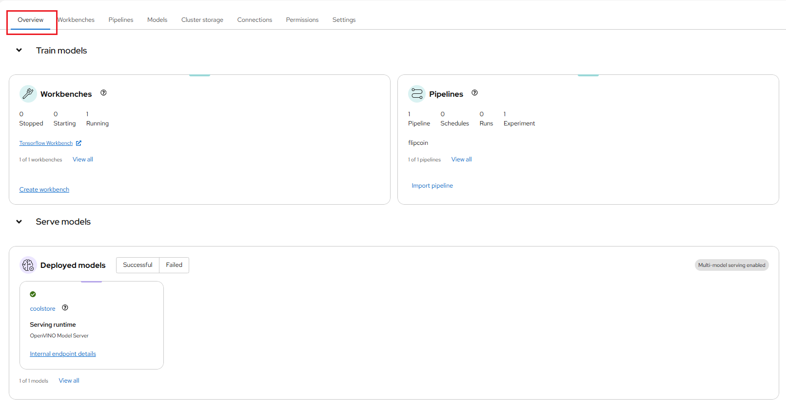
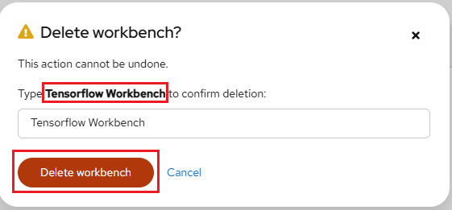
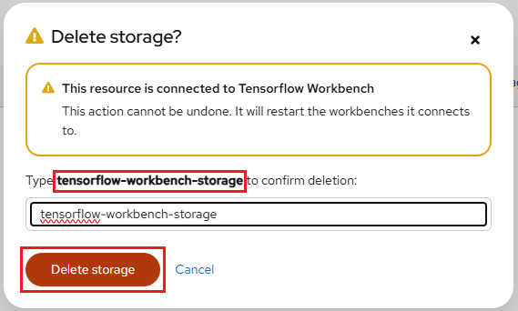
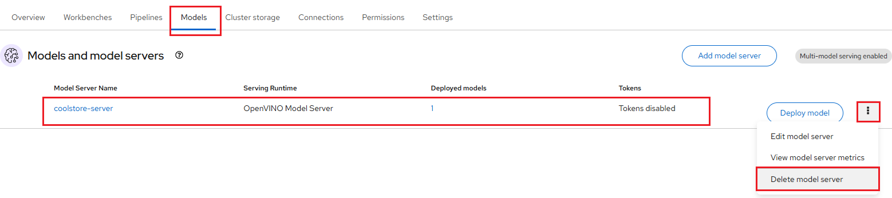
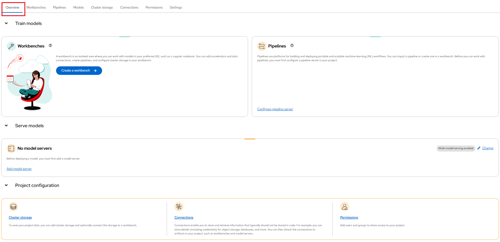

# Decommission OpenShift Resources

You can decommission all of your NERC OpenShift resources sequentially as outlined
below.

## Prerequisite

- **Backup**: Back up any critical data or configurations stored on the resources
that going to be decommissioned. This ensures that important information is not
lost during the process.

- **Kubernetes Objects (Resources)**: Please review all OpenShift Kubernetes Objects
(Resources) to ensure they are not actively used and ready to be decommissioned.

- Install and configure the **OpenShift CLI (oc)**, see [How to Setup the OpenShift CLI Tools](../logging-in/setup-the-openshift-cli.md)
for more information.

## Delete all Data Science Project (DSP) resources from the NERC RHOAI

Navigate to the NERC's Red Hat OpenShift AI (RHOAI) dashboard from [the NERC's OpenShift Web Console](https://console.apps.shift.nerc.mghpcc.org)
via the web browser as [described here](../../openshift-ai/logging-in/access-the-rhoai-dashboard.md).

Once you get access to the NERC's RHOAI dashboard, you can click on specific projects corresponding to the appropriate allocation of which resources you want to clean
up as [described here](../../openshift-ai/logging-in/access-the-rhoai-dashboard.md).

Once you gain access to the NERC's RHOAI dashboard, you can click on specific Data
Science Project (DSP) corresponding to the appropriate allocation of resources you
want to clean up, as [described here](../../openshift-ai/data-science-project/using-projects-the-rhoai.md#selecting-your-data-science-project).

The NERC RHOAI dashboard will look like the one shown below, displaying all consumed resources:

### Delete all Workbenches

Delete all workbenches by clicking on the three dots on the right side of the
individual workbench and selecting **Delete workbench**, as shown below:

When prompted please confirm your workbench name and then click "Delete workbench"
button as shown below:

### Delete all Cluster Storage

Delete all cluster storage by clicking on the three dots on the right side of the
individual cluster storage and selecting **Delete storage**, as shown below:

When prompted please confirm your cluster storage name and then click "Delete storage"
button as shown below:

### Delete all Data connections

Delete all data connections by clicking on the three dots on the right side of the
individual data connection and selecting **Delete data connection**, as shown below:

When prompted please confirm your data connection name and then click "Delete data connection" button as shown below:

### Delete all Pipelines

Delete all pipelines by clicking on the three dots on the right side of the
individual pipeline and selecting **Delete pipeline**, as shown below:

When prompted please confirm your pipeline name and then click "Delete pipeline" button as shown below:

### Delete all Models and Model Servers

Delete all model servers by clicking on the three dots on the right side of the
individual pipeline and selecting **Delete model server**, as shown below:

When prompted please confirm your model server name and then click "Delete model
server" button as shown below:

!!! note "Important Note"
    Deleting Model Server will automatically delete **ALL** Models deployed on the
    model server.

Finally, the NERC RHOAI dashboard will look clean and empty without any resources,
as shown below:

Now, you can return to **"OpenShift Web Console"** by using the application launcher
icon (the black-and-white icon that looks like a grid), and choosing the "OpenShift
Console" as shown below:

## Delete all resources from the NERC OpenShift

Set up the OpenShift CLI Tools by installing and configuring the OpenShift CLI
(`oc`) client as [described here](../logging-in/setup-the-openshift-cli.md).

Running `oc login` in your local machine's terminal with your own token will authenticate you to access all your projects on the NERC OpenShift. Please make sure you are
already selected the correct project which need to be decommissioned as shown below:

Run `oc login` in your local machine's terminal using your token to authenticate
and access all your projects on the NERC OpenShift. Please ensure you have already
selected the correct project that needs to be decommissioned, as shown below:

    oc login --token=<your_token> --server=https://api.shift.nerc.mghpcc.org:6443
    Logged into "https://api.shift.nerc.mghpcc.org:6443" as "test1_user@fas.harvard.edu" using the token provided.

    You have access to the following projects and can switch between them with 'oc project <projectname>':

        test-project-1
    * test-project-2
        test-project-3

    Using project "test-project-2".

Switching to your project that need to be decommissioned by running `oc project <projectname>` command:

    oc project <your_openshift_project_to_decommission>
    Using project "<your_openshift_project_to_decommission>" on server "https://api.shift.nerc.mghpcc.org:6443".

Please confirm the correct project is being selected by running `oc project`, as
shown below:

    oc project
    Using project "<your_openshift_project_to_decommission>" on server "https://api.shift.nerc.mghpcc.org:6443".

Please review all resources currently being used in your project by running
`oc get all`, as shown below:

    oc get all

    NAME                                                                  READY   STATUS             RESTARTS       AGE
    pod/ds-pipeline-persistenceagent-pipelines-definition-868665f7z9lpm   1/1     Running            0              141m
    ...

    NAME                                       TYPE        CLUSTER-IP       EXTERNAL-IP   PORT(S)                               AGE
    service/ds-pipeline-pipelines-definition   ClusterIP   172.30.133.168   <none>        8443/TCP,8888/TCP,8887/TCP            141m
    ...

    NAME                                                                 READY   UP-TO-DATE   AVAILABLE   AGE
    deployment.apps/ds-pipeline-persistenceagent-pipelines-definition    1/1     1            1           141m
    ...

    NAME                                                                            DESIRED   CURRENT   READY   AGE
    replicaset.apps/ds-pipeline-persistenceagent-pipelines-definition-868665f748    1         1         1       141m
    ...

    NAME                                                 IMAGE REPOSITORY
                                                    TAGS   UPDATED
    imagestream.image.openshift.io/simple-node-app-git   image-registry.openshift-image-registry.svc:5000/test-project-gpu-dc1e23/simple-node-app-git

    NAME                                                        HOST/PORT
                                                    PATH   SERVICES                           PORT            TERMINATION          WILDCARD
    route.route.openshift.io/ds-pipeline-pipelines-definition   ds-pipeline-pipelines-definition-test-project-gpu-dc1e23.apps.shift.nerc.mghpcc.org          ds-pipeline-pipelines-definition   oauth           reencrypt/Redirect   None
    ...

Finally, run the `oc delete --all` command to delete all resources of the types
specified as parameters within your selected project (namespace).

    oc delete --all pod,deployment,pvc,route,service,builds,buildconfigs,statefulsets,replicasets,cronjobs,imagestream --force --grace-period=0

!!! danger "Danger"
    The `oc delete` operation will cause all resources specfied will be deleted.
    This command can be very powerful and should be used with caution as it will
    delete all resources in the specified project.

    Always ensure that you are targeting the correct project (namespace) when using
    this command to avoid unintentional deletion of resources.

    Make sure to backup any important data or configurations before executing this
    command to prevent accidental data loss.

---
