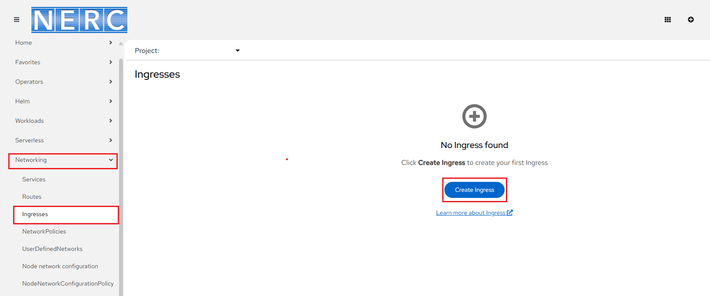

# Set up Domain Name for Your Application

**Prerequisites**:

Your application should be running in **Pods** within **NERC OpenShift**, with a
**Service** created for the **port(s)** you want to expose. By default, an
**HTTPS-enabled route** is set up for each deployed application, following this format:
`https://<your-application-name>-<your-namespace>.apps.shift.nerc.mghpcc.org`.

In this example, we have set up **Credit Card Fraud Detection Application** based
on [this Predictive AI tutorial](../../openshift-ai/other-projects/fraud-detection-predictive-ai-app.md#deploy-the-model-application-on-nerc-openshift).

The **Topology** view shows application details as shown below:


## Enabling HTTPS for Web Applications

HTTPS provides **data-in-motion encryption** for web applications. To enable HTTPS,
you need to generate **TLS certificates** and have them signed by a
**trusted Certificate Authority (CA)**.

[Let's Encrypt](https://letsencrypt.org) is a free CA that supports
**automatic certificate issuing** using the **ACME** protocol.

## What is DNS?

You can learn more about DNS by reading [this page](../../openstack/advanced-openstack-topics/domain-name-system/domain-names-for-your-vms.md#what-is-dns).

Unlike DNS services on NERC OpenStack, where the **Domain Name** requires an
[**A Record**](../../openstack/advanced-openstack-topics/domain-name-system/domain-names-for-your-vms.md#what-is-a-a-record)
pointing to the public floating IP of your NERC VM, on NERC OpenShift, you need
to point your unique public **Route** url i.e. `<your-application-name>-<your-namespace>.apps.shift.nerc.mghpcc.org`
of your deployed application to the public DNS by creating a **CNAME Record**.

### What is a CNAME Record?

A **CNAME (Canonical Name) record**: CNAME is a type of DNS record that maps one
domain name (alias) to another domain name (canonical name). This allows multiple
domain names to point to the same target without needing separate IP addresses.

## How to get user-friendly domain names (hostnames)?

NERC does not currently offer integrated domain name service management.

You can use one of the following methods to configure name resolution (DNS) for
your NERC's virtual instances.

### 1. Using freely available free Dynamic DNS services

Get a free domain or host name from [no-ip.com](https://www.noip.com/) or other

[free Dynamic DNS services](https://www.makeuseof.com/tag/5-best-dynamic-dns-providers-can-lookup-free-today/).

Here we will describe how to use No-IP to configure dynamic DNS.

**Step 1: Create your No-IP Account.**


During this process you can add your desired unique hostname with pre-existing
domain name or you can choose to create your hostname later on.


**Step 2: Confirm Your Account by verifing your email address.**


**Step 3: Log In to Your Account to view your dashboard.**

**Step 4: Create a New Hostname.**


Give a **Hostname** and select one of the available **Domain** names. This will
create your full hostname like `<Hostname><Domain>. Also, choose **DNS Alias (CNAME)**
as the **Record Type** and add your application's unique **Public Route**
[without HTTP(S) protocol] in the **Target** textbox.


Click **Create Hostname**.

Then, browse your host or domain name as you setup during registration or later
i.e. [http://nerc.hopto.org](http://nerc.hopto.org) on above example.

#### How to create an Ingress with TLS/SSL certificates from Let's Encrypt

To use your own custom domain with HTTPS, you need to create an [Ingress](https://kubernetes.io/docs/concepts/services-networking/ingress/)
with annotations for [cert-manager](https://cert-manager.io).

To expose your application securely with HTTPS on OpenShift, you need to create
an **Ingress** resource per port that is used by Service to serve public facing.
An Ingress allows external HTTP and HTTPS traffic to access services within your
cluster.

1. Go to the [NERC's OpenShift Web Console](https://console.apps.shift.nerc.mghpcc.org).

2. Click on the **Perspective Switcher** drop-down menu and select **Administrator**.

3. Click on the **Ingresses** under **Networking** Menu:

    

4. Click **Create Ingress**.

5. You will need to:

    - **i. Change**:

    `metadata.name` i.e. `<your-unique-ingress-name>`

    `spec.rules[0].host` i.e. `<your-hostname>`

    `spec.rules[0].http.paths[*].backend.service` i.e. path, servicename and service
    exposed port number

    - **ii. Add**:

    `metadata.annotations` i.e.

    ```yaml
    annotations:
      acme.cert-manager.io/http01-ingress-class: openshift-default
      cert-manager.io/cluster-issuer: letsencrypt-production-http01
    ```

    `spec.ingressClassName` i.e.

    ```yaml
    spec:
      ingressClassName: openshift-default
    ```

    `spec.tls` i.e.

    ```yaml
    tls:
      - hosts:
          - <your-hostname>
        secretName: <unique-secret-name>
    ```

    For example, your Ingress template should look like similar to shown below:

    ```yaml
    kind: Ingress
    apiVersion: networking.k8s.io/v1
    metadata:
      name: <your-unique-ingress-name>
      namespace: <your-namespace>
      annotations:
        acme.cert-manager.io/http01-ingress-class: openshift-default
        cert-manager.io/cluster-issuer: letsencrypt-production-http01
    spec:
      ingressClassName: openshift-default
      tls:
        - hosts:
            - nerc.hopto.org
          secretName: <your-unique-tls-secret-name>
      rules:
        - host: nerc.hopto.org
          http:
            paths:
              - path: <your-path-to-service>
                pathType: Prefix
                backend:
                  service:
                    name: <your-service-name>
                    port:
                      number: <your-service-exposed-port>
    ```

6. Click **Create**.

7. Click on the **Perspective Switcher** drop-down menu and select **Developer**.

8. Go to **Topology** Menu and click on your deployed application to see the
_Overview_ panel to the right.

- Click the **Resources** tab to view the **Routes** used by the component. You
will see a new Route that has been added by the Ingress configuration you just
set up above as shown below:


- Click on the Route link it will load the web application with the HTTPS and domain
name you defined in your ingress: `https://<your-hostname>` i.e. `https://nerc.hopto.org`

!!! tips "To Troubleshoot Certificate Requests"

    Naviage to **Search** Menu and search for *certificate* and select **CertificateRequest**.
    Here you will be able to see all requested certificates in your namespaces as
    shown below:

    

    You can click on it and check the **Conditions** of the certificate request
    as shown below:

    

### 2. Using your local Research Computing (RC) department or academic institution's Central IT services

You need to contact and work with your Research Computing department or
academic institution's Central IT services to create **CNAME record** for your
hostname that maps to the Public Route url i.e. `<your-application-name>-<your-namespace>.apps.shift.nerc.mghpcc.org`
of your deployed application.

### 3. Using commercial DNS providers

Alternatively, you can purchase a fully registered domain name or host name from
commercial hosting providers and then register DNS records for your route url i.e.
`<your-application-name>-<your-namespace>.apps.shift.nerc.mghpcc.org` from commercial
cloud servies i.e. AWS Route53, Azure DNS, CloudFlare, Google Cloud Platform,
GoDaddy, etc.

---
