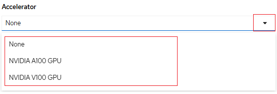

# Introduction to GPUs in NERC OpenShift

NERC OCP clusters leverage the [NVIDIA GPU Operator](https://docs.nvidia.com/datacenter/cloud-native/gpu-operator/latest/index.html)
as well as the [Node Feature Discovery Operator](https://docs.openshift.com/container-platform/4.15/hardware_enablement/psap-node-feature-discovery-operator.html)
to manage and deploy GPU worker nodes to clusters.

GPU nodes in NERC clusters are also managed via
[taints](https://kubernetes.io/docs/concepts/scheduling-eviction/taint-and-toleration/)
according to their GPU device. This ensures that only workloads explicitly
requesting GPUs will consume GPU resources.

## NERC GPU Worker Node Architecture

The NERC OpenShift environment currently supports two different NVIDIA GPU
 products:

1. NVIDIA-A100-SXM4-40GB (A100)
2. Tesla-V100-PCIE-32GB (V100)

!!! note "NERC GPU Worker Nodes Info"

    A100 worker nodes contain 4 individual gpus, each with 40GB of memory whereas
    V100 worker nodes contain 1 gpu with 32 GB of memory.

## Accessing GPU Resources

In order to use GPU resources on your pod, you must specify the number of GPUs
you want to use in the "**OpenShift Request on GPU Quota**" attribute that has
been approved for your "**NERC-OCP (OpenShift)**" resource allocation on NERC's
ColdFront as [described here](../../get-started/allocation/allocation-details.md#pi-and-manager-allocation-view-of-openshift-resource-allocation).

## Deploying Workloads to GPUs

There are two ways to deploy workloads on GPU nodes:

1. Deploy directly in your OCP namespace:

    In your project namespace you can deploy a GPU workload by explicitely requesting
    a GPU in your pod manifest, see: [How to specify pod to use GPU](https://nerc-project.github.io/nerc-docs/openshift/applications/scaling-and-performance-guide/#how-to-specify-pod-to-use-gpu).

2. Deploy through NERC RHOAI

    See [Populate the data science project with a Workbench](https://nerc-project.github.io/nerc-docs/openshift-ai/data-science-project/using-projects-the-rhoai/#populate-the-data-science-project-with-a-workbench)
    for selecting GPU options.

    !!! note "GPU Accelerator on NERC RHOAI"

        The different options for accelerator are "NONE", "NVIDIA GPU", "NVIDIA V100 GPU", and "NVIDIA A100 GPU" as shown below:

        
