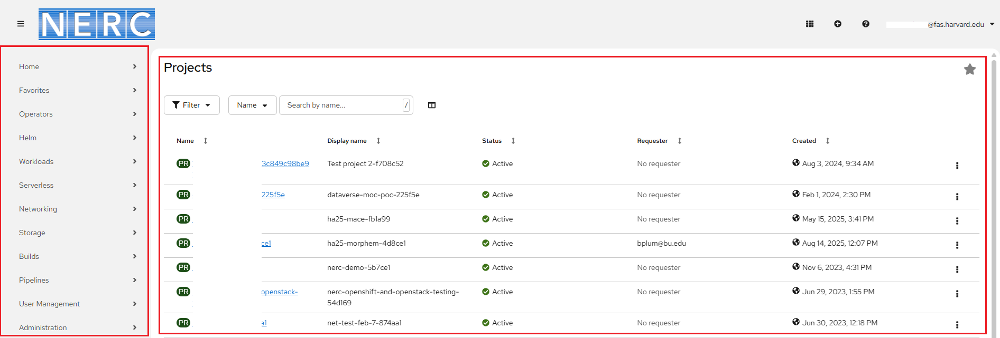

# Access the NERC's OpenShift Web Console

**The NERC's OpenShift Container Platform web console** is a user interface accessible
from a web browser and is located at [https://shift.nerc.mghpcc.org](https://shift.nerc.mghpcc.org).

The NERC Authentication supports CILogon using Keycloak for gateway authentication
and authorization that provides federated login via your institution accounts and
it is the recommended authentication method.

Make sure you are selecting "**mss-keycloak**" as shown here:

Next, you will be redirected to CILogon welcome page as shown below:

MGHPCC Shared Services (MSS) Keycloak will request approval of access to the
following information from the user:

- Your CILogon user identifier
- Your name
- Your email address
- Your username and affiliation from your identity provider

which are required in order to allow access your account on NERC's OpenStack
web console.

From the **"Selected Identity Provider"** dropdown option, please select your institution's
name. If you would like to remember your selected institution name for future
logins please check the "Remember this selection" checkbox this will bypass the
CILogon welcome page on subsequent visits and proceed directly to the selected insitution's
identity provider(IdP). Click "Log On". This will redirect to your respective institutional
login page where you need to enter your institutional credentials.

!!! note "Important Note"
    The NERC does not see or have access to your institutional account credentials,
    it points to your selected insitution's identity provider and redirects back
    once authenticated.

Once you successfully authenticate you should see a graphical user interface to
visualize your project data and perform administrative, management, and troubleshooting
tasks.

!!! note "Important Note"
    The default view for the OpenShift Container Platform web console is the **Developer**
    perspective.

---
