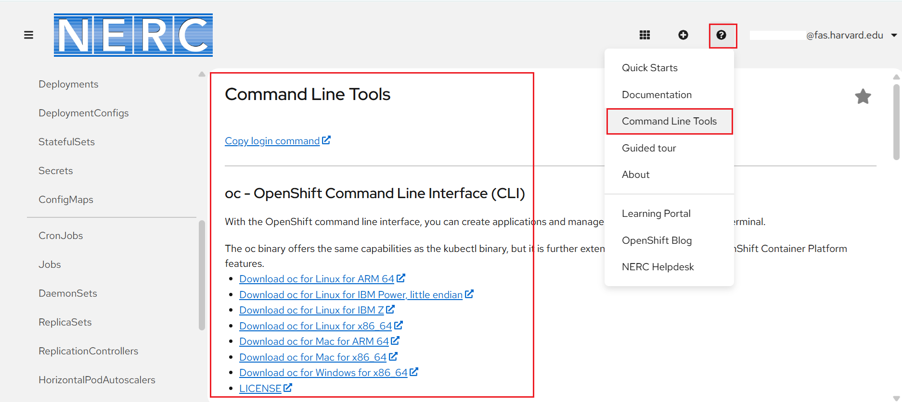
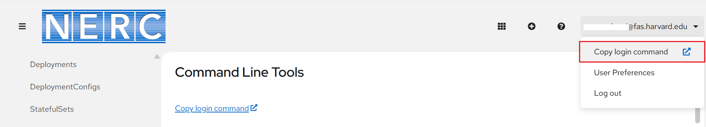
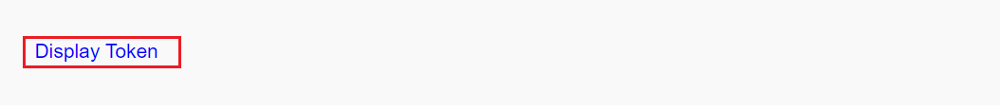

# How to Setup the OpenShift CLI Tools

The most commonly used command-line client tool for the NERC's OpenShift is
[OpenShift CLI (`oc`)](https://docs.openshift.com/container-platform/4.17/cli_reference/openshift_cli/getting-started-cli.html#cli-getting-started).
It is available for Linux, Windows, or macOS and allows you to create
applications and manage OpenShift Container Platform projects from a terminal.

## Installing the OpenShift CLI

Installation options for the CLI vary depending on your Operating System (OS).
You can install the OpenShift CLI (oc) either by downloading the binary or by using
an Package Manager (RPM).

Unlike the web console, it allows the user to work directly with the project
source code using command scripts once they are authenticated using token.

You can download the latest `oc` CLI client tool binary from web console as shown
below:

Then add it to your path environment based on your OS choice by following [this documentation](https://docs.openshift.com/container-platform/4.17/cli_reference/openshift_cli/getting-started-cli.html#installing-openshift-cli).

## Configuring the OpenShift CLI

You can configure the `oc` command tool to enable tab completion to automatically
complete oc commands or suggest options when you press Tab for the _Bash_ or _Zsh_
shells by following [these steps](https://docs.openshift.com/container-platform/4.17/cli_reference/openshift_cli/configuring-cli.html).

## First Time Usage

Before you can use the _oc_ command-line tool, you will need to authenticate to the
NERC's OpenShift platform by running built-in _login_ command obtained from the
NERC's OpenShift Web Console. This will allow authentication and enables you to
work with your NERC's OpenShift Container Platform projects. It will create a session
that will last approximately 24 hours.

To get the _oc login_ command with your own unique token, please login to the NERC's
OpenShift Web Console and then under your user profile link located at the top right
corner, click on **Copy login command** as shown below:

It will once again ask you to provide your KeyCloak login and then once successful
it will redirect you to a static page with a link to Display Token as shown below:

Clicking on that "Display Token" link it will show a static page with Login command
with token as shown below:

Copy and run the generated command on your terminal to authenticate yourself to
access the project from your terminal i.e. `oc login --token=<Your-Token> --server=https://<NERC-OpenShift-Server>`

If you try to run an oc command and get a permission denied message, your login
session has likely expired and you will need to re-generate the oc login command
from your NERC's OpenShift Web Console and then run the new oc login command with
new token on your terminal.

## Other Useful oc Commands

[This reference document](https://docs.openshift.com/container-platform/4.17/cli_reference/openshift_cli/developer-cli-commands.html)
provides descriptions and example commands for OpenShift CLI (oc) developer commands.

!!! info "Important Note"

    Run `oc help` to list all commands or run `oc <command> --help` to get additional
    details for a specific command.

---
