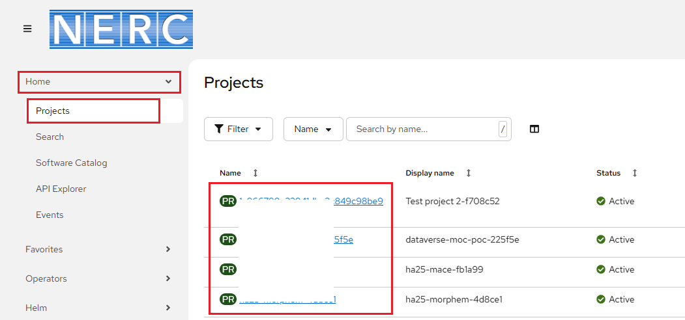

# Web Console Overview

The NERC's OpenShift Container Platform (OCP) provides a web-based console that
enables users to perform common management tasks such as building and deploying
applications. It now features a **single unified view** within the OpenShift
console, offering a more comprehensive and cohesive interface for all tasks. This
enhancement simplifies navigation and allows developers and administrators to
manage their environments seamlessly from one centralized dashboard.

You can find it at [https://console.apps.shift.nerc.mghpcc.org](https://console.apps.shift.nerc.mghpcc.org).

!!! info "Very Important: What is the Web Console URL for NERC Academic (EDU) OpenShift?"

    Access the NERC Academic (EDU) OpenShift web console at: [https://console.apps.edu.nerc.mghpcc.org](https://console.apps.edu.nerc.mghpcc.org)

The web console provides tools to access and manage your application code and data.

Below is a sample screenshot of the web interface with labels describing different
sections of the NERC's OpenShift Web Console:

1. Navigation Menu - Menu options to access different tools and settings for a project.
   The list will change depending on which Perspective view you are in.

2. Project List - Drop-down to select a different project. Based on user's active
    and approved resource allocations this projects list will be updated.

    This allows you to view the overview of the currently selected project from
    the drop-down list and also details about it including resource utilization
    and resource quotas, as shown below:

    

    !!! info "Important Note"

        You can identify the currently selected project with **tick** mark and also
        you can click on **star** icon to keep the project under your **Favorites**
        list:

        

3. User Preferences - Shown the option to get and copy the OpenShift Command Line
   _oc login command_ and set your individual console preferences including default
   views, language, import settings, and more.

4. View Switcher - This three dot menu is used to switch between **List View**
   and **Graph view** of all your applications.

5. Main Panel - Displays basic application information. Clicking on the application
   names in the main panel expands the Details Panel (6).

6. Details Panel - Displays additional information about the application selected
   from the Main Panel. This includes detailed information about the running application,
   applications builds, routes, and more. Tabs at the top of this panel will change
   the view to show additional information such as Details and Resources.

## Navigation Menu

On the left side of the navigation pane, the web console provides a comprehensive
set of tools for managing your projects and applications.

### Home

#### Projects

Clicking on the **Home** -> **Projects** menu which is displayed near the top
left side will show the list of projects you are in. You can search and select
the project by clicking on the project name in that list as shown below:

#### Search

Clicking on the **Home** -> **Search** menu allows you to search any resources
based on search criteria like Label or Name.

#### Software Catalog

Easily discover, explore, and deploy tools from a centralized catalog built to
streamline your workflow

-   Centralizes all available software for faster discovery and access.

-   Improved categorization for easier browsing.

-   Supports consistent deployment flows.

#### Events

Clicking on the **Home** -> **Events** menu provides you with a Dashboard to view
the resource usage and also other metrics and events that occured on your project.
Here you can identify, monitor, and inspect the usage of Memory, CPU, Network,
and Storage in your project.

### Favorites

Pin frequently used items to the top for quick access whenever you need them.

-   Reduce time spent searching for commonly used pages and resources.

-   Customize the interface to match your personal workflow.

### Helm

You can enable the Helm Charts here. Helm Charts is the pacakge manager that help
to easily manage definitions, installations and upgrades of you complex application.
It also shows catalog of all available helm charts for you to use by installing them.

### Workloads

#### Topology

The **Topology** view in the the web console provides a visual representation of
all the applications within a project, their build status, and the components and
services associated with them. If you have no workloads or applications in the
project, the Topology view displays the available options to create applications.

If you have existing workloads, the Topology view graphically displays your
workload nodes. The Topology view provides you the option to monitor your
applications using the List view. Use the List view icon ()
to see a list of all your applications and use the Graph view icon
() to switch back to
the graph view.To read more about how to view the topology of your application
please read [this official documentation from Red Hat](https://docs.redhat.com/en/documentation/openshift_container_platform/4.19/html/building_applications/odc-viewing-application-composition-using-topology-view).

#### Secrets

This allows you to view or create Secrets that allows to inject sensitive data
into your application as files or environment variables.

#### ConfigMaps

This menu allows you to view or create a new ConfigMap by entering manually YAML
or JSON definitions, or by dragging and dropping a file into the editor.

### Storage

Read more about **Storage** [here](../storage/storage-overview.md).

### Builds

This menu provides tools for building and deploying applications. You can use it
to create and manage build configurations using YAML syntax, as well as view the
status and logs of your builds.

### Administration

#### Resource Quotas

You can also view the resource quota for your project in the web console by
navigating to **Administration** -> **ResourceQuotas**, as shown below:

If you scroll down to the Resource Quota Details section for the pods resource
type, you can view the used and maximum resources as shown below:

#### Limit Ranges

You can also be able to view the current limit range for your project
by going into the **Administration** -> **LimitRange** menu as shown below:

---
