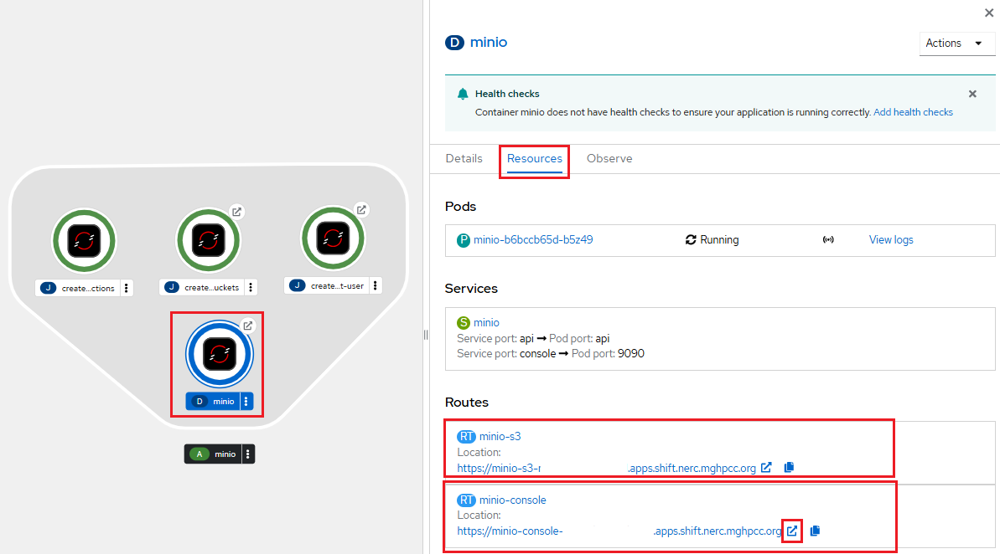
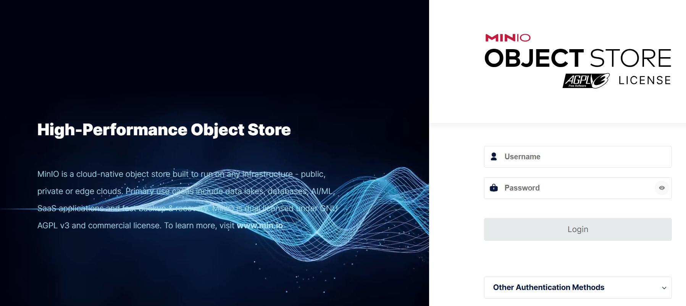

# Data Transfer To and From NERC OpenShift

OpenShift containers are [ephemeral](storage-overview.md#ephemeral-storage).
Files written only to a container's local filesystem can be lost when
the pod is restarted, replaced, or deleted.

Store important data on a [PersistentVolumeClaim (PVC)](storage-overview.md#persistent-volume-claims-pvcs)
or in [object storage using Minio](minio.md).

See [Storage Overview](storage-overview.md) for more information about OCP storage.

OpenShift users normally transfer data through the OpenShift API to a pod. Durable
data should be placed on a PVC or in object storage rather than in the pod's
container filesystem.

For most transfers between your computer and OpenShift, use `oc rsync`. For large
datasets or transfers that must continue after your computer disconnects, use NERC
object storage, `rclone`, or another managed data-transfer service.

## **Prerequisites**

Before proceeding, confirm that you have:

1. Set up the OpenShift CLI (`oc`) tools locally and configure the OpenShift CLI
    to enable `oc` commands. Refer to [this user guide](../logging-in/setup-the-openshift-cli.md).

2. From a terminal on your laptop/desktop, log in to the NERC OpenShift cluster and
    switch to your project namespace:

    ```sh
    oc login --token=<your_token> --server=https://api.shift.nerc.mghpcc.org:6443  
    ```

    For example:

    ```sh
    oc login --token=<your_token> --server=https://api.shift.nerc.mghpcc.org:6443
    Logged into "https://api.shift.nerc.mghpcc.org:6443" as "<your_account>" using
	the token provided.  
    ```

3. Select your project.

    !!! info "Information"

        Some users may have access to multiple projects. Run the following command
        to switch to a specific project space: `oc project <your-project-namespace>`.

4. Confirm you have selected the correct project by running `oc project`,
    as shown below:

    ```sh
    oc project
    Using project "<your-project-namespace>" on server "https://api.shift.nerc.mghpcc.org:6443".
	```

5. Identify the pod, container, PVC, source directory, and destination directory.

	```sh
	oc get pods
	```

	To list the containers in a pod:

	```sh
	oc get pod <pod-name> \
	-o jsonpath='{.spec.containers[*].name}{"\n"}'
	```

	To see the volumes and mount locations used by a pod:

	```sh
	oc describe pod <pod-name>
	```

## Use Persistent Storage

A container filesystem is not persistent. Unless a file is needed only temporarily,
transfer data into a directory backed by a PVC as [described here](storage-overview.md#persistent-storage).

For example, an application might mount its PVC at:

```sh
/data
```

Confirm the correct mount path before transferring files:

```sh
oc exec <pod-name> -- df -h
```

You can also examine the pod configuration:

```sh
oc get pod <pod-name> -o yaml
```

OpenShift mounts storage requested through a PVC into one or more containers in
a pod. The PVC remains available independently of a particular pod, subject to
its [storage class](storage-overview.md#storage-class) and
[access-mode](storage-overview.md#access-modes) configuration.

### Using `oc rsync`

[Rsync](https://linux.die.net/man/1/rsync) is a fast, versatile, remote (and local)
file-copying tool. It is famous for its delta-transfer algorithm, which reduces
the amount of data sent over the network by sending only the differences between
the source files and the existing files in the destination. This can often lead
to efficiencies in repeat-transfer scenarios, as rsync only copies files that are
different between the source and target locations (and can even transfer partial
files when only part of a file has changed). This can be very useful in reducing
the number of copies you may perform when synchronizing two datasets.

`oc rsync` is the recommended method for transferring directories between your
computer and a running OpenShift pod and vice-versa.

The basic syntax is:

```sh
oc rsync <source> <destination>
```

A pod path is written as:

```sh
<pod-name>:<directory>
```

`oc rsync` transfers directories rather than individual files.

When native `rsync` is unavailable in the container, the command may fall back to
a tar-based copy, provided that `tar` is available. The fallback does not provide
all normal `rsync` behavior, such as transferring only changed files.

#### Copy a Local Directory to OpenShift

```sh
oc rsync ./local-data/ <pod-name>:/data/
```

For example:

```sh
oc rsync ./research-data/ analysis-workbench-0:/data/research-data/
```

The trailing slash on `./research-data/` means to copy the directory's contents.

Without the trailing slash:

```sh
oc rsync ./research-data analysis-workbench-0:/data/
```

the `research-data` directory itself is copied into `/data`.

#### Copy Data from OpenShift to Your Computer

```sh
oc rsync <pod-name>:/data/results/ ./results/
```

For example:

```sh
oc rsync analysis-workbench-0:/data/results/ ./results/
```

#### Select a Container

A pod can contain more than one container. Specify the container using `-c`:

```sh
oc rsync ./local-data/ <pod-name>:/data/ \
  -c <container-name>
```

For example:

```sh
oc rsync ./local-data/ analysis-workbench-0:/data/ \
  -c workbench
```

#### Select a Different Project

Use `-n` when the pod is in a project other than your currently selected project:

```sh
oc rsync ./local-data/ <pod-name>:/data/ \
  -n <your-project-namespace>
```

#### Synchronize Changes

When both the local computer and container have `rsync` installed, subsequent runs
generally transfer only changed data:

```sh
oc rsync ./local-data/ <pod-name>:/data/
```

To remove files from the destination that no longer exist in the source:

```sh
oc rsync ./local-data/ <pod-name>:/data/ --delete
```

!!! danger "Be careful with this option!"

    Use `--delete` carefully. Files in the destination directory that are not
    present in the source directory can be permanently deleted.

To continuously synchronize local changes:

```sh
oc rsync ./local-data/ <pod-name>:/data/ --watch
```

### Copying a Single File

Although `oc rsync` operates on directories, `oc cp` can be convenient for copying
a single file.

#### Copy a File to OpenShift

```sh
oc cp ./input.csv <your-project-namespace>/<pod-name>:/data/input.csv
```

When using the currently selected project:

```sh
oc cp ./input.csv <pod-name>:/data/input.csv
```

#### Copy a File from OpenShift

```sh
oc cp <your-project-namespace>/<pod-name>:/data/results.csv ./results.csv
```

For a multi-container pod:

```sh
oc cp ./input.csv <pod-name>:/data/input.csv \
  -c <container-name>
```

!!! note "Important Note"

    `oc cp` requires the `tar` command to be available inside the container. It
	can fail with minimal or distroless container images that do not contain `tar`.

### Using `tar` with `oc exec`

For directories containing many small files, streaming a compressed tar archive
can be more efficient than transferring each file individually.

#### Copy a Directory to OpenShift

```sh
tar czf - ./local-directory \
  | oc exec -i <pod-name> -- \
    tar xzf - -C /data
```

For a particular container:

```sh
tar czf - ./local-directory \
  | oc exec -i <pod-name> -c <container-name> -- \
    tar xzf - -C /data
```

#### Copy a Directory from OpenShift

```sh
oc exec <pod-name> -- \
  tar czf - -C /data results \
  | tar xzf - -C ./local-destination
```

Create the local destination first if necessary:

```sh
mkdir -p ./local-destination
```

Both the local computer and the container must have `tar` available.

### Transferring Data Directly to a PVC

Sometimes an application container does not contain `tar`, `rsync`, or other
transfer utilities. In that case, create a temporary transfer pod and mount the
application's PVC into it.

First identify the PVC:

```sh
oc get pvc
```

Note the name of your PVC, i.e., `<your-pvc-name>`.

Create a file named `data-transfer-pod.yaml`:

```yaml
apiVersion: v1
kind: Pod
metadata:
  name: data-transfer
spec:
  restartPolicy: Never
  containers:
    - name: data-transfer
      image: registry.access.redhat.com/ubi9/ubi:latest
      command:
        - /bin/sh
        - -c
        - sleep infinity
      volumeMounts:
        - name: data
          mountPath: /data
  volumes:
    - name: data
      persistentVolumeClaim:
        claimName: <your-pvc-name>
```

Replace `<your-pvc-name>` with the PVC name and create the pod:

```sh
oc apply -f data-transfer-pod.yaml
oc wait --for=condition=Ready pod/data-transfer --timeout=120s
```

Copy the data:

```sh
oc rsync ./local-data/ data-transfer:/data/
```

Verify the transfer:

```sh
oc exec data-transfer -- ls -lah /data
```

Delete the transfer pod when finished:

```sh
oc delete pod data-transfer
```

Deleting the transfer pod does not delete the PVC.

!!! note "Important Note"

    A `ReadWriteOnce` PVC might not be mountable by the application pod and transfer
	pod simultaneously, depending on the storage system and where the pods are scheduled.

    You may need to stop or scale down the application before starting the transfer
	pod.

    For example:

    ```sh
    oc scale deployment/<deployment-name> --replicas=0
    ```

    After the transfer:

    ```sh
    oc scale deployment/<deployment-name> --replicas=1
    ```

    **NOTE:** Stop applications before copying live database files or other data
	that must remain internally consistent.

### Transferring Between Two PVCs

Create a temporary pod that mounts both PVCs:

```yaml
apiVersion: v1
kind: Pod
metadata:
  name: pvc-transfer
spec:
  restartPolicy: Never
  containers:
    - name: transfer
      image: registry.access.redhat.com/ubi9/ubi:latest
      command:
        - /bin/sh
        - -c
        - sleep infinity
      volumeMounts:
        - name: source
          mountPath: /source
          readOnly: true
        - name: destination
          mountPath: /destination
  volumes:
    - name: source
      persistentVolumeClaim:
        claimName: <source-pvc>
    - name: destination
      persistentVolumeClaim:
        claimName: <destination-pvc>
```

Create the pod:

```sh
oc apply -f pvc-transfer-pod.yaml
oc wait --for=condition=Ready pod/pvc-transfer --timeout=120s
```

Copy the files:

```sh
oc exec pvc-transfer -- \
  cp -a /source/. /destination/
```

For directories containing many small files, use `tar`:

```sh
oc exec pvc-transfer -- \
  sh -c 'tar cf - -C /source . | tar xf - -C /destination'
```

Verify the destination:

```sh
oc exec pvc-transfer -- \
  du -sh /source /destination
```

Delete the pod after verification:

```sh
oc delete pod pvc-transfer
```

!!! tip "Important Note"

	This procedure copies the contents. It does not transfer ownership of the source
	PVC or delete its data.

	To delete the PVC completely, run:

	```sh
	oc delete pvc <your-pvc-name>
	```

## For Object Storage Setup on NERC OCP

### Using Minio

If you are using object storage set up with [MinIO](https://min.io/) as
[explained here](minio.md), you can transfer data through it.

Once successfully initiated, click on the **MinIO** deployment and select the
"Resources" tab to review created *Pods*, *Services*, and *Routes*.



The **`minio-s3`** route URL (found under "Routes" -> `minio-s3` -> _Location_
path) is used to interact with the MinIO API **programmatically** and will
serve as the `S3_ENDPOINT`. Make sure to note this **S3_ENDPOINT**, as it
will be required when configuring `Rclone` later.

Please note the **minio-console** route URL, also under "Routes" section
under the _Location_ path. When you click on the **minio-console** route URL, it
will open the MinIO web console as shown below:



!!! info "MinIO Web Console Login Credential"

    For this, you need to install and configure the OpenShift CLI by following
    the [setup instructions](../logging-in/setup-the-openshift-cli.md#installing-the-openshift-cli).

    Once the OpenShift CLI is set up, the username and password for the MinIO web
    console can be retrieved by running the following `oc` commands:

    i. To get *Access key* run:

    `oc get secret minio-root-user -o template --template '{{.data.MINIO_ROOT_USER}}' | base64 --decode`

    ii. And to get *Secret key* run:

    `oc get secret minio-root-user -o template --template '{{.data.MINIO_ROOT_PASSWORD}}' | base64 --decode`  

Return to the **MinIO Web Console** using the provided URL. Enter the **Access Key**
as the **Username** and the **Secret Key** as the **Password**.


This will open the **Object Browser**, from where you will be able to upload/download
data using a web browser.

### Using Rclone

[Rclone](https://rclone.org/) is a convenient and performant command-line tool
for transferring files and synchronizing directories directly between your local
file systems and NERC's containers. Rclone is mature, open-source software
originally inspired by **rsync** and written in Go.

#### Using RHOAI Rclone Workbench

You can also set up an Rclone-based RHOAI workbench and connect
it to your object storage as [explained here](Rclone.md).

#### Using Rclone CLI

Alternatively, you can use the `rclone` command line tool locally.

**Prerequisites**:

To run the `rclone` commands, you need to have:

-   `rclone` installed, see
    [Downloading and Installing the latest version of the Rclone](https://rclone.org/downloads/)
    for more information.

##### Configuring Rclone

First, you'll need to configure `rclone`. Since object storage systems
have quite complicated authentication, these credentials are kept in a config file.

If you run `rclone config file` you will see where the default location is
for you.

!!! note "Note"

    For **Windows** users, you may need to specify the full path to the `rclone`
    executable file if it is not included in your system's PATH variable.

The **S3_ENDPOINT**, **Access Key**, and **Secret Key** that you previously noted
from MinIO deployed routes can then be plugged into `rclone` config file.

Edit the config file at the path shown by `rclone config file` and
add the following entry with the remote name `nerc`:

    [nerc]
    type = s3
    env_auth = false
    provider = Other
    endpoint = <S3_ENDPOINT>
    acl = public-read
    access_key_id = <ACCESS_KEY>
    secret_access_key = <SECRET_KEY>
    location_constraint =
    server_side_encryption =

See [rclone S3 configuration](https://rclone.org/s3/) for more information.

!!! note "Important Information"

    If `env_auth` is set to `true`, rclone will read credentials from environment
    variables, so you should not insert them directly in the config.

Or you can copy this content to a new config file and then use the
`--config` flag to override the config location, e.g. `rclone --config=FILE`

!!! note "Interactive Configuration"

    Run `rclone config` to setup. See [rclone config docs](https://rclone.org/docs/)
    for more details.

##### Using Rclone

`rclone` supports many subcommands (see
[the complete list of Rclone subcommands](https://rclone.org/docs/#subcommands)).
A few commonly used subcommands (assuming you configured the NERC Object Storage
as `nerc`):

Once your object storage has been configured in rclone, you can list all
buckets with the `lsd` command

    rclone lsd "nerc:"

Once an object-storage is configured with the name "nerc:", common `rclone`
commands include the following.

List available buckets or directories:

```sh
rclone lsd "nerc:"
```

Upload a directory:

```sh
rclone copy /data/results/ <nerc>:<bucket>/results/ \
  --progress
```

Download a directory:

```sh
rclone copy <nerc>:<bucket>/input-data/ /data/input-data/ \
  --progress
```

Preview a synchronization:

```sh
rclone sync /data/results/ <nerc>:<bucket>/results/ \
  --dry-run
```

Review the dry-run output, then run:

```sh
rclone sync /data/results/ <nerc>:<bucket>/results/ \
  --progress
```

!!! warning "Very Important"

    `rclone sync` can delete destination objects that do not exist in the source. Use `rclone copy` when you do not want deletion behavior.

Do not place object-storage credentials directly in a container image or commit them to Git. Store them in an OpenShift Secret and mount the Secret into the transfer pod.

## Verifying a Transfer

Compare directory sizes:

```sh
du -sh ./local-data
oc exec <pod-name> -- du -sh /data/local-data
```

Compare file counts:

```sh
find ./local-data -type f | wc -l
```

```sh
oc exec <pod-name> -- \
  sh -c 'find /data/local-data -type f | wc -l'
```

For important datasets, create checksums locally:

```sh
find ./local-data -type f -print0 \
  | sort -z \
  | xargs -0 sha256sum > SHA256SUMS
```

Transfer the checksum file with the data and verify it in the pod:

```sh
oc exec <pod-name> -- \
  sh -c 'cd /data/local-data && sha256sum -c SHA256SUMS'
```

## Troubleshooting

### Permission Denied

Check the destination permissions:

```sh
oc exec <pod-name> -- \
  ls -ld /data /data/<destination-directory>
```

Check the identity used by the container:

```sh
oc exec <pod-name> -- id
```

OpenShift containers commonly run with a dynamically assigned, non-root user ID.
Do not assume that the container can write to every directory.

Use the application's designated writable directory or PVC mount. Do not change
the container to run as root merely to complete a transfer.

### Pod Not Found

Confirm the active project and pod name:

```sh
oc project
oc get pods
```

Or specify the project explicitly:

```sh
oc get pods -n <your-project-namespace>
```

### Multiple Containers

List the containers:

```sh
oc get pod <pod-name> \
  -o jsonpath='{.spec.containers[*].name}{"\n"}'
```

Then add the following option to the transfer command:

```sh
-c <container-name>
```

### `rsync` or `tar` Is Missing

Use a temporary transfer pod with the same PVC mounted, as described in
[Transferring Data Directly to a PVC](#transferring-data-directly-to-a-pvc).

### Transfer Stops When the Pod Restarts

Transfer data to a PVC, not to the container's local filesystem.

If the application pod is frequently replaced, use a dedicated transfer pod.

### Transfer Is Too Slow or Frequently Interrupted

Avoid transferring a very large dataset through `oc rsync` or `oc cp`.

Use object storage, `rclone`, or another managed transfer mechanism that supports
retries and resumable transfers.

## Choosing a Transfer Method

| Situation                              | Recommended method                                                  |
| -------------------------------------- | ------------------------------------------------------------------- |
| One small file                         | `oc cp`                                                             |
| Small or medium directory              | `oc rsync`                                                          |
| Repeated synchronization               | `oc rsync` with native `rsync`                                      |
| Many small files                       | `tar` through `oc exec`                                             |
| Application image lacks transfer tools | Temporary transfer pod                                              |
| Copy between PVCs                      | Pod mounting both PVCs                                              |
| Large or resumable transfer            | Object storage, `rclone`                                               |
| Database backup                        | Database-native backup tool followed by transfer of the backup file   |

---
