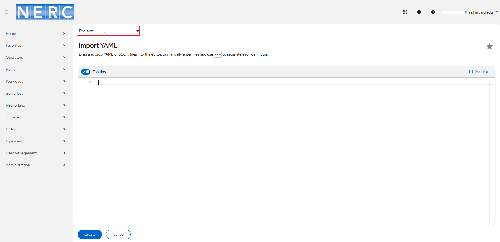
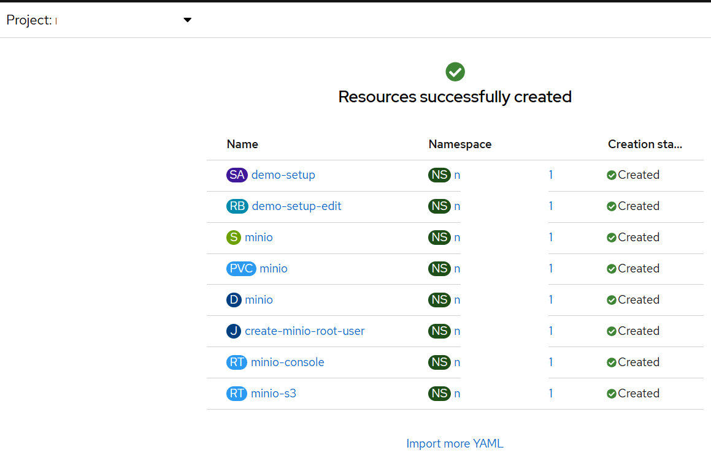
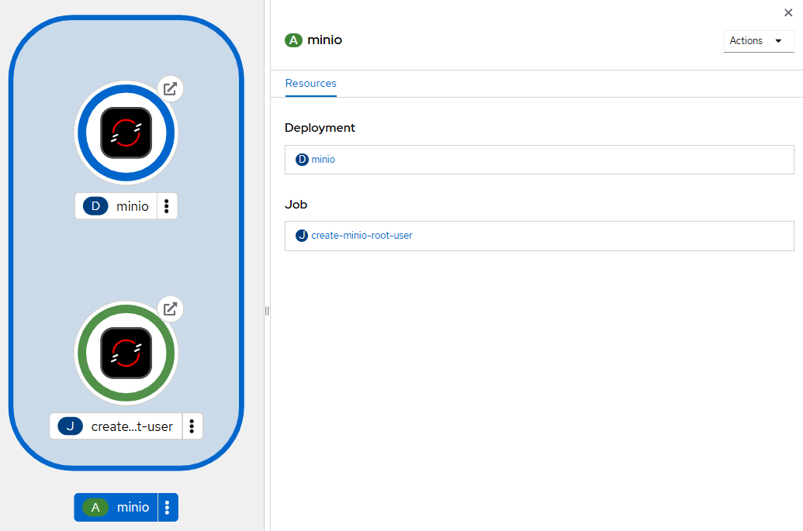
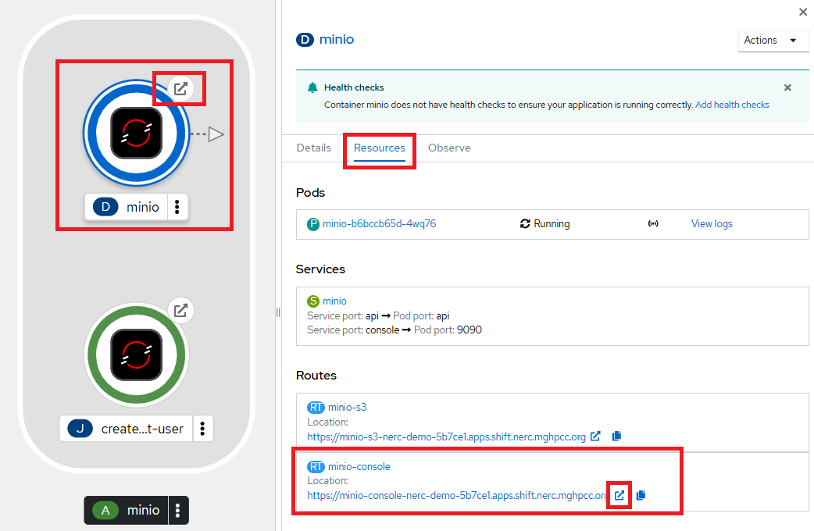

# Minio

[Minio](https://min.io/) is an open-source, high-performance object storage server
compatible with the Amazon S3 API. It provides reliable and scalable storage for
cloud-native applications, big data, and AI workloads.

MinIO offers several key features:

-   **High Performance**: MinIO is optimized for high throughput and low latency,
making it suitable for large-scale object storage deployments.

-   **Scalability**: It can handle petabytes of data and thousands of concurrent
users, allowing you to scale your storage needs as required.

-   **Reliability**: MinIO ensures data durability and availability with built-in
replication and erasure coding capabilities.

-   **Security**: It supports encryption at rest and in transit, ensuring the
confidentiality and integrity of your data.

-   **Integration**: MinIO is compatible with the Amazon S3 API, making it easy
to migrate existing applications and workflows to MinIO.

## Deploying Minio in Your OpenShift Project

**Procedure:**

1.  From the OpenShift AI dashboard, you can return to OpenShift Web Console
    by using the application launcher icon (the black-and-white icon that looks
    like a grid), and choosing the "OpenShift Console" as shown below:

    

2.  From your [NERC's OpenShift Web Console](https://console.apps.shift.nerc.mghpcc.org/),
    navigate to your project corresponding to the _NERC RHOAI Data Science Project_
    and select the "Import YAML" button, represented by the "+" icon in the top
    navigation bar as shown below:

    

3.  Verify that you selected the correct project.

    

4.  Copy the following code and paste it into the Import YAML editor.

    ??? note "Local MinIO storage Creation YAML Script"

        ```yaml
        ---
		apiVersion: v1
		kind: ServiceAccount
		metadata:
		  name: demo-setup
		---
		apiVersion: rbac.authorization.k8s.io/v1
		kind: RoleBinding
		metadata:
		  name: demo-setup-edit
		roleRef:
		  apiGroup: rbac.authorization.k8s.io
		  kind: ClusterRole
		  name: edit
		subjects:
		- kind: ServiceAccount
		  name: demo-setup
		---
		apiVersion: v1
		kind: Service
		metadata:
		  labels:
		    app: minio
		    app.kubernetes.io/part-of: minio
		  name: minio
		spec:
		  ports:
		  - name: api
		    port: 9000
		    targetPort: api
		  - name: console
		    port: 9090
		    targetPort: 9090
		  selector:
		    app: minio
		    app.kubernetes.io/part-of: minio
		  sessionAffinity: None
		  type: ClusterIP
		---
		apiVersion: v1
		kind: PersistentVolumeClaim
		metadata:
		  labels:
		    app: minio
		    app.kubernetes.io/part-of: minio
		  name: minio
		spec:
		  accessModes:
		  - ReadWriteOnce
		  resources:
		    requests:
		      storage: 10Gi # Adjust the size according to your needs
		---
		apiVersion: apps/v1
		kind: Deployment
		metadata:
		  labels:
		    app: minio
		    app.kubernetes.io/part-of: minio
		  name: minio
		spec:
		  replicas: 1
		  selector:
		    matchLabels:
		      app: minio
		      app.kubernetes.io/part-of: minio
		  strategy:
		    type: Recreate
		  template:
		    metadata:
		      labels:
		        app: minio
		        app.kubernetes.io/part-of: minio
		    spec:
		      containers:
		      - args:
		        - minio server /data --console-address :9090
		        command:
		        - /bin/bash
		        - -c
		        envFrom:
		        - secretRef:
		            name: minio-root-user
		        image: quay.io/minio/minio:latest
		        name: minio
		        ports:
		        - containerPort: 9000
		          name: api
		          protocol: TCP
		        - containerPort: 9090
		          name: console
		          protocol: TCP
		        resources:
		          limits:
		            cpu: "2"
		            memory: 2Gi
		          requests:
		            cpu: 200m
		            memory: 1Gi
		        volumeMounts:
		        - mountPath: /data
		          name: minio
		      volumes:
		      - name: minio
		        persistentVolumeClaim:
		          claimName: minio
		      - emptyDir: {}
		        name: empty        
		---
		apiVersion: batch/v1
		kind: Job
		metadata:
		  labels:
		    app: minio
		    app.kubernetes.io/part-of: minio
		  name: create-minio-root-user
		spec:
		  backoffLimit: 4
		  template:
		    metadata:
		      labels:
		        app: minio
		        app.kubernetes.io/part-of: minio
		    spec:
		      containers:
		      - args:
		        - -ec
		        - |-
		          if [ -n "$(oc get secret minio-root-user -oname 2>/dev/null)" ]; then
		            echo "Secret already exists. Skipping." >&2
		            exit 0
		          fi
		          genpass() {
		              < /dev/urandom tr -dc _A-Z-a-z-0-9 | head -c"${1:-32}"
		          }
		          id=$(genpass 16)
		          secret=$(genpass)
		          cat << EOF | oc apply -f-
		          apiVersion: v1
		          kind: Secret
		          metadata:
		            name: minio-root-user
		          type: Opaque
		          stringData:
		            MINIO_ROOT_USER: ${id}
		            MINIO_ROOT_PASSWORD: ${secret}
		          EOF
		        command:
		        - /bin/bash
		        image: image-registry.openshift-image-registry.svc:5000/openshift/tools:latest
		        imagePullPolicy: IfNotPresent
		        name: create-minio-root-user
		      restartPolicy: Never
		      serviceAccount: demo-setup
		      serviceAccountName: demo-setup
		---
		apiVersion: route.openshift.io/v1
		kind: Route
		metadata:
		  labels:
		    app: minio
		    app.kubernetes.io/part-of: minio
		  name: minio-console
		spec:
		  port:
		    targetPort: console
		  tls:
		    insecureEdgeTerminationPolicy: Redirect
		    termination: edge
		  to:
		    kind: Service
		    name: minio
		    weight: 100
		  wildcardPolicy: None
		---
		apiVersion: route.openshift.io/v1
		kind: Route
		metadata:
		  labels:
		    app: minio
		    app.kubernetes.io/part-of: minio
		  name: minio-s3
		spec:
		  port:
		    targetPort: api
		  tls:
		    insecureEdgeTerminationPolicy: Redirect
		    termination: edge
		  to:
		    kind: Service
		    name: minio
		    weight: 100
		  wildcardPolicy: None
        ```

    !!! warning "Very Important Note"

        In this YAML file, the size of the storage is set as 10Gi. Change it if
        you need to.

5.  Click **Create**.

**Verification:**

i. Once Resource is successfully created, you will see a "Resources successfully
created" message and the following resources listed:



ii. Once the deployment is successful, you will be able to see all resources
are created and grouped under "minio" application grouping on the
**Topology View** menu, as shown below:



Once successfully initiated, click on the **minio** deployment and select the
"Resources" tab to review created *Pods*, *Services*, and *Routes*.



Please note the **minio-console** route URL by navigating to the "Routes" section
under the _Location_ path. When you click on the **minio-console** route URL, it
will open the MinIO web console that looks like below:


!!! info "MinIO Web Console Login Credential"

    For this, you need to install and configure the OpenShift CLI by following
    the [setup instructions](../../openshift/logging-in/setup-the-openshift-cli.md#installing-the-openshift-cli).

    Once the OpenShift CLI is set up, the Username and Password for the MinIO web
    console can be retrieved by running the following `oc` commands:

    i. To get *Secret key* run:

    `oc get secret minio-root-user -o template --template '{{.data.MINIO_ROOT_USER}}' | base64 --decode`

    ii. And to get *Access key* run:

    `oc get secret minio-root-user -o template --template '{{.data.MINIO_ROOT_PASSWORD}}' | base64 --decode`  

Return to the **MinIO Web Console** using the provided URL. Enter the **Access Key**
as the **Username** and the **Secret Key** as the **Password**.

!!! note "Alternatively, Running a script to install local MinIO object storage"

    Alternatively, you can run a script to install local object storage using the
    OpenShift CLI (`oc`). Once the OpenShift CLI is set up, execute the following
    command to install MinIO object storage along with local MinIO storage:

    `oc apply -f https://raw.githubusercontent.com/nerc-project/fraud-detection/main/setup/s3-basic.yaml`

!!! danger "Important Note"

    The script is based on a [guide for deploying MinIO](https://ai-on-openshift.io/tools-and-applications/minio/minio/).
    The MinIO-based Object Storage that the script creates is not meant for production usage.

---
