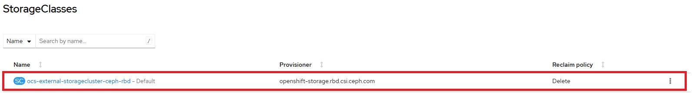

# Storage Overview

The NERC OCP supports multiple types of storage.

## Glossary of common terms for OCP storage

This glossary defines common terms that are used in the storage content.

### Compute Resources

For more details, read the [Compute Resources page](../applications/scaling-and-performance-guide.md#compute-resources).

### Storage

OCP supports many types of storage, both for on-premise and cloud providers. You
can manage container storage for persistent and non-persistent data in an OCP cluster.

### Storage class

A storage class provides a way for administrators to describe the classes of storage
they offer. Different classes might map to quality of service levels, backup policies,
arbitrary policies determined by the cluster administrators.



!!! note "Very Important Note"

    On the NERC OCP cluster, the default `StorageClass` is `ocs-external-storagecluster-ceph-rbd`.
    If you don't specify `storageClassName` in your **PersistentVolumeClaim (PVC)**,
    that default will be used.

## Storage types

OCP storage is broadly classified into two categories, namely ephemeral storage
and persistent storage.

### Ephemeral storage

Pods and containers are ephemeral or transient in nature and designed for stateless
applications. Ephemeral storage allows administrators and developers to better manage
the local storage for some of their operations. For more information about ephemeral
storage overview, types, and management, see Understanding ephemeral storage.

Pods and containers can require temporary or transient local storage for their
operation. The lifetime of this ephemeral storage does not extend beyond the life
of the individual pod, and this ephemeral storage cannot be shared across pods.

For more information on how to specify ephemeral storage (deleted with the pod)
to a pod please [read this](../applications/scaling-and-performance-guide.md#compute-resources).

#### Using in-memory `emptyDir` (tmpfs) on the NERC OCP

You can also use an **in-memory** `emptyDir` (RAM-backed tmpfs) on OpenShift that
is fast, shared by all containers in the Pod, and wiped when the Pod goes away.

For a Pod that defines an `emptyDir` volume, the volume is created when the Pod
is scheduled onto a node. As the name implies, it starts empty. All containers
in the Pod can read and write the same files in the `emptyDir`, which can be
mounted at the same or different paths in each container. When the Pod is removed
from the node for any reason, the `emptyDir` and its data are permanently deleted.

##### What it is (and why)

- Set `emptyDir.medium: "Memory"` to mount a **tmpfs** inside the Pod.

- Fast, node-RAM–backed storage that's **wiped when the Pod goes away**.

- The volume is **shared by all containers in the Pod**.

- Files written there **count against the container's memory limit** (not `ephemeral-storage`).
To learn more about defining CPU and memory, read [this user guide](../applications/scaling-and-performance-guide.md#how-to-define-cpu-and-memory).

**Common uses for an `emptyDir` volume include:**

- Scratch space (e.g., for a disk-based merge sort)

- Checkpointing long-running computations for crash recovery

- Staging files that a content-fetcher/manager container downloads while a web
server container serves them

!!! note "Note"

    A container crashing does not remove a Pod from a node. The data in an `emptyDir`
    volume is safe across container crashes.

##### YAML example

```yaml
apiVersion: apps/v1
kind: Deployment
metadata:
  name: mem-cache-demo
spec:
  replicas: 1
  selector:
    matchLabels: { app: mem-cache-demo }
  template:
    metadata:
      labels: { app: mem-cache-demo }
    spec:
      containers:
        - name: app
          image: registry.access.redhat.com/ubi9/ubi-minimal
          command: ["/bin/sh","-c"]
          args: ["python3 -m http.server 8080"]
          resources:
            requests:
              memory: "256Mi"
            limits:
              memory: "512Mi"   # leave headroom for tmpfs usage
          volumeMounts:
            - name: fast-cache
              mountPath: /cache
      volumes:
        - name: fast-cache
          emptyDir:
            medium: Memory
            sizeLimit: 256Mi    # strongly recommended
```

!!! tips "Sizing & safety tips"

    - **Always set `sizeLimit`** to prevent the tmpfs from growing until the node
    or pod runs out of memory.

    - Because it's RAM-backed, **`ephemeral-storage` limits do not apply** - use
    **memory** requests/limits and `sizeLimit`.

    - Leave headroom: if total memory (processes + tmpfs) exceeds the
    **memory limit**, the container can be **OOM-killed**.

### Persistent storage

Stateful applications deployed in containers require persistent storage. OCP uses
a pre-provisioned storage framework called persistent volumes (PV) to allow cluster
administrators to provision persistent storage. The data inside these volumes can
exist beyond the lifecycle of an individual pod. Developers can use persistent
volume claims (PVCs) to request storage requirements. For more information about
persistent storage overview, configuration, and lifecycle, see Understanding
persistent storage.

Pods and containers can require permanent storage for their operation. OpenShift
Container Platform uses the Kubernetes persistent volume (PV) framework to allow
cluster administrators to provision persistent storage for a cluster. Developers
can use PVC to request PV resources without having specific knowledge of the
underlying storage infrastructure.

#### Persistent volumes (PV)

OCP uses the Kubernetes persistent volume (PV) framework to allow cluster
administrators to provision persistent storage for a cluster. Developers can use
PVC to request PV resources without having specific knowledge of the underlying
storage infrastructure.

#### Persistent volume claims (PVCs)

You can use a PVC to mount a PersistentVolume into a Pod. You can access the
storage without knowing the details of the cloud environment.

!!! note "Important Note"

    A PVC is in active use by a pod when a Pod object exists that uses the PVC.

#### Access modes

Volume access modes describe volume capabilities. You can use access modes to match
persistent volume claim (PVC) and persistent volume (PV). The following are the
examples of access modes:

| Storage Class           | Description                                                                                      |
| ----------------------- | ------------------------------------------------------------------------------------------------ |
| ReadWriteOnce (RWO)     | Allows read-write access to the volume by a single node at a time.                               |
| ReadOnlyMany (ROX)      | Allows multiple nodes to read from the volume simultaneously, but only one node can write to it. |
| ReadWriteMany (RWX)     | Allows multiple nodes to read from and write to the volume simultaneously.                       |
| ReadWriteOncePod (RWOP) | Allows read-write access to the volume by multiple pods running on the same node simultaneously. |

#### How to specify Persistent storage using YAML?

Create a **PersistentVolumeClaim** and mount it in your Pod/Deployment. The cluster's
**StorageClass** handles provisioning.

```yaml
# 1) Create a PVC
apiVersion: v1
kind: PersistentVolumeClaim
metadata:
  name: data-pvc
spec:
  accessModes:
    - ReadWriteOnce     # or other Access Mode if your storage supports sharing
  resources:
    requests:
      storage: 10Gi
  storageClassName: ocs-external-storagecluster-ceph-rbd  # omit to use the default
---
# 2) Use the PVC in a Deployment
apiVersion: apps/v1
kind: Deployment
metadata:
  name: my-app
spec:
  replicas: 1
  selector:
    matchLabels: { app: my-app }
  template:
    metadata:
      labels: { app: my-app }
    spec:
      securityContext:
        fsGroup: 1001   # helps with write permissions on many storage backends
      containers:
        - name: app
          image: registry.access.redhat.com/ubi9/ubi-minimal
          command: ["/bin/sh","-c"]
          args: ["python3 -m http.server 8080"]
          volumeMounts:
            - name: data
              mountPath: /var/lib/data
      volumes:
        - name: data
          persistentVolumeClaim:
            claimName: data-pvc
```

!!! tips "Quick CLI equivalent (creates & mounts a PVC to `/var/lib/data`)"

    ```yaml
    oc set volume deploy/my-app \
        --add --name=data --type pvc \
        --claim-name=data-pvc --claim-size=10Gi \
        --mount-path=/var/lib/data \
        --claim-class=ocs-external-storagecluster-ceph-rbd
    ```

### Per-replica storage (StatefulSet)

StatefulSets can auto-create one PVC **per pod** via `volumeClaimTemplates` as
shown below:

```yaml
apiVersion: apps/v1
kind: StatefulSet
metadata:
  name: db
spec:
  serviceName: db
  replicas: 3
  selector:
    matchLabels: { app: db }
  template:
    metadata:
      labels: { app: db }
    spec:
      securityContext:
        fsGroup: 1001
      containers:
        - name: db
          image: registry.access.redhat.com/rhel9/postgresql-15
          volumeMounts:
            - name: data
              mountPath: /var/lib/pgsql/data
  volumeClaimTemplates:
    - metadata:
        name: data
      spec:
        accessModes: ["ReadWriteOnce"]
        resources:
          requests:
            storage: 20Gi
        storageClassName: ocs-external-storagecluster-ceph-rbd  # omit to use the default
```

!!! tips "Tips & gotchas"

    - **Permissions (arbitrary UIDs):** OpenShift runs containers with a random
    UID by default. Use `spec.securityContext.fsGroup` (or an image that supports
    arbitrary UIDs) so the pod can write to the volume.

    - **Access modes:** Use **ReadWriteOnce (RWO)** for a single writer;
    **ReadWriteMany (RWX)** if multiple pods must write concurrently (requires an
    RWX-capable StorageClass).

    - **StorageClass:** If you omit `storageClassName`, the NERC OCP cluster's
    **Default** StorageClass i.e. `ocs-external-storagecluster-ceph-rbd` is used.
    Specify one explicitly to control performance/features.

    - **SubPath mounts:** To mount only a subdirectory of a volume, set
    `subPath: <dir>` under `volumeMounts`.

---
