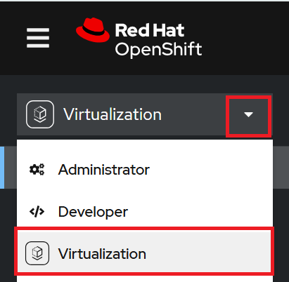
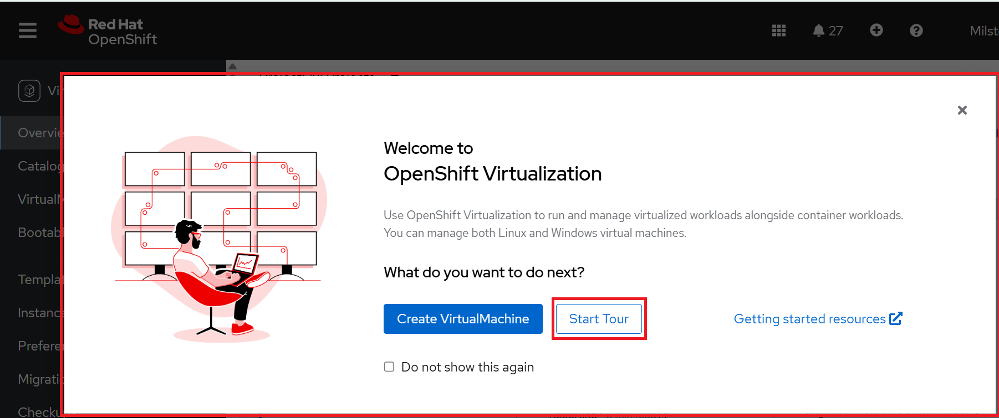
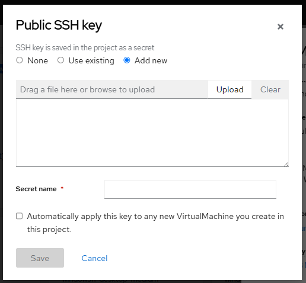

# Getting Started

## Quick Getting Started Tour

You can start exploring OpenShift Virtualization by taking tours in the OpenShift
Container Platform web console.

1. Go to the [NERC's OpenShift Web Console](https://console.apps.shift.nerc.mghpcc.org).

2. Click on the **Perspective Switcher** drop-down menu and select **Virtualization**
as shown below:

        

    This short guided tour introduces several key aspects of using OpenShift Virtualization.

    There are **two ways** to start the tour:

    On the **Welcome to OpenShift Virtualization** dialog, click **Start Tour** as
    shown below:

    

    **Or,**
    
    Go to **Virtualization** > **Overview** > **Settings** > **User** >
    **Getting started resources** and click **Guided tour**.

## Setting Up Your Environment

The `virtctl` client is a command-line utility designed for managing OpenShift
Virtualization resources. To install the `virtctl` command-line interface (CLI)
tool, please follow the instructions in [this documentation](https://docs.redhat.com/en/documentation/openshift_container_platform/4.18/html/virtualization/getting-started#installing-virtctl_virt-using-the-cli-tools).

You can utilize `virtctl` information commands to perform various operations, as
outlined [here](https://docs.redhat.com/en/documentation/openshift_container_platform/4.18/html/virtualization/getting-started#virt-virtctl-commands_virt-using-the-cli-tools).

!!! note "Note"

    The virtual machine (VM) commands also apply to virtual machine instances (VMIs)
    unless otherwise specified.

## Set Up a Public SSH Key

Before creating a virtual machine, we recommend that you configure the public SSH
key to your project. It will be saved in the project as a secret. You can configure
the public SSH key at a later time, but this is the easiest way.

For a Linux-based volume, follow these steps to configure SSH:

i. If you have not already added a public SSH key to your project, click the edit
icon beside **Authorized SSH key** in the **VirtualMachine details** section.

ii. Select one of the following options:

-   **Use existing**: Select a secret from the secrets list.

-   **Add new**: Follow these steps:

    i. Browse to the public SSH key file or paste the file in the key field.

    

    !!! tips "Creating SSH Key Pair"

        You can generate an SSH key pair by running the `ssh-keygen` command.

    ii. Enter the secret name.

    iii. Optional: Select **Automatically apply this key to any new VirtualMachine you create in this project**.

iii. Click **Save**.

---
