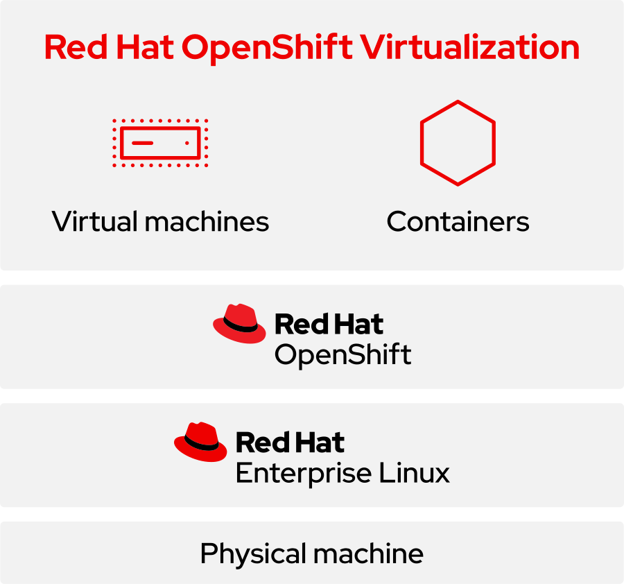

# Introduction to Virtualization on OpenShift

This will provide an in-depth overview of OpenShift Virtualization, highlighting
its benefits and key concepts.

## Overview of OpenShift Virtualization

Red Hat OpenShift Virtualization isn't entirely new - it's built on the upstream
open source project [KubeVirt](https://kubevirt.io/). It is an add-on to Red Hat
OpenShift that enables you to run virtualized workloads alongside your existing
containerized workloads on the same infrastructure. As a built-in feature of the
platform, OpenShift Virtualization offers a modern solution for organizations to
run and deploy both new and existing VM workloads efficiently.

While [OpenShift](../get-started/openshift-overview.md) was originally envisioned
as a pure container and application development platform, it has since been
extended with additional APIs and technical enhancements in the CoreOS operating
system to support virtualization.

OpenShift Virtualization is now a unified platform designed to seamlessly accommodate
both containers and VMs. This allows users to integrate VMs into containerized
workflows by running a VM within a container. You can manage VMs either exclusively
or alongside containerized workloads on the same platform.

Users seeking to leverage the [Kubernetes-native benefits](#benefits-of-using-red-hat-openshift-virtualization)
of OpenShift Virtualization can modernize their infrastructure by migrating workloads
from traditional servers-based platforms, such as [NERC OpenStack](../../openstack/index.md),
to modern cloud-native NERC Red Hat OpenShift Virtualization. This transition
enables organizations to maintain compatibility with existing VM-based workloads
while benefiting from a unified platform that supports both containerized and VM
workloads.

This approach enables organizations to benefit from faster time-to-market and
other advantages of these modern workflows - without needing to first redesign
virtualized workloads as container-native applications.

## Benefits of Using Red Hat OpenShift Virtualization

By moving VMs from other platforms to Red Hat OpenShift, you can maximize the
value of your existing virtualization investments while benefiting from cloud-native
architectures, streamlined operations and management, and modern development approaches.

- **Unified Platform**: Run and manage both containerized applications and VM
workloads on a single Kubernetes-native platform.

- **Operational Consistency**: Apply the same DevOps and GitOps practices across
VMs and containers using familiar OpenShift tools and workflows.

- **Cost Efficiency**: Reduce infrastructure overhead by consolidating workloads
and eliminating the need for separate virtualization platforms.

- **Seamless Migration**: Import, clone, and migrate existing VMs - including those
from legacy virtualization environments like VMware - into OpenShift with minimal
effort.

- **Scalability & Automation**: Leverage Kubernetes-native scaling, scheduling,
and automation features for VM workloads, just like with containers.

- **Enhanced Developer Experience**: Provide developers with self-service access
to VMs via OpenShift's UI, CLI, and APIs, integrated into their existing CI/CD
pipelines.

- **Improved Security and Governance**: Benefit from OpenShift's built-in RBAC,
SELinux, and policy enforcement to secure both container and VM environments.

- **Live Migration Support**: Migrate running VMs between nodes without downtime,
improving availability during maintenance or scaling operations.

- **Integrated Monitoring & Logging**: Use OpenShift's observability tools (e.g.,
Prometheus, Grafana, Loki) to monitor and troubleshoot both VMs and container workloads.

- **Future-Ready Infrastructure**: Modernize applications incrementally by running
legacy VMs and cloud-native containers side by side, supporting gradual transitions.

Looking for more information on the benefits of Red Hat OpenShift Virtualization?
[Read this eBook to learn more](https://www.redhat.com/en/engage/15-reasons-adopt-openshift-virtualization-ebook).

## Key Concepts and Terminology

OpenShift Virtualization extends our NERC OpenShift Container Platform (OCP) cluster
by introducing new objects through **Kubernetes custom resources**. These resources
enable users to perform a wide range of virtualization tasks, including:

-   Creating and managing Linux and Windows VMs

-   Running pod and VM workloads side by side in the same NERC OCP cluster

-   Connecting to VMs using various console and CLI tools

-   Importing and cloning existing VMs

-   Managing network interface controllers (NICs) and storage disks attached to VMs

-   Performing live migrations of VMs between nodes

!!! info "Note"

    In OpenShift Virtualization, VMs are native Kubernetes objects that you can
    manage by using the OCP web console or the command line. OpenShift Virtualization
    is represented by the { width="25" }
    icon.

At a high level, the following diagram illustrates the components of Red Hat
OpenShift Virtualization in comparison to Red Hat Virtualization and Red Hat
OpenStack Platform:

To learn more about Red Hat OpenShift Virtualization, please refer to the  
[Red Hat OpenShift Virtualization FAQ](https://www.redhat.com/en/resources/openshift-virtualization-faq),
the [Red Hat OpenShift Virtualization documentation page](https://docs.redhat.com/en/documentation/openshift_container_platform/4.18/html/virtualization/index),
and the [Red Hat OpenShift Virtualization product page](https://www.redhat.com/en/technologies/cloud-computing/openshift/virtualization).

---
