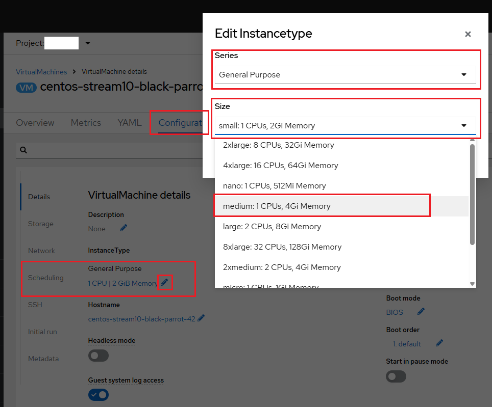
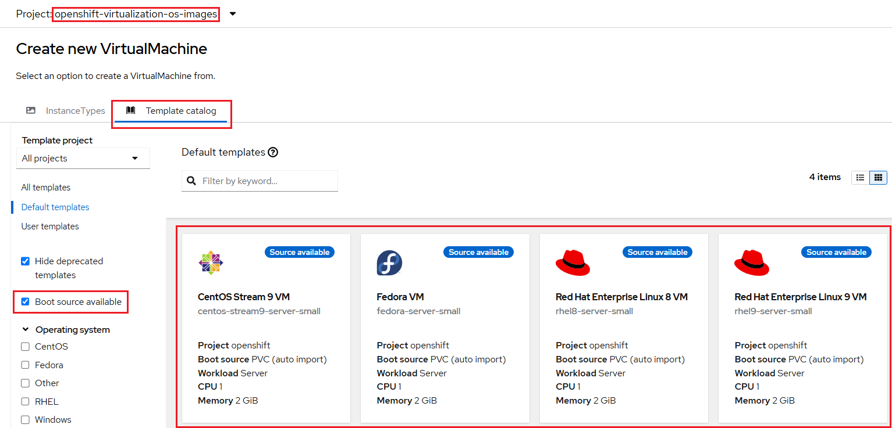
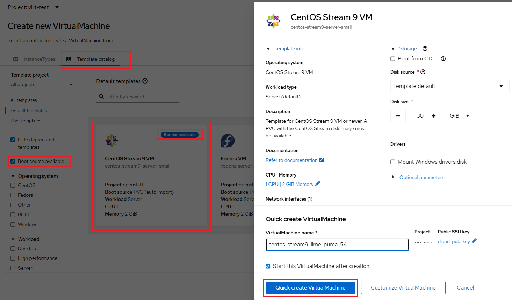
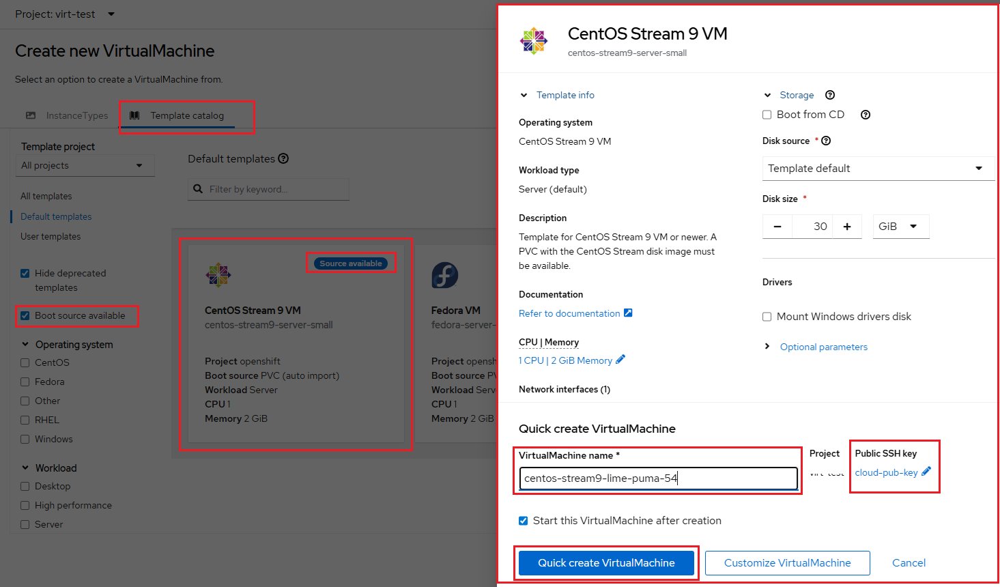
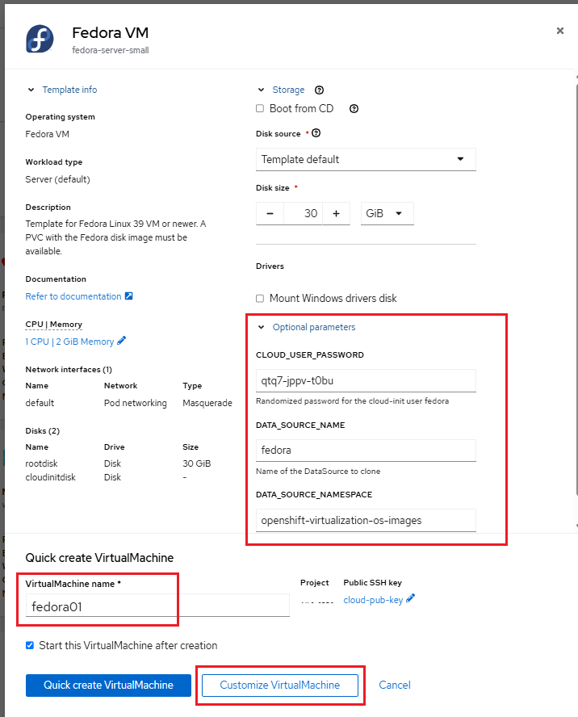
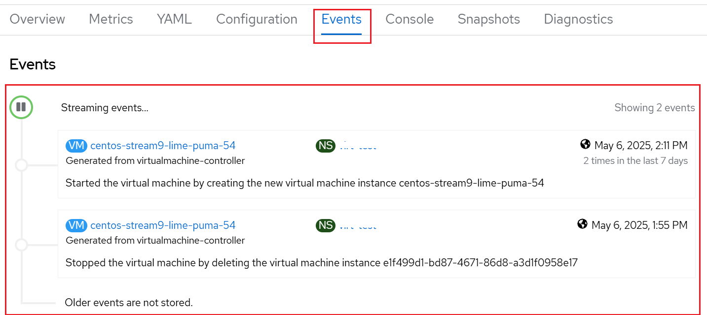

# Running and Managing Virtual Machines (VMs)

## Creating and Launching VMs

OpenShift Virtualization provides multiple ways to create and launch virtual
machines (VMs) easily. Depending on your workload requirements, you can either
create VMs from predefined **instance types** or use customizable **templates**
for rapid deployment.

### Creating virtual machines from instance types

An instance type is a reusable object where you can define resources and characteristics
to apply to new VMs. Instance types offer a fast and standardized way to create
VMs by specifying predefined compute, memory, and disk resource settings. This
approach is ideal when you need to quickly provision VMs with consistent configurations
across your environment.

!!! note "Important Note"

    When you create a VM from an instance type, you cannot override any parameters
    defined in the instance type.

    Because instance types require defined CPU and memory attributes, OpenShift
    Virtualization always rejects additional requests for these resources when
    creating a VM from an instance type.

You can create a VM from an instance type by using the OpenShift Container Platform
web console. Additionally, you can create a VM by copying an existing snapshot or
cloning an existing VM.

You also have the option to create a VM from a list of available bootable volumes.
Both Linux-based and Windows-based volumes can be added to the bootable volumes
list for VM creation.

#### Steps to create a VM from an instance type by using the web console

1. In the left navigation pane, navigate to the **Virtualization** -> **Catalog**
section in the OpenShift Web Console.

    Alternatively, in the left navigation pane, click  **Virtualization** -> **VirtualMachines**.
    From the **Create VirtualMachine** dropdown choose **From InstanceType** as shown
    below:

    

    The **InstanceTypes** tab opens by default as shown below:

    

2. Select either of the following options:

    -   From the Volume table, select a bootable volume to boot your VirtualMachine.
    If the list is truncated, click the **Show all** button to display the entire
    list.

        !!! info "Optional"

            Click the **star** icon to designate a bootable volume as a favorite.
            Starred bootable volumes appear first in the volume list.

    -   Click **Add volume** to upload a new volume or to use an existing persistent
    volume claim (PVC), a volume snapshot, or a *containerDisk* volume. Click **Save**.

        Logos of operating systems that are not available in the cluster are shown
        at the bottom of the list. You can add a volume for the required operating
        system by clicking the **Add volume** link.

        In addition, there is a link to the **Create a Windows boot source** quick
        start. The same link appears in a popover if you hover the pointer over
        the *question mark* icon next to the Select volume to boot from line as
        shown below:

        

        Immediately after you install the environment or when the environment is
        disconnected, the list of volumes to boot from is empty. In that case,
        three operating system logos are displayed: Linux, RHEL, and Windows as
        shown below:

        

        You can add a new volume that meets your requirements by clicking the
        **Add volume** button.

3. Click an InstanceType tile and select the appropriate resource size (CPU, memory,
disk size) for your workload, as shown below:

    

4. *Optional*: Click **View YAML & CLI** to view the YAML file. Click CLI to view
the CLI commands. You can also download or copy either the YAML file contents or
the CLI commands.

5. *Optional*: In **VirtualMachine details**, you can edit the VM's name, disk &
storage settings, and **Public SSH key**, etc. Configure any overrides the original
parameters for them if necessary.

    !!! info "Project-Level SSH Key Injection"

        You can add an SSH key to a project as [described here](getting-started.md#set-up-a-public-ssh-key).
        This key will then be automatically injected into any VMs you create within
        that project.

    !!! note "Mount a Windows drivers disk in a Windows VM"

        *Optional*: If you are creating a Windows VM, you can mount a Windows driver
        disk:

        -   Click the **Customize VirtualMachine** button.

        -   On the **VirtualMachine details** page, click **Storage**.

        -   Select the **Mount Windows drivers disk** checkbox.

6. Review the configuration and then create the virtual machine by clicking
**Create VirtualMachine**.

7. Navigate to **Virtualization** -> **VirtualMachines** in the left menu bar to
view the status of the newly provisioned virtual machine. To verify that you have
successfully created the virtual machine, make sure your VM is in **Running** status.

#### Changing the instance type of a VM

You can modify the instance type of a running VM using the web console, and the
change takes effect immediately.

**Prerequisites**:

You created the VM by using an instance type.

**Procedure**:

1. From the **VirtualMachine details** page, click the **Configuration** tab.

2. On the **Details** tab, click the instance type text to open the **Edit Instancetype**
dialog. For example, click the pencil icon next to **1 CPU | 2 GiB Memory**.

3. Edit the instance type by using the **Series** and **Size** lists.

    -   Select an item from the **Series** list to show the relevant
        sizes for that series. For example, select **General Purpose**.

    -   Select the VM's new instance type from the **Size** list. For
        example, select **medium: 1 CPUs, 4Gi Memory**, which is available
        in the **General Purpose** series.

        

4. Click **Save**.

**Verification**:

1. Click the **YAML** tab.

2. Click **Reload**.

3. Review the VM YAML to confirm that the instance type changed.

### Creating virtual machines from templates

Templates provide a fast and simple way to provision VMs. OpenShift Virtualization
includes predefined templates for a wide range of common operating systems and
hardware configurations. Templates can include preset resource allocations, disk
images, cloud-init scripts, and networking options. For example, templates are
available for both Linux and Microsoft Windows VMs. Templates allow you to create
VMs based on reusable configurations, ideal for specific operating systems,
application stacks, or organizational standards.

#### Provision a virtual machine using default templates

1. In the left navigation pane, navigate to the **Virtualization** -> **Catalog**
section in the OpenShift Web Console.

    Alternatively, in the left navigation pane, click  **Virtualization** -> **VirtualMachines**.
    From the **Create VirtualMachine** dropdown choose **From template** as shown
    below:

    

2. On the *Catalog* screen, select the **Template catalog** tab, which contains
various templates (e.g., RHEL, Fedora, Windows Server) for creating virtual
machines (VMs). Use the available filters to narrow down the list of displayed
templates. Click on the template tile you want to use to create your VM.

    !!! tip "Template Catalog with Boot Source Available"

        Templates that display the label **Source available** are ready to use
        immediately because they are backed by a pre-uploaded boot source image
        stored in the `openshift-virtualization-os-images` project. This means you
        can provision a VM directly from the template without needing to manually
        upload an operating system ISO or configure a disk image.

        You can filter templates by "Boot source available" as shown below:

        

        **Benefits of Using Templates with Boot Sources:**

        - **Faster provisioning**: VMs can be launched instantly without waiting
        for boot images to be uploaded. Since a boot source is already available,
        the **Quick Create VirtualMachine** button is enabled, allowing you to
        rapidly deploy a VM with minimal configuration.

            

        - **Standardized configurations**: Ensures consistent VM settings across
        environments.

        - **Simplified user experience**: Great for developers and teams who want
        to get started without deep knowledge of underlying storage or image management.

3. Verify that the **Template Info** is accurate for the virtual machine that you
want to create.

    

4. Enter the required parameters such as the VirtualMachine name, **Public SSH key**,
and optional customizations. Configure any overrides the original parameters for
storage, CPU | Memory, Optional parameters if necessary.

    !!! info "Project-Level SSH Key Injection"

        You can add an SSH key to a project as [described here](getting-started.md#set-up-a-public-ssh-key).
        This key will then be automatically injected into any VMs you create within
        that project.

5. Create the virtual machine by clicking **Quick create VirtualMachine**.

6. Navigate to **Virtualization** -> **VirtualMachines** in the left menu bar to
view the status of the newly provisioned virtual machine. To verify that you have
successfully created the virtual machine, make sure your VM is in **Running** status.

#### Provision a virtual machine using customized templates

1. In the left navigation pane, navigate to the **Virtualization** -> **Catalog**
section in the OpenShift Web Console.

2. Click a template tile to view the virtual machine details.

    

3. Expand the **Storage** and **Optional parameters** sections to modify related
virtual machine settings, then click **Next** at the bottom of the frame.

    

4. Click **Customize VirtualMachine** to edit the virtual machine settings.

5. Customize virtual machine settings in the **Overview**, **YAML**, **Scheduling**,
**Environment**, **Network interfaces**, **Disks**, **Scripts**, and **Metadata**
tabs and click **Create VirtualMachine**.

    It includes the following tabs that allow you to view and edit VM settings:

    -   **Overview**: Review the **Overview** tab with the default configuration
        for the VM that displays general information it.

        For example, you can customize the number of processor cores and amount
        of memory, change connected networks, add additional disks, and include
        configuration scripts.

        

    -   **YAML**: The **YAML** tab provides direct access to the VM's Kubernetes
        resource definition. This view is ideal for advanced users who want to make
        low-level or bulk configuration changes not exposed in the UI.

    -   **Scheduling**: The **Scheduling** tab allows you to control where and how
        the VM runs within the cluster. Here, you can configure node selectors,
        tolerations, affinity rules, eviction strategies, and dedicated
        resource options (e.g., pinning CPUs or assigning PCI devices).

        

        -   **Node Selector**: A **node selector** is used to specify one or more
            cluster nodes that the VM is allowed to run on. Selection can be based
            on node **name**, **label**, or **annotation**.

        -   **Tolerations**: **Tolerations rules** allow VMs to be scheduled on
            nodes that have **taints** applied. Taints act as restrictions—only
            workloads with matching tolerations can be scheduled on those nodes.
            This is useful in scenarios where certain nodes are dedicated for
            specialized workloads, such as GPU-enabled VMs.

        -   **Affinity Rules**: **Affinity rules** specify that a VM should be co-located
            with certain workloads, while **anti-affinity rules** ensure that the
            VM is scheduled away from specific workloads. These rules are useful
            for high availability, workload isolation, or optimizing resource usage.

        -   **Dedicated Resources**: The **dedicated resources** option allows you
            to assign specific physical resources to a VM. This includes allocating
            individual CPU cores or passing through PCIe devices like GPUs or network
            cards directly to the VM.

        -   **Eviction Strategy**: By default, VMs use the **Live Migrate** eviction
            strategy. This enables seamless migration of VMs to another node when
            a node is cordoned and drained for maintenance, such as applying updates.
            You can alternatively configure the VM to:

            -   Shut down and perform a cold migration

            -   Remain on the current node without migrating

        -   **Descheduler**: OpenShift includes a **descheduler** that periodically
            evaluates VMs and their host nodes. It can trigger migration to another
            node for reasons such as:

            -   Resource optimization

            -   Affinity or anti-affinity rule violations

    -   **Network Interfaces**: Use the **Network Interfaces** tab to view and manage
        the VM's network configuration. You can attach the VM to one or more networks
        (such as Software Defined Network (SDN) or Multus), define IP address assignment
        modes, and add or remove network interfaces as needed. By default a VM is
        connected to the `Pod networking` network with a `masquerade` type (which
        is just OpenShift internal networking that connects the VM to the SDN).
        This enables outbound access from the VM and allowing other VMs and Pods
        within the cluster to reach it.

        

    -   **Disks**: The **Disks** tab lists all virtual disks attached to the VM.
        You can add new disks, resize existing ones, or configure boot priority.
        If the guest agent is installed, it also displays filesystem details and
        usage statistics.

        

        You can add new disks or modify the default ones before creating the VM.
        Additionally, you can change the storage class, set a custom boot source
        - such as an ISO - and specify a different disk interface instead of using
        the default `virtio` interface.

        !!! info "Note"

            For more details about virtual machine storage, refer to [this page](storage.md).

    -   **Scripts**: The **Scripts** tab is used to configure **cloud-init** for
        Linux or **sysprep** for Windows VMs. This also includes **Authorized SSH
        key** to setup user credentials. Here, you can set first-boot commands,
        inject SSH keys, install packages, define users, and automate initial
        system configuration.

        

        - **Cloud-init** can be configured either through the GUI dialog or by using
        a standard YAML script for more advanced customization.

            

        - An **Authorized SSH key** can optionally be provided to allow one or more
        users to connect to the VM without a password. This SSH key can be stored
        as a `Secret` and automatically applied to new Linux VMs if desired.

        - **Sysprep** is a Microsoft Windows tool used for automatically configuring
        new OS deployments. It supports settings such as the hostname, default
        `Administrator` password, and joining an Active Directory domain. Please
        refer to [this document](windows-vm.md#how-to-configure-sysprep) for
        instructions on how to set up or edit `Sysprep`.

            !!! tip "Tips"

                To learn more about customizing and deploying Windows virtual machines,
                refer to [this page](windows-vm.md).

    -   **Metadata**: The **Metadata** tab allows you to view and edit Kubernetes
        metadata for the VM, such as labels and annotations. These are useful for
        organizing, selecting, or applying policies to VMs across your environment.

    !!! info "Very Important"

        When creating a VM, make sure the **Start this VirtualMachine after
        creation** option is checked. If you forget to enable this option and
        the VM is created in the *Stopped* state, you can start it manually
        by clicking the **Actions** drop-down in the upper-right corner of the
        panel and selecting **Start**.

        

6. Navigate to **Virtualization** -> **VirtualMachines** in the left menu bar to
view the status of the newly provisioned virtual machine.

#### Creating a custom VM template in the web console

You can create a VM template by editing a YAML file in the OpenShift Container
Platform web console.

**Procedure**:

-   In the web console, click **Virtualization** -> **Templates** in the side menu.

-   Click **Create Template**.

-   Specify the template parameters by editing the **YAML** file.

-   Click **Create**.

The template is displayed on the **Templates** page.

!!! tip "Tips"

    You can also create virtual machines by providing YAML manifests i.e. YAML or
    JSON definitions, either through the web console or via the command line.

    

    You can also view amd update the existing VM's configuration using the **YAML**
    tab on the **VirtualMachine Details** page, as [explained here](#yaml-tab).

## Controlling virtual machine states

You can stop, start, restart, pause, and unpause virtual machines from the web console.

!!! tip "Note"

    You can use `virtctl` to manage VM states and perform various other actions
    directly from the command line. For a full list of VM management commands,
    refer to the official Red Hat documentation: [VM Management Commands](https://docs.redhat.com/en/documentation/openshift_container_platform/4.18/html/virtualization/getting-started#vm-management-commands_virt-using-the-cli-tools).

1. Navigate to **Virtualization** -> **VirtualMachines** in the left menu bar to
view the status of the newly provisioned virtual machine.

2. Select the VM of your interest from the list.

3. Press the top-right dropdown, **Actions**, to list the available options:

    

    !!! tip "Shorthand Method using Actions Icon Bar"

        Alternatively, you can simply click the action icons - such as **Stop**,
        **Restart**, **Pause**, and **Start** - located near to the **Actions**
        menu as shown below:

        

    - **Stop**: Initiates a graceful shutdown of the VM.

    - **Restart**: Sends a reboot signal to the operating system. Guest agent
    integrations are required for this action to function properly.

    - **Pause**: Suspends the VM's execution by freezing its processes. The VM will
    not consume CPU or I/O resources during this state, but its memory remains
    allocated at the hypervisor level.

    !!! note "Note"

        While launching the VM, you selected the "Start this VirtualMachine after
        creation" checkbox (which is selected by default). As a result, the VM is
        already in *Running* status, which is why the **Start** option is not available.

4. Press **Stop** and wait till the Virtual Machine is in state *Stopped*.

    

5. Clicking on **Actions**, the option **Start** appears, and the options **Restart**
and **Pause** are greyed out as shown below:

    

6. Press **Start**, and wait for the *Running* status.

7. Using the **Actions** menu, press the **Pause** option. The Virtual Machine
state will change to *Paused*.

    

8. Once your VM is in the *Paused* state, unpause the Virtual Machine using **Actions**
    and the option **Unpause**.

## VirtualMachine details page

Follow these steps to view details of any virtual machine using the web console:

1. In the left navigation pane, navigate to the **Virtualization** -> **Catalog**
section in the OpenShift Web Console.

2. Select any one of the virtual machine to view the **VirtualMachine details**
page of that selected VM.

### Overview Tab

Click the **Overview** tab to view details including its status, creation time,
operating system, and resource usage such as CPU, memory, storage, and network transfer.
This tab also displays the VM's IP address on the SDN, along with additional details
such as the boot order, workload profile, and the cluster node and pod currently
hosting the VM.

-   Hostname

-   Operating system version and timezone information

-   Active users

-   Utilization: CPU, Memory, Storage and Network.

### Metrics Tab

Navigate to the **Metrics** tab to access detailed usage information, including
the ability to specify a custom time range.

### YAML Tab

Navigate to the **YAML** tab to access the VM's full Kubernetes resource definition,
ideal for making low-level or bulk configuration changes not available through the
web console. The `VirtualMachine` resource manages virtual machines that are not
currently running or are in a stopped state. It contains the template used to create
a `VirtualMachineInstance` (VMI) and reflects the running state of the VMI in its
status.

### Configuration Tab

The **Configuration** tab provides access to editable VM properties such as
scheduling policies, environment variables, network interfaces, disks, and `cloud-init`
or `sysprep` scripts. It enables you to fine-tune VM behavior before or after deployment.

For more details on how to update VM configurations, see
[Updating Virtual Machine Configurations](#update-virtual-machine-configurations).

### Events Tab

After the VM is created, navigate to the **Events** tab to review details of the
creation process. This displays a chronological list of system-generated events
related to the VM lifecycle, such as creation, start, stop, migration, or failure
notifications. Any issues encountered during VM creation will also be displayed
in this tab. This is helpful for debugging and auditing VM behavior.

### Console Tab

Navigate to the **Console** tab to access the VM's graphical or serial console.
This enables direct interaction with the guest operating system as if you were
physically accessing the machine.

For more details on how to access the VM via console, see
[Access the Virtual Machine Console](#access-the-virtual-machine-console).

### Snapshots Tab

The **Snapshots** tab allows you to create, manage, and restore snapshots of
the VM. Snapshots capture the VM's state and data at a specific point in time and
can be used for backups, rollbacks, or cloning.

For more details on using snapshots to backup and restore a VM, see
[Backup and Restore by Using VM Snapshots](storage.md#backup-and-restore-by-using-vm-snapshots).

### Diagnostics Tab

The **Diagnostics** tab provides troubleshooting information and health indicators
for the VM. It includes alerts, conditions, and additional metadata that help you
investigate operational or performance issues.

!!! info "Editing VM Metadata"

    After the VM is created, you can view and edit Kubernetes metadata for the VM, such as labels and annotations by clicking the **Actions** drop-down in the upper-right corner of the panel and selecting either **Edit labels** or **Edit annotations** options as shown below:

    

## Update virtual machine configurations

As workload demands change, you may need to update the configurations of running
virtual machines. You can change a selection of **configuration** options using
the OpenShift Virtualization web console.

Follow these steps to reconfigure existing virtual machines in the web console:

1. In the left navigation pane, navigate to the **Virtualization** -> **Catalog**
section in the OpenShift Web Console.

2. Select a virtual machine to view the **VirtualMachine details** page.

    

3. Click the **Configuration** tab.

    

    It includes seven subtabs that allow you to view and edit VM settings: Details,
    Storage, Network, Scheduling, SSH, Initial run, and Metadata.

    -   **Details**:
        Here you can change the VirtualMachine details such as InstanceType, Hostname,
        Hardware devices, etc.

    -   **Storage**:
        Here you can change **Disks** and **Environment** attached to the VM.

        - **Disks**: Lists the disks currently attached to the VM and allows you
        to add new ones. If the guest agent is installed, this section also displays
        filesystem details and usage statistics.

        -   **Environment**: You can attach ConfigMaps, Secrets, and Service Accounts
        as additional disks. This is useful for passing configuration data to applications
        running inside the VM.

    -   **Network**:
        Displays the current network interfaces configured for the VM and provides
        the option to add new ones.

    -   **Scheduling**:
        This section includes advanced configuration options that determine where
        the VM should run and the strategy to follow for eviction. It allows you
        to configure affinity and anti-affinity rules, node selectors, tolerations,
        and other settings that influence how and where the VM is scheduled within
        the cluster.

    -   **SSH**:
        Allows you to set the SSH settings such as injecting SSH keys for the VM.

    -   **Initial run**:
        This tab allows you to configure **cloud-init** for Linux or **sysprep**
        for Microsoft Windows. You can specify commands to be executed at first
        boot, such as user credentials, installing applications, setting up network
        configuration, and more.

    -   **Metadata**:
        This allows you to view and edit Kubernetes metadata for the VM, such as
        labels and annotations.

4. List the disks associated with the VM by clicking **Storage** subtab:

    

    Here you can view the Name, Size, PVC source, Interface, and Storage class -
    which defines the source and type of storage attached to the VM as the VM disks.

    !!! info "Note"

        For more details about modifying storage for an existing VM, refer to [this page](storage.md#modifying-storage-for-an-existing-vm).

5. Examine the network interfaces attached to the VM by clicking on the **Network**
subtab:

    

    When a VM is created, an interface using the `Pod Networking` network with a
    `masquerade` type is created by default. This connects the VM to the OpenShift
    SDN, enabling outbound access from the VM and allowing other VMs and Pods within
    the cluster to reach it.

!!! note "Important Note"

    Some changes require a restart of the VM. The web console notifies you if a
    restart is needed.

## Access the virtual machine console

Click the **Console** tab to access the VM's console as shown below:

You can connect to the following consoles to connect to VM consoles:

-   [VNC console](#connecting-to-the-vnc-console)

-   [Serial console](#connecting-to-the-serial-console)

-   [Desktop viewer for Windows VMs (Only)](#connecting-to-the-desktop-viewer)

### Connecting to the VNC console

You can connect to the VNC console of a VM using either the OpenShift Container
Platform web console or the `virtctl` command-line tool.

#### Connecting to the VNC console by using the web console

You can connect to the VNC console of a VM using the OpenShift Container Platform
web console.

!!! note "Note"

    When connected to a Windows VM with a vGPU assigned as a mediated device, you
    can switch between the default display and the vGPU display.

**Procedure**:

1. On the **Virtualization** -> **VirtualMachines** page, click a VM to open the
**VirtualMachine details** page.

2. Click the **Console** tab. The VNC console session starts automatically.

    

3. *Optional*: To switch to the vGPU display of a Windows VM, select
**Ctl + Alt + 2** from the **Send key** list.

    -   Select **Ctl + Alt + 1** from the **Send key** list to restore the default
        display.

4. Click **Guest login credentials** to view the password generated for the default
username, based on the selected operating system (OS) for the VM. This option is
available only when the VM has been customized - by default in this template - using
OpenShift Virtualization with `cloud-init` to set the password.

    

    !!! tip "Important Tips"

        You can click on **Paste** to paste the password after copying it.

5. After you log in, run the `ip a` command to display the interfaces and IP addresses:

    

    Since this network adapter is connected to the SDN, the assigned IP address
    is an internal IP used by the KVM hypervisor and is not externally accessible.
    This internal IP remains the same even if the VM is live migrated to a different
    node, although the external IP associated with the SDN connection may change.

6. Run `lsblk` to display the list of disks and their capacities and free space:

    

    - `/dev/vda` is the primary disk created during VM creation, sized according
    to the specifications provided at that time.

    - `/dev/vdb` is a temporary disk used by `cloud-init` to inject required data,
    such as setting the password for the default OS user. This disk can be safely
    removed after the VM has been created and initialized.

7. You can verify the number of CPUs and the amount of memory allocated to the
VM - matching the flavor selected during creation - by using the following commands
inside the VM:

    - `nproc`: Displays the number of available CPU cores.

    - `free -m`: Shows the amount of memory in megabytes.

    

8. To review the guest customization, mount the `cloud-init` disk by running the
following commands:

    sudo mount /dev/vdb /mnt
    sudo cat /mnt/user-data; echo

    

9. To end the console session, click outside the console pane and then click **Disconnect**.

### Connecting to the serial console

You can connect to the serial console of a VM using either the OpenShift Container
Platform web console or the `virtctl` command-line tool.

!!! note "Important Note"

    Concurrent VNC connections to a single VM are not currently supported.

#### Connecting to the serial console by using the web console

You can connect to the serial console of a VM using the OpenShift Container Platform
web console.

!!! note "Note"

    When connected to a Windows VM with a vGPU assigned as a mediated device, you
    can switch between the default display and the vGPU display.

**Procedure**:

1. On the **Virtualization** -> **VirtualMachines** page, click a VM to open the
**VirtualMachine details** page.

2. Click the **Console** tab. The VNC console session starts automatically.

3. Click **Disconnect** to end the VNC console session. Otherwise, the VNC console
session continues to run in the background.

4. Select **Serial console** from the console list.

5. *Optional*: To switch to the vGPU display of a Windows VM, select
**Ctl + Alt + 2** from the **Send key** list.

    -   Select **Ctl + Alt + 1** from the **Send key** list to restore the default
        display.

6. To end the console session, click outside the console pane and then click **Disconnect**.

### Connecting to the desktop viewer

You can connect to a Windows VM using the desktop viewer and Remote Desktop Protocol
(RDP) through the OpenShift Container Platform web console.

!!! note "Note"

    If you connect to a Windows VM with a vGPU assigned as a mediated device, you
    can switch between the default display and the vGPU-enabled display.

**Prerequisites**:

-   You installed the QEMU guest agent on the Windows VM.

-   You have an RDP client installed.

**Procedure**:

1. On the **Virtualization** -> **VirtualMachines** page, click a VM to open the
**VirtualMachine details** page.

2. Click the **Console** tab. The VNC console session starts automatically.

3. Click **Disconnect** to end the VNC console session. Otherwise, the VNC console
session continues to run in the background.

4. Select **Desktop viewer** from the console list.

5. Click **Create RDP Service** to open the RDP Service dialog.

6. Select **Expose RDP Service** and click **Save** to create a node port service.

7. Click **Launch Remote Desktop** to download an `.rdp` file and launch the desktop
viewer.

8. *Optional*: To switch to the vGPU display of a Windows VM, select
**Ctl + Alt + 2** from the **Send key** list.

    -   Select **Ctl + Alt + 1** from the **Send key** list to restore the default
        display.

9. To end the console session, click outside the console pane and then click **Disconnect**.

---
