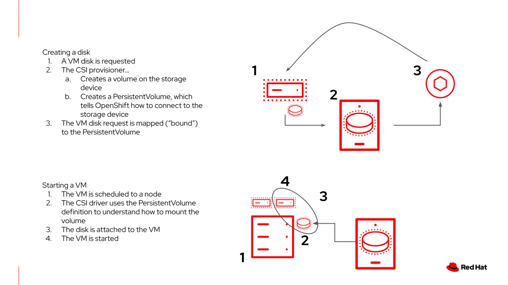
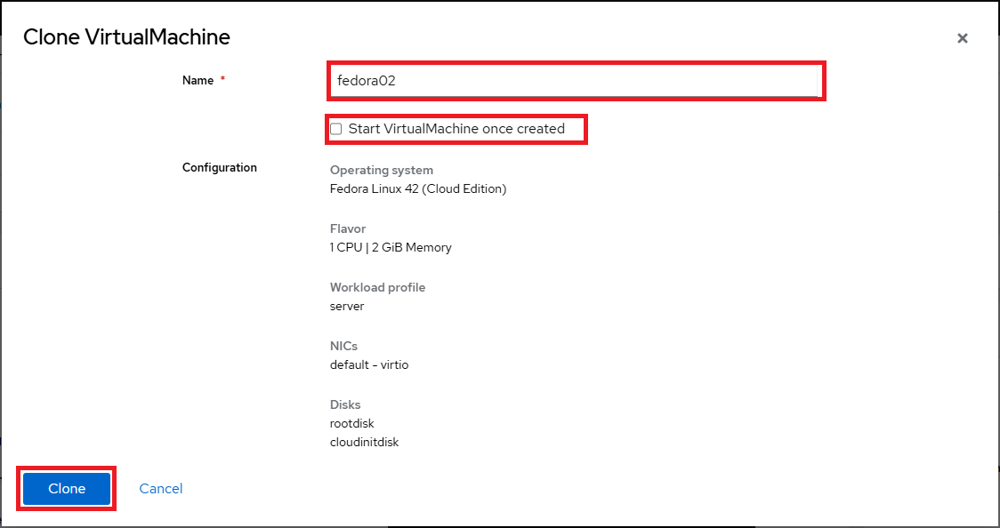
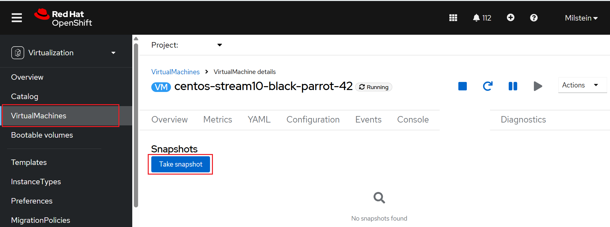

# Storage Management

OpenShift Virtualization leverages Kubernetes objects - such as storage classes,
persistent volume claims (PVCs), and persistent volumes (PVs) - to manage storage
for VMs. PVCs are requests for storage resources with specific Storage classes,
capacities, and access modes. Through the Container Storage Interface (CSI), storage
systems receive these requests, allocate storage as PVs, and bind the PVs to the
corresponding PVCs.

Our cluster is already configured with default `StorageClass` objects that include
details such as quality-of-service levels, backup policies, and organization-specific
requirements. Storage classes define and categorize available storage resources.
This allows users to request storage resources by referencing the `StorageClass`
name, without needing in-depth knowledge of the underlying storage infrastructure.

Navigate to **Virtualization** -> **Storage** -> **StorageClasses** from the
left-hand menu to view all available StorageClasses.

## Create PersistentVolumeClaims (PVC) using the web console

Follow these steps to create a PVC using the web console:

**Procedure**:

1. On the **Virtualization** -> **Storage** page, click the **PersistentVolumeClaims**
page.

2. From the Project dropdown at the top left of the page, make sure you have selected
your own namespace that you want to work with.

3. Click **Create PersistentVolumeClaim** and select the **With Data upload form**
option.

    

4. On the **Create PersistentVolumeClaim** screen, customize the PVC settings and
click **Create** to provision the PVC.

    

**Verification**:

To verify that you have successfully created the PVC:

Navigate to **Storage** -> **PersistentVolumeClaims** in the left menu bar to
view the status of all PVCs and their associated bound PVs.

## Upload a boot source

Boot sources are standardized OS images used to create VMs.

Once a boot source is uploaded, it becomes available for creating VMs from templates.
Other users in the cluster can also use this boot source to provision VMs using
templates that reference it.

To upload a boot source image, follow these steps:

- Upload the boot source image using a PVC.

This ensures that the image is stored persistently and can be reused across multiple
VM deployments.

**Procedure**:

1. On the **Virtualization** -> **Storage** page, click the **PersistentVolumeClaims**
page.

2. From the Project dropdown at the top left of the page, make sure you have selected
your own namespace that you want to work with.

3. Click **Create PersistentVolumeClaim** and select the **With Data upload form**
option.

    

4. On the **Upload data to Persistent Volume Claim** screen, click **Upload** in
the **Upload data** field to select the boot source image that you want to upload.

    

5. In the **Persistent Volume Claim Name** field, specify a name for the PVC.

6. The **StorageClass** specifies the underlying storage type backing the VM disk.
This varies by storage provider, and a single provider may offer multiple storage
classes to represent different capabilities such as performance tiers or access
modes.

7. In the **Size** field, specify the size of the PVC.

    !!! warning "Important Note"

        Ensure that the storage allocation you specify for the PVC is larger than
        the size of the uncompressed image (i.e. the QCOW2 or ISO image) and any
        other space requirements. Use the console to verify the size of the image
        you want to upload.

8. **Apply optimized StorageProfile Settings** use recommended clone strategies
and volume modes based on the selected storage type.

9. Click **Upload**. Uploading the image may take some time, depending on the size
of the image.

**Verification**:

To verify that you have successfully uploaded your boot source:

Click **Storage** -> **PersistentVolumeClaims**.

In the boot source's project, your upload is listed.

## OpenShift Virtualization Default Boot Sources

Persistent virtual machines require persistent storage. During the installation
of the OpenShift Virtualization Operator, some PersistentVolumeClaims were automatically
created to hold template disks for various Linux distributions.

Using these OS images is optional, and their creation and download can be disabled
through the appropriate setting in the Operator. However, they offer a quick and
convenient way to start provisioning VMs with OpenShift Virtualization, as they
use cloud images tailored for each supported distribution. These images typically
include `cloud-init` and have a minimal OS footprint optimized for virtualization.
Additionally, Red Hat-provided boot images are automatically updated when new
templates are released.

The `openshift-virtualization-os-images` project contains all available boot
sources and is automatically enabled when OpenShift Virtualization is installed.

In this section, we will review the PVCs created by the Operator, as well as the
PVCs associated with a virtual machine.

**Procedure**:

1. On the **Virtualization** -> **Storage** page, click the **PersistentVolumeClaims**
page.

2. In the project drop-down menu, enable **Show default projects**, then select
the **openshift-virtualization-os-images** project as shown below:

    

3. List the boot sources that OpenShift Virtualization automatically created. Each
PVC represents a boot source image for a supported operating system distribution.

    

    !!! note "Note"

        Navigate to **Virtualization** -> **Bootable volumes** to obtain a list
        of the available volumes.

4. Select one of the available boot source PVCs - such as `fedora-XX` - to view its
detailed configuration.

    !!! note "Examine the PVC for a VM"

        In this section, we are going to take a closer look at the storage behind
        the virtual machine we created previously using **Fedora VM** template as
        [explained here](running-and-managing-vms.md#provision-a-virtual-machine-using-customized-templates).

    Once clicked on the `fedora-XX` PVC and and you will be presented with a
    screen that shows additional details about the storage volume backing the VM
    as shown below:

    

    As you can see, `ocs-external-storagecluster-ceph-rbd` storage class is used.
    The details reveal that the PVC is configured as `ReadWriteMany` (RWX), which
    is required for features like live migration, and is using **Block** volume
    mode. Note that the access mode (RWX) is critical, but the volume mode - block
    or file - may vary by storage provider. Either mode will work as long as RWX
    is supported.

    The PVC's capacity must be sufficient to store the base OS and any software
    packages installed for use by VMs created from this template. While VMs cloned
    from this disk can increase the size of their attached disk, they cannot reduce
    it. The PVC will be created using a **DataVolume** through Containerized Data
    Importer (CDI). A DataVolume is created. DataVolumes are used to manage the
    creation of a VM disk, abstracting the clone or import process onto OpenShift
    native storage during the virtual machine's creation flow.

    

5. When a VM is created, the boot source image is cloned, and a new disk (PVC)
is provisioned for the VM. Switch to your project namespace and review the list
of PVCs. You will see a separate PVC for each disk associated with the VMs in
your project.

6. A PVC requests storage from a specific `StorageClass`, or defaults to the
cluster's default class if none is specified. To view the associated PVs, navigate
to **Storage** -> **PersistentVolumes** in the OpenShift web console. From there,
you can sort the list by the **Claim** column to see which PVs are bound to which
PVCs.

## Modifying Storage for an Existing VM

Follow these steps to reconfigure existing virtual machines in the web console.

1. In the left navigation pane, navigate to the **Virtualization** -> **VirtualMachines**
section in the OpenShift Web Console.

2. Select the virtual machine to view its **VirtualMachine details** page.

    

3. Click the **Configuration** tab.

    

4. List the disks associated with the VM by clicking **Storage** subtab:

    

5. Here you can perform any of the following tasks:

    -   You can add a new disk (by clickling **Add Disk**).

        

    -   Edit any existing disks by clicking on the three dots on the right side
        of the individual disk and selecting **Edit**. This will show a dialog
        as shown below:

        

    -   Detach or delete unused disks by clicking on the three dots on the right
        side of the individual disk and selecting **Detach**.

!!! note "Important Note"

    If the VM is running, some changes (e.g., disk size) may require you to stop
    the VM before editing.

## Cloning a VM by using the web console

You can clone an existing VM by using the web console.

**Procedure**:

-   Navigate to **Virtualization** -> **VirtualMachines** in the left menu bar.

-   Select a VM to open the **VirtualMachine details** page.

-   Click **Actions**.

-   Select **Clone**.

    

-   On the **Clone VirtualMachine** page, enter the name of the new VM.

-   *Optional*: Select the **Start cloned VM** checkbox to start the cloned VM.

    

-   Click **Clone**.

    !!! danger "Very Important Note"

        The cloned VM will have the same identity as the source VM, which may cause
        conflicts with applications and other clients interacting with the VM. Use
        caution when cloning a VM connected to an external network or in the same
        project.

-   A new VM is created, the disks are cloned and automatically the portal will
    redirect you to the new VM.

    

-   Click on the **YAML** menu at the top of the screen, you will see that the
    name of the VM is changed, however there are labels that remain from the main
    source VM (**from the new VM is cloned!**) that will need to be manually updated.

    

-   Modify the the `app` and `kubevirt.io/domain` values in the **YAML** so that
    they are set to the new VM name, then click the **Save** button at the bottom,
    this will allow us to work with this VM in future modules much more easily.

!!! note "Note"

    Note that if the VM is powered on, it will be stopped in order to perform the
    clone. However, if a snapshot of the VM exists, you can create a clone from
    the snapshot without powering off the VM.

## Backup and restore by using VM snapshots

Snapshots capture the state and data of a VM at a specific point in time. If you
encounter issues while configuring or updating your infrastructure, you can use
snapshots to restore the VM to a known good state. You can use a snapshot to restore
an existing VM to a previous state for backup, disaster recovery, or to quickly
roll back to an earlier development version. In the event of a security incident,
snapshots also allow you to preserve the VM's state for further investigation.

!!! note "Note"

    A VM snapshot is created from a VM that is powered off (*Stopped* state) or
    powered on (*Running* state). For running VMs, it ensures all data is written
    to disk before capturing the snapshot. The platform leverages backing storage
    mechanisms to efficiently snapshot VM data.

OpenShift Virtualization includes features that simplify snapshot management across
your environment. You can:

-   Create new snapshots

-   Create VMs from existing snapshots

-   List all snapshots attached to a specific VM

-   Restore VMs from snapshots

-   Delete existing snapshots

### Create and manage snapshots

You can create snapshots of VMs using either the OpenShift Container Platform web
console or the command line.

#### Creating a snapshot by using the web console

**Prerequisites**:

The VM snapshot includes disks that meet the following requirements:

-   The disks are data volumes or persistent volume claims.

-   The disks belong to a storage class that supports Container Storage Interface
    (CSI) volume snapshots.

-   The disks are bound to a persistent volume (PV) and populated with a datasource.

**Procedure**:

1. Navigate to **Virtualization** -> **VirtualMachines** in the web console.

2. Select a VM to open the **VirtualMachine details** page.

3. Click the **Snapshots** tab and then click **Take Snapshot**.

    

    !!! tip "Take Snapshot using VM Action Option"

        You can take snapshot of a VM from the **VirtualMachine details** page
        using **Actions** and the **Take snapshot** option.

        

4. Enter the snapshot name.

5. Expand **Disks included in this Snapshot** to see the storage volumes to be
    included in the snapshot.

6. If your VM has disks that cannot be included in the snapshot and you wish to
    proceed, select **I am aware of this warning and wish to proceed**.

    

7. Click **Save** and wait till the Snapshot has been created and the status shows
as *Operation complete*.

    

### Creating a VM from an existing snapshot by using the web console

You can create a new VM by copying an existing snapshot.

**Procedure**:

1. Navigate to **Virtualization** -> **VirtualMachines** in the web console.

2. Select a VM to open the **VirtualMachine details** page.

3. Click the **Snapshots** tab.

4. Click the Options menu for the snapshot you want to copy as shown below:

    

5. Select **Create VirtualMachine**.

    

6. Enter the name of the VM.

7. *Optional*: Select the **Start this VirtualMachine after creation** checkbox
    to start the new VM.

8. Click **Create**.

### Restoring virtual machines from snapshots

You can restore VMs from snapshots using either the OpenShift Container Platform
web console or the command line.

**Procedure**:

1. Navigate to **Virtualization** -> **VirtualMachines** in the web console.

2. Select a VM to open the **VirtualMachine details** page.

3. If the VM is running, click the **Actions** menu and select **Stop**.

    

    !!! tip "Shorthand Method using Actions Icon Bar"

        Alternatively, you can simply click the action icons - such as **Stop**,
        **Restart**, **Pause**, and **Start** - located near to the **Actions**
        menu as shown below:

        

4. Select the **Snapshots** tab to view a list of snapshots for this VM.

5. Click the Options menu for the desired snapshot, then click
    **Restore VirtualMachine from snapshot** in the pop-up menu.

    

    !!! note "Important Note"

        If the **Restore** option is greyed out please check if the VM is currently
        *Running* state. You need to Stop the VM in order to enable restoring using
        the snapshot.

        

6. In the dialog shown, press **Restore**.

    

7. Select the **Snapshots** tab to view the snapshot status.

    

8. Wait for the VM to finish restoring. Then, restart the VM by clicking the **Actions**
menu and selecting **Start**.

    

9. Verify that the VM is booting correctly again.

    

---
