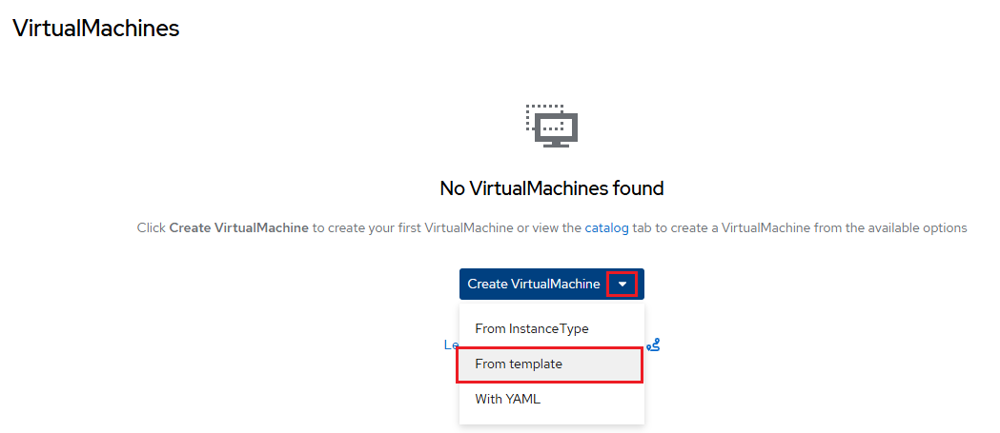
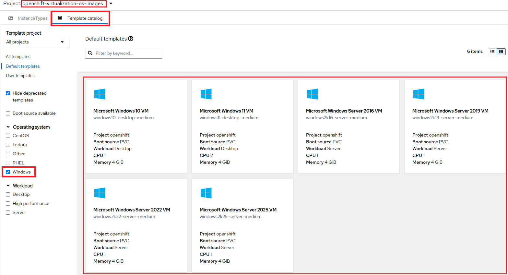
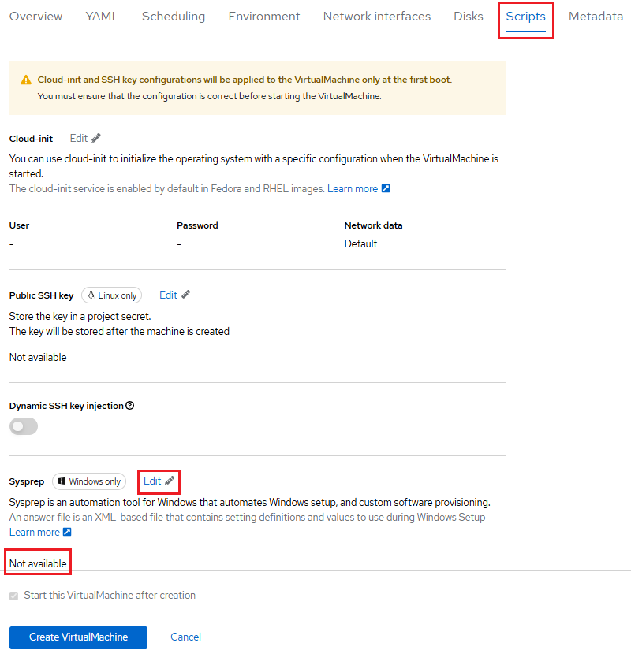
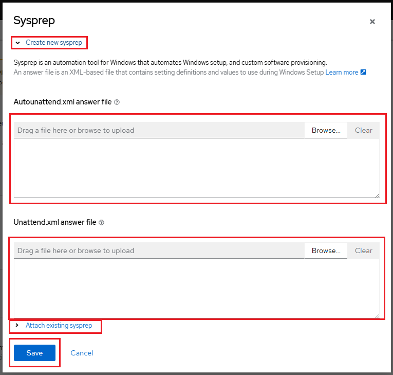
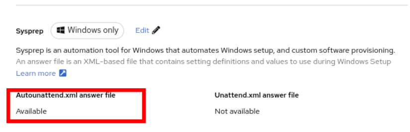

# Windows Virtual Machines with OpenShift Virtualization

## Creating a Microsoft Windows virtual machine

1. In the left navigation pane, navigate to the **Virtualization** -> **Catalog**
section in the OpenShift Web Console.

    Alternatively, in the left navigation pane, click  **Virtualization** -> **VirtualMachines**.
    From the **Create VirtualMachine** dropdown choose **From template** as shown
    below:

    

2. On the *Catalog* screen, select the **Template catalog** tab, which contains
various templates (e.g., RHEL, Fedora, Windows Server) for creating virtual
machines (VMs).

    !!! info "Important Note"

        Be sure to click the **Template project** dropdown in the upper-left corner
        and select **All Projects**. Also, ensure the *All templates* option is
        selected. This will display all available boot sources, including templates
        for Microsoft Windows operating systems.

        To narrow the view, apply the **Operating System** filter and select **Windows**,
        as shown below:

        

3. Select any one of the "Microsoft Windows OS" based template options.

    !!! info "Important Note"

        This type of machine does not have a **Quick Create VirtualMachine** option
        as they don't have a boot source available. So once clicked they need to
        be customized by clicking **Customize VirtualMachine** button.

4. Click **Customize VirtualMachine** to proceed to the customize template options.

5. Under Disk source, click the dropdown and select the Upload option.

6. You may browse your local system for the desired Windows disk image. Once
selected, the upload process will begin and take several minutes.

7. After the upload is complete, you can create the virtual machine and watch
it provisioning in the refreshed screen.

8. Once this posts, click Open web console to open a new tab accessing the VM.

9. Proceed with steps to change the Windows machine *Administrator* password. Once
done, the VM will be running.

## How to Configure Sysprep

**Sysprep** is a Microsoft Windows tool used for automatically configuring new
OS deployments. It supports settings such as the hostname, default `Administrator`
password, and joining an Active Directory domain.

For a Windows volume, follow either of these set of steps to configure `sysprep`
options:

-   If you haven't already added Sysprep options for the Windows volume, follow
    these steps while customizing the VM. Navigate to the **Scripts** tab to
    configure the necessary settings.

    i. Click the edit icon beside **Sysprep** in the **VirtualMachine details**
    section.

    

    ii. Add the **Autoattend.xml** answer file on the opened dialog pop-up form:

    

    !!! info "Sample Autoattend.xml answer file"

        This can be used as example for `Autoattend.xml` answer file:

        ```xml
        <?xml version="1.0" encoding="utf-8"?>
        <unattend xmlns="urn:schemas-microsoft-com:unattend" xmlns:wcm="http://schemas.microsoft.com/WMIConfig/2002/State" xmlns:xsi="http://www.w3.org/2001/XMLSchema-instance" xsi:schemaLocation="urn:schemas-microsoft-com:unattend">
          <settings pass="windowsPE">
            <component name="Microsoft-Windows-Setup" processorArchitecture="amd64" publicKeyToken="31bf3856ad364e35" language="neutral" versionScope="nonSxS">#pragma: allowlist secret
              <DiskConfiguration>
                <Disk wcm:action="add">
                  <CreatePartitions>
                    <CreatePartition wcm:action="add">
                      <Order>1</Order>
                      <Extend>true</Extend>
                      <Type>Primary</Type>
                    </CreatePartition>
                  </CreatePartitions>
                  <ModifyPartitions>
                    <ModifyPartition wcm:action="add">
                      <Active>true</Active>
                      <Format>NTFS</Format>
                      <Label>System</Label>
                      <Order>1</Order>
                      <PartitionID>1</PartitionID>
                    </ModifyPartition>
                  </ModifyPartitions>
                  <DiskID>0</DiskID>
                  <WillWipeDisk>true</WillWipeDisk>
                </Disk>
              </DiskConfiguration>
              <ImageInstall>
                <OSImage>
                  <InstallFrom>
                    <MetaData wcm:action="add">
                      <Key>/IMAGE/NAME</Key>
                      <Value>Windows Server 2019 SERVERSTANDARD</Value>
                    </MetaData>
                  </InstallFrom>
                  <InstallTo>
                    <DiskID>0</DiskID>
                    <PartitionID>1</PartitionID>
                  </InstallTo>
                </OSImage>
              </ImageInstall>
              <UserData>
                <AcceptEula>true</AcceptEula>
                <FullName>Administrator</FullName>
                <Organization>My Organization</Organization>
              </UserData>
              <EnableFirewall>false</EnableFirewall>
            </component>
            <component name="Microsoft-Windows-International-Core-WinPE" processorArchitecture="amd64" publicKeyToken="31bf3856ad364e35" language="neutral" versionScope="nonSxS">#pragma: allowlist secret
              <SetupUILanguage>
                <UILanguage>en-US</UILanguage>
              </SetupUILanguage>
              <InputLocale>en-US</InputLocale>
              <SystemLocale>en-US</SystemLocale>
              <UILanguage>en-US</UILanguage>
              <UserLocale>en-US</UserLocale>
            </component>
          </settings>
          <settings pass="offlineServicing">
            <component name="Microsoft-Windows-LUA-Settings" processorArchitecture="amd64" publicKeyToken="31bf3856ad364e35" language="neutral" versionScope="nonSxS">#pragma: allowlist secret
              <EnableLUA>false</EnableLUA>
            </component>
          </settings>
          <settings pass="specialize">
            <component name="Microsoft-Windows-Shell-Setup" processorArchitecture="amd64" publicKeyToken="31bf3856ad364e35" language="neutral" versionScope="nonSxS">#pragma: allowlist secret
              <AutoLogon>
                <Password>
                  <Value>R3dh4t1!</Value>
                  <PlainText>true</PlainText>
                </Password>
                <Enabled>true</Enabled>
                <LogonCount>999</LogonCount>
                <Username>Administrator</Username>
              </AutoLogon>
              <OOBE>
                <HideEULAPage>true</HideEULAPage>
                <HideLocalAccountScreen>true</HideLocalAccountScreen>
                <HideOnlineAccountScreens>true</HideOnlineAccountScreens>
                <HideWirelessSetupInOOBE>true</HideWirelessSetupInOOBE>
                <NetworkLocation>Work</NetworkLocation>
                <ProtectYourPC>3</ProtectYourPC>
                <SkipMachineOOBE>true</SkipMachineOOBE>
              </OOBE>
              <UserAccounts>
                <LocalAccounts>
                  <LocalAccount wcm:action="add">
                    <Description>Local Administrator Account</Description>
                    <DisplayName>Administrator</DisplayName>
                    <Group>Administrators</Group>
                    <Name>Administrator</Name>
                  </LocalAccount>
                </LocalAccounts>
              </UserAccounts>
              <TimeZone>Eastern Standard Time</TimeZone>
            </component>
          </settings>
          <settings pass="oobeSystem">
            <component name="Microsoft-Windows-International-Core" processorArchitecture="amd64" publicKeyToken="31bf3856ad364e35" language="neutral" versionScope="nonSxS">#pragma: allowlist secret
              <InputLocale>en-US</InputLocale>
              <SystemLocale>en-US</SystemLocale>
              <UILanguage>en-US</UILanguage>
              <UserLocale>en-US</UserLocale>
            </component>
            <component name="Microsoft-Windows-Shell-Setup" processorArchitecture="amd64" publicKeyToken="31bf3856ad364e35" language="neutral" versionScope="nonSxS">#pragma: allowlist secret
              <AutoLogon>
                <Password>
                  <Value>R3dh4t1!</Value>
                  <PlainText>true</PlainText>
                </Password>
                <Enabled>true</Enabled>
                <LogonCount>999</LogonCount>
                <Username>Administrator</Username>
              </AutoLogon>
              <OOBE>
                <HideEULAPage>true</HideEULAPage>
                <HideLocalAccountScreen>true</HideLocalAccountScreen>
                <HideOnlineAccountScreens>true</HideOnlineAccountScreens>
                <HideWirelessSetupInOOBE>true</HideWirelessSetupInOOBE>
                <NetworkLocation>Work</NetworkLocation>
                <ProtectYourPC>3</ProtectYourPC>
                <SkipMachineOOBE>true</SkipMachineOOBE>
              </OOBE>
              <UserAccounts>
                <LocalAccounts>
                  <LocalAccount wcm:action="add">
                    <Description>Local Administrator Account</Description>
                    <DisplayName>Administrator</DisplayName>
                    <Group>Administrators</Group>
                    <Name>Administrator</Name>
                  </LocalAccount>
                </LocalAccounts>
              </UserAccounts>
              <TimeZone>Eastern Standard Time</TimeZone>
            </component>
          </settings>
        </unattend>
        ```

    After saving the content for Autoattend xml file it shows its availablity as
    following:

    

    iii. Add the **Unattend.xml** answer file (if any).

    iv. Click **Save**.

-   If you want to use existing sysprep options for the Windows volume, follow
    these steps:

    i. Click **Attach existing sysprep**.

    ii. Enter the name of the existing sysprep **Unattend.xml** answer file.

    iii. Click **Save**.

---
