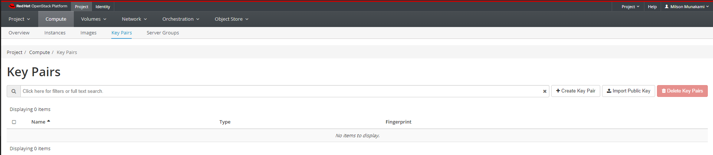

# Create a Key-pair

!!! note "NOTE"
    If you will be using PuTTY on Windows, please read [this first](#ssh-keys-with-putty-on-windows).

## Add a Key Pair

For security, the VM images have password authentication disabled by default,
so you will need to use an SSH key pair to log in.

You can view key pairs by clicking Project, then click Compute panel and choose
Key Pairs from the tabs that appears. This  shows the key pairs that are
available for this project.



## Import a Key Pair

!!! note "Prerequisite"
    You need ssh installed in your system

You can create a key pair on your local machine, then upload the public key to
the cloud.  This is the **recommended method**.

Open a terminal and type the following commands (in this example, we have named
the key cloud.key, but you can name it anything you want):

```sh
  cd ~/.ssh
  ssh-keygen -t rsa -f ~/.ssh/cloud.key -C "label_your_key"
```

Example:


You will be prompted to create a passphrase for the key.
*IMPORTANT: Do not forget the passphrase! If you do, you will be unable to use
your key.*

This process creates two files in your `.ssh` folder:

```sh
  cloud.key      # private key - don’t share this with anyone, and never upload
  # it anywhere ever
  cloud.key.pub  # this is your public key
```

!!! note "Pro Tip"
    The `-C "label"` field is not required, but it is useful to quickly identify
    different public keys later.

You could use your email address as the label, or a user@host tag that
identifies the computer the key is for.

For example, if Bob has both a laptop and a desktop computer that he will,
he might use -C "Bob@laptop" to label the key he generates on the laptop, and
-C "Bob@desktop" for the desktop.*

On your terminal:

```sh
  pbcopy < ~/.ssh/cloud.key.pub  #copies the contents of public key to your clipboard
```

!!! note "Pro Tip"
    If `pbcopy` isn't working, you can locate the hidden `.ssh` folder, open the
    file in your favorite text editor, and copy it to your clipboard.

---
Go back to the Openstack Dashboard, where you should still be on the Key Pairs tab

(If not, find it under Project -> Compute -> Key Pairs)

Choose "Import Public Key". Give the key a name in the "Key Pair Name" Box,
choose "SSH Key" as the Key Type dropdown option and paste the public key that
you just copied in the "Public Key" text box.


Click "Import Public Key". You will see your key pair appear in the list.


You can now skip ahead to [Adding the key to an ssh-agent](#adding-your-ssh-key-to-the-ssh-agent)

## Create a Key Pair

If you are having trouble creating a key pair with the instructions above, the
Openstack dashboard can make one for you.

Click "Create a Key Pair", and enter a name for the key pair.


Click on "Create a Key Pair" button. You will be prompted to download a `.pem`
file containing your private key.

In the example, we have named the key 'cloud_key.pem', but you can name it anything.

Save this file to your hard drive, for example in your Downloads folder.

Copy this key inside the `.ssh` folder on your local machine/laptop, using the
following steps:

```sh
  cd ~/Downloads          # Navigate to the folder where you saved the .pem file
  mv cloud.pem ~/.ssh/    # This command will copy the key you downloaded to
  # your .ssh folder.
  cd ~/.ssh               # Navigate to your .ssh folder
  chmod 400 cloud.pem     # Change the permissions of the file
```

To see your public key, navigate to Project -> Compute -> Key Pairs

You should see your key in the list.


If you click on the name of the newly added key, you will see a screen of
information that includes details about your public key:


The public key is the part of the key you distribute to VMs and remote servers.

You may find it convenient to paste it into a file inside your `.ssh` folder,
so you don't always need to log into the website to see it.

Call the file something like `cloud_key.pub` to distinguish it from your
private key.

*Important: Never share your private key with anyone, or upload it to a server!*

## Adding your SSH key to the ssh-agent

If you have many VMs, you will most likely be using one or two VMs with public
IPs as a gateway to others which are not reachable from the internet.

In order to be able to use your key for multiple SSH hops, do NOT copy your
private key to the gateway VM!

The correct method to use Agent Forwarding, which adds the key to an ssh-agent
on your local machine and 'forwards' it over the SSH connection.

If ssh-agent is not already running in background, you need to start the
ssh-agent in the background.

```sh
  eval "$(ssh-agent -s)"
  > Agent pid 59566
```

Then, add the key to your ssh agent:

```sh
  cd ~/.ssh
  ssh-add cloud.key
  Identity added: cloud.key (test_user@laptop)
```

Check that it is added with the command

```sh
  ssh-add -l
  2048 SHA256:D0DLuODzs15j2OaZnA8I52aEeY3exRT2PCsUyAXgI24 test_user@laptop (RSA)
```

Depending on your system, you might have to repeat these steps after you reboot
or log out of your computer.

You can always check if your ssh key is added by running the `ssh-add -l` command.

A key with the default name id_rsa will be added by default at login, although
you will still need to unlock it with your passphrase the first time you use it.

Once the key is added, you will be able to forward it over an SSH connection,
like this:

```sh
  ssh -A -i cloud.key <username>@<remote-host-IP>
```

Connecting via SSH is discussed in more detail later in the tutorial ([SSH to
Cloud VM](../create-and-connect-to-the-VM/ssh-to-cloud-VM.md)); for now, just
proceed to the next step below.

## SSH keys with PuTTY on Windows

PuTTY requires SSH keys to be in its own `ppk` format. To convert between
OpenSSH keys used by OpenStack and PuTTY's format, you need a utility called PuTTYgen.

If it was not installed when you originally installed PuTTY, you can get it
here: [Download PuTTY](#http://www.chiark.greenend.org.uk/~sgtatham/putty/latest.html).

You have 2 options for generating keys that will work with PuTTY:

 1. Generate an OpenSSH key with ssh-keygen or from the Horizon GUI using the
 instructions above, then use PuTTYgen to convert the private key to .ppk
 2. Generate a .ppk key with PuTTYgen, and import the provided OpenSSH public
 key to OpenStack using the 'Import a Key Pair' instructions [above](#import-a-key-pair).

There is a detailed walkthrough of how to use PuTTYgen here: [Use SSH Keys with
PuTTY on Windows](https://devops.profitbricks.com/tutorials/use-ssh-keys-with-putty-on-windows/)

---
