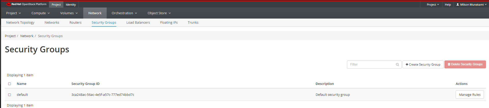
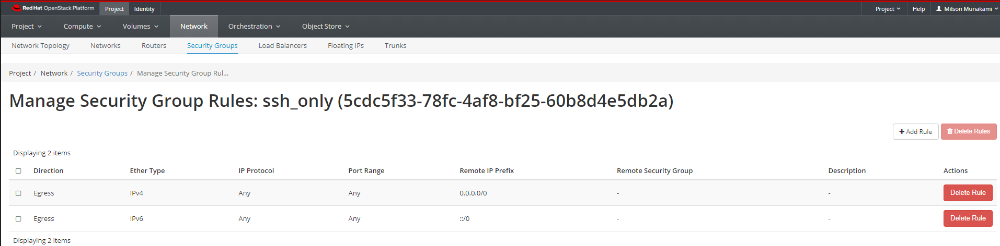
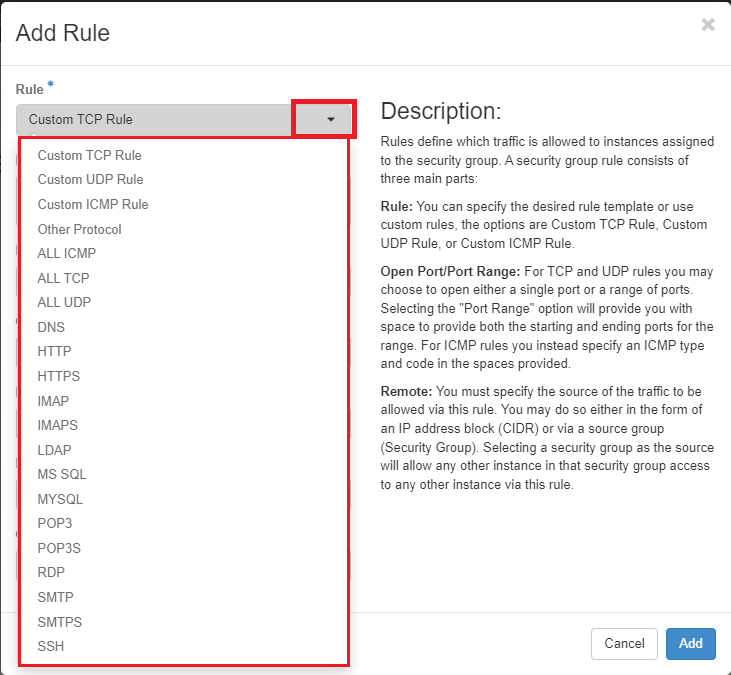
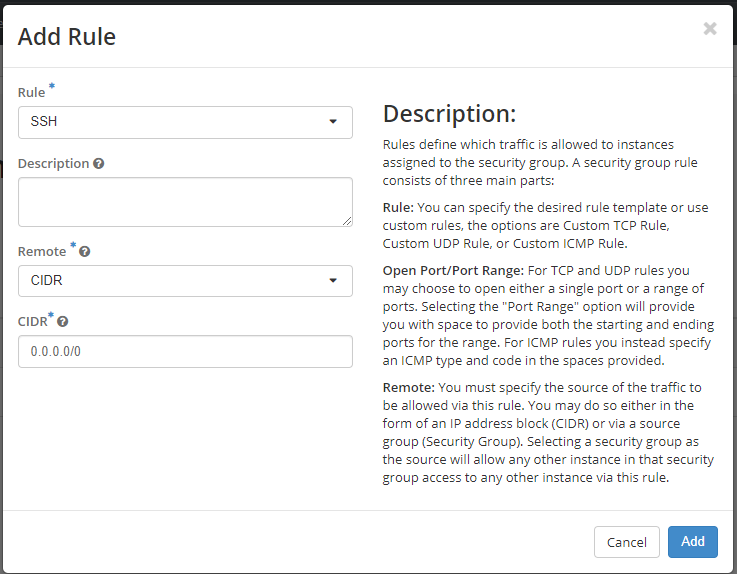
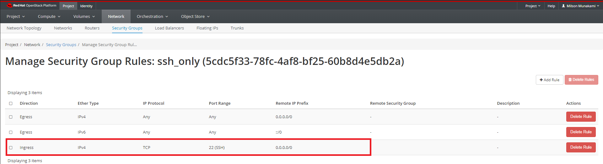
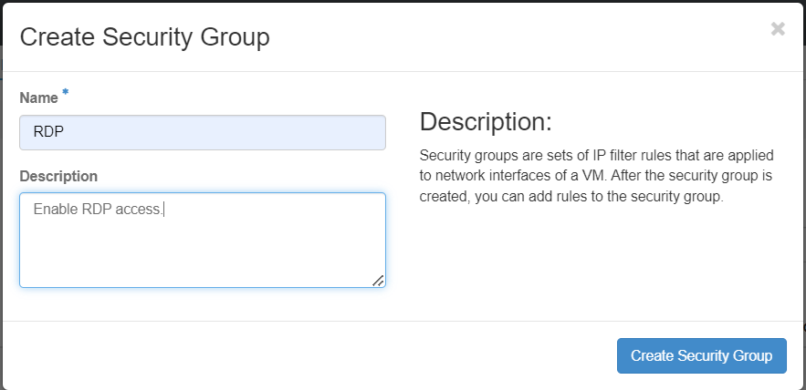
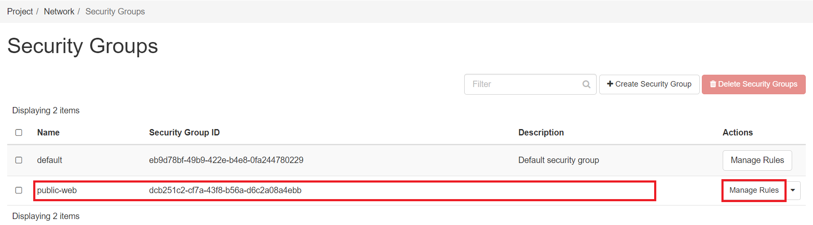
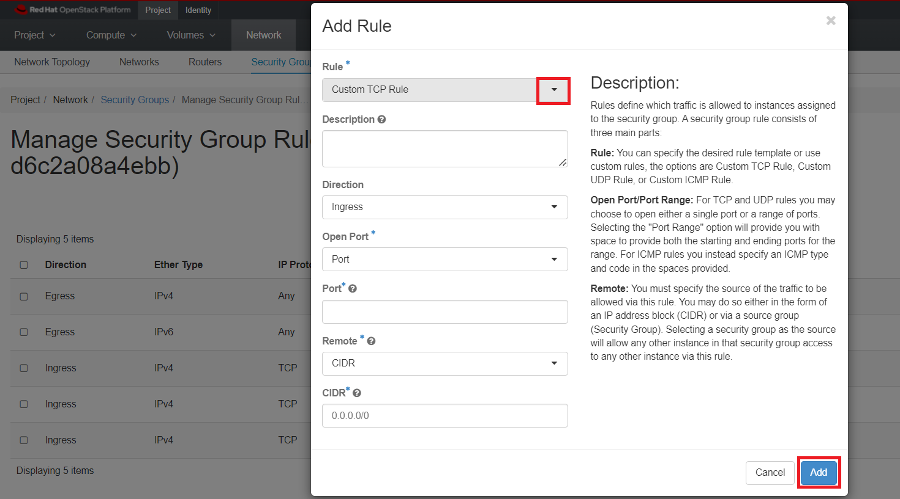

# Security Groups

Security groups can be thought of like firewalls. They ultimately control inbound
and outbound traffic to your virtual machines.

Before you launch an instance, you should add security group rules to enable
users to ping and use SSH to connect to the instance. Security groups are sets
of IP filter rules that define networking access and are applied to all
instances within a project. To do so, you either add rules to the default
security group Add a rule to the default security group or add a new security
group with rules.

You can view security groups by clicking Project, then click Network panel and
choose Security Groups from the tabs that appears.

Navigate to _Project -> Network -> Security Groups_.

You should see a ‘default’ security group. The default security group allows
traffic only between members of the security group, so by default you can
always connect between VMs in this group. However, it blocks all traffic from
outside, including incoming SSH connections. In order to access instances via a
public IP, an additional security group is needed. on the other hand, for a VM that
hosts a web server, you need a security group which allows access to ports 80
(for http) and 443 (for https).

!!! warning "Important Note"

    We strongly advise against altering the **default** security group and suggest
    refraining from adding extra security rules to it. This is because the
    **default** security group is automatically assigned to any newly created VMs.
    It is considered a best practice to create separate security groups for related
    services, as these groups can be reused multiple times.Security groups are
    very highly configurable, for insance, you might create a basic/ generic group
    for ssh (port 22) and icmp (which is what we will show as an example here)
    and then a separate security group for http (port 80) and https (port 443)
    access if you're running a web service on your instance.

You can also limit access based on where the traffic originates, using either
IP addresses or security groups to define the allowed sources.

## Create a new Security Group

### Allowing SSH

To allow access to your VM for things like SSH, you will need to create a
security group and add rules to it.

Click on "Create Security Group". Give your new group a name, and a brief description.

You will see some existing rules:

Let's create the new rule to allow SSH. Click on "Add Rule".

You will see there are a lot of options you can configure on the Add Rule
dialog box.

!!! note "To check all available Rule"

    You can choose the desired rule template as shown under Rule dropdown options.
    This will automatically select the Port required for the selected custom rule.

    

Enter the following values:

- Rule: SSH

- Remote: CIDR

- CIDR: 0.0.0.0/0

    !!! note "Note"

          To accept requests from a particular range of IP addresses, specify the
          IP address block in the CIDR box.

The new rule now appears in the list. This signifies that any instances using
this newly added Security Group will now have SSH port 22 open for requests
from any IP address.

### Allowing Ping

The default configuration blocks ping responses, so you will need to add an
additional group and/or rule
if you want your public IPs to respond to ping requests.

Ping is ICMP traffic, so the easiest way to allow it is to add a new rule and
choose "ALL ICMP" from the dropdown.

In the Add Rule dialog box, enter the following values:

- Rule: All ICMP

- Direction: Ingress

- Remote: CIDR

- CIDR: 0.0.0.0/0

Instances will now accept all incoming ICMP packets.

### Allowing RDP

To allow access to your VM for things like Remote Desktop Protocol (RDP), you will
need to create a security group and add rules to it.

Click on "Create Security Group". Give your new group a name, and a brief description.

You will see some existing rules:

Let's create the new rule to allow SSH. Click on "Add Rule".

You will see there are a lot of options you can configure on the Add Rule
dialog box.

Choose "RDP" from the Rule dropdown option as shown below:

Enter the following values:

- Rule: RDP

- Remote: CIDR

- CIDR: 0.0.0.0/0

    !!! note "Note"

          To accept requests from a particular range of IP addresses, specify the
          IP address block in the CIDR box.

The new rule now appears in the list. This signifies that any instances using
this newly added Security Group will now have RDP port 3389 open for requests
from any IP address.

## Editing Existing Security Group and Adding New Security Rules

- Navigate to Security Groups:

    Navigate to _Project -> Network -> Security Groups_.

- Select the Security Group:

    Choose the security group to which you want to add new rules.

- Add New Rule:

    Look for an option to add a new rule within the selected security group.

    

    Specify the protocol, port range, and source/destination details for the new
    rule.

    

- Save Changes:

    Save the changes to apply the new security rules to the selected security group.

!!! warning "Important Note"

    Security group changes may take some time to propagate to the instances
    associated with the modified group. Ensure that new rules align with your
    network security requirements.

## Update Security Group(s) to a running VM

If you want to attach/deattach any new Security Group(s) to a running VM after it
was launched. First create all new Security Group(s) with all rules required as
described here. Note that same Security Groups can be used by multiple VMs
so don't create same or redundant Security Rules based Security Groups as
there are Quota per project. Once have created all Security Groups, you can
easily attach them with any existing VM(s). You can select the VM from
Compute -> Instances tab and then select "Edit Security Groups" as shown below:

Then select all Security Group(s) that you want to attach to this VM by clicking
on "+" icon and then click "Save" as shown here:

---
