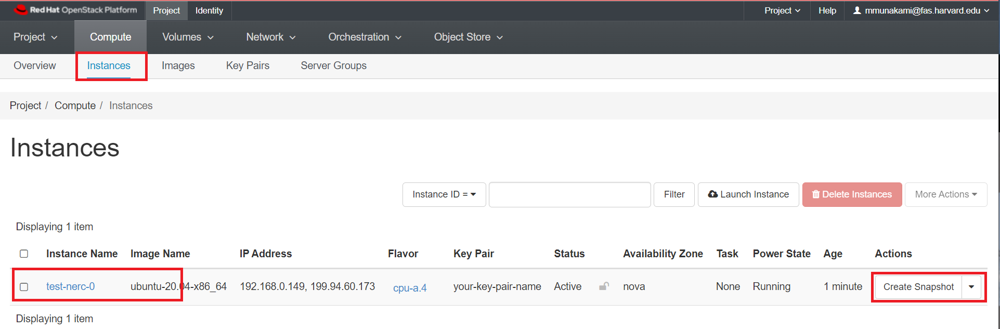

# Backup with snapshots

When you start a new instance, you can choose the Instance Boot Source from the
following list:

- boot from image
- boot from instance snapshot
- boot from volume
- boot from volume snapshot

When the instance boots from image or from snapshot, the instance has an ephemeral
disk. This means that the disk of the instance is not listed under the "Volumes"
list. This also means that if you delete the instance all the data on that disk
is lost forever.

To make a backup of the ephemeral disk you will need to create a snapshot of instance
itself. The resulting snapshot in this case will be a openstack image type. You will
be able to find it listed in the "Compute -> Images" list.

When the instance boots from volume this means that it will use an existing volume
listed in the "Volumes" menu. In this case the volume is persistent and will not
be deleted even if the instance is deleted, unless explicitely selected the **Yes**
option on "Delete Volume on Instance Delete".

## Create and use Instance snapshots

The OpenStack snapshot mechanism allows you to create new images from your instances
while they are either running or stopped.

This mainly serves two purposes:

- **As a backup mechanism:* save the main disk of your instance to an image and
later boot a new instance from this image with the saved data.

- *As a templating mechanism:* customise and upgrade a base image and save it to
use as a template for new instances.

### How to create an instance snapshot

#### Using the CLI

- **Prerequisites**

To run the OpenStack CLI commands, you need to have:

- OpenStack CLI setup, see [OpenStack Command Line setup](https://nerc-project.github.io/nerc-docs/openstack/advanced-openstack-topics/openstack-cli/openstack-CLI/#command-line-setup)
for more information.

To snapshot an instance to an image using the CLI, do this:

##### Using the openstack client

    openstack server image create --name <name of my snapshot> --wait <instance name or uuid>

##### To view newly created snapshot image

    openstack image show --fit-width <name of my snapshot>

Using this snapshot, the VM can be rolled back to the previous state with a
server rebuild.

    openstack server rebuild --image <name of my snapshot> <existing instance name or uuid>

For e.g.

    openstack server image create --name my-snapshot --wait test-nerc-0

    openstack image show --fit-width my-snapshot

    openstack server rebuild --image my-snapshot test-nerc-0

!!! info "Important Information"
    During the time it takes to do the snapshot, the machine can become unresponsive.

#### Using Horizon dashboard

Once you’re logged in to NERC's Horizon dashboard, you can create a snapshot via
the "Compute -> Instances" page by clicking on the "Create snapshot" action button
on desired instance as shown below:

Once created, you can find the image listed under Images in the Horizon dashboard:

You have the option to launch this image as a new instance, or by clicking on the
arrow next to Launch, create a volume from the image, edit details about the
image, update the image metadata, or delete it:

You can then select the snapshot when creating a new instance or directly click
"Launch" button to use the snapshot image to launch a new instance.

!!! warning "Live snapshots and data consistency"
    We call a snapshot taken against a running instance with no downtime a
    "live snapshot". These snapshots are simply disk-only snapshots, and may be
    inconsistent if the instance's OS is not aware of the snapshot being taken.

---

## Take and use Volume Snapshots

### Volume snapshots

You can also create snapshots of a volume, that then later can be used to
create other volumes or to rollback to a precedent point in time. You can take
a snapshot of volume that may or may not be attached to an instance. Snapshot of
available volumes or volumes that are not attached to an instance does not affect
the data on the volume. Snapshot of a volume serves as a backup for the persistent
data on the volume at a given point in time. Snapshots are of the size of the
actual data existing on the volume at the time at which the snapshot is taken.
The creation of a snapshot takes a few seconds and it can be done while the volume
is in-use.

!!! warning "Warning"
    Taking snapshots of volumes that are in use or attached to active instances
    can result in data inconsistency on the volume.

Once you have the snapshot, you can use it to create other volumes based on
this snapshot. Creation time for these volumes may depend on the type of the
volume you are creating as it may entitle some data transfer.

### How to create a volume snapshot

#### Using the OpenStack CLI

- **Prerequisites**

To run the OpenStack CLI commands, you need to have:

- OpenStack CLI setup, see [OpenStack Command Line setup](https://nerc-project.github.io/nerc-docs/openstack/advanced-openstack-topics/openstack-cli/openstack-CLI/#command-line-setup)
for more information.

To snapshot an instance to an image using the CLI, do this:

##### Using the openstack client commands

    $ openstack volume snapshot create --volume <volume name or uuid> <name of my snapshot>

For e.g.

    $ openstack volume snapshot create --volume test_volume my-volume-snapshot
    +-------------+--------------------------------------+
    | Field       | Value                                |
    +-------------+--------------------------------------+
    | created_at  | 2022-04-12T19:48:42.707250           |
    | description | None                                 |
    | id          | f1cf6846-4aba-4eb8-b3e4-2ff309f8f599 |
    | name        | my-volume-snapshot                   |
    | properties  |                                      |
    | size        | 25                                   |
    | status      | creating                             |
    | updated_at  | None                                 |
    | volume_id   | f2630d21-f8f5-4f02-adc7-14a3aa72cc9d |
    +-------------+--------------------------------------+

!!! note "Important Information"
    if the volume is in-use, you may need to specify `--force`

You can list the volume snapshots with the following command.

    $ openstack volume snapshot list

    For e.g.

    $ openstack volume snapshot list
    +--------------------------------------+--------------------+-------------+-----------+------+
    | ID                                   | Name               | Description | Status    | Size |
    +--------------------------------------+--------------------+-------------+-----------+------+
    | f1cf6846-4aba-4eb8-b3e4-2ff309f8f599 | my-volume-snapshot | None        | available |   25 |
    +--------------------------------------+--------------------+-------------+-----------+------+

Once the volume snapshot is in available state, then you can create other volumes
based on that snapshot. You don't need to specify the size of the volume, it will
use the size of the snapshot.

    openstack volume create --description --source <name of my snapshot> "Volume from an snapshot" <volume name or uuid>

You can delete the snapshots just by issuing the following command

    $ openstack volume snapshot delete <name of my snapshot>

    For e.g.

    $ openstack volume snapshot delete my-volume-snapshot

#### Using NERC's Horizon dashboard

Once you’re logged in to NERC's Horizon dashboard, you can create a snapshot via
the "Volumes" menu by clicking on the "Create Snapshot" action button
on desired volume as shown below:

In the dialog box that opens, enter a snapshot name and a brief description.

Once a snapshot is created, you can manage them under the Volumes menu in the
Horizon dashboard under Volume Snapshots:

Create Volume from Snapshot:

In the dialog box that opens, enter a volume name and a brief description.

Any snapshots made into volumes can be found under Volumes:

!!! info "Information"
    Keep in mind that any volumes and snapshots stored take up space in your project.
    Delete any you no longer need to conserve space.

---
