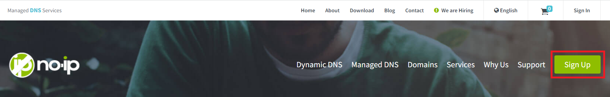
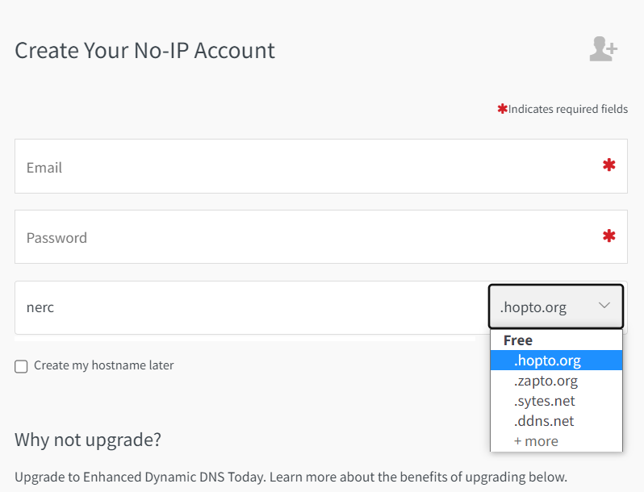
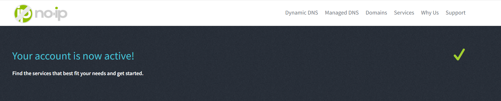
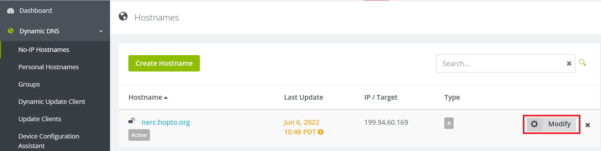
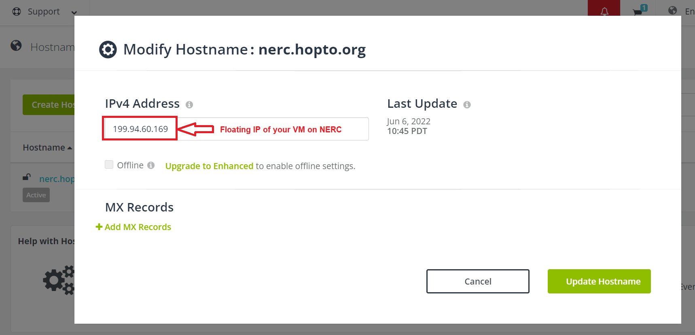
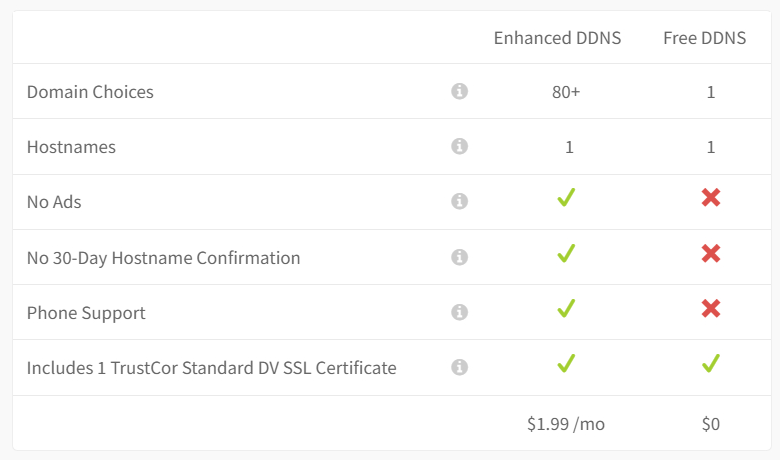

# DNS services in NERC OpenStack

## What is DNS?

The Domain Name System (DNS) is a ranked and distributed system for naming resources
connected to a network, and works by storing various types of record, such as an
IP address associated with a domain name.

DNS simplifies the communication between computers and servers through a network
and provides a user-friendly method for users to interact with and get the desired
information.

## How to get user-friendly domain names for your NERC VMs?

NERC does not currently offer integrated domain name service management.

You can use one of the following methods to configure name resolution (DNS) for
your NERC's virtual instances.

### 1. Using freely available free Dynamic DNS services

Get a free domain or host name from [no-ip.com](https://www.noip.com/) or other

[free Dynamic DNS services](https://www.makeuseof.com/tag/5-best-dynamic-dns-providers-can-lookup-free-today/).

Here we will describe how to use No-IP to configure dynamic DNS.

**Step 1: Create your No-IP Account.**

During this process you can add your desired unique hostname with pre-existing
domain name or you can choose to create your hostname later on.

**Step 2: Confirm Your Account by verifing your email address.**

**Step 3: Log In to Your Account to view your dashboard.**

**Step 4: Add Floating IP of your instance to the Hostname.**

Click on "Modify" to add your own floating IP attached to your NERC virtual instance.

Then, browse your host or domain name as you setup during registration or later
i.e. [http://nerc.hopto.org](http://nerc.hopto.org) on above example.

Easy video tutorial can be found [here](https://www.youtube.com/watch?v=1eeMxhpT868).

Having a free option is great for quick demonstrate your project but this has
the following restrictions:

### 2. Using your local Research Computing (RC) department or academic institution's Central IT services

You need to contact and work with your Research Computing department or
academic institution's Central IT services to create **A record** for your hostname
that maps to the address of a floating IP of your NERC virtual instance.

**A record:** The primary DNS record used to connect your domain to an IP address
that directs visitors to your website.

### 3. Using commercial DNS providers

Alternatively, you can purchase a fully registered domain name or host name from
commercial hosting providers and then register DNS records for your virtual instance
from commercial cloud servies i.e. AWS Route53, Azure DNS, CloudFlare, Google Cloud
Platform, GoDaddy, etc.

---
