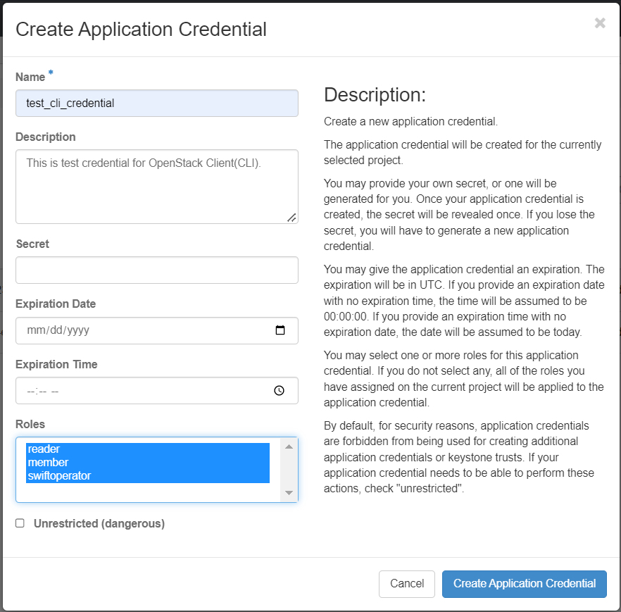

# OpenStack CLI

## References

[OpenStack Command Line Client(CLI) Cheat Sheet](https://docs.openstack.org/ocata/user-guide/cli-cheat-sheet.html)

The OpenStack CLI is designed for interactive use. OpenStackClient (aka OSC) is
a command-line client for OpenStack that brings the command set for Compute,
Identity, Image, Object Storage and Block Storage APIs together in a single
shell with a uniform command structure. OpenStackClient is primarily configured
using command line options and environment variables. Most of those settings
can also be placed into a configuration file to simplify managing multiple
cloud configurations. Most global options have a corresponding environment
variable that may also be used to set the value. If both are present, the
command-line option takes priority.

It's also possible to call it from a bash script or similar, but typically it
is too slow for heavy scripting use.

### Command Line setup

To use the CLI, you must create an application credentials and set the
appropriate environment variables.

You can download the environment file with the credentials from the OpenStack dashboard.

- Log in to the [NERC's OpenStack dashboard](https://stack.nerc.mghpcc.org), choose
the project for which you want to download the OpenStack RC file.

- Navigate to **Identity > Application Credentials**.

- Click on "Create Application Credential" button and provide a **Name** and **Roles**
for the application credential. All other fields are optional and leaving the
"Secret" field empty will set it to autogenerate (recommended).



!!! note "Important Note"
    Please note that an application credential is only valid for a single
    project, and to access multiple projects you need to create an application
    credential for each. You can switch projects by clicking on the project name
    at the top right corner and choosing from the dropdown under "Project".

After clicking "Create Application Credential" button, the **ID** and
**Secret** will be displayed and you will be prompted to `Download openrc file`
or to `Download clouds.yaml`. Both of these are different methods of
configuring the client for CLI access. Please save the file.

### Configuration

The CLI is configured via environment variables and command-line options as
listed in [Authentication](https://docs.openstack.org/python-openstackclient/latest/cli/authentication.html).

### Configuration Files

#### OpenStack RC File

Find the file (by default it will be named  the same as the application
credential name with the suffix `-openrc.sh` where project is the name of your
OpenStack project).

Source your downloaded **OpenStack RC File**:

```sh
  [user@laptop ~]$ source app-cred-<Credential_Name>-openrc.sh
```

!!! note "Important Note"
    When you source the file, environment variables are set for your current
    shell. The variables enable the OpenStack client commands to communicate with
    the OpenStack services that run in the cloud. This just stores your entry into
    the environment variable - there's no validation at this stage. You can inspect
    the downloaded file to retrieve the ID and Secret if necessary and see what
    other environment variables are set.

#### clouds.yaml

`clouds.yaml` is a configuration file that contains everything needed to
connect to one or more clouds. It may contain private information and is
generally considered private to a user.

For more information on configuring the OpenStackClient with `clouds.yaml`
please see the [OpenStack documentation](https://docs.openstack.org/python-openstackclient/wallaby/configuration/index.html#clouds-yaml)

---

### Install the OpenStack command-line clients

For more information on configuring the OpenStackClient please see the
[OpenStack documentation](https://docs.openstack.org/ocata/user-guide/common/cli-install-openstack-command-line-clients.html)

### OpenStack Hello World

To test that you have everything configured, try out some commands. The
following command lists all the images available to your project:

```sh
  [user@laptop ~]$ openstack image list
  +--------------------------------------+---------------------+--------+
  | ID                                   | Name                | Status |
  +--------------------------------------+---------------------+--------+
  | f43b9e94-2862-4edc-8844-4a4e348a2d49 | centos-7-x86_64     | active |
  | 482f489c-d8db-47be-8f55-53096fb37c07 | centos-8.4-x86_64   | active |
  | d7a71175-bb1b-412c-a6d3-83e5e1ad0646 | debian-10-x86_64    | active |
  | 2a8e36a3-31ea-4c6d-adce-5c18101c6be2 | fedora-34-x86_64    | active |
  | ef40d46e-88f9-4099-9d1d-c6c85297f042 | ubuntu-21.04-x86_64 | active |
  | a44f1bac-35c8-4abd-8669-a6c6ae7ef2e1 | ubuntu-21.04-x86_64 | active |
  +--------------------------------------+---------------------+--------+
```

If you have launched some instances already, the following command shows a list
of your project's instances:

```sh
  [user@laptop ~]$ openstack server list
  +--------------------------------------+-----------+--------+------------------------------------------------+--------------------------+---------------------+
  | ID                                   | Name      | Status |
  Networks                                       | Image                    |
  Flavor              |
  +--------------------------------------+-----------+--------+------------------------------------------------+--------------------------+---------------------+
  | 1c96ba49-a20f-4c88-bbcf-93e2364365f5 | vm-test   | ACTIVE |
  harvard-network=140.247.152.235, 192.168.0.23  | N/A (booted from volume) |
  m1.medium           |
  | dd0d8053-ab88-4d4f-b5bc-97e7e2fe035a | gpu-test  | ACTIVE |
  harvard-network=140.247.152.195, 192.168.0.227 |                          |
  vm.24cpu.64ram.1gpu |
  +--------------------------------------+-----------+--------+------------------------------------------------+--------------------------+---------------------+
```

If you don't have any instances, you will get the error `list index out of
range`, which is why we didn't suggest this command for your first test:

```sh
  [user@laptop ~]$ openstack server list
  list index out of range
```

If you see this error:

```sh
  [user@laptop ~]$ openstack server list
  The request you have made requires authentication. (HTTP 401) (Request-ID: req-6a827bf3-d5e8-47f2-984c-b6edeeb2f7fb)
```

Then your environment variables are likely not configured correctly.

The most common reason is that you made a typo when entering your password.
Try sourcing the OpenStack RC file again and retyping it.

You can type `openstack -h` to see a list of available commands.

!!! warning "Note"
    This includes some admin-only commands.

If you try one of these by mistake, you might see this output:

```sh
  [user@laptop ~]$ openstack user list
  You are not authorized to perform the requested action: identity:list_users.
  (HTTP 403) (Request-ID: req-cafe1e5c-8a71-44ab-bd21-0e0f25414062)
```

Depending on your needs for API interaction, this  might be sufficient.

If you just occasionally want to run 1 or 2 of these commands from your
terminal, you can do it manually or write a quick bash script that makes use of
this CLI.

However, this isn't a very optimized  way to do complex interactions with
OpenStack. For that, you want to write scripts that interact with the python
SDK bindings directly.

!!! note "Pro Tip"
    If you find yourself fiddling extensively with awk and grep to extract things
    like project IDs from the CLI output, it's time to move on to using the client
    libraries or the RESTful API directly in your scripts.

---
