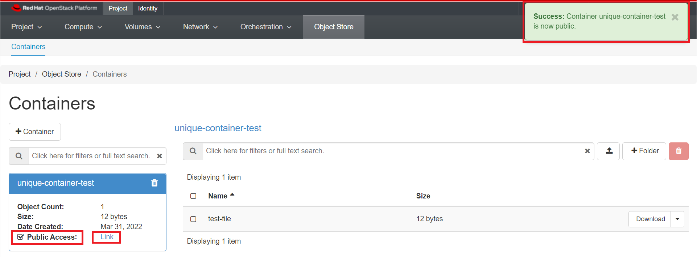

# Object Storage

OpenStack Object Storage (Swift) is a highly available, distributed, eventually consistent
object/blob store. Object Storage is used to manage cost-effective and long-term
preservation and storage of large amounts of data across clusters of standard server
hardware. The common use cases include the storage, backup and archiving of unstructured
data, such as documents, static web content, images, video files, and virtual
machine images, etc.

The end-users can interact with the object storage system through a RESTful HTTP
API i.e. the Swift API or use one of the many client libraries that exist for all
of the popular programming languages, such as Java, Python, Ruby, and C# based on
provisioned quotas. Swift also supports and is compatible with [Amazon's Simple
Storage Service (S3) API](https://docs.openstack.org/swift/latest/s3_compat.html)
that makes it easier for the end-users to move data between multiple storage end
points and supports hybrid cloud setup.

## Access by Web Interface

To get started, navigate to Project -> Object Store -> Containers.


### Create a Container

In order to store objects, you need at least one **Container** to put them in.
Containers are essentially top-level directories. Other services use the
terminology **buckets**.

Click Create Container. Give your container a name.


!!! note "Important Note"
        The container name needs to be unique, not just within your project but
        across all of our OpenStack installation. If you get **an error message**
        after trying to create the container, try giving it a more unique name.

For now, leave the "Container Access" set to **Private**.

### Upload a File

Click on the name of your container, and click the Upload File icon as shown below:


Click Browse and select a file from your local machine to upload.

It can take a while to upload very large files, so if you're just testing it out
you may want to use a small text file or similar.


By default the File Name will be the same as the original file, but you can change
it to another name. Click "Upload File". Your file will appear inside the container
as shown below once successful:


### Using Folders

Files stored by definition do not organize objects into folders, but you can use
folders to keep your data organized.

On the backend, the folder name is actually just prefixed to the object name, but
from the web interface (and most other clients) it works just like a folder.

To add a folder, click on the "+ folder" icon as shown below:


### Make a container public

Making a container public allows you to send your collaborators a URL that gives
access to the container's contents.

Click on your container's name, then check the "Public Access" checkbox. Note that
"Public Access" changes from "Disabled" to "Link".



Click "Link" to see a list of object in the container. This is the URL of your container.

!!! note "Important Note"
        Anyone who obtains the URL will be able to access the container, so this
        is not recommended as a way to share sensitive data with collaborators.

In addition, everything inside a public container is public, so we recommend creating
a separate container specifically for files that should be made public.

To download the file `test-file` we would use the [following url](https://stack.nerc.mghpcc.org:13808/v1/AUTH_4c5bccef73c144679d44cbc96b42df4e/unique-container-test/test-file)

**Or**, you can just click on "Download" next to the file's name as shown below:


You can also interact with public objects using a utility such as `curl`:

    ```sh
    # curl https://stack.nerc.mghpcc.org:13808/v1/AUTH_4c5bccef73c144679d44cbc96b42df4e/unique-container-test
    test-file
    ```

To download a file:

    ```sh
    # curl -o local-file.txt https://stack.nerc.mghpcc.org:13808/v1/AUTH_4c5bccef73c144679d44cbc96b42df4e/unique-container-test/test-file
    ```

### Make a container private

You can make a public container private by clicking on your container's name,
then uncheck the "Public Access" checkbox. Note that "Public Access" changes
from "Link" to "Disabled".

This will deactivate the public URL of the container and then it will show "Disabled".


## Access by using APIs

### Swift Interface

This is a python client for the Swift API. There's a [Python API](https://github.com/openstack/python-swiftclient)
(the `swiftclient` module), and a command-line script (`swift`).

    - This example uses a `Python3` virtual environment, but you are free to choose
    any other method to create a local virtual environment like `Conda`.

    ```sh
    py -3 -m venv venv
    ```

    - Activate the virtual environment by running:

    **on Linux/Mac:** `source venv/bin/activate`

    **on Windows:** `venv\Scripts\activate`

[Python Swift Client page at PyPi](https://pypi.org/project/python-swiftclient/)

    - Once virtual environment is activated, install `python-swiftclient` and `python-keystoneclient`

    ```sh
    # pip install python-swiftclient python-keystoneclient
    ```

    - Swift authenticates using a user, tenant, and key, which map to your OpenStack username, project, and password.

    For this, you need to download the **"NERC's OpenStack RC File"** with the credentials for
    your NERC project from the [NERC's OpenStack dashboard](https://stack.nerc.mghpcc.org/).
    Then you need to source that RC file using: `source *-openrc.sh`. You can
    [read here](https://github.com/nerc-project/terraform-nerc#how-to-get-credential-to-connect-nercs-openstack)
    on how to do this.

    By sourcing the "NERC's OpenStack RC File", you will set the all required environmental variables and then type the following command to get a lits of your containers:

    ```sh
    swift list
    ```

    This will output your existing container on your project, for e.g.

    `unique-container-test`

    To upload a file to the above listed i.e. `unique-container-test`, you can run following command:

    ```sh
    swift upload unique-container-test ./README.md
    ```

    Other helpful Swift commands:

    ```sh
    delete               Delete a container or objects within a container.
    download             Download objects from containers.
    list                 Lists the containers for the account or the objects
                         for a container.
    post                 Updates meta information for the account, container,
                         or object; creates containers if not present.
    copy                 Copies object, optionally adds meta
    stat                 Displays information for the account, container,
                         or object.
    upload               Uploads files or directories to the given container.
    capabilities         List cluster capabilities.
    tempurl              Create a temporary URL.
    auth                 Display auth related environment variables.
    bash_completion      Outputs option and flag cli data ready for
                         bash_completion.
    ```

    !!! note "Helpful Tip"
            Type `swift -h` to learn more about using the swift commands. The client has a `--debug` flag, which can be useful if you are facing any issues.

### S3 Interface

The Ceph Object Gateway [supports basic operations through the Amazon S3 interface](http://docs.ceph.com/docs/master/radosgw/s3/).
To access this interface you must login through the OpenStack Dashboard and navigate
to "Projects > API Access" where you can click on "Download OpenStack RC File" and
select "EC2 Credentials".


This will download a file **zip file** including `ec2rc.sh` file that has content
similar to shown below. The important parts are `EC2_ACCESS_KEY` and `EC2_SECRET_KEY`.

    ```sh
    #!/bin/bash

    NOVARC=$(readlink -f "${BASH_SOURCE:-${0}}" 2>/dev/null) || NOVARC=$(python -c 'import os,sys; print os.path.abspath(os.path.realpath(sys.argv[1]))' "${BASH_SOURCE:-${0}}")
    NOVA_KEY_DIR=${NOVARC%/*}
    export EC2_ACCESS_KEY=...
    export EC2_SECRET_KEY=...
    export EC2_URL=https://localhost/notimplemented
    export EC2_USER_ID=42 # nova does not use user id, but bundling requires it
    export EC2_PRIVATE_KEY=${NOVA_KEY_DIR}/pk.pem
    export EC2_CERT=${NOVA_KEY_DIR}/cert.pem
    export NOVA_CERT=${NOVA_KEY_DIR}/cacert.pem
    export EUCALYPTUS_CERT=${NOVA_CERT} # euca-bundle-image seems to require this set

    alias ec2-bundle-image="ec2-bundle-image --cert ${EC2_CERT} --privatekey ${EC2_PRIVATE_KEY} --user 42 --ec2cert ${NOVA_CERT}"
    alias ec2-upload-bundle="ec2-upload-bundle -a ${EC2_ACCESS_KEY} -s ${EC2_SECRET_KEY} --url ${S3_URL} --ec2cert ${NOVA_CERT}"
    ```

The keys can then be plugged into your application. See below example using the
[Python boto3 library](https://boto3.amazonaws.com/v1/documentation/api/latest/reference/services/s3.html),
which connects through the S3 API interface through EC2
credentials, and requests a listing of all the buckets that the user has access to.

    ```python
    import boto3

    # Use the higher level resource api
    # https://boto3.amazonaws.com/v1/documentation/api/latest/reference/services/s3.html#bucket
    s3 = boto3.resource('s3',
        aws_access_key_id='EC2_ACCESS_KEY_FROM_ec2rc_FILE',
        aws_secret_access_key='EC2_SECRET_KEY_FROM_ec2rc_FILE', #pragma: allowlist secret
        endpoint_url='https://stack.nerc.mghpcc.org:13808',
    )

    # List all objects in a container i.e. unique-container-test is your current Container
    bucket = s3.Bucket('unique-container-test')
    for obj in bucket.objects.all():
        print(' ->', obj)

    # Add an image to the bucket
    # bucket.put_object(Body=open('image.png', mode='rb'), Key='image.png')
    ```

---
