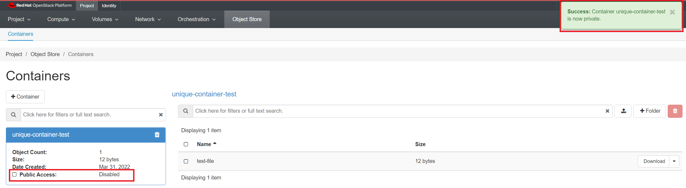

# Object Storage

OpenStack Object Storage (Swift) is a highly available, distributed, eventually consistent
object/blob store. Object Storage is used to manage cost-effective and long-term
preservation and storage of large amounts of data across clusters of standard server
hardware. The common use cases include the storage, backup and archiving of unstructured
data, such as documents, static web content, images, video files, and virtual
machine images, etc.

The end-users can interact with the object storage system through a RESTful HTTP
API i.e. the Swift API or use one of the many client libraries that exist for all
of the popular programming languages, such as Java, Python, Ruby, and C# based on
provisioned quotas. Swift also supports and is compatible with [Amazon's Simple
Storage Service (S3) API](https://docs.openstack.org/swift/latest/s3_compat.html)
that makes it easier for the end-users to move data between multiple storage end
points and supports hybrid cloud setup.

## Access by Web Interface

To get started, navigate to Project -> Object Store -> Containers.

### Create a Container

In order to store objects, you need at least one **Container** to put them in.
Containers are essentially top-level directories. Other services use the
terminology **buckets**.

Click Create Container. Give your container a name.

!!! note "Important Note"
        The container name needs to be unique, not just within your project but
        across all of our OpenStack installation. If you get **an error message**
        after trying to create the container, try giving it a more unique name.

For now, leave the "Container Access" set to **Private**.

### Upload a File

Click on the name of your container, and click the Upload File icon as shown below:

Click Browse and select a file from your local machine to upload.

It can take a while to upload very large files, so if you're just testing it out
you may want to use a small text file or similar.

By default the File Name will be the same as the original file, but you can change
it to another name. Click "Upload File". Your file will appear inside the container
as shown below once successful:

### Using Folders

Files stored by definition do not organize objects into folders, but you can use
folders to keep your data organized.

On the backend, the folder name is actually just prefixed to the object name, but
from the web interface (and most other clients) it works just like a folder.

To add a folder, click on the "+ folder" icon as shown below:

### Make a container public

Making a container public allows you to send your collaborators a URL that gives
access to the container's contents.

Click on your container's name, then check the "Public Access" checkbox. Note that
"Public Access" changes from "Disabled" to "Link".

Click "Link" to see a list of object in the container. This is the URL of your container.

!!! note "Important Note"
        Anyone who obtains the URL will be able to access the container, so this
        is not recommended as a way to share sensitive data with collaborators.

In addition, everything inside a public container is public, so we recommend creating
a separate container specifically for files that should be made public.

To download the file `test-file` we would use the [following url](https://stack.nerc.mghpcc.org:13808/v1/AUTH_4c5bccef73c144679d44cbc96b42df4e/unique-container-test/test-file).

!!! note "Very Important Information"
        Here `4c5bccef73c144679d44cbc96b42df4e` is specific **Tenant Id** or
        **Project Id**. You can get this value when you click on the public container's
        **Link** on a new browser tab.

**Or**, you can just click on "Download" next to the file's name as shown below:

You can also interact with public objects using a utility such as `curl`:

    curl https://stack.nerc.mghpcc.org:13808/v1/AUTH_4c5bccef73c144679d44cbc96b42df4e/unique-container-test
    test-file

To download a file:

    curl -o local-file.txt https://stack.nerc.mghpcc.org:13808/v1/AUTH_4c5bccef73c144679d44cbc96b42df4e/unique-container-test/test-file

### Make a container private

You can make a public container private by clicking on your container's name,
then uncheck the "Public Access" checkbox. Note that "Public Access" changes
from "Link" to "Disabled".

This will deactivate the public URL of the container and then it will show "Disabled".

## Access by using APIs

### 1. OpenStack CLI

#### Prerequisites

To run the OpenStack CLI commands, you need to have:

- OpenStack CLI setup, see [OpenStack Command Line setup](https://nerc-project.github.io/nerc-docs/openstack/advanced-openstack-topics/openstack-cli/openstack-CLI/#command-line-setup)
for more information.

#### Some Object Storage management examples

##### Create a container

In order to create a container in the Object Storage service, you can use the
OpenStack client with the following command.

    [user@laptop ~]$ openstack container create mycontainer
    +---------------------------------------+-------------+------------------------------------+
    | account                               | container   | x-trans-id                         |
    +---------------------------------------+-------------+------------------------------------+
    | AUTH_4c5bccef73c144679d44cbc96b42df4e | mycontainer | txb875f426a011476785171-00624b37e8 |
    +---------------------------------------+-------------+------------------------------------+

Once created you can start adding objects.

##### Manipulate objects in a container

To upload files to a container you can use the following command

    $ openstack object create --name my_test_file mycontainer test_file.txt
    +--------------+-------------+----------------------------------+
    | object       | container   | etag                             |
    +--------------+-------------+----------------------------------+
    | my_test_file | mycontainer | e3024896943ee80422d1e5ff44423658 |
    +--------------+-------------+----------------------------------+

Once uploaded you can see the metadata through:

    $ openstack object show mycontainer my_test_file
    +----------------+---------------------------------------+
    | Field          | Value                                 |
    +----------------+---------------------------------------+
    | account        | AUTH_4c5bccef73c144679d44cbc96b42df4e |
    | container      | mycontainer                           |
    | content-length | 26                                    |
    | content-type   | application/octet-stream              |
    | etag           | e3024896943ee80422d1e5ff44423658      |
    | last-modified  | Mon, 04 Apr 2022 18:27:14 GMT         |
    | object         | my_test_file                          |
    +----------------+---------------------------------------+

You can save the contents of the object from your container to your local machine
by using:

`$ openstack object save mycontainer my_test_file --file test_file.txt`

!!! danger "Very Important"

    Please note that this will overwrite the file in the local directory.

Finally you can delete the object with the following command

`$ openstack object delete mycontainer my_test_file`

##### Delete the container

If you want to delete the container, you can use the following command

`$ openstack container delete mycontainer`

If the container **has some data**, you can trigger the recursive option to delete
the objects internally.

    $ openstack container delete mycontainer
    Conflict (HTTP 409) (Request-ID: tx6b53c2b3e52d453e973b4-00624b400f)

So, try to delete the container recursively using command

`$ openstack container delete --recursive mycontainer`

##### List existing containers

You can check the existing containers with

    $ openstack container list
    +---------------+
    | Name          |
    +---------------+
    | mycontainer   |
    +---------------+

##### Swift quota utilization

To check the overall space used, you can use the following command

    $ openstack object store account show
    +------------+---------------------------------------+
    | Field      | Value                                 |
    +------------+---------------------------------------+
    | Account    | AUTH_4c5bccef73c144679d44cbc96b42df4e |
    | Bytes      | 665                                   |
    | Containers | 1                                     |
    | Objects    | 3                                     |
    +------------+---------------------------------------+

To check the space used by a specific container

    $ openstack container show mycontainer
    +----------------+---------------------------------------+
    | Field          | Value                                 |
    +----------------+---------------------------------------+
    | account        | AUTH_4c5bccef73c144679d44cbc96b42df4e |
    | bytes_used     | 665                                   |
    | container      | mycontainer                           |
    | object_count   | 3                                     |
    | read_acl       | .r:*,.rlistings                       |
    | storage_policy | Policy-0                              |
    +----------------+---------------------------------------+

### 2. Swift Interface

This is a python client for the Swift API. There's a [Python API](https://github.com/openstack/python-swiftclient)
(the `swiftclient` module), and a command-line script (`swift`).

- This example uses a `Python3` virtual environment, but you are free to choose
any other method to create a local virtual environment like `Conda`.

        py -3 -m venv venv

- Activate the virtual environment by running:

    **on Linux/Mac:** `source venv/bin/activate`

    **on Windows:** `venv\Scripts\activate`

#### Install [Python Swift Client page at PyPi](https://pypi.org/project/python-swiftclient/)

- Once virtual environment is activated, install `python-swiftclient` and `python-keystoneclient`

    pip install python-swiftclient python-keystoneclient

- Swift authenticates using a user, tenant, and key, which map to your OpenStack
username, project,and password.

For this, you need to download the **"NERC's OpenStack RC File"** with the
credentials for your NERC project from the [NERC's OpenStack dashboard](https://stack.nerc.mghpcc.org/).
Then you need to source that RC file using: `source *-openrc.sh`. You can
[read here](https://github.com/nerc-projectterraform-nerc#how-to-get-credential-to-connect-nercs-openstack)
on how to do this.

By sourcing the "NERC's OpenStack RC File", you will set the all required
environmental variablesand then type the following command to get a lits of
your containers:

    swift list

This will output your existing container on your project, for e.g.
`unique-container-test`

To upload a file to the above listed i.e. `unique-container-test`, you can run
the following command:

    swift upload unique-container-test ./README.md

Other helpful Swift commands:

    delete               Delete a container or objects within a container.
    download             Download objects from containers.
    list                 Lists the containers for the account or the objects
                        for a container.
    post                 Updates meta information for the account, container,
                        or object; creates containers if not present.
    copy                 Copies object, optionally adds meta
    stat                 Displays information for the account, container,
                        or object.
    upload               Uploads files or directories to the given container.
    capabilities         List cluster capabilities.
    tempurl              Create a temporary URL.
    auth                 Display auth related environment variables.
    bash_completion      Outputs option and flag cli data ready for
                        bash_completion.

!!! note "Helpful Tip"
        Type `swift -h` to learn more about using the swift commands. The client
        has a `--debug`flag, which can be useful if you are facing any issues.

### 3. Using [AWS CLI](https://awscli.amazonaws.com/v2/documentation/api/latest/reference/index.html)

The Ceph Object Gateway [supports basic operations through the Amazon S3 interface](http://docs.ceph.com/docs/master/radosgw/s3/).

You can use both [high-level (s3) commands with the AWS CLI](https://docs.aws.amazon.com/cli/latest/userguide/cli-services-s3-commands.html)
and [API-Level (s3api) commands with the AWS CLI](https://docs.aws.amazon.com/cli/latest/userguide/cli-services-s3-apicommands.html)
to access object storage on your NERC project.

#### **Prerequisites**

To run the `s3` or `s3api` commands, you need to have:

- AWS CLI installed, see [Installing or updating the latest version of the AWS CLI](https://docs.aws.amazon.com/cli/latest/userguide/getting-started-install.html)
for more information.

- The NERC's Swift End Point URL: `https://stack.nerc.mghpcc.org:13808`

- Understand these Amazon S3 terms:

    i. **Bucket** – A top-level Amazon S3 folder.

    ii. **Prefix** – An Amazon S3 folder in a bucket.

    iii. **Object** – Any item that's hosted in an Amazon S3 bucket.

#### Configuring the AWS CLI

To access this interface you must login through the OpenStack Dashboard and navigate
to "Projects > API Access" where you can click on "Download OpenStack RC File" and
select "EC2 Credentials".

This will download a file **zip file** including `ec2rc.sh` file that has content
similar to shown below. The important parts are `EC2_ACCESS_KEY` and `EC2_SECRET_KEY`,
keep them noted.

    #!/bin/bash

    NOVARC=$(readlink -f "${BASH_SOURCE:-${0}}" 2>/dev/null) || NOVARC=$(python -c 'import os,sys; print os.path.abspath(os.path.realpath(sys.argv[1]))' "${BASH_SOURCE:-${0}}")
    NOVA_KEY_DIR=${NOVARC%/*}
    export EC2_ACCESS_KEY=...
    export EC2_SECRET_KEY=...
    export EC2_URL=https://localhost/notimplemented
    export EC2_USER_ID=42 # nova does not use user id, but bundling requires it
    export EC2_PRIVATE_KEY=${NOVA_KEY_DIR}/pk.pem
    export EC2_CERT=${NOVA_KEY_DIR}/cert.pem
    export NOVA_CERT=${NOVA_KEY_DIR}/cacert.pem
    export EUCALYPTUS_CERT=${NOVA_CERT} # euca-bundle-image seems to require this set

    alias ec2-bundle-image="ec2-bundle-image --cert ${EC2_CERT} --privatekey ${EC2_PRIVATE_KEY} --user 42 --ec2cert ${NOVA_CERT}"
    alias ec2-upload-bundle="ec2-upload-bundle -a ${EC2_ACCESS_KEY} -s ${EC2_SECRET_KEY} --url ${S3_URL} --ec2cert ${NOVA_CERT}"

- Source the downloaded OpenStack RC File by using: `source *-openrc.sh` command.

- Sourcing the RC File will set the required `${OS_PROJECT_NAME}` envrionmnet variable.
Then run aws configuration command which requires the `EC2_ACCESS_KEY` and
`EC2_SECRET_KEY` keys that you noted from `ec2rc.sh` file (above):

        $> aws configure --profile "'${OS_PROJECT_NAME}'"
        AWS Access Key ID [None]: <EC2_ACCESS_KEY>
        AWS Secret Access Key [None]: <EC2_SECRET_KEY>
        Default region name [None]:
        Default output format [None]:

!!! note "Information"
        We need to have a profile that you use must have permissions to allow
        the AWS operations can be performed.

#### Listing buckets using **aws-cli**

i. Using `s3api`:

    $ aws --profile "'${OS_PROJECT_NAME}'" --endpoint-url=https://stack.nerc.mghpcc.org:13808 \
        s3api list-buckets

    {
        "Buckets": [
            {
                "Name": "unique-container-test",
                "CreationDate": "2009-02-03T16:45:09+00:00"
            }
        ],
        "Owner": {
            "DisplayName": "Test Project-f69dcff:mmunakami@fas.harvard.edu",
            "ID": "Test Project-f69dcff:mmunakami@fas.harvard.edu"
        }
    }

ii. Alternatively, you can do the same using `s3`:

    aws --profile "'${OS_PROJECT_NAME}'" --endpoint-url=https://stack.nerc.mghpcc.org:13808 \
        s3 ls

Output:

    2009-02-03 11:45:09 unique-container-test

#### To list contents inside bucket

    aws --profile "'${OS_PROJECT_NAME}'" --endpoint-url=https://stack.nerc.mghpcc.org:13808 \
        s3 ls s3://<your-bucket>

#### To make a bucket

    aws --profile "'${OS_PROJECT_NAME}'" --endpoint-url=https://stack.nerc.mghpcc.org:13808 \
        s3 mb s3://<your-bucket>

#### Adding/ Copying files from one container to another container

1. Single file copy using `cp` command:

    The aws tool provides a `cp` command to move files to your `s3` bucket:

        $ aws --profile "'${OS_PROJECT_NAME}'" --endpoint-url=https://stack.nerc.mghpcc.org:13808 \
            s3 cp <Your-file> s3://<your-bucket>/

    Output:

        upload: .\<Your-file> to s3://<your-bucket>/<Your-file>

2. Whole directory copy using the `--recursive` flag

        $ aws --profile "'${OS_PROJECT_NAME}'" --endpoint-url=https://stack.nerc.mghpcc.org:13808 \
            s3 cp <Your-directory> s3://<your-bucket>/ --recursive

    Output:

        upload: <your-directory>/<file0> to s3://<your-bucket>/<file0>
        upload: <your-directory>/<file1> to s3://<your-bucket>/<file1>
        ...
        upload: <your-directory>/<fileN> to s3://<your-bucket>/<fileN>

You can then use aws `s3 ls` to check that your files have been properly uploaded:

    aws --profile "'${OS_PROJECT_NAME}'" --endpoint-url=https://stack.nerc.mghpcc.org:13808 \
        s3 ls s3://<your-bucket>/

Output:

    2022-04-04 16:32:38          <size> <file0>
    2022-04-04 16:32:38          <size> <file1>
    ...
    2022-04-04 16:25:50          <size> <fileN>

!!! note "Other Useful Flags"

    Additionally, `aws cp` provides an `--exclude` flag to filter files not to be transfered, the syntax is: `--exclude "<regex>"`

#### To delete an object from a bucket

    aws --profile "'${OS_PROJECT_NAME}'" --endpoint-url=https://stack.nerc.mghpcc.org:13808 \
        s3 rm s3://<your-bucket>/argparse-1.2.1.tar.gz

#### To remove a bucket

    aws --profile "'${OS_PROJECT_NAME}'" --endpoint-url=https://stack.nerc.mghpcc.org:13808 \
        s3 rb s3://<your-bucket>

### 4. Using [rclone](https://rclone.org/swift/)

`rclone` is a convenient and performant command-line tool for transferring files
and synchronizing directories directly between your local file systems and the
NERC's containers.

#### *Prerequisites*

To run the `rclone` commands, you need to have:

- `rclone` installed, see [Downloading and Installing the latest version of the rclone](https://rclone.org/downloads/)
for more information.

#### Configuring rclone

First, you’ll need to configure `rclone`. As the object storage systems
have quite complicated authentication these are kept in a config file.

If you run `rclone config file` you will see where the default location is
for you.

!!! note "Note"
        For **Windows** users, you many need to specify the full path to the rclone
        executable file, if its not included in your systems PATH variable.

The `EC2_ACCESS_KEY` and `EC2_SECRET_KEY` keys that you noted from `ec2rc.sh`
file can then be plugged into `rclone` config file.

Edit the config file's content on the path location described by
`rclone config file` command and add the following entry with the name **[nerc]**:

    [nerc]
    type = s3
    env_auth = false
    provider = Other
    endpoint = https://stack.nerc.mghpcc.org:13808
    acl = public-read
    access_key_id = 'YOUR_EC2_ACCESS_KEY_FROM_ec2rc_FILE'
    secret_access_key = 'YOUR_EC2_SECRET_KEY_FROM_ec2rc_FILE', #pragma: allowlist secret
    location_constraint =
    server_side_encryption =

More about the config for **AWS S3 compatible API** can be [seen here](https://rclone.org/s3/).

!!! note "Important Information"
    Mind that if set `env_auth = true` then it  will take variables from environment,
    so you shouldn't insert it in this case.

**OR,** You can locally compy this content to a new config file and then use this
flag to override the config location, e.g. `rclone --config=".myconfig"`

!!! note "Interactive Configuration"
        Run `rclone config` to setup. See [rclone config docs](https://rclone.org/docs/)
        for more details.

#### Using rclone

`rclone` supports many subcommands (see
[the complete list of rclone subcommands](https://rclone.org/docs/#subcommands)).
A few commonly-used subcommands (assuming you configured the NERC Object Storage
as `nerc`):

##### Listing the Containers and Files and Folders within a Container

Once your Object Storage has been configured in rclone, you can then use the
rclone interface to List all the Containers with the "lsd" command

    rclone lsd "nerc:"

or,

    rclone lsd "nerc:" --config=rclone.conf

For e.g.,

    $ rclone lsd "nerc:" --config=rclone.conf
            -1 2009-02-03 11:45:09        -1 second-mycontainer
            -1 2009-02-03 11:45:09        -1 unique-container-test

To list the files and folders available within a container i.e.
"unique-container-test" in this case, within a container we can use the "ls" command

    $ rclone ls "nerc:unique-container-test/"
      653 README.md
        0 image.png
       12 test-file

##### Uploading and Downloading Files and Folders

`rclone` support a variety of options to allow you to Copy, Sync and Move
files from one destination to another.

A simple example of this can be seen below, where we copy (Upload) the file
"upload.me" to the `<your-bucket>` container:

    rclone copy "./upload.me" "nerc:<your-bucket>/"

Another example, to copy (Download) the file "upload.me" from the
`<your-bucket>` container to your local:

    rclone -P copy "nerc:<your-bucket>/upload.me" "./"

Also, to **Sync** files into  to the `<your-bucket>` container - try with
`--dry-run` first

    rclone --dry-run sync /path/to/files nerc:<your-bucket>

Then sync for real

    rclone sync /path/to/files nerc:<your-bucket>

##### Mounting object storage on local filesystem

**Linux:**

First, you need to create a directory on which you will mount your filesystem:

`$ mkdir ~/mnt-rclone`

Then you can simply mount your object storage with:

`$ rclone -vv --vfs-cache-mode writes mount nerc: ~/mnt-rclone`

**Windows:**

First you have to [download Winsfp](http://www.secfs.net/winfsp/rel/):

**WinFsp** is an open source Windows File System Proxy which provides a FUSE
emulation layer.

Then you can simply mount your object storage with (no need to create the directory
in advance):

`rclone -vv --vfs-cache-mode writes mount nerc: C:/mnt-rclone`

`vfs-cache-mode` flag enable file caching, you can use either `writes` or full`
option. For further explanation you can see [official documentation](https://rclone.org/commands/rclone_mount/#file-caching).

Now that your object storage is mounted, you can list, create and delete files
in it.

##### Unmount object storage

To unmount, simply press `CTRL-C` and the mount will be interrupted.

### 5. Using client libraries

a. The `EC2_ACCESS_KEY` and `EC2_SECRET_KEY` keys that you noted from `ec2rc.sh`
file can then be plugged into your application. See below example using the
[Python Boto3 library](https://boto3.amazonaws.com/v1/documentation/api/latest/reference/services/s3.html),
which connects through the S3 API interface through EC2
credentials, and perform some basic operations on available buckets and file
that the user has access to.

    import boto3

    # https://boto3.amazonaws.com/v1/documentation/api/latest/reference/services/s3.html#bucket
    s3 = boto3.resource('s3',
        aws_access_key_id='YOUR_EC2_ACCESS_KEY_FROM_ec2rc_FILE',
        aws_secret_access_key='YOUR_EC2_SECRET_KEY_FROM_ec2rc_FILE', #pragma: allowlist secret
        endpoint_url='https://stack.nerc.mghpcc.org:13808',
    )

    # List all containers
    for bucket in s3.buckets.all():
        print(' ->', bucket)

    # List all objects in a container i.e. unique-container-test is your current Container
    bucket = s3.Bucket('unique-container-test')
    for obj in bucket.objects.all():
        print(' ->', obj)

    # Download an S3 object i.e. test-file a file available in your unique-container-test Container
    s3.Bucket('unique-container-test').download_file('test-file', './test-file.txt')

    # Add an image to the bucket
    # bucket.put_object(Body=open('image.png', mode='rb'), Key='image.png')

We can configure the [Python Boto3 library](https://boto3.amazonaws.com/v1/documentation/api/latest/reference/core/session.html),
to work with the saved aws profile.

    import boto3

    # https://boto3.amazonaws.com/v1/documentation/api/latest/reference/core/session.html
    session = boto3.Session(profile_name='<YOUR_CONFIGURED_AWS_PROFILE_NAME>')

    # List all containers
    s3 = boto3.client('s3', endpoint_url='https://stack.nerc.mghpcc.org:13808',)
    response = s3.list_buckets()

    for bucket in response['Buckets']:
        print(' ->', bucket)

b. The `EC2_ACCESS_KEY` and `EC2_SECRET_KEY` keys that you noted from `ec2rc.sh`
file can then be plugged into your application. See below example using the
[Python Minio library](https://docs.min.io/docs/python-client-quickstart-guide.html),
which connects through the S3 API interface through EC2
credentials, and perform some basic operations on available buckets and file
that the user has access to.

    from minio import Minio

    # Create client with access key and secret key.
    # https://docs.min.io/docs/python-client-api-reference.html
    client = Minio(
        "stack.nerc.mghpcc.org:13808",
        access_key='YOUR_EC2_ACCESS_KEY_FROM_ec2rc_FILE',
        secret_key='YOUR_EC2_SECRET_KEY_FROM_ec2rc_FILE', #pragma: allowlist secret
    )

    # List all containers
    buckets = client.list_buckets()
    for bucket in buckets:
        # print(bucket.name, bucket.creation_date)
        print(' ->', bucket)

    # Make 'nerc-test-container' container if not exist.
    found = client.bucket_exists("nerc-test-container")
    if not found:
        client.make_bucket("nerc-test-container")
    else:
        print("Bucket 'nerc-test-container' already exists")

    # Upload './nerc-backup.zip' as object name 'nerc-backup-2022.zip'
    # to bucket 'nerc-test-container'.
    client.fput_object(
        "nerc-test-container", "nerc-backup-2022.zip", "./nerc-backup.zip",
    )

---
