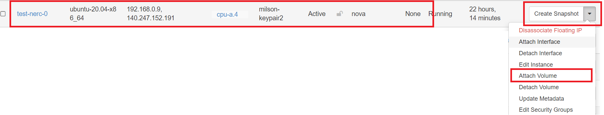
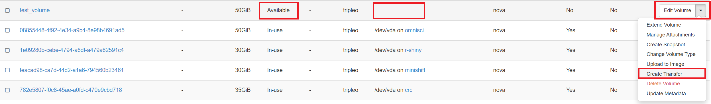
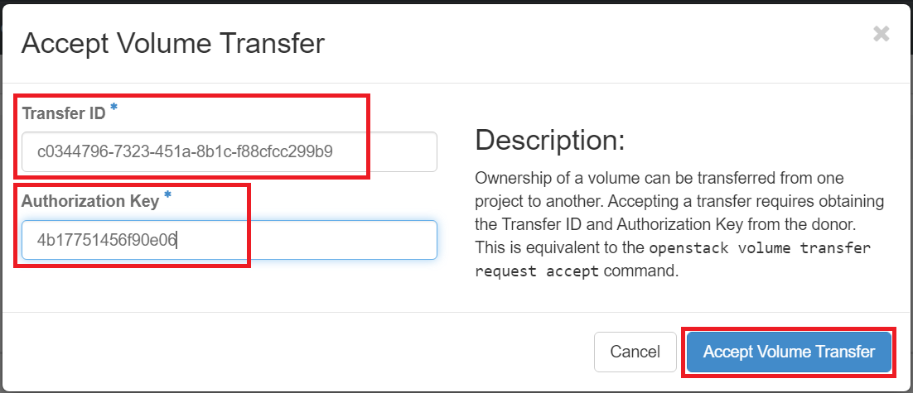

# Persistent Storage

## Volumes

A volume is a detachable block storage device, similar to a USB hard drive. You
can attach a volume to only one instance.

Volumes are the Block Storage devices that you attach to instances to enable
persistent storage. Users can attach a volume to a running instance or detach a
volume and attach it to another instance at any time.

Ownership of volumes can be transferred to another project.

Some uses for volumes:

- Persistent data storage for ephemeral instances.
- Transfer of data between projects
- Bootable image where disk changes persist
- Mounting the disk of one instance to another for troubleshooting

### Create an empty volume

An empty volume is like an unformatted USB stick.  We'll attach it to an
instance, create a filesystem on it, and mount it to the instance.

#### Using Horizon dashboard

Once you’re logged in to NERC's Horizon dashboard, you can create a volume via
the "Volumes -> Volumes" page by clicking on the "Create Volume" button.

Navigate to Project -> Volumes -> Volumes.

Click "Create Volume".

In the Create Volume dialog box, give your volume a name.  The description
field is optional.

Choose "empty volume" from the Source dropdown.  This will create a volume that
is like an unformatted hard disk.  Choose a size (In GiB) for your volume.
Leave Type and Availibility Zone as it as. Only admin to the NERC OpenStack
will be able to manage volume types.

Click "Create Volume" button.

Checking the status of created volume will show:

"downloading" means that the volume contents is being transferred from the image
service to the volume service

In a few moments, the newly created volume will appear in the Volumes list with
the Status "available". "available" means the volume can now be used for booting.
A set of volume_image meta data is also copied from the image service.

#### Using the CLI

**Prerequisites**:

To run the OpenStack CLI commands, you need to have:

- OpenStack CLI setup, see [OpenStack Command Line setup](../openstack-cli/openstack-CLI.md#command-line-setup)
  for more information.

To create a volume using the CLI, do this:

##### Using the openstack client

This allows an arbitrary sized disk to be attached to your virtual machine, like
plugging in a USB stick. The steps below create a disk of 20GB with name "my-volume".

    openstack volume create --size 20 my-volume

    +---------------------+--------------------------------------+
    | Field               | Value                                |
    +---------------------+--------------------------------------+
    | attachments         | []                                   |
    | availability_zone   | nova                                 |
    | bootable            | false                                |
    | consistencygroup_id | None                                 |
    | created_at          | 2024-02-03T17:06:05.000000           |
    | description         | None                                 |
    | encrypted           | False                                |
    | id                  | 5b5380bd-a15b-408b-8352-9d4219cf30f3 |
    | multiattach         | False                                |
    | name                | my-volume                            |
    | properties          |                                      |
    | replication_status  | None                                 |
    | size                | 20                                   |
    | snapshot_id         | None                                 |
    | source_volid        | None                                 |
    | status              | creating                             |
    | type                | tripleo                              |
    | updated_at          | None                                 |
    | user_id             | 938eb8bfc72e4ca3ad2b94e2eb4059f7     |
    +---------------------+--------------------------------------+

##### To view newly created volume

    openstack volume list
    +--------------------------------------+-----------------+-----------+------+----------------------------------+
    | ID                                   | Name            | Status    | Size | Attached to                      |
    +--------------------------------------+-----------------+-----------+------+----------------------------------+
    | 563048c5-d27b-4397-bb4e-034e0f4d9fa7 |                 | in-use    |   20 | Attached to test-vm on /dev/vda  |
    | 5b5380bd-a15b-408b-8352-9d4219cf30f3 | my-volume       | available |   20 |                                  |
    +--------------------------------------+-----------------+-----------+------+----------------------------------+

### Attach the volume to an instance

#### Using NERC Horizon dashboard

Once you’re logged in to NERC's Horizon dashboard.

Navigate to Project -> Volumes -> Volumes.

In the Actions column, click the dropdown and select "Manage Attachments".

From the  menu, choose the instance you want to connect the volume to from
Attach to Instance, and click "Attach Volume".

The volume now has a status of "in-use" and "Attached To" column shows which
instance it is attached to, and what device name it has.

This will be something like `/dev/vdb` but it can vary depending on the state
of your instance, and whether you have attached volumes before.

Make note of the device name of your volume.

#### Using the CLI Terminal

**Prerequisites**:

To run the OpenStack CLI commands, you need to have:

- OpenStack CLI setup, see [OpenStack Command Line setup](../openstack-cli/openstack-CLI.md#command-line-setup)
  for more information.

To attach the volume to an instance using the CLI, do this:

##### Using the openstack client terminal

Once the status is "available", it can be attached to a virtual machine. The
following command attaches the volume "my-volume" to the virtual machine "test-vm":

    openstack server add volume test-vm my-volume
    +-----------------------+--------------------------------------+
    | Field                 | Value                                |
    +-----------------------+--------------------------------------+
    | ID                    | 5b5380bd-a15b-408b-8352-9d4219cf30f3 |
    | Server ID             | 8a876a17-3407-484c-85c4-8a46fbac1607 |
    | Volume ID             | 5b5380bd-a15b-408b-8352-9d4219cf30f3 |
    | Device                | /dev/vdb                             |
    | Tag                   | None                                 |
    | Delete On Termination | False                                |
    +-----------------------+--------------------------------------+

##### To verify the volume is attached to the VM

    openstack volume list
    +--------------------------------------+-----------------+--------+------+----------------------------------+
    | ID                                   | Name            | Status | Size | Attached to                      |
    +--------------------------------------+-----------------+--------+------+----------------------------------+
    | 563048c5-d27b-4397-bb4e-034e0f4d9fa7 |                 | in-use |   20 | Attached to test-vm on /dev/vda  |
    | 5b5380bd-a15b-408b-8352-9d4219cf30f3 | my-volume       | in-use |   20 | Attached to test-vm on /dev/vdb  |
    +--------------------------------------+-----------------+--------+------+----------------------------------+

The volume now has a status of "in-use" and "Attached To" column shows which
instance it is attached to, and what device name it has.

This will be something like `/dev/vdb` but it can vary depending on the state
of your instance, and whether you have attached volumes before.

Make note of the device name of your volume.

### Format and mount the volume

#### For Linux based virtual machine

SSH to your instance.  You should now see the volume as an additional disk in
the output of `sudo fdisk -l` or `lsblk` or `cat /proc/partitions`.

    # lsblk
    NAME    MAJ:MIN RM  SIZE RO TYPE MOUNTPOINT
    ...
    vda     254:0    0   10G  0 disk
    ├─vda1  254:1    0  9.9G  0 part /
    ├─vda14 254:14   0    4M  0 part
    └─vda15 254:15   0  106M  0 part /boot/efi
    vdb     254:16   0    1G  0 disk

We see the volume here as the disk 'vdb', which matches the `/dev/vdb/` we
noted in "Attached To" column.

Create a filesystem on the volume and mount it - in the example we create an
`ext4` filesystem:

Run the following commands as `root` user:

    mkfs.ext4 /dev/vdb
    mkdir /mnt/test_volume
    mount /dev/vdb /mnt/test_volume
    df -H

The volume is now available at the mount point:

    lsblk
    NAME    MAJ:MIN RM  SIZE RO TYPE MOUNTPOINT
    ...
    vda     254:0    0   10G  0 disk
    ├─vda1  254:1    0  9.9G  0 part /
    ├─vda14 254:14   0    4M  0 part
    └─vda15 254:15   0  106M  0 part /boot/efi
    vdb     254:16   0    1G  0 disk /mnt/test_volume

If you place data in the directory `/mnt/test_volume`, detach the volume, and
mount it to another instance, the second instance will have access to the data.

!!! note "Important Note"
    In this case it's easy to spot because there is only one additional disk attached
    to the instance, but it's important to keep track of the device name, especially
    if you have multiple volumes attached.

#### For Windows virtual machine

Here we create an empty volume of 100 GB as described above:

Login using the Floating IP attached to the Windows VM:

!!! warn "What is the user login for Windows Server 2022?"
    To connect with this Windows VM you need to contact us by emailing us at
    [help@nerc.mghpcc.org](mailto:help@nerc.mghpcc.org?subject=NERC%20Windows%20Server%20Login%20Info)
    or, by submitting a new ticket at [the NERC's Support Ticketing System (osTicket)](https://mghpcc.supportsystem.com/open.php)

Once connected search for "Disk Management" from Windows search box. This will
show all attached disk as **Unknown** and **Offline** as shown here:

In Disk Management, you may be prompted to initialize the new disk.

Choose the appropriate partition style (usually MBR or GPT) and proceed.

Format the New Volume:

- Right-click on the unallocated space of the new disk.
- Select "New Simple Volume" and follow the wizard to create a new partition.

- Choose the file system (usually NTFS for Windows).
- Assign a drive letter or mount point.

Complete Formatting:

- Complete the wizard to format the new volume.

- Once formatting is complete, the new volume should be visible in File Explorer
  as shown below:

### Detach a volume

#### Using NERC's Horizon dashboard

To detach a mounted volume by going back to "Manage Attachments" and choosing
Detach Volume.

This will popup the following interface to proceed:

#### Using openstack client

Then use the openstack command line interface to detach the volume from the VM:

    openstack server remove volume test-vm my-volume

where "test-vm" is the virtual machine and the second parameter, "my-volume" is
the volume created before and attached to the VM and can be shown in
`openstack volume list`.

Check that the volume is in state 'available' again.

If that's the case, the volume is now ready to either be attached to another
virtual machine or, if it is not needed any longer, to be [completely deleted](#delete-volumes)
(please note that this step cannot be reverted!).

### Attach an existing volume to an instance

Once it is successfully detached, you can use "Manage Attachments" to attach it
to another instance if desired as explaned before.

**OR,**

You can attach the existing volume (Detached!) to the new instance as shown below:

After this run the following commands as `root` user to mount it:

    mkdir /mnt/test_volume
    mount /dev/vdb /mnt/test_volume

All the previous data from previous instance will be available under the mounted
folder at `/mnt/test_volume`.

!!! note "Very Important Note"
    Also, a given volume might not get the same device name the second time you
    attach it to an instance.

### Delete volumes

When you delete an instance, the data of its attached volumes is not destroyed.

Navigate to Project -> Volumes -> Volumes.

Select the volume or volumes that you want to delete.

Click "Delete Volumes" button.

In the Confirm Delete Volumes window, click the Delete Volumes button to
confirm the action.

!!! warn "Unable to delete volume"
    You cannot delete a bootable volume that is actively in use by a running VM.
    If you really want to delete such volume then first delete the insance and
    then you are allowed to delete the detached volume.

**Alternatively,** Using openstack client terminal:

    openstack volume delete my-volume

Your volume will now go into state 'deleting' and completely disappear from the
`openstack volume list` output.

### Extending volumes

A volume can be made larger while maintaining the existing contents, assuming the
file system supports resizing. We can extend a volume that is not attached to any
VM and in **"Available"** status.

The steps are as follows:

- Extend the volume to its new size

- Extend the filesystem to its new size

Specify, the new extened size in GB:

**Alternatively,** Using openstack client terminal:

The existing volume "my-volume" can be extended to a new size of 100 GB for
the previous 80 GB by running the following command:

    openstack volume set --size 100 my-volume

For windows systems, please follow the [provider documentation](https://docs.microsoft.com/en-us/windows-server/storage/disk-management/extend-a-basic-volume).

!!! info "Please note"
    - Volumes can be made larger, but not smaller. There is no support for
    shrinking existing volumes.
    - The procedure given above has been tested with ext4 and XFS filesystems only.

### Transfer a Volume

You may wish to transfer a volume to a different project.

!!! note "Important"
    The volume to be transferred must not be attached to an instance. This can
    be examined by looking into "Status" column of the volume i.e. it need to
    be **"Available"** instead of "In-use"  and "Attached To" column need to be **empty**.

Navigate to Project -> Volumes -> Volumes.
Select the volume that you want to transfer and then click the dropdown next to
the "Edit volume" and choose "Create Transfer".

Give the transfer a name.

You will see a screen like shown below. Be sure to capture the **Transfer ID** and
the **Authorization Key**.

!!! note "Important Note"
    You can always get the transfer ID later if needed, but there is no way to
    retrieve the key.
    If the key is lost before the transfer is completed, you will have to cancel
    the pending transfer and create a new one.

Then the volume will show the status like below:

Assuming you have access to the receiving project, switch to it using the Project
dropdown at the top right.

If you don't have access to the receiving project, give the transfer ID and
Authorization Key to a collaborator who does, and have them complete the next steps.

In the receiving project, go to the Volumes tab, and click "Accept Transfer"
button as shown below:

Enter the "Transfer ID" and the "Authorization Key" that were captured when the
transfer was created in the previous project.

The volume should now appear in the Volumes list of the receiving project as shown
below:

!!! note "Important Note"
    Any pending transfers can be cancelled if they are not yet accepted, but there
    is no way to "undo" a transfer once it is complete.
    To send the volume back to the original project, a new transfer would be required.

---
