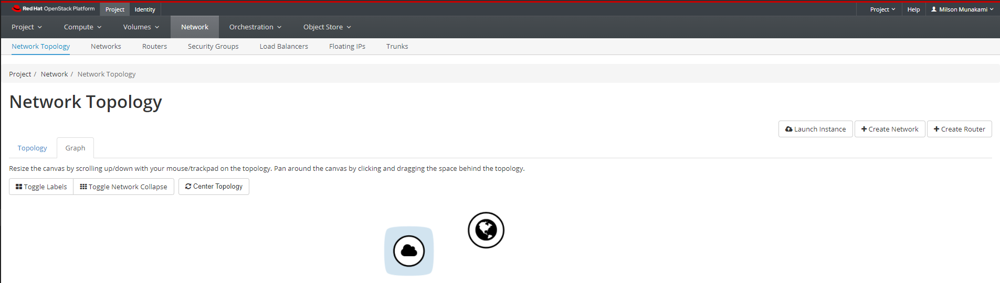

# Set up a Private Network

!!! note "Default Network for your Project"

    During your project setup, NERC will setup a default network, router and interface
    for your project that is ready-to-use.

    

## Create Your Own Private Network

You can view/ create your/ existing network topology by clicking Project, then click
Network panel and choose Network Topology from the tabs that appears. This
shows public network which is accessible to all projects.

Click on "Networks" tab and then click "Create Network" button on the right
side of the screen.

In the Create Network dialog box, specify the following values.

-   Network tab:

    Network Name: Specify a name to identify the network.

    Admin State: The state to start the network in.

    Create Subnet: Select this check box to create a subnet

    Give your network a name, and leave the two checkboxes for "Admin State" and
    "Create Subnet" with the default settings.

    

-   Subnet tab:

    You do not have to specify a subnet when you create a network, but if you do
    not specify a subnet, the network can not be attached to an instance.

    Subnet Name: Specify a name for the subnet.

    Network Address: Specify the IP address for the subnet. For your private
    networks, you should use IP addresses which fall within the ranges that are
    specifically reserved for private networks:

        10.0.0.0/8
        172.16.0.0/12
        192.168.0.0/16

    In the example below, we configure a network containing addresses 192.168.0.1
    to 192.168.0.255 using CIDR 192.168.0.0/24
    _Technically, your private network will still work if you choose any IP outside
    these ranges, but this causes problems with connecting to IPs in the outside
    world - so don't do it!_

    

    IP Version: Select IPv4 or IPv6.

    Gateway IP: Specify an IP address for a specific gateway. This parameter is optional.

    Disable Gateway: Select this check box to disable a gateway IP address.

-   Subnet Details tab

    Enable DHCP: Select this check box to enable DHCP so that your VM instances
    will automatically be assigned an IP on the subnet.

    Allocation Pools: Specify IP address pools.

    DNS Name Servers: Specify a name for the DNS server. If you use '8.8.8.8' (you
    may recognize this as one of Google's public name servers).

    Host Routes: Specify the IP address of host routes.

    For now, you can leave the Allocation Pools and Host Routes boxes empty and
    click on "Create" button. But here we specify Allocation Pools of `192.168.0.2,192.168.0.254`.

    

    The Network Topology should now show your virtual private network next to the
    public network.

    

---
