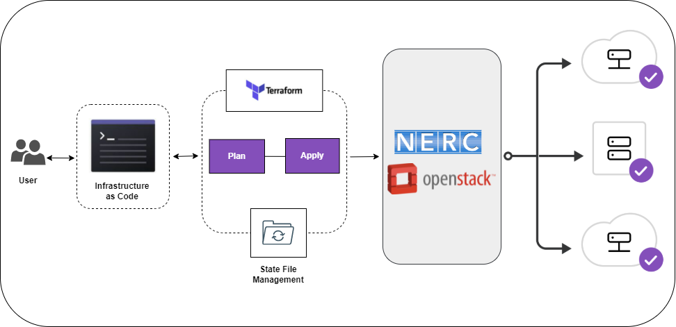

# Provisioning the NERC resources using Terraform

[Terraform](https://www.hashicorp.com/products/terraform/infrastructure-as-code)
is an open-source Infrastructure as Code (IaC) software tool that works
with NERC and allows you to orchestrate, provision, and manage infrastructure
resources quickly and easily. Terraform codifies cloud application programming
interfaces (APIs) into human-readable, declarative configuration (**\*.tf**) files.
These files are used to manage underlying infrastructure rather than through
[NERC's web-based graphical interface - Horizon](https://stack.nerc.mghpcc.org).
Terraform allows you to build, change, and manage your infrastructure in a safe,
consistent, and repeatable way by defining resource configurations that you can
version, reuse, and share. Terraform's main job is to create, modify, and destroy
compute instances, private networks and other NERC resources.

## Benefits of Terraform

If you have multiple instances/ VMs you are managing for your work or research,
it can be simpler and more reproducible if you are doing it with automation tool
like **Terraform**.

## Installing Terraform

To use Terraform you will need to install it from [here](https://www.terraform.io/downloads).

## Basic Template to use Terraform on your NERC Project

To get started, clone the repository using:

```sh
git clone https://github.com/nerc-project/terraform-nerc.git
```

Then run this base template for terraform to provision some basic NERC's OpenStack
resources within this repo.

!!! info "Note"

    The `main` branch of this git repo should be a good starting point in developing
    your own terraform code.

## Template to setup R Shiny server using Terraform on your NERC Project

To get started, clone the repository using:

```sh
git clone https://github.com/nerc-project/terraform-nerc-r-shiny.git
```

Then you can run this template locally using terraform to provision
[R Shiny server](https://www.rstudio.com/products/shiny/shiny-server/) on NERC's
OpenStack resources within this repo.

!!! tip "Important Note"

    Please make sure to review bash script file i.e. `install-R-Shiny-<OS>.sh` located
    in this repo that is pointing as `user-data-path` variable in `example.tfvars`.
    This repo includes the script required to setup the R Shiny Server. You can use
    similar concept to any other project that needs custom user defined scripts
    while launching an instance. If you want to change and update this script you
    can just change this file and then run `terraform plan` and `terraform apply`
    command pointing this `example.tfvars` file.

!!! warning "Which R Shiny Script i.e. `install-R-Shiny-<OS>.sh` to Choose?"

    Please use the appropriate bash script file i.e. `install-R-Shiny-<OS>.sh` based
    on your operating system (OS):

    - **AlmaLinux** -> `install-R-Shiny-AlmaLinux.sh`

    - **CentOS** -> `install-R-Shiny-Centos.sh`

    - **Ubuntu** -> `install-R-Shiny-Ubuntu.sh`

## How Terraform Works

Terraform reads configuration files and provides an execution plan of changes, which
can be reviewed for safety and then applied and provisioned. Terraform reads all
files with the extension .tf in your current directory. Resources can be in a
single file, or organised across several different files.

The basic Terraform deployment workflow is:

i. Scope - Identify the infrastructure for your project.

ii. Author - Write the configuration for your infrastructure in which you
declare the elements of your infrastructure that you want to create.

The format of the **resource** definition is straightforward and looks like this:

```sh
resource type_of_resource "resource name" {
    attribute = "attribue value"
    ...
}
```

iii. Initialize - Install the plugins Terraform needs to manage the infrastructure.

iv. Plan - Preview the changes Terraform will make to match your configuration.

v. Apply - Make the planned changes.

## Running Terraform

The Terraform deployment workflow on the NERC looks like this:



### Prerequisite

1. You can download the **"NERC's OpenStack RC File"** with the credentials for
   your NERC project from the [NERC's OpenStack dashboard](https://stack.nerc.mghpcc.org/).
   Then you need to source that RC file using: `source *-openrc.sh`. You can
   [read here](https://github.com/nerc-project/terraform-nerc#how-to-get-credential-to-connect-nercs-openstack)
   on how to do this.

2. Setup SSH key pairs running `ssh-keygen -t rsa -f username-keypair` and then
   make sure the newly generated SSH key pairs exist on your `~/.ssh` folder.

### Terraform Init

The first command that should be run after writing a new Terraform configuration
or cloning an existing one is `terraform init`. This command is used to initialize
a working directory containing Terraform configuration files and install the plugins.

!!! info "Information"

    You will need to run `terraform init` if you make any changes to providers.

### Terraform Plan

`terraform plan` command creates an execution plan, which lets you preview the changes
that Terraform plans to make to your infrastructure based on your configuration files.

### Terraform Apply

When you use `terraform apply` without passing it a saved plan file, it incorporates
the `terraform plan` command functionality and so the planning options are also
available while running this command.

#### Input Variables on the Command Line

You can use the `-var 'NAME=VALUE'` command line option to specify values for input
variables declared in your root module for e.g. `terraform plan -var 'name=value'`

In most cases, it will be more convenient to set values for potentially many input
variables declared in the root module of the configuration, using definitions from
a "tfvars" file and use it using `-var-file=FILENAME` command for e.g.
`terraform plan -var-file=FILENAME`

## Track your infrastructure and Collaborate

Terraform keeps track of your real infrastructure in a state file, which acts as
a source of truth for your environment. Terraform uses the state file to determine
the changes to make to your infrastructure so that it will match your configuration.
Terraform's state allows you to track resource changes throughout your deployments.
You can securely share your state with your teammates, provide a stable environment
for Terraform to run in, and prevent race conditions when multiple people make
configuration changes at once.

## Some useful Terraform commands

```sh
terraform init

terraform fmt

terraform validate

terraform plan

terraform apply

terraform show

terraform destroy

terraform output
```

---
