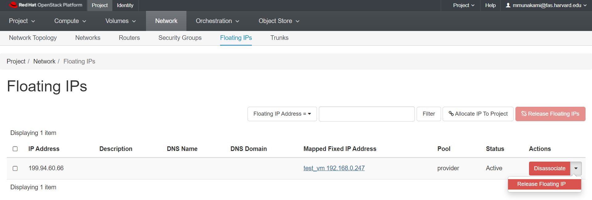

# Assign a Floating IP

When an instance is created in OpenStack, it is automatically assigned a fixed
IP address in the network to which the instance is assigned. This IP address is
permanently associated with the instance until the instance is terminated.

However, in addition to the fixed IP address, a Floating IP address can also be
attached to an instance. Unlike fixed IP addresses, Floating IP addresses can
have their associations modified at any time, regardless of the state of the
instances involved. Floating IPs are a limited resource, so your project will
have a quota based on its needs.
You should only assign public IPs to VMs that need them. This procedure details
the reservation of a Floating IP address from an existing pool of addresses and
the association of that address with a specific instance.

By attaching a Floating IP to your instance, you can ssh into your vm from your
local machine.

Make sure you are using key forwarding as described in [Create a Key Pair](../access-and-security/create-a-key-pair.md).

## Allocate a Floating IP

Navigate to *Project -> Compute -> Instances*.

Next to Instance Name -> Click Actions dropdown arrow (far right) -> Choose
Associate Floating IP

If you have some floating IPs already allocated to your project which are not
yet associated with a VM, they will be available in the dropdown list on this
screen.

If you have no floating IPs allocated, or all your allocated IPs are in use
already, the dropdown list will be empty.

Click the "+" icon to allocate an IP. You will see the following screen.

Make sure 'provider' appears in the dropdown menu, and that you have not
already met your quota of allocated IPs.

In this example, the project has a quota of 50 floating IPs, but we have
allocated 5 so far, so we can still allocate up to next 45 Floating IPs.

Click "Allocate IP".

You will get a green "success" popup in the top right corner that shows your
public IP address and that is listed as option to choose from "IP Address" dropdown
list.

You will be able to select between multiple Floating IPs under "IP Address"
dropdown and any unassociated VMs from "Port to be associated" dropdown options:

Now click on "Associate" button.

Then, a green "success" popup in the top left
and you can see the Floating IP is attached to your VM on the Instances page:

!!! warn "Floating IP Quota Exceed"
    If you have already exceed your quota, you will get a red error message
    saying "You are already using all of your available floating IPs" as shown below:

    

    **NOTE:** By default, each approved project is provided with only 2 OpenStack
    Floating IPs, regardless of the units requested in the quota, as
    [described here](../../get-started/allocation/requesting-an-allocation.md#resource-allocation-quotas-for-openstack-project).
    Your PI or Project Manager(s) can adjust the quota and request additional
    Floating IPs as needed, following [this documentation](../../get-started/allocation/allocation-change-request.md#request-change-resource-allocation-attributes-for-openstack-project).
    This is controlled by the **"OpenStack Floating IP Quota"** attribute.

## Disassociate a Floating IP

You may need to disassociate a Floating IP from an instance which no longer
needs it, so you can assign it to one that does.

Navigate to *Project -> Compute -> Instances*.

Find the instance you want to remove the IP from in the list. Click the red
"Disassociate Floating IP" to the right.

This IP will be disassociated from the instance, but it will still remain
allocated to your project.

## Release a Floating IP

You may discover that your project does not need all the floating IPs that are
allocated to it.

We can release a Floating IP while disassociating it just we need to check the
"Release Floating IP" option as shown here:

**OR,**

Navigate to *Project -> Network -> Floating IPs*.

To release the Floating IP address back into the Floating IP pool, click the
Release Floating IP option in the Actions column.

!!! tip "Pro Tip"
    You can also choose multiple Floating IPs and release them all at once.

---
