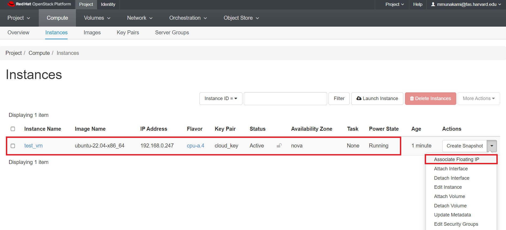
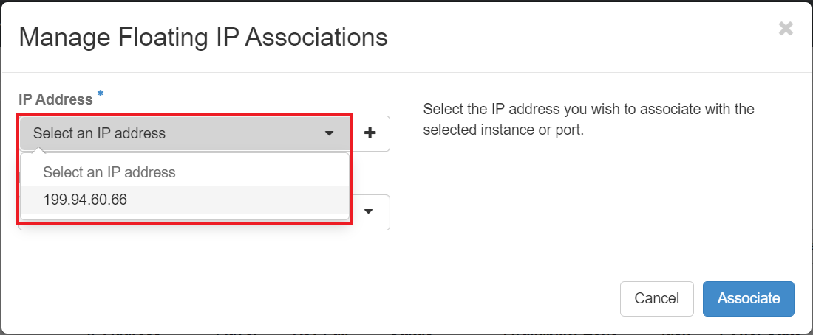
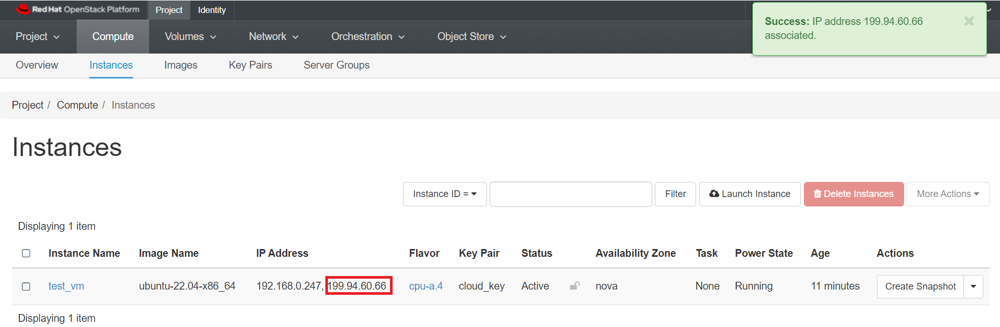
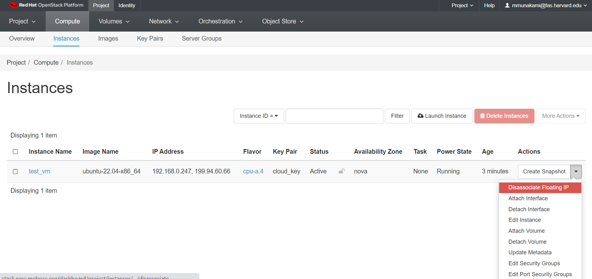
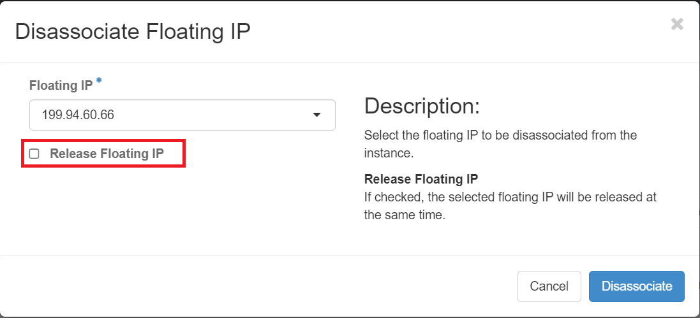

When an instance is created in OpenStack, it is automatically assigned a fixed IP address in the network to which the instance is assigned. This IP address is permanently associated with the instance until the instance is terminated.

However, in addition to the fixed IP address, a floating IP address can also be attached to an instance. Unlike fixed IP addresses, floating IP addresses can have their associations modified at any time, regardless of the state of the instances involved. Floating IPs are a limited resource, so your project will have a quota based on its needs.
You should only assign public IPs to VMs that need them. This procedure details the reservation of a floating IP address from an existing pool of addresses and the association of that address with a specific instance.

By attaching a Floating IP to your instance, you can ssh into your vm from your local machine.

Make sure you are using key forwarding as described in [Create a Key Pair](../access-and-security/create-a-key-pair.md)

### Allocate a Floating IP
Navigate to Project -> Compute -> Instances

Next to Instance Name -> Click Actions dropdown arrow (far right) -> Choose Associate Floating IP

If you have some floating IPs already allocated to your project which are not yet associated with a VM, they will be available in the dropdown list on this screen.

If you have no floating IPs allocated, or all your allocated IPs are in use already, the dropdown list will be empty.

Click the + symbol to allocate an IP.  You will see the following screen.

Make sure 'provider' appears in the dropdown menu, and that you have not already met your quota of allocated IPs.

In this example, the project has a quota of 50 floating IPs, but we have allocated 5 so far, so we can still allocate up to 45 IPs.

Click "Allocate IP".

You will get a green "success" popup in the top left that shows your public IP address.

You will get a red error message instead if you attempt to exceed your project's floating IP quota.
*If you have not tried to exceed your quota, but you get a red error message anyway, please contact [TODO:contact_mail] for help.*

NOw click on "Associate" button. Then, a green "success" popup in the top left and you can see the floating IP is attached to your VM on the Instances page:

### Disassociate a Floating IP
You may need to disassociate a Floating IP from an instance which no longer needs it, so you can assign it to one that does.

Navigate to Project -> Compute -> Instances

Find the instance you want to remove the IP from in the list.  Click the red "Disassociate Floating IP" to the right.

This IP will be disassociated from the instance, but it will still remain allocated to your project.

### Release a Floating IP
You may discover that your project does not need all the floating IPs that are allocated to it.

We can release a Floating IP while disassociating it just we need to check the "Release Floating IP" option as shown here:

**OR,**

Navigate to Project -> Network -> Floating IPs

To release the floating IP address back into the floating IP pool, click the Release Floating IP option in the Actions column.

---
