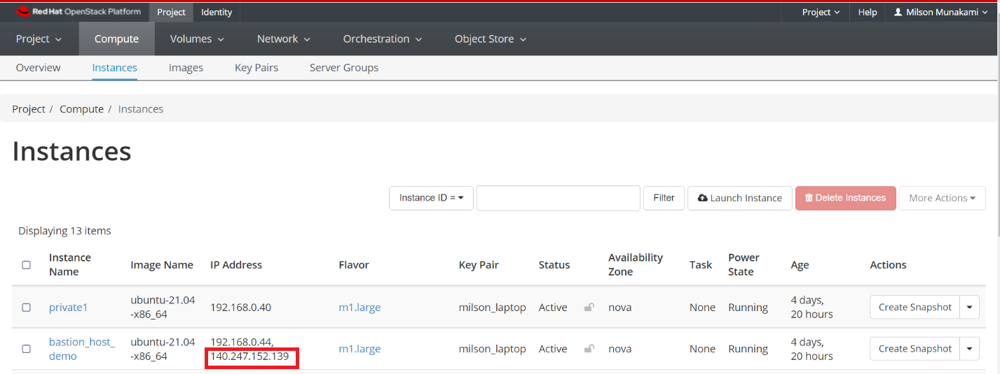

# Bastion Host

A bastion host is a server that provides secure access to private networks over
SSH from an external network, such as the Internet. We can leverage a bastion
host to record all SSH sessions established with private network instances
which enables auditing and can help us in efforts to comply with regulatory requirements.

The following diagram illustrates the concept of using an SSH bastion host to
provide access to Linux instances running inside OpenStack cloud network.


In OpenStack, users can deploy instances in a private tenant network. In order
to make these instances to be accessible externally via internet, the tenant
must assign each instance a Floating IP address i.e., an external public IP.
Nevertheless, users may still want a way to deploy instances without having to
[assign a Floating IP](../assign-a-floating-IP.md) address for every instance.

This is useful in the context of an OpenStack project as you don't necessarily
want to reserve a Floating IP for all your instances. This way you can isolate
certain resources so that there is only a single point of access to them and
conserve Floating IP addresses so that you don't need as big of a quota.

Leveraging an SSH bastion host allows this sort of configuration while still
enabling SSH access to the private instances.

Before trying to access instances from the outside world using SSH tunneling
via Bastion Host, you need to make sure you have followed these steps:

-   You followed the instruction in [Create a Key Pair](../../access-and-security/create-a-key-pair.md)
    to set up a public ssh key. You can use the same key for both the bastion
    host and the remote instances, or different keys; you'll just need to ensure
    that the keys are loaded by ssh-agent appropriately so they can be used as
    needed. Please read [this instruction](../../access-and-security/create-a-key-pair.md#adding-your-ssh-key-to-the-ssh-agent)
    on how to add ssh-agent and load your private key using ssh-add command to
    access the bastion host.

**Verify you have an SSH agent running. This should match whatever you built
your cluster with.**

```sh
ssh-add -l
```

**If you need to add the key to your agent:**

```sh
ssh-add path/to/private/key
```

**Now you can SSH into the bastion host:**

```sh
ssh -A <user>@<bastion-floating-IP>
```

-   Your public ssh-key was selected (in the Access and Security tab) while
    [launching the instance](../launch-a-VM.md).

-   Add two Security Groups, one will be used by the Bastion host and another one
    will be used by any private instances.


**i. Bastion Host Security Group:**

Allow inbound SSH (optional ICMP) for this security group. Make sure you have
added rules in the [Security Groups](../../access-and-security/security-groups.md)
to allow ssh to the bastion host.


**ii. Private Instances Security Group:**

You need to select "Security Group" in Remote dropdown option, and
then select the "**Bastion Host Security Group**" under Security
Group option as shown below:


-   [Assign a Floating IP](../assign-a-floating-IP.md) to the Bastion host instance
    in order to access it from outside world.

Make a note of the Floating IP you have associated to your instance.



While adding the Bastion host and private instance, please select appropriate
Security Group as shown below:

**private1:**


**bastion_host_demo:**


Finally, you'll want to configure the ProxyJump setting for the remote
instances in your SSH configuration file (typically found in `~/.ssh/config`).
In SSH configuration file, we can define multiple hosts by pet names, specify
custom ports, hostnames, users, etc. For example, let's say that you had a
remote instance named "**private1**" and you wanted to run SSH connections
through a bastion host called "**bastion**". The appropriate SSH configuration
file might look something like this:

```sh
Host bastion
  HostName 140.247.152.139
  User ubuntu

Host private1
  Hostname 192.168.0.40
  User ubuntu
  ProxyJump bastion
```

**ProxyJump** makes it super simple to jump from one host to another totally transparently.

**OR,**

if you don't have keys loaded by `ssh-add` command starting `ssh-agent` on your
local machine. you can load the private key using **IdentityFile** variable in
SSH configuration file as shown below:

```sh
Host private1
  Hostname 192.168.0.40
  User ubuntu
  IdentityFile ~/.ssh/cloud.key
  ProxyJump bastion

Host bastion
  HostName 140.247.152.139
  User ubuntu
  IdentityFile ~/.ssh/cloud.key
```

With this configuration in place, when you type `ssh private1` SSH will
establish a connection to the bastion host and then through the bastion host
connect to "**private1**", using the agent added keys or specified private keys.

In this sort of arrangement, SSH traffic to private servers that are not
directly accessible via SSH is instead directed through a bastion host, which
proxies the connection between the SSH client and the remote servers. The
bastion host runs on an instance that is typically in a public subnet with
attached floating public IP. Private instances are in a subnet that is not
publicly accessible, and they are set up with a security group that allows SSH
access from the security group attached to the underlying instance running the
bastion host.

The user won't see any of this; he or she will just see a shell for
"**private1**" appear. If you dig a bit further, though (try running who on the
remote node), you'll see the connections are coming from the bastion host, not
the original SSH client.


---
