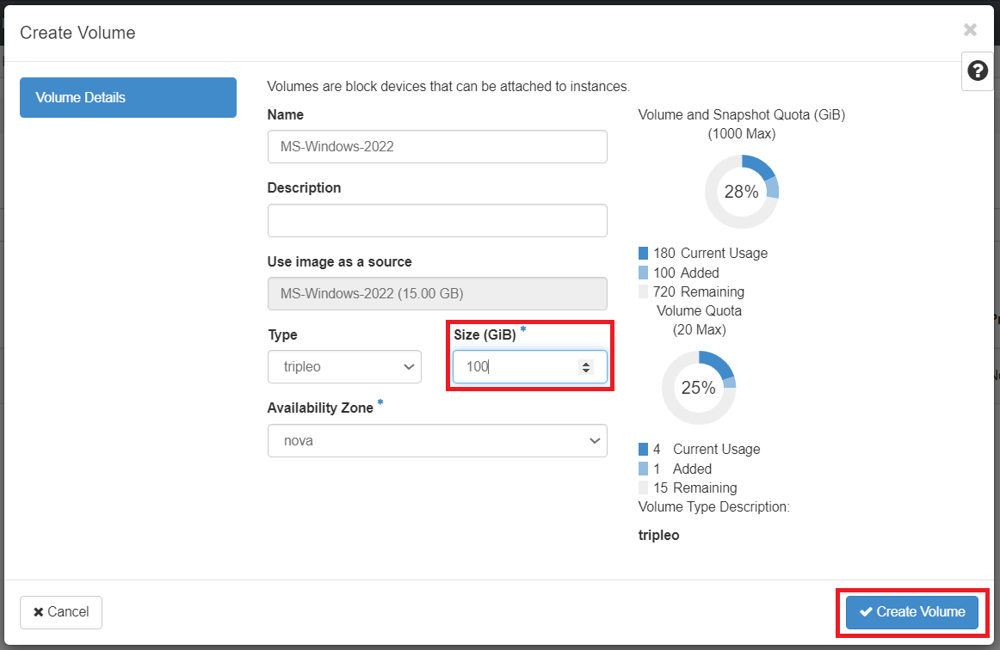
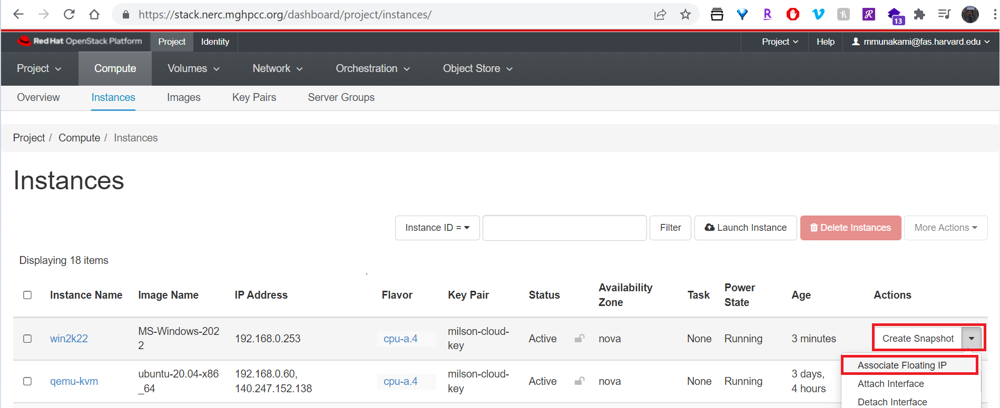
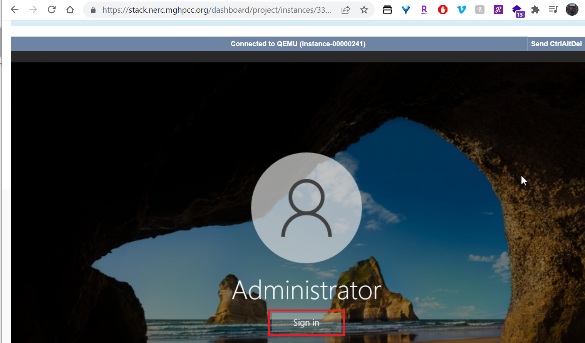

# Create a Windows virtual machine

## Launch an Instance using a boot volume

In this example, we will illustrate how to utilize a boot volume to launch a
Windows virtual machine, similar steps can be used to other types of virtual
machines. The following steps show how to create a virtual machine which boots
from an external volume:

- Create a volume with source data from the image

- Launch a VM with that volume as the system disk

!!! note "Recommendations"
    - The recommended method to create a Windows desktop virtual machine is boot
    from volume
    - To ensure smooth upgrade and maintenance of the system, select at least
    100GB for the size of the volume
    - Make sure your project has sufficient [storage quotas](../../get-started/get-an-allocation.md#general-user-view-of-openstack-resource-allocation).

### Create a volume from image

Navigate: Project -> Compute -> Images.

Make sure you are able to see **MS-Windows-2022** is available on Images List for
your project as shown below:

Create a **Volume** using that *Windows Image*:

To ensure smooth upgrade and maintenance of the system, select at least 100GB
for the size of the volume as shown below:

### Launch instance from existing bootable volume

Navigate: Project -> Volumes -> Volumes.

Once successfully Volume is created, we can use the Volume to launch an instance
as shown below:

!!! note "Note"
    Only one instance at a time can be booted from a given volume. Make sure
    'Delete Volume on Instance Delete' is selected "No" if you want the volume
    to persist even after the instance is terminated.

Add other information and setup a Security Group that allows RDP as shown below:

###Accessing the graphical console

You can access the graphical console using the browser once the VM is in status
ACTIVE. It can take up to 15 minutes to reach this state.

The console is accessed by selecting the Instance Details for the machine and the
'Console' tab as shown below:

!!! warn "What is the user login for Windows Server 2022?"
    To connect with this Windows VM you need to contact us by emailing us at
    [help@nerc.mghpcc.org](mailto:help@nerc.mghpcc.org?subject=NERC%20Windows%20Server%20Login%20Info)
    or, by submitting a new ticket at [the NERC's Support Ticketing System (osTicket)](https://mghpcc.supportsystem.com/open.php)

### How to have Remote Desktop login to your Windows instance

When the build and the Windows installation steps have completed, you can access
the console using the Windows Remote Desktop application. Remote Desktop login
should work with the Floating IP associated with the instance:

!!! warn "What is the user login for Windows Server 2022?"
    To connect with this Windows VM you need to contact us by emailing us at
    [help@nerc.mghpcc.org](mailto:help@nerc.mghpcc.org?subject=NERC%20Windows%20Server%20Login%20Info)
    or, by submitting a new ticket at [the NERC's Support Ticketing System (osTicket)](https://mghpcc.supportsystem.com/open.php)

### Connect additional disk using volume

To attach additional disk to a running Windows machine you can follow
[this documentation](../advanced-openstack-topics/persistent-storage/volumes.md). 
[**This guide**](../advanced-openstack-topics/persistent-storage/volumes.md#for-windows-virtual-machine)
provides instructions on formatting and mounting a volume as an attached disk
within a Windows virtual machine.

---
