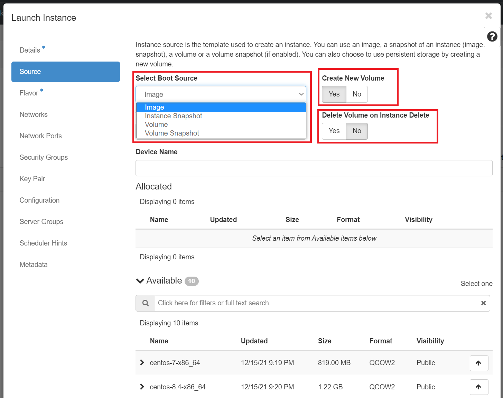

# How to launch an Instance

Navigate: Project -> Compute -> Instances.

Click on "Launch Instance" button:

In the Launch Instance dialog box, specify the following values:

- **Details** tab

Instance Name: Give your instance a name that assign a name to the virtual machine.

!!! note "Important Note"
    The instance name you assign here becomes the initial host name of the server.
    If the name is longer than 63 characters, the Compute service truncates it
    automatically to ensure dnsmasq works correctly.

Availability Zone: By default, this value is set to the availability zone given
by the cloud provider i.e. `nova`.

Count: To launch multiple instances, enter a value greater than 1. The default
is 1.

- **Source** tab: Double check that in the dropdown "Select Boot Source".

When you start a new instance, you can choose the Instance Boot Source from the
following list:

- boot from image
- boot from instance snapshot
- boot from volume
- boot from volume snapshot

In its default configuration, when the instance is launched from an **Image** or
an **Instance Snapshot**, the choice for utilizing persistent storage is configured
by selecting the **Yes** option for "Create New Volume." Additionally, the "Delete
Volume on Instance Delete" setting is pre-set to **No**, as indicated here:

!!! danger "Very Important: How do you make your VM setup and data persistent?”"
    - If you set the **"Create New Volume"** option to **No**, the instance will boot
    from either an image or a snapshot, with the instance only being attached to
    an ephemeral disk. It's crucial to note that this configuration does **NOT**
    create persistent block storage in the form of a Volume, which can pose risks.
    Consequently, the disk of the instance won't appear in the "Volumes" list. To
    mitigate potential data loss, we strongly recommend regularly taking a snapshot
    of such a running ephemeral instance, referred to as an "instance snapshot,"
    especially if you want to safeguard or recover important states of your instance.

    - By default, the setting for **"Delete Volume on Instance Delete"** is configured
    to use **No**. This setting ensures that the volume created during the launch
    of a virtual machine remains persistent and won't be deleted alongside the
    instance unless explicitly chosen as "Yes". When you delete virtual machines
    backed by persistent volumes, the disk data is retained, continuing to consume
    resources for which you will still be billed. When deploying a non-ephemeral
    instance, which involves creating a new volume and selecting "Yes" for "Delete
    Volume on Instance Delete", deleting the instance will also remove the
    associated volume. Consequently, all data on that disk is permanently lost,
    which is undesirable when the data on attached volumes needs to persist even
    after the instance is deleted. Instances configured with "No" in "Delete
    Volume on Instance Delete" boot from a **bootable volume**, utilizing an
    existing volume listed in the "Volumes" menu. This configuration allows for
    launching the instance later or creating a backup by generating a snapshot
    through the "Create Snapshot" option. It's important to note that such usage
    will impact your **Storage quotas**, specifically the "OpenStack Volume Quota"
    and "OpenStack Volume GB Quota". Ideally, selecting "Yes" for this setting
    should be reserved for instances where persistent data storage is not required.

To start a VM, for the first time we will need a base image so, please make sure
"Image" dropdown option is selected. In the example, we chose **ubuntu-22.04-x86_64**,
you may choose any available images.

!!! note "Bootable Images"
    NERC has made several Public bootable images available to the users as
    listed [here](images.md). **Customers can also upload their own custom images,
    as documented in [this guide](../advanced-openstack-topics/setting-up-your-own-images/how-to-build-windows-image.md).**

    To view them, Navigate: Project -> Compute -> Images.

    

!!! info "How to override the flavor's Default root disk volume size"
    If you don't specify custom value for the "**Volume Size (GB)**", that will
    be set to the root disk size of your selected Flavor. For more about the
    default root disk size you can refer to [this documentation](flavors.md).
    We can override this value by entering our own custom value (in GB) and that
    is available as a Volume that is attach to the instance to enable persistent
    storage.

- **Flavor** tab: Specify the size of the instance to launch. Choose `cpu-su.4`
from the 'Flavor' tab by clicking on the "+" icon.

!!! question "Important Note"
    In NERC OpenStack, flavors define the compute, memory, and storage
    capacity of nova computing instances. In other words, a flavor is an
    available hardware configuration for a server.

    Some of the flavors will not be available for your use as per your resource **Quota**
    limits and will be shown as below:

    

    More details about available flavors can be found [**here**](flavors.md) and
    how to change request the current allocation quota attributes can be found [**here**](../../get-started/get-an-allocation.md#request-change-resource-allocation-attributes-for-openstack-project).

After choosing `cpu-su.4`, you should see it moved up to "Allocated".

- **Networks:** tab: Make sure the Default Network that is created by default is
moved up to "Allocated". If not, you can click on the "+" icon in "Available".

- **Security Groups:** tab: Make sure to add the security group where you
enabled SSH. To add an SSH security group first, see [here](../access-and-security/security-groups.md).

!!! info "How to attach New Security Group(s) to any running VM?"
    If you want to attach any new Security Group(s) to a running VM after it was
    launched. First create all new Security Group(s) with all rules required as
    described [here](../access-and-security/security-groups.md). Note that same
    Security Groups can be used by multiple VMs so don't create same or redundant
    Security Rules based Security Groups as there are Quota per project. Once have
    created all Security Groups, you can easily attach them with any existing
    VM(s). You can select the VM from Compute -> Instances tab and then select
    "Edit Security Groups" as shown below:

    

    Then select all Security Group(s) that you want to attach to this VM by clicking
    on [+] sign and then click "Save" as shown here:

    

- **Key Pair:** Add the key pair you created for your local machine/laptop to
use with this VM. To add a Key Pair first create and add them to your Project as
described [here](../access-and-security/create-a-key-pair.md).

!!! note "Important Note"
    If you did not provide a key pair, security groups, or rules, users can
    access the instance only from inside the cloud through VNC. Even pinging the
    instance is not possible without an ICMP rule configured. We recommend limiting
    access as much as possible for [best security practices](../../get-started/best-practices/best-practices.md).

- **Network Ports, Configuration, Server Groups, Schedular Hints, and
Metadata:** tab: Ignore these tabs for now.

!!! info "How to use 'Configuration' tab"
    If you want to specify a customization script that runs after your instance
    launches then you can write those custom script inside the
    "**Customization Script**" text area. For example:
    

You are now ready to launch your VM - go ahead and click "Launch Instance". This
will initiate an instance.

On a successful launch you would be redirected to Compute -> Instances tab and
can see the VM spawning.

Once your VM is successfully running you will see the **Power State** changes
from "No State" to "running".

!!! note "Note"
    Here we explained about launching an instance using Image but you can also
    launch an instance from the "instance snapshot" or "volume" or "volume snapshot"
    option similar to the steps above. If you want to use OpenStack CLI to launch
    a VM you can [read this](../advanced-openstack-topics/openstack-cli/launch-a-VM-using-openstack-CLI.md)
    or if you want to provision the NERC resources using **Terraform** you can
    [read this](../advanced-openstack-topics/terraform/terraform-on-NERC.md).

---
