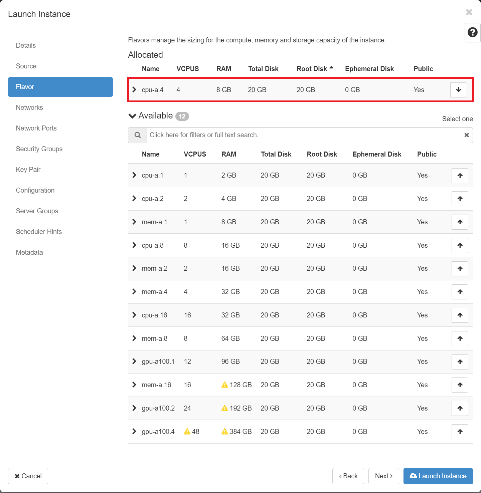

# Launch a VM

## Background

To start a VM, we will need a base image.  NERC has made several Public images
available to users.

## Launch an Instance

Navigate: Project -> Compute -> Images.

Click Launch Instance next to the public image of your choice. In the example,
we chose **ubuntu-21.04-x86_64**, you can choose any available images.

*Important: There are multiple tabs along the top of the the pop up window.

Make sure you review all of them as per instructions before clicking on Launch!
Otherwise, your launched VM may be inaccessible.*

In the Launch Instance dialog box, specify the following values:

- **Details** tab

Instance Name: Give your instance a name that assign a name to the virtual machine.

!!! note "Important Note"
    The instance name you assign here becomes the initial host name of the server.
    If the name is longer than 63 characters, the Compute service truncates it
    automatically to ensure dnsmasq works correctly.

Availability Zone: By default, this value is set to the availability zone given
by the cloud provider i.e. `nova`.

Count: To launch multiple instances, enter a value greater than 1. The default
is 1.

- **Source** tab: Double check that in the dropdown "Select Boot Source,"
"Image" is selected.

!!! note "Note"
    - To create an image that uses the boot volume sized according to the flavor
    ensure that "No" is selected under the "Create New Volume" section.

    - When you deploy a non-ephemeral instance (i.e. Creating a new volume), and
    indicate "Yes" in "Delete Volume on Instance delete", then when you delete
    the instance, the volume is also removed. This is not desired while the
    data of its attached volumes need to persist even instance is deleted. But
    this incures the Volumes quotas so ideally you can select "Yes" only for
    those instances you will not be storing persistent data.

    

    **More details about available bootable images can be found [here](images.md).
    Customers can also upload their own custom images, as demonstrated in [this documentation](../advanced-openstack-topics/setting-up-your-own-images/how-to-build-windows-image.md).**

- **Flavor** tab: Specify the size of the instance to launch. Choose `m1.large`
from the 'Flavor' tab by clicking on the "+" icon.

!!! note "Note"
    In NERC OpenStack, flavors define the compute, memory, and storage
    capacity of nova computing instances. In other words, a flavor is an
    available hardware configuration for a server. The default flavor is `m1.
    small` which is too small for the available base images so please do not
    use it.

    Some of the flavors will not be available for your use as per your resource **Quota**
    limits and will be shown as below:

    

    **More details about available flavors and corresponding quotas
    details can be found [here](flavors.md).**

After choosing `m1.large`, you should see it moved up to "Allocated".

- **Networks:** tab: Make sure the Default Network that is created by default is
moved up to "Allocated". If not, you can click on the "+" icon in "Available".

- **Security Groups:** tab: Make sure to add the security group where you
enabled SSH.

- **Key Pair:** Add the key pair you created for your local machine/laptop to
use with this VM.

!!! note "Important Note"
    If you did not provide a key pair, security groups, or rules, users can
    access the instance only from inside the cloud through VNC. Even pinging the
    instance is not possible without an ICMP rule configured.

- **Network Ports, Configuration, Server Groups, Schedular Hints, and
Metadata:** tab: Ignore these tabs for now.

You are now ready to launch your VM - go ahead and click "Launch Instance"!
This will initiate a instance on a compute node in the cloud.

On a successful launch you would be redirected to Compute -> Instances tab and
can see the VM spawning.

Once your VM is successfully running you will see the **Power State** changes
from "No State" to "running".

!!! note "Note"
    You can also launch an instance from the "Instances" or "Volumes" category
    when you launch an instance from an instance or a volume respectively.

---
