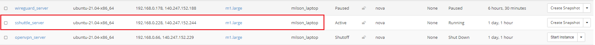

# sshuttle

sshuttle is a lightweight SSH-encrypted VPN. This is a Python based script that
allows you to tunnel connections through SSH in a far more efficient way then
traditional ssh proxying.

## Installing sshuttle Server

You can spin up a new instance with "**ubuntu-22.04-x86_64**" or any available
Ubuntu OS image, named "**sshuttle_server**" on OpenStack, with
"**default**" and "**ssh_only**" Security Groups attached to it.



Also, attach a Floating IP to this instance so you can ssh into it from outside.


Finally, you'll want to configure the setting for the remote instances in your
SSH configuration file (typically found in `~/.ssh/config`). The SSH
configuration file might include entry for your newly create sshuttle server
like this:

```sh
Host sshuttle

  HostName 140.247.152.244
  User ubuntu
  IdentityFile ~/.ssh/cloud.key
```

1. Then you can ssh into the sshuttle Server running: `ssh sshuttle`


!!! note "Note"
    Unlike other VPN servers, for sshuttle you don't need to install
    anything on the server side. **As long as you have an SSH server (with
    python3 installed) you're good to go.**

## To connect from a new client

## Install sshuttle

### Windows

Currently there is no built in support for running sshuttle directly on
Microsoft Windows. What you can do is to create a Linux VM with Vagrant (or
simply Virtualbox if you like) and then try to connect via that VM. For more
details [read here](https://sshuttle.readthedocs.io/en/stable/windows.html)

### Mac OS X

Install using **Homebrew**:

```sh
brew install sshuttle
```

**OR,** via **MacPorts**

```sh
sudo port selfupdate
sudo port install sshuttle
```

### Linux

sshuttle is available through the package management system on most Linux distributions.

**On Debian/Ubuntu:**

```sh
sudo apt-get install sshuttle
```

**On RedHat/CentOS:**

```sh
sudo yum install sshuttle
```

It is also possible to install into a **virtualenv** as *a non-root user*.

- From PyPI:

```sh
virtualenv -p python3 /tmp/sshuttle
 . /tmp/sshuttle/bin/activate
 pip install sshuttle
```

- Clone:

```sh
virtualenv -p python3 /tmp/sshuttle
 . /tmp/sshuttle/bin/activate
 git clone [https://github.com/sshuttle/sshuttle.git](https://github.com/sshuttle/sshuttle.git)
 cd sshuttle
 ./setup.py install
```

## How to Connect

**Tunnel to all networks (0.0.0.0/0):**

```sh
sshuttle -r ubuntu @140.247.152.244 0.0.0.0/0
```

**OR,** shorthand:

```sh
sudo sshuttle -r ubuntu@140.247.152.244 0/0
```

If you would also like your DNS queries to be proxied through the DNS server of
the server, you are connected to:

```sh
sshuttle --dns -r ubuntu@140.247.152.244 0/0
```


---
