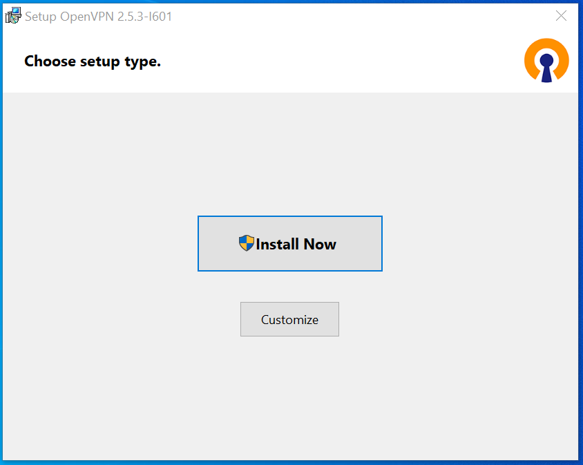
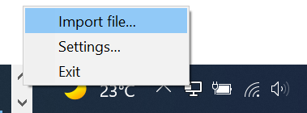
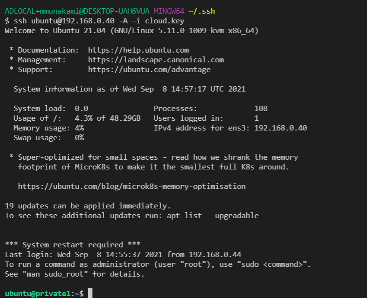

# OpenVPN-GUI

[Official OpenVPN Windows installers](https://github.com/OpenVPN/openvpn-gui)
include a Windows
[OpenVPN-GUI](https://community.openvpn.net/openvpn/wiki/OpenVPN-GUI), which
allows managing OpenVPN connections from a system tray applet.

## Find your client account credentials

You need to contact your project administrator to get your own OpenVPN
configuration file (file with .ovpn extension). Download it and Keep it in your
local machine so in next steps we can use this configuration client profile file.

## Download and install OpenVPN-GUI

1. Download the OpenVPN client installer:

    OpenVPN for Windows can be installed from the self-installing exe file on the
    [OpenVPN download page](https://openvpn.net/community-downloads/). Also note
    that OpenVPN must be installed and run by a user who has administrative
    privileges (this restriction is imposed by Windows, not OpenVPN)

2. Launch the installer and follow the prompts as directed.

    

3. Clicking "**Customize**" button we can see settings and features of OpenVPN
GUI client.

    

4. Click "**Install Now**" to continue.

    

5. Click "Close"button.

6. For the newly installed OpenVPN GUI there will be no configuration profile
for the client so it will show a pop up that alerts:

    

## Set up the VPN with OpenVPN GUI

After you've run the Windows installer, OpenVPN is ready for use and will
associate itself with files having the **.ovpn** extension.

1. You can use the previously downloaded .ovpn file from your Downloads folder
to setup the connection profiles.

    a. Either you can Right click on the OpenVPN configuration file (.ovpn) and
    select "**Start OpenVPN on this config file**":

    

    b. **OR,** you can use "Import file…" menu to select the previously
    downloaded .ovpn file.

    

    Once, done it will show:

    

    c. **OR,** you can manually copy the config file to one of OpenVPN's
    configuration directories:

        C:\Program Files\OpenVPN\config (global configs)
        C:\Program Files\OpenVPN\config-auto (autostarted global configs)
        %USERPROFILE%\OpenVPN\config (per-user configs)

## Connect to a VPN server location

For launching OpenVPN Connections you click on OpenVPN GUI (tray applet).
OpenVPN GUI is used to launching VPN connections on demand. OpenVPN GUI is a
system-tray applet, so an icon for the GUI will appear in the lower-right
corner of the screen located at the taskbar notification area. Right click on
the system tray icon, and if you have multiple configurations then a menu
should appear showing the names of your OpenVPN configuration profiles and
giving you the option to connect. If you have only one configuration then you
can just click on "Connect" menu.

When you are connected to OpenVPN server successfully, you will see popup
message as shown below. That's it! You are now connected to a VPN.

Once you are connected to the OpenVPN server, you can run commands like shown
below in your terminal to connect to the private instances: `ssh ubuntu@192.168.
0.40 -A -i cloud.key`

## Disconnect VPN server

To disconnect, right click on the system tray icon, in your status bar and
select **Disconnect** from the menu.

---
