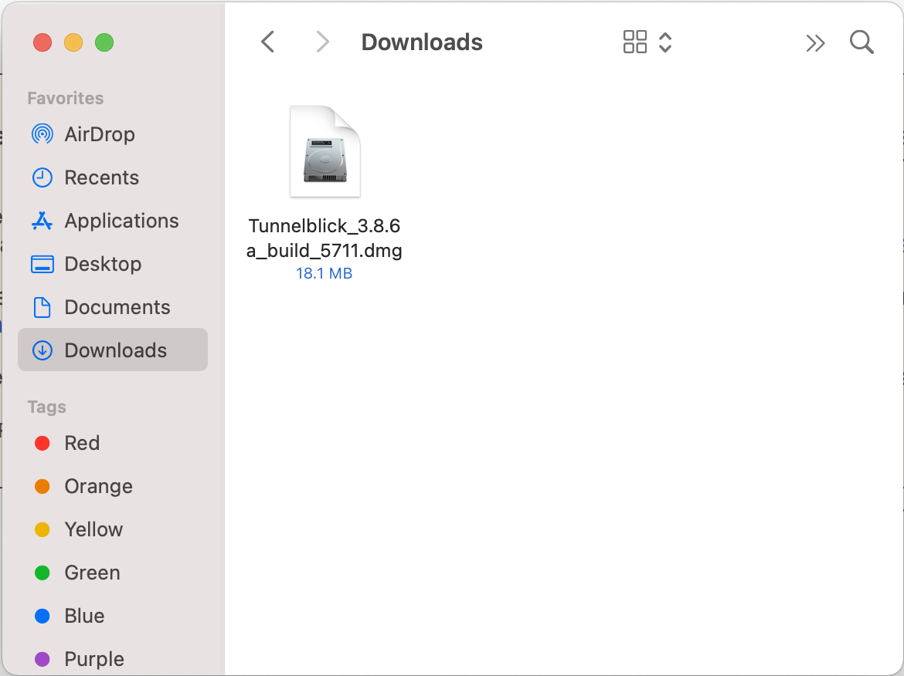
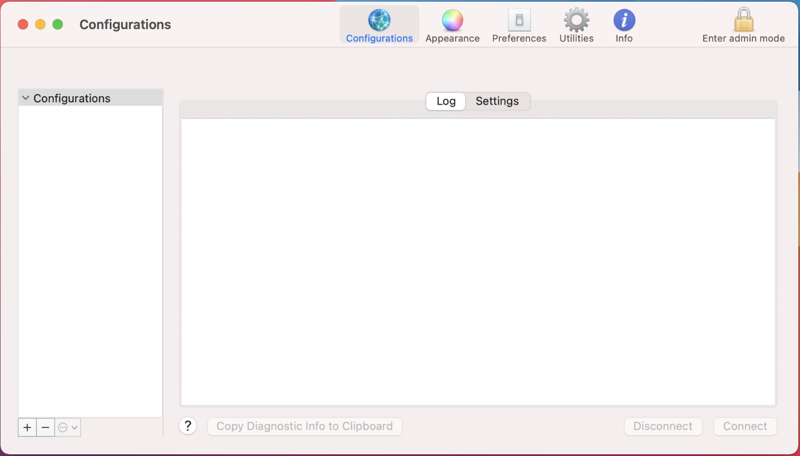
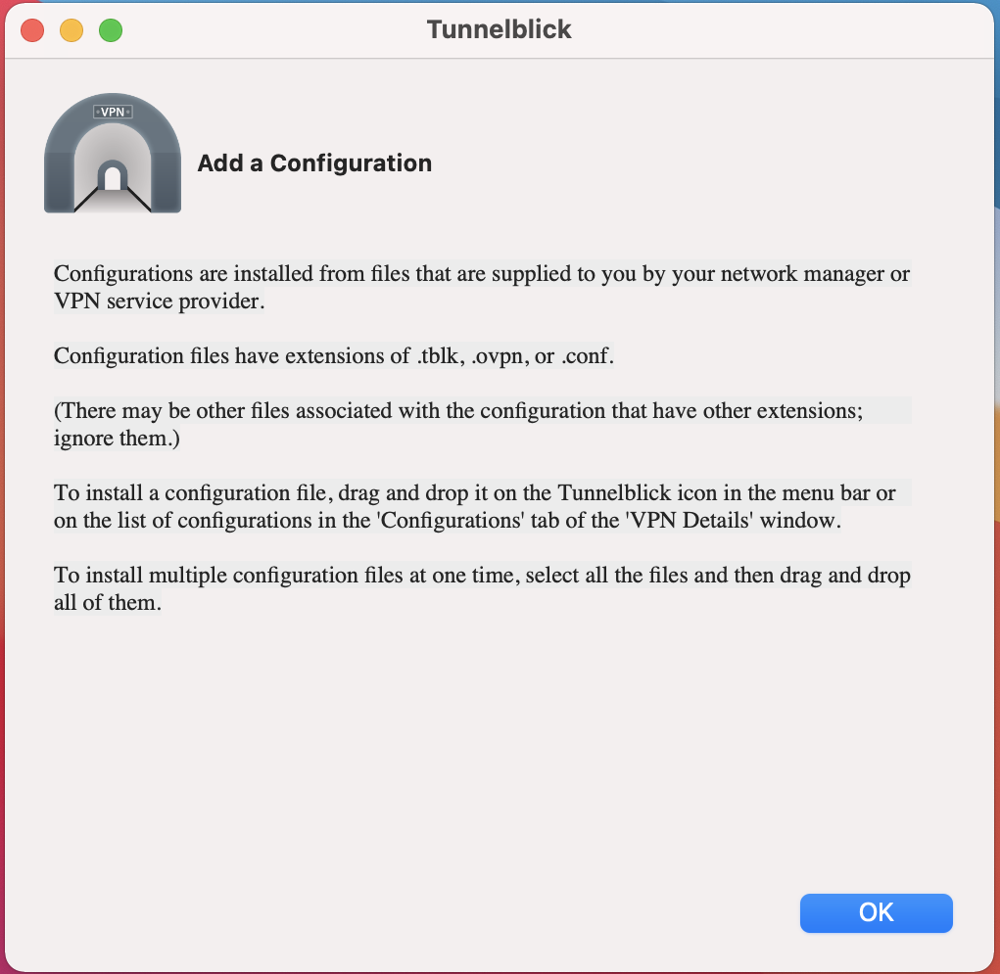
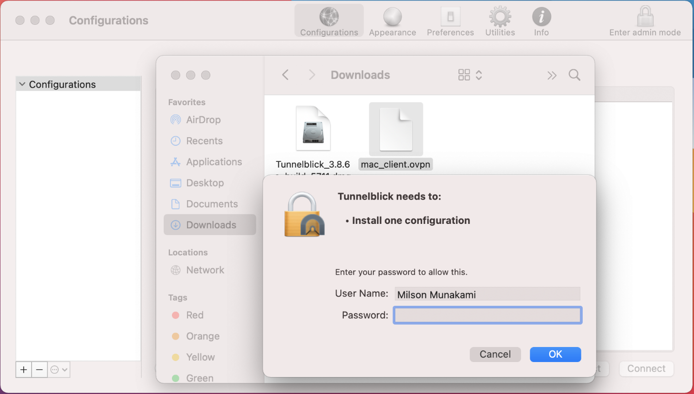
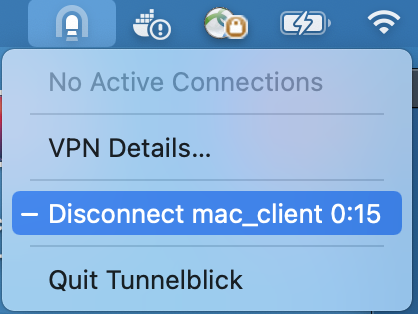

# Tunnelblick

Tunnelblick is a free, open-source GUI (graphical user interface) for OpenVPN
on macOS and OS X: More details can be found [here](https://tunnelblick.net/).
Access to a VPN server — your computer is one end of the tunnel and the VPN
server is the other end.

## Find your client account credentials

You need to contact your project administrator to get your own OpenVPN
configuration file (file with .ovpn extension). Download it and Keep it in your
local machine so in next steps we can use this configuration client profile file.

## Download and install Tunnelblick

1. Download [Tunnelblick](https://tunnelblick.net/index.html), a free and
user-friendly app for managing OpenVPN connections on macOS.

    

2. Navigate to your Downloads folder and double-click the Tunnelblick
installation file (.dmg installer file) you have just downloaded.

    

3. In the window that opens, **double-click** on the Tunnelblick icon.

    

4. A new dialogue box will pop up, asking you if you are sure you want to open
the app. Click **Open**.

    

    

5. You will be asked to enter your device password. Enter it and click **OK**:

    

6. Select **Allow** or **Don't Allow** for your notification preference.

    

7. Once the installation is complete, you will see a pop-up notification asking
you if you want to launch Tunnelblick now. *(An administrator username and
password will be required to secure Tunnelblick).* Click **Launch**.

**Alternatively,** you can click on the **Tunnelblick icon** in the status bar
and select **VPN Details...**:




## Set up the VPN with Tunnelblick

1. A new dialogue box will appear. Click **I have configuration files**.

    

2. Another notification will pop-up, instructing you how to import
configuration files. Click **OK**.

    

3. Drag and drop the previously downloaded .ovpn file from your Downloads
folder to the **Configurations** tab in Tunnelblick.

    

    **OR,**

    You can just **drag and drop** the provided OpenVPN configuration file (file
    with .ovpn extension) directly to Tunnelblick icon in status bar at the
    top-right corner of your screen.

    

4. A pop-up will appear, asking you if you want to install the configuration
profile for your current user only or for all users on your Mac. Select your
preferred option. If the VPN is intended for all accounts on your Mac, select
**All Users**. If the VPN will only be used by your current account, select
**Only Me**.

    

5. You will be asked to enter your Mac password.

    

    

    Then the screen reads "**Tunnelblick successfully: installed one configuration**".

    

You can see the configuration setting is loaded and installed successfully.

## Connect to a VPN server location

1. To connect to a VPN server location, click the Tunnelblick icon in status
bar at the top-right corner of your screen.

    

2. From the drop down menu select the server and click **Connect** **[name of
the .ovpn configuration file]**..

    

    **Alternatively,** you can select "**VPN Details**" from the menu and then
    click the "**Connect**"button:

    

    This will show the connection log on the dialog:

    

3. When you are connected to OpenVPN server successfully, you will see popup
message as shown below. That's it! You are now connected to a VPN.

    

4. Once you are connected to the OpenVPN server, you can run commands like
shown below to connect to the private instances:

    ```sh
    ssh ubuntu@192.168.0.40 -A -i cloud.key
    ```

    

## Disconnect VPN server

To disconnect, click on the Tunnelblick icon in your status bar and select
**Disconnect** in the drop-down menu.



While closing the log will be shown on popup as shown below:


---
