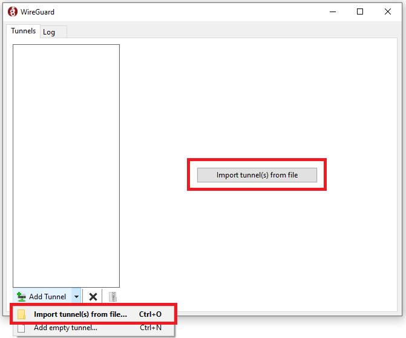
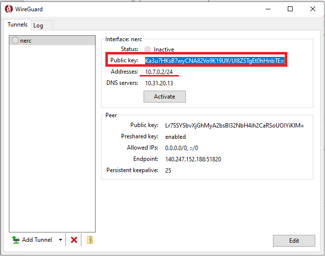
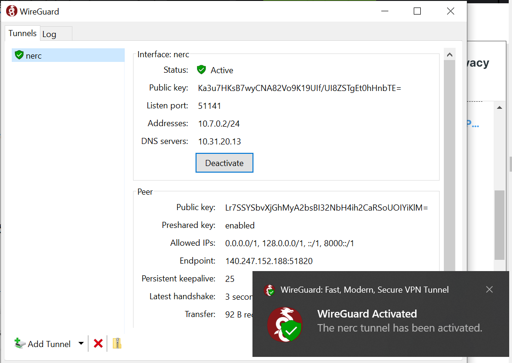
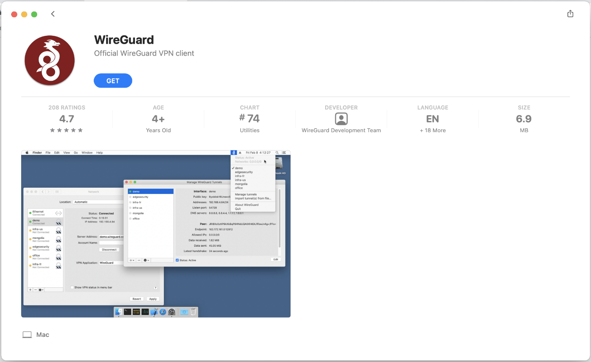
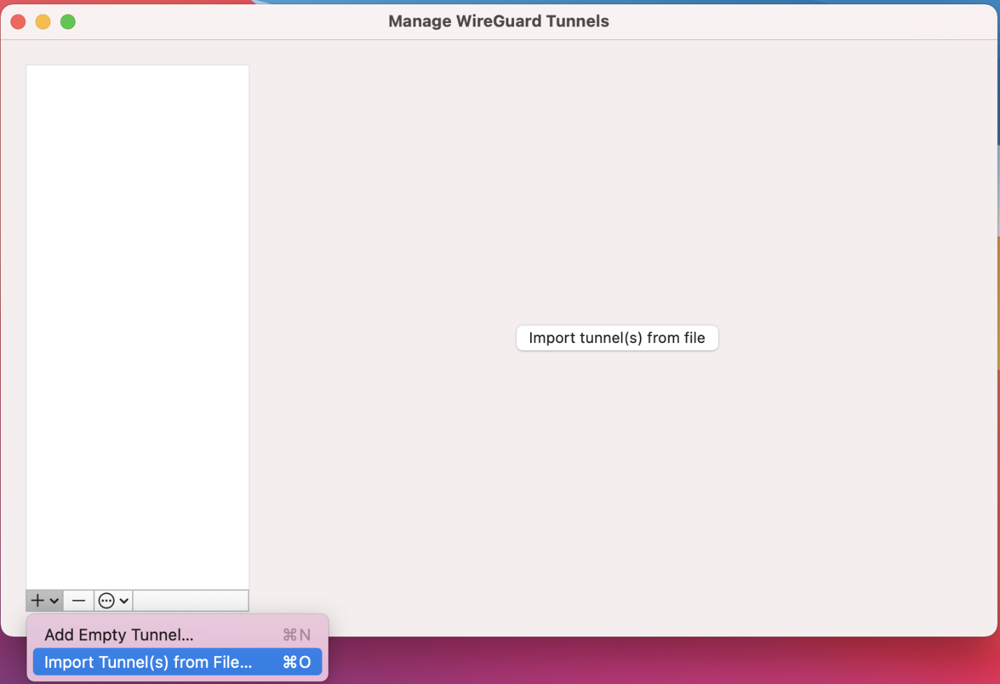
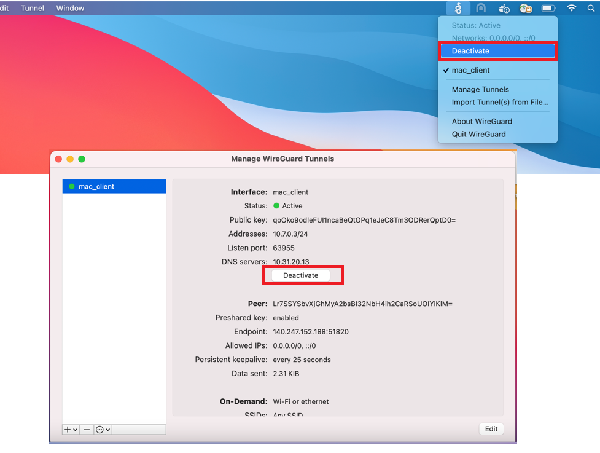

# WireGuard

[WireGuard](https://www.wireguard.com/) is an extremely simple yet fast and
modern VPN that utilizes **state-of-the-art** cryptography.

Here's what it will look like:


## Installing WireGuard Server

You can spin up a new instance with "**ubuntu-22.04-x86_64**" or any available
Ubuntu OS image, named "**wireguard_server**" on OpenStack, with
"**default**" and "**ssh_only**" Security Groups attached to it.


Also, attach a Floating IP to this instance so you can ssh into it from outside.

Create a new Security Group i.e. "**wireguard**" that is listening on
**UDP port 51820** as shown below:


The Security Groups attached to the WireGuard server includes "**default**",
"**ssh_only**" and "**wireguard**". It should look similar to the image shown below:


Finally, you'll want to configure the setting for the remote instances in your
SSH configuration file (typically found in `~/.ssh/config`). The SSH
configuration file might include entry for your newly created WireGuard server
like this:

```ssh
Host wireguard
  HostName 140.247.152.188
  User ubuntu
  IdentityFile ~/.ssh/cloud.key
```

1. Then you can ssh into the WireGuard Server running: `ssh wireguard`

    

2. Also note that WireGuard must be installed and run by a user who has
   **administrative/root** privileges. So, we need to run the command: `sudo su`

3. We are using [this repo](https://github.com/Nyr/wireguard-install) to
   install WireGuard server on this ubuntu server.

    For that, run the script and follow the assistant:

    ```sh
    wget https://git.io/wireguard -O wireguard-install.sh && bash wireguard-install.sh
    ```

    

    You can press **Enter** for all default values. And, while entering a name
    for the first client you can give "**nerc**" as the client name, this will
    generate a new configuration file (.conf file) named as "**nerc.conf**". Based
    on your client's name it will name the config file as "**<your_client_name>.conf**"

    

    **NOTE:** For each peers the client configuration files comply with the
    following template:

    

4. Copy the generated config file from "**/root/nerc.conf**" to
   "**/home/ubuntu/nerc.conf**" by running: `cp /root/nerc.conf .`

5. Update the ownership of the config file to ubuntu user and ubuntu group by
   running the following command: `chown ubuntu:ubuntu nerc.conf`

6. You can exit from the root and ssh session all together and then copy the
   configuration file to your local machine by running the following script on
   your local machine's terminal: `scp wireguard:nerc.conf .`

## To add a new client user

Once it ends, you can run it again to add more users, remove some of them or
even completely uninstall WireGuard.

For this, run the script and follow the assistant:

```sh
wget https://git.io/wireguard -O wireguard-install.sh && bash wireguard-install.sh
```


Here, you are giving client name as "**mac_client**" and that will
generate a new configuration file at "**/root/mac_client.conf**".
You can repeat above steps: **4 to 6** to copy this new client's configuration
file and share it to the new client.

### Authentication Mechanism

It would be kind of pointless to have our VPN server allow anyone to connect.
This is where our public &amp; private keys come into play.

- Each **client's \*\*public\*\* key** needs to be added to the
  **SERVER'S** configuration file

- The **server's \*\*public\*\* key** added to the **CLIENT'S**
  configuration file

### Useful commands

To view server config: `wg show` or, `wg`

To activateconfig: `wg-quick up /path/to/file_name.config`

To deactivate config: `wg-quick down /path/to/file_name.config`

**Read more:**

[https://git.zx2c4.com/wireguard-tools/about/src/man/wg.8](https://git.zx2c4.com/wireguard-tools/about/src/man/wg.8)

[https://git.zx2c4.com/wireguard-tools/about/src/man/wg-quick.8](https://git.zx2c4.com/wireguard-tools/about/src/man/wg-quick.8)

---

!!! note "Important Note"

    You need to contact your project administrator to get your own WireGUard
    configuration file (file with .conf extension). Download it and Keep it in
    your local machine so in next steps we can use this configuration client
    profile file.

A WireGuard client or compatible software is needed to connect to the WireGuard
VPN server. Please install[one of these clients](https://www.wireguard.com/install/)
depending on your device. The client program must be configured with a client
profile to connect to the WireGuard VPN server.

### Windows

WireGuard client can be [downloaded here](https://www.wireguard.com/install/).
The WireGuard executable should be installed on client machines. After the
installation, you should see the WireGuard icon in the lower-right corner of
the screen located at the taskbar notification area.


#### Set up the VPN with WireGuard GUI

Next, we configure the VPN tunnel. This includes setting up the endpoints and
exchanging the public keys.

Open the WireGuard GUI and either click on **Add Tunnel -> Import tunnel(s)
from file…** **OR,**

click on "**Import tunnel(s) from file**" button located at the center.



The software automatically loads the client configuration. Also, it creates a
public key for this new tunnel and displays it on the screen.



Either, Right Click on your tunnel name and select
"**Edit selected tunnel…**" menu **OR,** click on
"**Edit**" button at the lower left.


Checking **Block untunneled traffic (kill-switch)** will make sure that all
your traffic is being routed through this new VPN server.


#### Test your connection

On your Windows machine, press the "**Activate"** button. You should
see a successful connection be made:



After a few seconds, the status should change to **Active.**

If the connection is routed through the VPN, it should show the IP address of
the WireGuard server as the public address.

If that's not the case, to troubleshoot please check the "**Log**"
tab and verify and validate the client and server configuration.

Clicking " **Deactivate**" button closes the VPN connection.


### Mac OS X

#### I. Using [HomeBrew](https://brew.sh/)

This allows more than one Wireguard tunnel active at a time unlike the
WireGuard GUI app.

1. Install WireGuard CLI on macOS through brew: `brew install wireguard-tools`

2. Copy the "**.conf**" file to
   "**/usr/local/etc/wireguard/**" (or "**/etc/wireguard/**").
   You'll need to create the " **wireguard**" directory first. For your
   example, you will have your config file located at: " **/usr/local/etc
   /wireguard/mac_client.conf**" or, "**/etc/wireguard/mac_client.conf**"

3. To activate the VPN: "wg-quick up [*name of the conf file without
   including .conf extension*]". For example, in your case, running
   `wg-quick up mac_client` - If the peer system is already configured
   and its interface is up, then the VPN connection should establish
   automatically, and you should be able to start routing traffic through the peer.

Use `wg-quick down mac_client` to take the VPN connection down.

#### II. Using WireGuard GUI App

1. Download WireGuard Client from the macOS App Store

    You can find the official WireGuard Client app on the App Store [here](https://itunes.apple.com/us/app/wireguard/id1451685025?ls=1&mt=12).

    

2. Set up the VPN with WireGuard

    Next, we configure the VPN tunnel. This includes setting up the endpoints
    and exchanging the public keys.

    Open the WireGuard GUI by directly clicking WireGuard icon in status bar at
    the top-right corner of your screen.

    

    And then click on "**Import tunnel(s) from file**" menu to load your
    client config file.

    

    **OR,**

    Find and click the WireGUard GUI from your Launchpad and then either click
    on **Add Tunnel -> Import tunnel(s) from file…** or, just click on "**Import
    tunnel(s) from file**" button located at the center.

    

    **Browse to the configuration file:**

    

    The software automatically loads the client configuration. Also, it creates
    a public key for this new tunnel and displays it on the screen.

    

    

    If you would like your computer to automatically connect to the WireGuard
    VPN server as soon as either (or both) Ethernet or Wi-Fi network adapter
    becomes active, check the relevant '**On-Demand**' checkboxes for
    "**Ethernet**" and " **Wi-Fi**".

    Checking **Exclude private IPs** will generate a list of networks which
    excludes the server IP address and add them to the **AllowedIPs** list. This
    setting allows you to pass all your traffic through your Wireguard VPN
    **EXCLUDING** private address ranges like **10.0.0.0/8**, **172.16.0.0/12**,
    and **192.168.0.0/16**.

    

3. Test your connection

    On your Windows machine, press the "**Activate**" button. You should see a
    successful connection be made:

    

    After a few seconds, the status should change to **Active.**

    Clicking "**Deactivate**" button from the GUI's interface or
    directly clicking "**Deactivate**" menu from the WireGuard icon in
    status bar at the top-right corner of your screen closes the VPN connection.

    

### Linux

WireGuard is available through the package management system on most Linux distributions.

**On Debian/Ubuntu:**

```sh
sudo apt update
sudo apt-get install wireguard resolvconf -y
```

**On RedHat/Rocky/AlmaLinux:**

```sh
sudo dnf install wireguard
```

Then, to run WireGuard using the client profile:
**Move** the VPN client profile (configuration) file to **/etc/wireguard/**:

```sh
sudo mv nerc.conf /etc/wireguard/client.conf
```

Restart the WireGuard daemon (i.e., This will start WireGuard connection and
will automatically run on boot):

```sh
sudo /etc/init.d/wireguard start
```

**OR,**

```sh
sudo systemctl enable --now wg-quick@client
sudo systemctl start wg-quick@client
```

**OR,**

```sh
wg-quick up /etc/wireguard/client.conf
```

Checking the status:

```sh
systemctl status wg-quick@client
```

**Alternatively,** if you want to run WireGuard manually each time, then run:

```sh
sudo wireguard --config /etc/wireguard/client.conf
```

**OR,**

```sh
sudo wireguard --config nerc.conf
```

## To test the connection

Once you are connected to the WireGuard server, you can run commands like shown
below in your terminal to connect to the private instances: `ssh ubuntu@192.168.
0.40 -A -i cloud.key`


---
