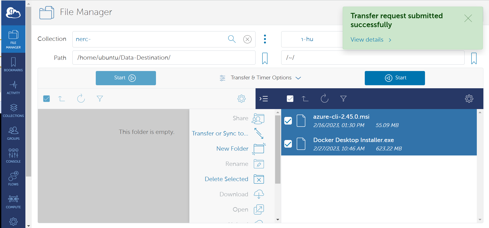
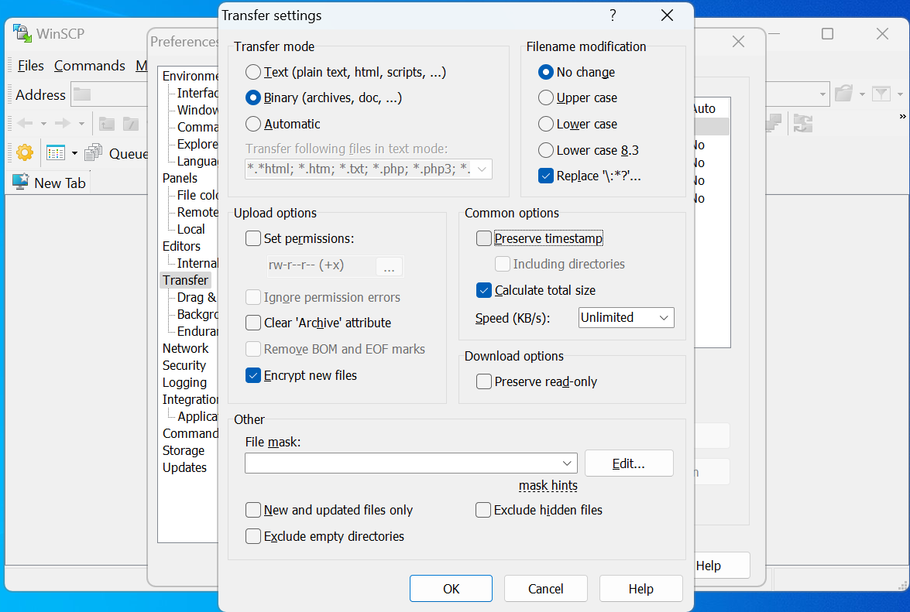
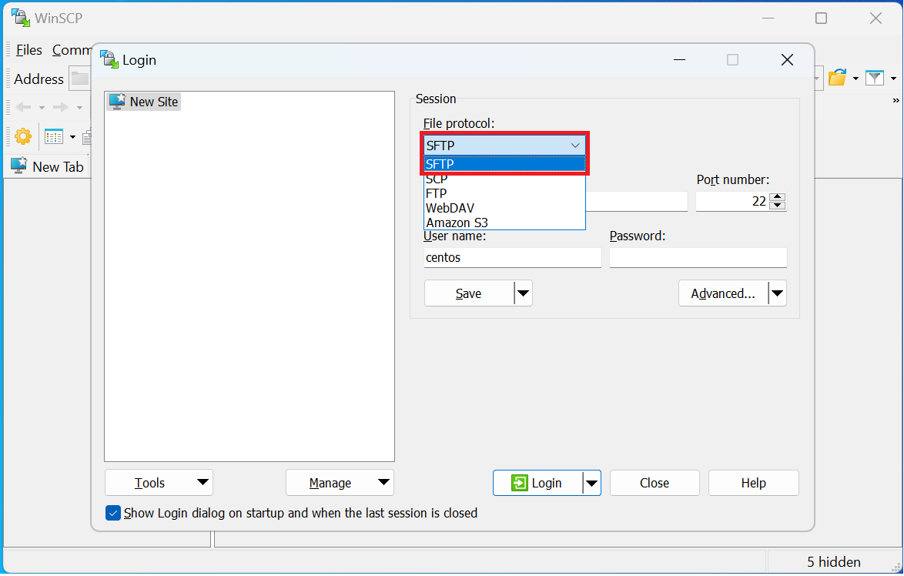
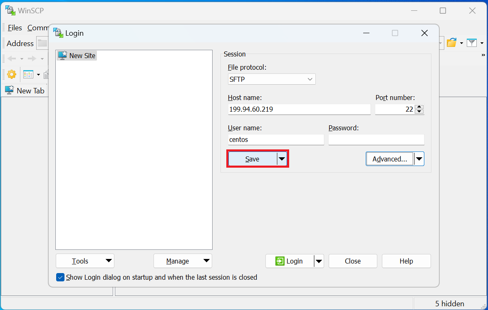
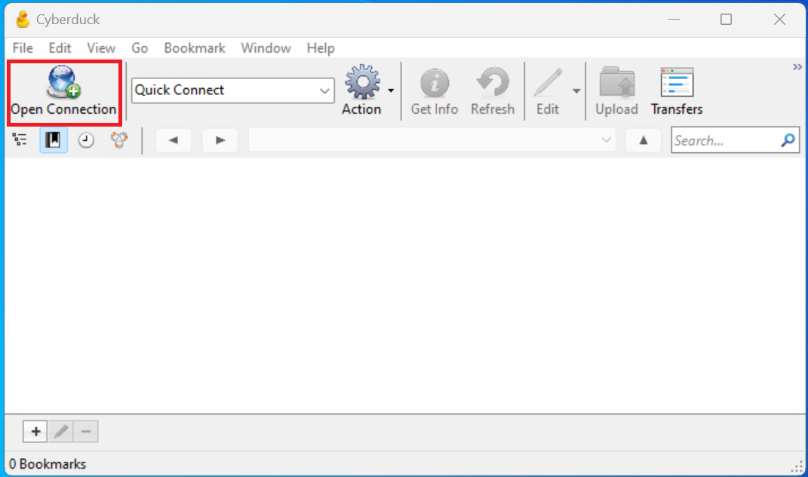
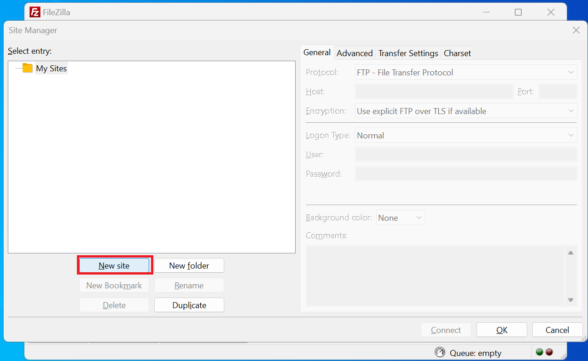
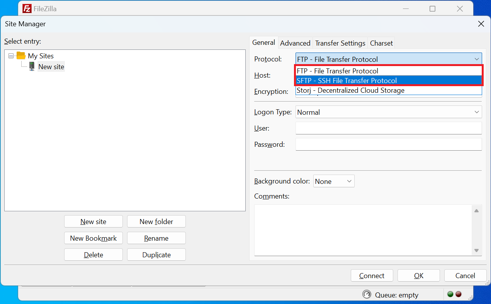
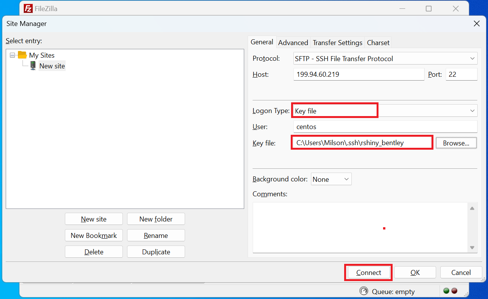
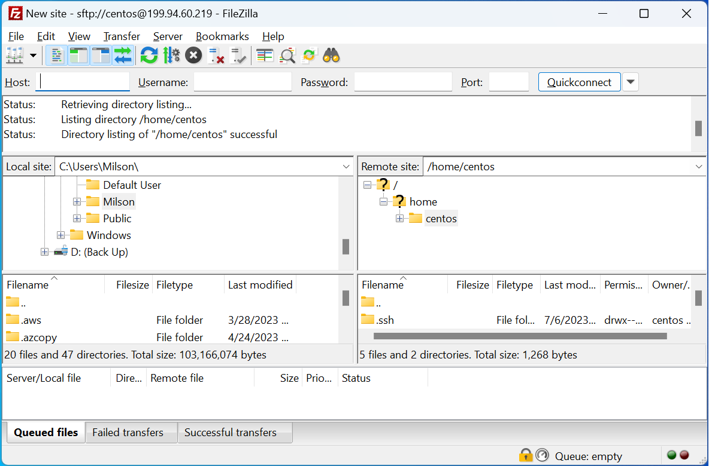

# Data Transfer To/From NERC VM

## Transfer using Volume

You may wish to transfer a volume which includes all data to a different project
which can be your own (with access in project dropdown list) or external collaborators
with in NERC. For this you can follow [this guide](../persistent-storage/transfer-a-volume.md).

!!! danger "Very Important Note"
    If you transfer the volume then that will be removed from the source and will
    only be available on destination project.

## Using Globus

[Globus](https://globus.org/) is a web-based service that is the preferred method
for transferring substantial data between NERC VM and other locations. It effectively
tackles the typical obstacles researchers encounter when moving, sharing, and
storing vast quantities of data. By utilizing Globus, you can delegate data transfer
tasks to a managed service that oversees the entire process. This service monitors
performance and errors, retries failed transfers, automatically resolves issues
whenever feasible, and provides status updates to keep you informed. This allows
you to concentrate on your research while relying on Globus to handle data movement
efficiently. For information on the user-friendly web interface of Globus and its
flexible REST/API for creating scripted tasks and operations, please visit
[Globus.org](https://globus.org/).

!!! info "Important Information"
    For large data sets and/or for access by external users, consider using Globus.
    An institutional endpoint/collection is not required to use Globus - you can
    set up a personal endpoint on your NERC VM and also on your local machine if
    you need to transfer large amounts of data.

### Setting up a Personal Globus Endpoint on NERC VM

You can do this using [Globus Connect Personal](https://docs.globus.org/how-to/globus-connect-personal-linux/#running_with_no_gui)
to configure an endpoint on your NERC VM. In general, it is always fastest to setup
a Personal endpoint on your NERC VM, and then use that endpoint for transfers
to/from a local machine or any other shared or private Globus endpoints.

You can find instructions for downloading and installing the Globus Connect Personal
on the [Globus web site](https://docs.globus.org/how-to/).

!!! tip "Helpful Tip"
    You may get a "Permission Denied" error for certain paths with Globus Connect
    Personal. If you do, you may need to add this path to your list of allowed
    paths for Globus Connect Personal. You can do this by editing the
    `~/.globusonline/lta/config-paths` file and adding the new path as a line in
    the end of the list. The path must be followed by sharing (`0`/`1`) and
    R/W (`0`/`1`) flags.

    For example, to enable read-write access to the /data/tables directory, add
    the following line i.e. `/data/tables,0,1`.

### Usage of Globus

Once a Personal Endpoint is set up on a NERC VM, you will be able to find that named
collection on [Globus file explorer](https://app.globus.org/file-manager)
and then can be chosen as source or destination for data transfer to/from another
Guest Collection (Globus Shared Endpoints). Login into the
[Globus web interface](https://app.globus.org/), select your organization
which will allow you to log in to Globus, and land on
[File Manager page](https://docs.globus.org/how-to/get-started/).

If your account belong to [Globus Subscription](https://www.globus.org/subscriptions)
that you will be able to use data transfers between two personal endpoints
i.e. you can setup your local machine as another personal endpoint.

## Using SCP

!!! warning "Important Information"
    SCP is suggested for smaller files (<~10GB), otherwise use [Globus](#using-globus).
    When you want to transfer many small files in a directory, we recommend Globus.

We generally recommend using SCP (Secure Copy) to copy data to and from your VM.
SCP is used to securely transfer files between two hosts using the Secure Shell
(ssh) protocol. It’s usage is simple, but the order that file locations are
specified is crucial. SCP always expects the 'from' location first, then the 'to'
destination. Depending on which is the remote system, you will prefix your username
and Floating IP of your NERC VM.

`scp [username@Floating_IP:][location of file] [destination of file]`

or,

`scp [location of file] [username@Floating_IP:][destination of file]`

### Usage

Below are some examples of the two most common scenarios of SCP to copy to and from
various sources.

!!! tip "Helpful Tip"
    We use '~' in the examples. The tilde '~' is a Unix short-hand that means
    "my home directory". So if user `centos` uses `~/` this is the same as typing
    out the full path to centos user's home directory (easier to remember than
    `/home/centos/`). You can, of course, specify other paths (ex. –
    `/user/centos/output/files.zip`) Also, we use `.` in the examples to specify
    the current directory path from where the command is issued. This can be
    replaced with the actual path.

**i. Copying Files From the NERC VM to Another Computer:**

From a terminal/shell from your local machine, you'll issue your SCP command by
specifying the SSH Private Key to connect with the VM that has included corresponding
SSH Public Key. The syntax is:

    scp -i <Your SSH Private Key including Path> <Default User name based on OS>@<Your Floating IP of VM>:~/<File In VM> .

This copies the file `<File In VM>` from your VM's default user's directory (`~`
is a Unix shortcut for `my home directory`) on your VM to your current directory
(`.` is a Unix shortcut the current directory) on your computer from where the command
is issued or you can specify the actual path instead of `.`.

For e.g.

    scp -i ~/.ssh/your_pem_key_file.pem centos@199.94.60.219:~/myfile.zip /my_local_directory/

**ii. Copying Files From Another Computer to the NERC VM:**

From a terminal/shell on your computer (or another server or cluster) where you
have access to the SSH Private Key, you'll issue your SCP command. The syntax is:

    scp -i <Your SSH Private Key including Path> ./<Your Local File> <Default User name based on OS>@<Your Floating IP of VM>:~/`

This copies the file `<Your Local File>` from the current directory on the computer
you issued the command from, to your home directory on your NERC VM. (recall that
`.` is a Unix shortcut for the current directory path and `~` is a Unix shortcut
for `my home directory`)

For e.g.

    scp -i ~/.ssh/your_pem_key_file.pem ./myfile.zip centos@199.94.60.219:~/myfile.zip:~/

!!! info "Important Note"
    While it’s probably best to compress all the files you intend to transfer into
    one file, this is not always an option. To copy the contents of an entire directory,
    you can use the `-r` (for recursive) flag.

    For e.g.

        scp -i ~/.ssh/your_pem_key_file.pem -r centos@<Floating_IP>:~/mydata/ ./destination_directory/

    This copies all the files from `~/mydata/` on the cluster to the current
    directory (i.e. `.`) on the computer you issued the command from. Here we can
    replace `./` with actual full path on you local machine and also `~/` with
    actual full path on your NERC VM.

### Using tar+ssh

When you want to transfer many small files in a directory, we recommend
[Globus](#using-globus). If you don't wish to use Globus, you can consider using
ssh piped with tar.

**i. Send a directory to NERC VM:**

    tar cz /local/path/dirname | ssh -i <Your SSH Private Key including Path> <Default User name based on OS>@<Your Floating IP of VM> tar zxv -C /remote/path

**ii. Get a directory from NERC VM:**

    ssh -i <Your SSH Private Key including Path> <Default User name based on OS>@<Your Floating IP of VM> tar cz /remote/path/dirname | tar zxv -C /local/path

## Using rsync

[Rsync](https://linux.die.net/man/1/rsync) is a fast, versatile, remote (and local)
file-copying tool. It is famous for its delta-transfer algorithm, which reduces
the amount of data sent over the network by sending only the differences between
the source files and the existing files in the destination. This can often lead
to efficiencies in repeat-transfer scenarios, as rsync only copies files that are
different between the source and target locations (and can even transfer partial
files when only part of a file has changed). This can be very useful in reducing
the amount of copies you may perform when synchronizing two datasets.

The basic syntax is: `rsync SOURCE DESTINATION` where `SOURCE` and `DESTINATION`
are filesystem paths. They can be local, either absolute or relative to the current
working directory, or they can be remote but prefixing something like
`USERNAME@HOSTNAME:` to the front of them.

**i. Synchronizing from a local machine to NERC VM:**

    rsync -avxz ./source_directory/ -e "ssh -i ~/.ssh/your_pem_key_file.pem" <user_name>@<Floating_IP>:~/destination_directory/

**ii. Synchronizing from NERC VM to a local machine:**

    rsync -avz -e "ssh -i ~/.ssh/your_pem_key_file.pem" -r <user_name>@<Floating_IP>:~/source_directory/ ./destination_directory/

**iii. Update a previously made copy of "foo" on the NERC VM after you’ve made changes
to the local copy:**

    rsync -avz --delete foo/ -e "ssh -i ~/.ssh/your_pem_key_file.pem" <user_name>@<Floating_IP>:~/foo/

!!! danger "Be careful with this option!"
    The `--delete` option has no effect when making a new copy, and therefore can
    be used in the previous example too (making the commands identical), but since
    it recursively deletes files, it’s best to use it sparingly. If you want to
    maintain a mirror (i.e. the `DESTINATION` is to be an exact copy of the
    `SOURCE`) then you will want to add the `--delete` option. This deletes
    files/directories in the `DESTINATION` that are no longer in the `SOURCE`.

**iv. Update a previously made copy of "foo" on the NERC VM after you or someone
else has already updated it from a different source:**

    rsync -aAvz --update foo/ -e "ssh -i ~/.ssh/your_pem_key_file.pem" <user_name>@<Floating_IP>:~/foo/

!!! info "Information"
    The `--update` option has no effect when making a new copy and can also be
    specified in that case. If you're updating a master copy (i.e. the
    `DESTINATION` may have files that are newer than the version(s) in `SOURCE`)
    then you will also want to add the `--update` option. This will leave those
    files alone and not revert them to the older copy in `SOURCE`.

### Progress, Verbosity, Statistics

`-v`
Verbose mode — list each file transferred.
Adding more vs makes it more verbose.

`--progress`
Show a progress meter for each **individual** file transfer that is part of the
entire operation. If you have many small files then this option can significantly
slow down the transfer.

`--stats`
Print a short paragraph of statistics at the end of the session (e.g. average transfer
rate, total number of files transferred, etc).

### Other Useful Options

`--dry-run`
Perform a dry-run of the session instead of actually modifying the `DESTINATION`.
Mostly useful when adding multiple `-v` options, especially for verifying `--delete`
is doing what you want.

`--exclude PATTERN`
Skip files/directories in the `SOURCE` that match a given pattern (supports regular
expressions)

## Using Rclone

`rclone` is a convenient and performant command-line tool for transferring files
and synchronizing directories directly between your local file systems and a
given NERC VM.

**Prerequisites**:

To run the `rclone` commands, you need to have:

- To run the `rclone` commands you will need to have `rclone` installed.
See [Downloading and Installing the latest version of Rclone](https://rclone.org/downloads/)
for more information.

### Configuring Rclone

First you'll need to configure `rclone`. The filesystem protocols, especially,
can have complicated authentication parameters so it's best to place these details
in a config file.

If you run `rclone config file` you will see where the default location is for
your current user.

!!! note "Note"
    For **Windows** users, you may need to specify the full path to the Rclone
    executable file if it's not included in your system's `%PATH%` variable.

Edit the config file's content on the path location described by
`rclone config file` command and add the following entry with the name **[nerc]**:

    [nerc]
    type = sftp
    host = 199.94.60.219
    user = centos
    port =
    pass =
    key_file = C:\Users\YourName\.ssh\rshiny_bentley
    shell_type = unix

More about the config for **SFTP** can be [found here](https://rclone.org/sftp/).

**OR,** You can locally copy this content to a new config file and then use this
flag to override the config location, e.g. `rclone --config=FILE`

!!! note "Interactive Configuration"
    Run `rclone config` to setup. See [Rclone config docs](https://rclone.org/docs/)
    for more details.

### How to use Rclone

`rclone` supports many subcommands (see
[the complete list of Rclone subcommands](https://rclone.org/docs/#subcommands)).
A few commonly used subcommands (assuming you configured the NERC VM filesystem
as `nerc`):

#### Listing Files and Folders

Once your NERC VM filesystem has been configured in Rclone, you can then use the
Rclone interface to List all the directories with the "lsd" command:

    rclone lsd "nerc:"

or,

    rclone lsd "nerc:" --config=rclone.conf

For e.g.

    rclone lsd "nerc:" --config=rclone.conf
            -1 2023-07-06 12:18:24        -1 .ssh
            -1 2023-07-06 19:27:19        -1 destination_directory

To list the files and folders available within the directory (i.e.
"destination_directory") we can use the "ls" command:

    rclone ls "nerc:destination_directory/"
      653 README.md
        0 image.png
       12 test-file

#### Uploading and Downloading Files and Folders

`rclone` support a variety of options to allow you to copy, sync, and move files
from one destination to another.

A simple example of this can be seen below where we copy/upload the file
`upload.me` to the `<your-directory>` directory:

    rclone copy "./upload.me" "nerc:<your-directory>/"

Another example, to copy/download the file `upload.me` from the remote
directory, `<your-directory>`, to your local machine:

    rclone -P copy "nerc:<your-directory>/upload.me" "./"

Also, to **Sync** files into the `<your-directory>` directory it's recommended to
first try with `--dry-run` first. This will give you a preview of what would be
synced without actually performing any transfers.

    rclone --dry-run sync /path/to/files nerc:<your-directory>

Then sync for real

    rclone sync --interactive /path/to/files nerc:<your-directory>

#### Mounting VM filesystem on local filesystem

**Linux:**

First, you need to create a directory on which you will mount your filesystem:

`mkdir ~/mnt-rclone`

Then you can simply mount your filesystem with:

`rclone -vv --vfs-cache-mode writes mount nerc: ~/mnt-rclone`

**Windows:**

First you have to [download Winfsp](http://www.secfs.net/winfsp/rel/):

**WinFsp** is an open source Windows File System Proxy which provides a FUSE
emulation layer.

Then you can simply mount your VM's filesystem with (no need to create the directory
in advance):

`rclone -vv --vfs-cache-mode writes mount nerc: C:/mnt-rclone`

The `vfs-cache-mode` flag enables file caching. You can use either the `writes`
or `full` option. For further explanation you can see the [official documentation](https://rclone.org/commands/rclone_mount/#file-caching).

Now that your VM's filesystem is mounted locally,  you can list, create, and delete
files in it.

#### Unmount NERC VM filesystem

To unmount, simply press `CTRL-C` and the mount will be interrupted.

## Using Graphical User Interface (GUI) Tools

### i. WinSCP

[WinSCP](https://winscp.net/eng/index.php) is a popular and free open-source SFTP
client, SCP client, and FTP client for Windows. Its main function is file transfer
between a local and a remote computer, with some basic file management functionality
using FTP, FTPS, SCP, SFTP, WebDAV, or S3 file transfer protocols.

**Prerequisites**:

- WinSCP installed, see [Download and Install the latest version of the WinSCP](https://winscp.net/eng/docs/guide_install)
for more information.

- Go to WinSCP menu and open "View > Preferences".

- When the "Preferences" dialog window appears, select "Transfer" in the options
on the left pane.

- Click on the "Edit" button.

- Then, in the popup dialog box, review the "Common options" group and uncheck the
"Preserve timestamp" option as shown below:

#### Configuring WinSCP

- Click on the "New Tab" button as shown below:

- Select either **"SFTP"** or **"SCP"** from the "File protocol" dropdown options
as shown below:

- Provide the following required information:

    **"File protocol"**: Choose either "**"SFTP"** or **"SCP"**"

    **"Host name"**: "`<Your Floating IP of VM>`"

    **"Port number"**: "22"

    **"User name"**: "`<Default User name based on OS>`"

    !!! info "Default User name based on OS"
        - **all Ubuntu images**: ubuntu
        - **all CentOS images**: centos
        - **all Rocky Linux images**: rocky
        - **all Fedora images**: fedora
        - **all Debian images**: debian
        - **all RHEL images**: cloud-user

    **"Password"**: "`<Leave blank as you using SSH key>`"

- Change Authentication Options

Before saving, click the "Advanced" button.
In the "Advanced Site Settings", under "SSH >> Authentication" settings, check
"Allow agent forwarding" and select the private key file with `.ppk` extension from
the file picker.

!!! tip "Helpful Tip"
    You can save your above configured site with some preferred name by
    clicking the "Save" button and then giving a proper name to your site.
    This prevents needing to manually enter all of your configuration again the
    next time you need to use WinSCP.
    

#### Using WinSCP

You can follow the above steps to manually add a new site the next time you open
WinSCP, or you can connect to your previously saved site. Saved sites will be
listed in the popup dialog and can be selected by clicking on the site name.

Then click the "Login" button to connect to your NERC project's VM as shown below:

You should now be connected to the VM's remote directories/files. You can drag
and drop your files to/from file windows to begin transfer. When you're finished,
click the "X" icon in the top right to disconnect.

### ii. Cyberduck

[Cyberduck](https://docs.cyberduck.io/cyberduck/) is a libre server and cloud
storage browser for Mac and Windows. Its user-friendly interface enables seamless
connections to servers, enterprise file sharing, and various cloud storage platforms.

**Prerequisites**:

- Cyberduck installed, see [Download and Install the latest version of the Cyberduck](https://cyberduck.io/download/)
for more information.

#### Configuring Cyberduck

- Click on the "Open Connection" button as shown below:

- Select either **"SFTP"** or **"FTP"** from the dropdown options as shown below:

- Provide the following required information:

    **"Server"**: "`<Your Floating IP of VM>`"

    **"Port"**: "22"

    **"User name"**: "`<Default User name based on OS>`"

    !!! info "Default User name based on OS"
        - **all Ubuntu images**: ubuntu
        - **all CentOS images**: centos
        - **all Rocky Linux images**: rocky
        - **all Fedora images**: fedora
        - **all Debian images**: debian
        - **all RHEL images**: cloud-user

    **"Password"**: "`<Leave blank as you using SSH key>`"

    **"SSH Private Key"**: "Choose the appropriate SSH Private Key from your local
    machine that has the corresponding public key attached to your VM"

#### Using Cyberduck

Then click the "Connect" button to connect to your NERC VM as shown below:

You should now be connected to the VM's remote directories/files. You can drag
and drop your files to/from file windows to begin transfer. When you're
finished, click the "X" icon in the top right to disconnect.

### iii. Filezilla

[Filezilla](https://filezilla-project.org/download.php?show_all=1) is a free and
open source SFTP client which is built on modern standards. It is available
cross-platform (Mac, Windows and Linux) and is actively maintained. You can transfer
files to/from the cluster from your computer or any resources connected to your
computer (shared drives, Dropbox, etc.)

**Prerequisites**:

- Filezilla installed, see
[Download and Install the latest version of the Filezilla](https://wiki.filezilla-project.org/Client_Installation)
for more information.

#### Configuring Filezilla

- Click on "Site Manager" icon as shown below:

- Click on "New Site" as shown below:

- Select either **"SFTP"** or **"FTP"** from the dropdown options as shown below:

- Provide the following required information:

    **"Server"**: "`<Your Floating IP of VM>`"

    **"Port"**: "22"

    **"Logon Type"**: "Key file" from the dropdown option

    **"User"**: "`<Default User name based on OS>`"

    !!! info "Default User name based on OS"
        - **all Ubuntu images**: ubuntu
        - **all CentOS images**: centos
        - **all Rocky Linux images**: rocky
        - **all Fedora images**: fedora
        - **all Debian images**: debian
        - **all RHEL images**: cloud-user

    **"Key file"**: "Browse and choose the appropriate SSH Private Key from you
    local machine that has corresponding Public Key attached to your VM"

#### Using Filezilla

Then click "Connect" button to connect to your NERC VM as shown below:

You should now be connected to the VM and see your local files in the left-hand
pane and the remote files in the right-hand pane. You can drag and drop between
them or drag and drop to/from file windows on your computer. When you're
finished, click the "X" icon in the top right to disconnect.

---
