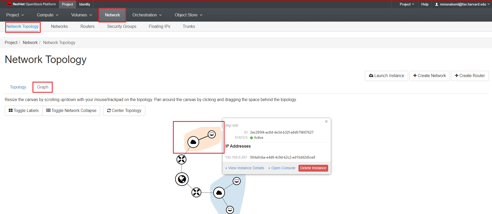
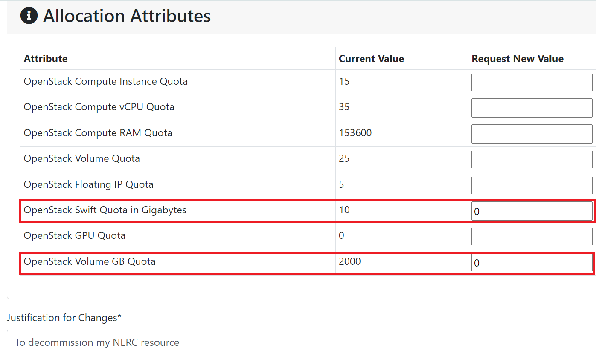

# Decommission Your NERC OpenStack Resources

You can decommission all of your NERC OpenStack resources sequentially as outlined
below.

## Prerequisite

- **Backup**: Back up any critical data or configurations stored on the resources
that going to be decommissioned. This ensures that important information is not
lost during the process. You can refer to [this guide](../data-transfer/data-transfer-from-to-vm.md)
to initiate and carry out data transfer to and from the virtual machine.

- **Shutdown Instances**: If applicable, [Shut Off any running instances](../management/vm-management.md#stopping-and-starting)
to ensure they are not actively processing data during decommissioning.

- Setup **OpenStack CLI**, see [OpenStack Command Line setup](../openstack-cli/openstack-CLI.md#command-line-setup)
for more information.

## Delete all VMs

For instructions on deleting instance(s), please refer to [this documentation](../management/vm-management.md#delete-instance).

## Delete volumes and snapshots

For instructions on deleting volume(s), please refer to [this documentation](../persistent-storage/delete-volumes.md).

To delete snapshot(s), if that snapshot is not used for any running instance.

Navigate to *Project -> Volumes -> Snapshots*.

!!! warn "Unable to Delete Snapshots"
    First delete all volumes and instances (and its attached volumes) that are
    created using the snapshot first, you will not be able to delete the volume
    snapshots.

## Delete all custom built Images and Instance Snapshot built Images

Navigate to *Project -> Compute -> Images*.

Select all of the custom built that have Visibility set as "Private" images to delete.

## Delete your all private Networks, Routers and Internal Interfaces on the Routers

To review all Network and its connectivities, you need to:

Navigate to *Project -> Network -> Network Topology*.

This will shows all view of current Network in your project in Graph or Topology
view. Make sure non instances are connected to your private network, which is
setup by following [this documentation](../advanced-openstack-topics/setting-up-a-network/set-up-a-private-network.md).
If there are any instances then [refer this](#delete-all-vms) to delete those VMs.

First, delete all other Routers used to create private networks, which is
setup by following [this documentation](../advanced-openstack-topics/setting-up-a-network/create-a-router.md)
except `default_router` from:

Navigate to *Project -> Network -> Routers*.

First, delete all other Routers used to create private networks except `default_network`
and `provider` then only you will be able to delete the Networks from:

Navigate to *Project -> Network -> Networks*.

!!! warn "Unable to Delete Networks"
    First delete all instances and then delete all routers then only you will be
    able to delete the associated private networks.

## Release all Floating IPs

Navigate to *Project -> Network -> Floating IPs*.

For instructions on releasing your allocated Floating IP back into the NERC floating
IP pool, please refer to [this documentation](../create-and-connect-to-the-VM/assign-a-floating-IP.md#release-a-floating-ip).

## Clean up all added Security Groups

First, delete all other security groups except `default` also make sure the `default`
security group does not have any extra rules. To view all Security Groups:

Navigate to *Project -> Network -> Security Groups*.

!!! warn "Unable to Delete Security Groups"
    First delete all instances and then only you will be able to delete the
    security groups. If a security group is attached to a VM, that security group
    will not be allowed to delete.

## Delete all of your stored Key Pairs

Navigate to *Project -> Compute -> Key Pairs*.

!!! warn "Unable to Delete Key Pairs"
    First delete all instances that are using the selected Key Pairs then only you
    will be to delete them.

## Delete all buckets and objects

For instructions on deleting bucket(s) along with all objects, please refer to
[this documentation](../persistent-storage/delete-volumes.md).

To delete snapshot(s), if that snapshot is not used for any running instance.

Navigate to *Project -> Object Store -> Containers*.

!!! warn "Unable to Delete Container with Objects inside"
    First delete all objects inside a Container first, then only you will be able
    to delete the container. Please make sure any critical objects data are already
    been remotely backed up before deleting them. You can also use openstack client
    to recursively delete the containers which has multi-level objects inside as
    [described here](../persistent-storage/object-storage.md#delete-the-container).
    So, you don't need to manually delete all objects inside a container prior
    deleting the container. This will save a lot of your time and effort.

## ColdFront to reduce the Storage Quota to Zero

Each allocation, whether requested or approved, will be billed based on the
**pay-as-you-go** model. The exception is for **Storage quotas**, where the cost
is determined by [your requested and approved allocation values](../../get-started/allocation/allocation-details.md#pi-and-manager-allocation-view-of-openstack-resource-allocation)
to reserve storage from the total NESE storage pool. For **NERC (OpenStack)**
Resource Allocations, storage quotas are specified by the "OpenStack Volume GB
Quota" and "OpenStack Swift Quota in Gigabytes" allocation attributes.

Even if you have deleted all volumes, snapshots, and object storage buckets and
objects in your OpenStack project. It is very essential to adjust the approved
values for your NERC (OpenStack) resource allocations to zero (0) otherwise you
still be incurring a charge for the approved storage as explained in
[Billing FAQs](../../get-started/cost-billing/billing-faqs.md).

To achieve this, you must submit a final change request to reduce the
**Storage Quotas** for "OpenStack Volume GB Quota" and "OpenStack Swift Quota in
Gigabytes" to zero (0) for your **NERC (OpenStack)** resource type. You can review
and manage these resource allocations by visiting the
[resource allocations](https://coldfront.mss.mghpcc.org/allocation/). Here, you
can filter the allocation of your interest and then proceed to request a
[change request](../../get-started/allocation/allocation-change-request.md#request-change-resource-allocation-attributes-for-openstack-project).

Please make sure your change request looks like this:

Wait until the requested resource allocation gets approved by the NERC's admin.

After approval, kindly review and verify that the quotas are accurately
reflected in your [resource allocation](https://coldfront.mss.mghpcc.org/allocation/)
and [OpenStack project](https://stack.nerc.mghpcc.org/). Please ensure that the
approved quota values are accurately displayed.

### Review your Block Storage(Volume/Cinder) Quota

Please confirm and verify that the `gigabytes` resource value that specifies total
space in [external volumes](../persistent-storage/volumes.md#volumes) is set to
a limit of zero (0) in correspondence with the approved "OpenStack Volume GB Quota"
of your allocation when running `openstack quota show` openstack client command
as shown below:

    openstack quota show
    +-----------------------+--------+
    | Resource              |  Limit |
    +-----------------------+--------+
    ...
    | gigabytes             |      0 |
    ...
    +-----------------------+--------+

### Review your Object Storage(Swift) Quota

To check the overall space used, you can use the following command

Also, please confirm and verify that the `Quota-Bytes` property value is set to
a limit of zero (0) in correspondence with the approved "OpenStack Swift Quota
in Gigabytes" of your allocation and also check the overall space used in `Bytes`
is one (1) along with no Containers and Objects, when running
`openstack object store account show` openstack client command as shown below:

    openstack object store account show
    +------------+---------------------------------------+
    | Field      | Value                                 |
    +------------+---------------------------------------+
    | Account    | AUTH_5e1cbcfe729a4c7e8fb2fd5328456eea |
    | Bytes      | 0                                     |
    | Containers | 0                                     |
    | Objects    | 0                                     |
    | properties | Quota-Bytes='1'                       |
    +------------+---------------------------------------+

### Review your Project Usage

Several commands are available to access project-level resource utilization details.
The `openstack limits show --absolute` command offers a comprehensive view of the
most crucial resources and also allows you to view your current resource consumption.

Multiple commands are at your disposal to access project resource utilization
details. The openstack limits show --absolute command offers a comprehensive
view of critical resources and allows you to assess your current resource consumption.

!!! danger "Very Important: Ensure No Resources that will be Billed are Used"
    Most importantly, ensure that there is no active usage for any of your
    currently allocated project resources.

The output may appear as follows, with all used resources having a value of zero
(0), except for `totalSecurityGroupsUsed`.

    openstack limits show --absolute
    +--------------------------+-------+
    | Name                     | Value |
    +--------------------------+-------+
    ...
    | totalRAMUsed             |     0 |
    | totalCoresUsed           |     0 |
    | totalInstancesUsed       |     0 |
    | totalFloatingIpsUsed     |     0 |
    | totalSecurityGroupsUsed  |     1 |
    | totalServerGroupsUsed    |     0 |
    ...
    | totalVolumesUsed         |     0 |
    | totalGigabytesUsed       |     0 |
    | totalSnapshotsUsed       |     0 |
    | totalBackupsUsed         |     0 |
    | totalBackupGigabytesUsed |     0 |
    +--------------------------+-------+

## Review your OpenStack Dashboard

After removing all OpenStack resources and updating the Storage Quotas to set them
to zero (0), you can review and verify that these changes are reflected in your
Horizon Dashboard Overview.

Navigate to *Project -> Compute -> Overview*.

## Finally, Archive your ColdFront Project

As a **PI**, you will be now able to **Archive** your ColdFront Project via
accessing [NERC's ColdFront interface](https://coldfront.mss.mghpcc.org/).
Please refer to [these intructions](../../get-started/allocation/archiving-a-project.md)
on how to archive your project that needs to be decommissioned.

---
