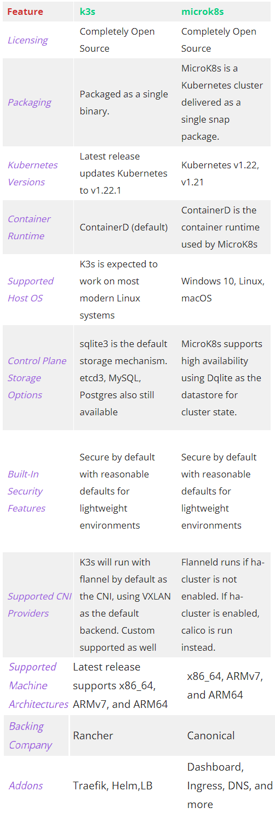

# Comparison

## Kubespray vs Kubeadm

[Kubeadm](https://github.com/kubernetes/kubeadm) provides domain Knowledge of
Kubernetes clusters' life cycle management, including self-hosted layouts,
dynamic discovery services and so on. Had it belonged to the new
[operators world](https://coreos.com/blog/introducing-operators.html), it may
have been named a "Kubernetes cluster operator". Kubespray however, does generic
configuration management tasks from the "OS operators" ansible world, plus some
initial K8s clustering (with networking plugins included) and control plane bootstrapping.

Kubespray has started using `kubeadm` internally for cluster creation since v2.3
in order to consume life cycle management domain knowledge from it and offload
generic OS configuration things from it, which hopefully benefits both sides.

---
