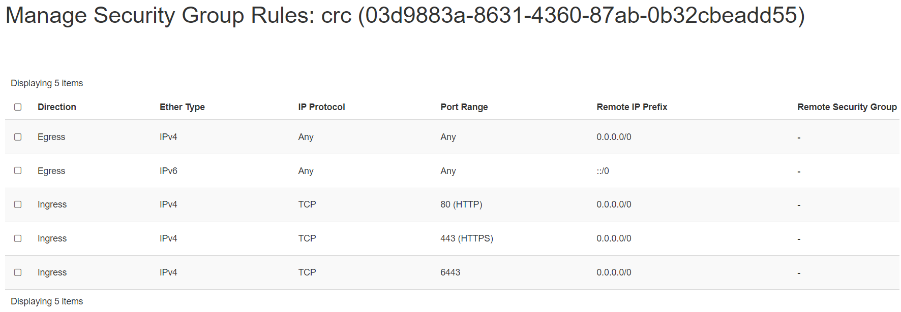

# CRC - Red Hat Code Ready Containers

Red Hat CodeReady Containers allows you to spin up a small Red Hat OpenShift cluster
on your local PC, without the need for a server, a cloud, or a team of operations
people. For developers who want to get started immediately with cloud-native
development, containers, and Kubernetes (as well as OpenShift), it's a simple and
slick tool. It runs on macOS, Linux, and all versions of Windows 10.

---

## Minimum system requirements for CRC

CodeReady Containers requires the following system resources:

4 virtual CPUs (vCPUs)
8 GB of memory
35 GB of storage space

## Pre-requisite

We will need 1 VM to create a single node kubernetes cluster using `crc`.
We are using following setting for this purpose:

- 1 Linux machine, fedora-34-x86_64, c2.s2.xlarge flavor with 16vCPUs,
32GB RAM, 50GB storage - also [assign Floating IP](../../create-and-connect-to-the-VM/assign-a-floating-IP.md)
 to this VM.

## Prepare host for CRC

Run the below command on the CRC's VM:

- SSH into **crc** machine

!!!note "Important Note"
    Please run the following commands not using `root` user.

On newly built VM download CRC using your redhat login, from:
`https://console.redhat.com/openshift/create/local`

To save transfer hassle you can, curl CRC bundle directly to the VM, using the
url from a **"Download CodeReady Containers"** button in redhat console.

```sh
curl \
https://developers.redhat.com/content-gateway/rest/mirror/pub/openshift-v4/\
clients/crc/latest/crc-linux-amd64.tar.xz \
--output crc-linux-amd64.tar.xz -L
```

then click **"Copy pull secret"** button from the same console page and save it
to a file somewhere (for example ~fedora/pull-secret)

- Setup crc binary to be accessable

```sh
tar -xvf crc-linux-amd64.tar.xz
mkdir -p ~/bin
mv crc-linux-1.33.1-amd64/crc ~/bin/
export PATH=$PATH:$HOME/bin
echo 'export PATH=$PATH:$HOME/bin' >> ~/.bashrc
```

## Install and configure CRC

- Run the install (you can choose to answer *N* for collecing data by RedHat when
prompted on terminal). Also, CRC has trouble starting with default resources
allocated to it, that is why additional steps need to be taken allocationg
addtional memory to it. Additional cores added as well, but this may not be as
critical to it's performance.

```sh
crc setup
crc config set memory 24576
crc config set cpus 12
```

- Paste crc secret copied during previous prep step when prompted for
"? Please enter the pull secret" by `crc start` terminal.

```sh
crc start
```

- Make a note of user login info displayed once install is finished. Output would
like below:

```sh
Started the OpenShift cluster.

The server is accessible via web console at:
  https://console-openshift-console.apps-crc.testing

Log in as administrator:
  Username: kubeadmin
  Password: ... #pragma: allowlist secret

Log in as user:
  Username: developer
  Password: ... #pragma: allowlist secret

Use the 'oc' command line interface:
  $ eval $(crc oc-env)
  $ oc login -u developer https://api.crc.testing:6443
```

## Using CRC CLI

- Setup your environment

```sh
eval $(crc oc-env)
```

- To look up CRC login credentials you can run. This will provide the `oc login`
commands with password info for both `admin` and `developer` users.

```sh
crc console --credentials

To login as a regular user, run 'oc login -u developer -p developer https://api.crc.testing:6443'.
To login as an admin, run 'oc login -u kubeadmin -p MTNAK-YHvuU-FIuSt-qgAxd https://api.crc.testing:6443'
```

## Using CRC web interface

### Install and configure **HAPROXY** first

- Install the package

```sh
sudo dnf install haproxy policycoreutils-python-utils
```

- Update configuration

```sh
cd /etc/haproxy
sudo cp haproxy.cfg haproxy.cfg.orig
```

- Clean the content of `/etc/haproxy/haproxy.cfg`:

```sh
sudo echo > /etc/haproxy/haproxy.cfg
```

- Replace `/etc/haproxy/haproxy.cfg` with

```sh
cat <<EOF | sudo tee /etc/haproxy/haproxy.cfg
global

defaults
log global
mode http
timeout connect 0
timeout client 0
timeout server 0

frontend apps
bind SERVER_IP:80
bind SERVER_IP:443
option tcplog
mode tcp
default_backend apps

backend apps
mode tcp
balance roundrobin
option ssl-hello-chk
server webserver1 CRC_IP:443 check

frontend api
bind SERVER_IP:6443
option tcplog
mode tcp
default_backend api

backend api
mode tcp
balance roundrobin
option ssl-hello-chk
server webserver1 CRC_IP:6443 check
EOF
```

- Plugin your servers and `crc ip` addresses

!!!note "Note"
    - To check the internal IP, run the `crc ip` command.

```sh
# this may be different depending on your setup
export SERVER_IP=$(hostname --ip-address |cut -d\  -f3)
export CRC_IP=$(crc ip)
sudo sed -i "s/SERVER_IP/$SERVER_IP/g" /etc/haproxy/haproxy.cfg
sudo sed -i "s/CRC_IP/$CRC_IP/g" haproxy.cfg
sudo semanage port -a -t http_port_t -p tcp 6443
```

- Start haproxy

```sh
sudo systemctl start haproxy
sudo systemctl status haproxy
```

Ensure haproxy is in running status.

### Configure your local workstation to resolve CRC addresses

Add security groups for your CRC instance to open ports 80, 443 and 6443.
In our example setup, the Security Group Rules that are attached to a new Security
Rule to the CRC instance has entries like this:



Configure your local workstations host lookup to resolve names associated with
CRC to the Public IP i.e. Floating IP address of your openstack VM instance.

This can be done in several ways:

1) RH document [2] describes a dnsmasq configuration.

2) A simpler path for **Linux** and **Mac** users is just to create an entry in your
`/etc/hosts` file or for **Windows** users find it at `C:\Windows\System32\Drivers\etc\hosts`.

Associate your CRC servers public ip retrieved from Horizon with hostnames:

- api.crc.testing
- canary-openshift-ingress-canary.apps-crc.testing
- console-openshift-console.apps-crc.testing
- default-route-openshift-image-registry.apps-crc.testing
- downloads-openshift-console.apps-crc.testing
- oauth-openshift.apps-crc.testing apps-crc.testing

For example, using #2 by adding an entry in your `/etc/hosts` file in your local
machine.

Your local machine's `/etc/hosts` may have an entry looks like this:

```sh
<Your CRC Instance's Floating IP> api.crc.testing canary-openshift-ingress-canary.apps-crc.testing
 console-openshift-console.apps-crc.testing default-route-openshift-image-registry.apps-crc.testing
 downloads-openshift-console.apps-crc.testing oauth-openshift.apps-crc.testing apps-crc.testing
```

Use what's appropriate to your environment, ask for help if unsure.

Point your browser `https://console-openshift-console.apps-crc.testing` and log in
using crednetials provided by the output of `crc start` or `crc console --credentials`
command.

### References

[1] [Getting Started CRC](https://access.redhat.com/documentation/en-us/red_hat_codeready_containers/1.30/html/getting_started_guide/index)

[2] [Accessing CRC on a remote server](https://cloud.redhat.com/blog/accessing-codeready-containers-on-a-remote-server/)
