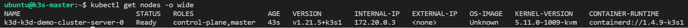

# Setup K3s cluster Using [k3d](https://k3d.io/v4.4.8/)

One of the most popular and second method of creating k3s cluster is by using `k3d`.
By the name itself it suggests, `K3s-in-docker`, is a wrapper around K3s – Lightweight
Kubernetes that runs it in docker. Please refer to [this link](https://collabnix.com/top-10-kubernetes-tool-you-need-for-2021-part-2/)
to get brief insights of this wonderful tool. It provides a seamless experience
working with K3s cluster management with some straight forward commands. k3d is
efficient enough to create and manage K3s single node and well as K3s High
Availability clusters just with few commands.

!!!note: "Note"
    For using `k3d` you must have **docker** installed in your system

- k3d Installation:
The below command will install the k3d, in your system using the installation script.

```sh
wget -q -O - https://raw.githubusercontent.com/rancher/k3d/main/install.sh | bash
```

To verify the installation, please run the following command:

```sh
k3d version

k3d version v5.0.0
k3s version v1.21.5-k3s1 (default)
```

After the successful installation, you are ready to create your cluster using k3d
and run K3s in docker within seconds.

- Getting Started:
Now let's directly jump into creating our K3s cluster using `k3d`.

1. Create k3d Cluster:

    ```sh
    k3d cluster create k3d-demo-cluster
    ```

    This single command spawns a K3s cluster with two containers: A Kubernetes
    **control-plane node(server)** and a **load balancer(serverlb)** in front of
    it. It puts both of them in a dedicated Docker network and exposes the Kubernetes
    API on a randomly chosen free port on the Docker host. It also creates a named
    Docker volume in the background as a preparation for image imports.

    You can also look for advance syntax for cluster creation:

    ```sh
    k3d cluster create mycluster --api-port 127.0.0.1:6445 --servers 3 \
        --agents 2 --volume '/home/me/mycode:/code@agent[*]' --port '8080:80@loadbalancer'
    ```

    Here, the above single command spawns a K3s cluster with six containers:

    i. load balancer
    ii. servers (control-plane nodes)
    iii. agents (formerly worker nodes)
    With the `--api-port 127.0.0.1:6445`, you tell k3d to map the Kubernetes API
    Port (6443 internally) to `127.0.0.1/localhost`’s port **6445**. That means
    that you will have this connection string in your Kubeconfig:
    `server: https://127.0.0.1:6445` to connect to this cluster.

    This port will be mapped from the load balancer to your host system. From there,
    requests will be proxied to your server nodes, effectively simulating a production
    setup, where server nodes also can go down and you would want to failover to
    another server.

    The `--volume /home/me/mycode:/code@agent[*]` bind mounts your local directory
    `/home/me/mycode` to the path `/code` inside all (`[*]` of your agent nodes).
    Replace * with an index (here: 0 or 1) to only mount it into one of them.

    The specification telling k3d which nodes it should mount the volume to is called
    “node filter” and it’s also used for other flags, like the `--port` flag for
    port mappings.

    That said, `--port '8080:80@loadbalancer'` maps your local host’s port 8080 to
    port 80 on the load balancer (serverlb), which can be used to forward HTTP
    ingress traffic to your cluster. For example, you can now deploy a web app into
    the cluster (Deployment), which is exposed (Service) externally via an Ingress
    such as `myapp.k3d.localhost`.

    Then (provided that everything is set up to resolve that domain to your local
    host IP), you can point your browser to `http://myapp.k3d.localhost:8080` to
    access your app. Traffic then flows from your host through the Docker bridge
    interface to the load balancer. From there, it’s proxied to the cluster, where
    it passes via Ingress and Service to your application Pod.

    !!!note: "Note"
        You have to have some mechanism set up to route to resolve `myapp.k3d.localhost`
        to your local host IP (`127.0.0.1`). The most common way is using entries
        of the form `127.0.0.1` `myapp.k3d.localhost` in your `/etc/hosts` file
        (`C:\Windows\System32\drivers\etc\hosts` on Windows). However, this does
        not allow for wildcard entries (`*.localhost`), so it may become a bit
        cumbersome after a while, so you may want to have a look at tools like
        `dnsmasq` (MacOS/UNIX) or `Acrylic` (Windows)  to ease the burden.

2. Switch context to newly created cluster:

    ```sh
    kubectl config use-context k3d-k3d-demo-cluster
    ```

3. Checking the nodes running on k3d cluster:

    ```sh
    k3d node list

    NAME                            ROLE           CLUSTER            STATUS
    k3d-k3d-demo-cluster-server-0   server         k3d-demo-cluster   running
    k3d-k3d-demo-cluster-serverlb   loadbalancer   k3d-demo-cluster   running
    ```

    You can see here two nodes. The (very) smart implementation here is that while
    the cluster is running on its node **k3d-k3s-default-server-0**, there is
    another “node” that acts as the load balancer i.e. **k3d-k3d-demo-cluster-serverlb**.

4. Firing **Kubectl** commands that allows you to run commands against Kubernetes:

    i. The below command will list down the nodes available in our cluster:

    ```sh
    kubectl get nodes -o wide
    ```

    **OR,**

    ```sh
    kubectl get nodes --output wide
    ```

    The output will looks like:
    

    ii. To look at what’s inside the K3s cluster (pods, services, deployments,
    etc.):

    ```sh
    kubectl get all --all-namespaces
    ```

    The output will looks like:
    

    We can see that, in addition of the Kubernetes service, K3s deploys DNS,
    metrics and ingress (traefik) services when we use the defaults.

    iii. List the active k3d clusters:

    ```sh
    k3d cluster list

    NAME               SERVERS   AGENTS   LOADBALANCER
    k3d-demo-cluster   1/1       0/0      true
    ```

    iv. Check the cluster connectivity:

    ```sh
    kubectl cluster-info

    Kubernetes control plane is running at https://0.0.0.0:44921
    CoreDNS is running at https://0.0.0.0:44921/api/v1/namespaces/kube-system/services/kube-dns:dns/proxy
    Metrics-server is running at https://0.0.0.0:44921/api/v1/namespaces/kube-system/services/https:metrics-server:/proxy

    To further debug and diagnose cluster problems, use 'kubectl cluster-info dump'.
    ```

5. Check the active containers:

```sh
docker ps
```

Now as you can observe, the cluster is up and running and we can play around the
cluster, you can create and deploy your applications over the cluster.

- Deleting Cluster:

```sh
k3d cluster delete k3d-demo-cluster

INFO[0000] Deleting cluster 'k3d-demo-cluster'
INFO[0000] Deleted k3d-k3d-demo-cluster-serverlb        
INFO[0001] Deleted k3d-k3d-demo-cluster-server-0        
INFO[0001] Deleting cluster network 'k3d-k3d-demo-cluster'
INFO[0001] Deleting image volume 'k3d-k3d-demo-cluster-images' 
INFO[0001] Removing cluster details from default kubeconfig... 
INFO[0001] Removing standalone kubeconfig file (if there is one)...
INFO[0001] Successfully deleted cluster k3d-demo-cluster!
```

You can also create a [k3d High Availability cluster](k3s-ha-cluster-using-k3d.md)
and add as many nodes you want within seconds.

---
