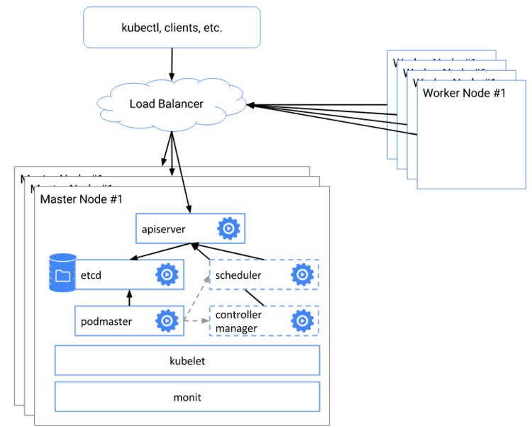

# Highly Available Kubernetes Cluster using kubeadm

## Objectives
- Install a multi control-plane(master) Kubernetes cluster
- Install a Pod network on the cluster so that your Pods can talk to each other

## Components and architecure



## Pre-requisite
You will need 2 control-plane(master node) and 2 worker nodes to create a multi-master kubernetes cluster using `kubeadm`. You are going to use the following set up for this purpose:

* 2 Linux machines for master, ubuntu-21.04-x86_64, m1.medium flavor with 2vCPU, 4GB RAM, 10GB storage
* 2 Linux machines for worker, ubuntu-21.04-x86_64, m1.small flavor with 1vCPU, 2GB RAM, 10GB storage - also assign Flaoting IPs to both of the worker nodes.
* 1 Linux machine for loadbalancer, ubuntu-21.04-x86_64, m1.small flavor with 1vCPU, 2GB RAM, 10GB storage
* ssh access to all machines: [Read more here](../../create-and-connect-to-the-VM/bastion-host-based-ssh/index.md) on how to setup SSH to your remote VMs.
* Create 2 security groups with appropriate [ports and protocols](https://kubernetes.io/docs/reference/ports-and-protocols/):
    i. To be used by the master nodes:
    
    
    ii. To be used by the worker nodes:
    
* setup Unique hostname to each machine using the following command:

    ```
    echo "<node_internal_IP> <host_name>" >> /etc/hosts
    hostnamectl set-hostname <host_name>
    ```
    
    For example,
    
    ```
    echo "192.168.0.167 loadbalancer" >> /etc/hosts
    hostnamectl set-hostname loadbalancer
    ```

## Steps
1. Prepare the Loadbalancer node to communicate with the two master nodes' apiservers on their IPs via port 6443.
2. Do following in all the nodes except the Loadbalancer node:
    - Disable swap.    
    - Install `kubelet` and `kubeadm`.
    - Install container runtime - you will be using *`Docker`*.
3. Initiate `kubeadm` control plane configuration on one of the master nodes.
4. Save the new master and worker node join commands with the token.
5. Join the second master node to the control plane using the join command.
6. Join the worker nodes to the control plane using the join command.
7. Configure kubeconfig(`$HOME/.kube/config`) on loadbalancer node.
8. Install `kubectl` on Loadbalancer node.
9. Install CNI network plugin i.e. **Flannel** on Loadbalancer node.
10. Validate all cluster components and nodes are visible on Loadbalancer node.
11. Deploy a sample app and validate the app from Loadbalancer node.

---

## Setting up loadbalancer
You will use **HAPROXY** as the primary loadbalancer, but you can use any other options as well. This node will be not part of the K8s cluster but will be outside of the cluster and interacts with the cluster using ports. 

You have 2 master nodes. Which means the user can connect to either of the 2 apiservers. The loadbalancer will be used to loadbalance between the 2 apiservers.

* Login to the loadbalancer node 

* Switch as root - `sudo su` 

* Update your repository and your system 

```
sudo apt-get update && sudo apt-get upgrade -y

```

* Install haproxy

```
sudo apt-get install haproxy -y
```

* Edit haproxy configuration 

```
vi /etc/haproxy/haproxy.cfg
```

Add the below lines to create a frontend configuration for loadbalancer - 

```
frontend fe-apiserver
   bind 0.0.0.0:6443
   mode tcp
   option tcplog
   default_backend be-apiserver
```

Add the below lines to create a backend configuration for master1 and master2 nodes at port **6443**. 

!!!note "Note"
    6443 is the default port of **kube-apiserver**

```
backend be-apiserver
   mode tcp
   option tcplog
   option tcp-check
   balance roundrobin
   default-server inter 10s downinter 5s rise 2 fall 2 slowstart 60s maxconn 250 maxqueue 256 weight 100

       server master1 10.138.0.15:6443 check
       server master2 10.138.0.16:6443 check
```

Here - **master1** and **master2** are the hostnames of the master nodes and **10.138.0.15** and **10.138.0.16** are the corresponding internal IP addresses.

* Restart and Verify haproxy

```
systemctl restart haproxy
systemctl status haproxy
```

Ensure haproxy is in running status. 

Run `nc` command as below:

```
nc -v localhost 6443
Connection to localhost 6443 port [tcp/*] succeeded!
```
!!!note "Note"
    If you see failures for `master1` and `master2` connectivity, you can ignore them for time being as you have not yet installed anything on the servers.

---

## Install kubeadm, kubelet and docker on master and worker nodes

In this step, you will install kubelet and kubeadm on the below nodes 

* master1
* master2
* worker1
* worker2 

The below steps will be performed on all the above mentioned nodes:
* SSH into all the 4 machines

* Switch as root: `sudo su` 

* Update the repositories and packages: 

```
apt-get update && apt-get upgrade -y
```

* Turn off `swap`

```
swapoff -a
sed -i '/ swap / s/^/#/' /etc/fstab
```

* Install `curl` and `apt-transport-https`

```
apt-get update && apt-get install -y apt-transport-https curl
```

* Download the Google Cloud public signing key and add key to verify releases

```
curl -s https://packages.cloud.google.com/apt/doc/apt-key.gpg | apt-key add -
```

* add kubernetes apt repo

```
cat <<EOF | sudo tee /etc/apt/sources.list.d/kubernetes.list
deb https://apt.kubernetes.io/ kubernetes-xenial main
EOF
```

* Install kubelet and kubeadm

```
apt-get update
apt-get install -y kubelet kubeadm
```

* `apt-mark hold` is used so that these packages will not be updated/removed automatically

```
apt-mark hold kubelet kubeadm 
```

* Install container runtime - **docker**

```
sudo apt-get install docker.io -y
```

* Configure the Docker daemon, in particular to use systemd for the management of the container’s cgroups

```
cat <<EOF | sudo tee /etc/docker/daemon.json 
{ 
"exec-opts": ["native.cgroupdriver=systemd"] 
} 
EOF

systemctl enable --now docker
usermod -aG docker ubuntu
systemctl restart docker
```

* Ensure net.bridge.bridge-nf-call-iptables is set to 1 in your sysctl config

For more [Read this](https://kubernetes.io/docs/setup/production-environment/tools/kubeadm/install-kubeadm/#letting-iptables-see-bridged-traffic)

```
sysctl net.bridge.bridge-nf-call-iptables=1
```

---

## Configure kubeadm to bootstrap the cluster

You will start off by initializing only one master node. For this purpose, you choose `master1` to initialize our first control plane but you can also do the same in `master2`.

* SSH into **master1** machine 
* Switch to root user: `sudo su` 
* Execute the below command to initialize the cluster:

```
kubeadm init --control-plane-endpoint "LOAD_BALANCER_IP_OR_HOSTNAME:LOAD_BALANCER_PORT" --upload-certs --pod-network-cidr=10.244.0.0/16 
```

Here, you can use either the IP address or the hostname of the loadbalancer in place of <LOAD_BALANCER_IP_OR_HOSTNAME>. You have not enabled the hostname of the server, i.e. `loadbalancer` as the LOAD_BALANCER_IP_OR_HOSTNAME that is visible from the **master1** node. so instead of using not resolvable hostnames across your network, you will be using the IP address of the Loadbalancer server.

The <LOAD_BALANCER_PORT> is the front end configuration port defined in HAPROXY configuration. For this, you have kept the port as **6443** which is the default `apiserver` port.

!!!note "Important Note"
    `--pod-network-cidr` value depends upon what CNI plugin you going to use so need to be very careful while setting this CIDR values. In our case, you are going to use **Flannel** CNI network plugin so you will use: `--pod-network-cidr=10.244.0.0/16`. If you are opted to use **Calico** CNI network plugin then you need to use: `--pod-network-cidr=192.168.0.0/16` and if you are opted to use **Weave Net** no need to pass this parameter.

For example, our `Flannel` CNI network plugin based kubeadm init command with *loadbalancer node* with internal IP: `192.168.0.167` look like below:

```
kubeadm init --control-plane-endpoint "192.168.0.167:6443" --upload-certs --pod-network-cidr=10.244.0.0/16
```
Save the output in some secure file for future use. The output from `kubeadm init` should looks like below:

```
Your Kubernetes control-plane has initialized successfully!

To start using your cluster, you need to run the following as a regular user:

  mkdir -p $HOME/.kube
  sudo cp -i /etc/kubernetes/admin.conf $HOME/.kube/config
  sudo chown $(id -u):$(id -g) $HOME/.kube/config

Alternatively, if you are the root user, you can run:

  export KUBECONFIG=/etc/kubernetes/admin.conf

You should now deploy a pod network to the cluster.
Run "kubectl apply -f [podnetwork].yaml" with one of the options listed at:
  https://kubernetes.io/docs/concepts/cluster-administration/addons/

You can now join any number of the control-plane node running the following command on each as root:

  kubeadm join 192.168.0.167:6443 --token cnslau.kd5fjt96jeuzymzb \
    --discovery-token-ca-cert-hash sha256:871ab3f050bc9790c977daee9e44cf52e15ee37ab9834567333b939458a5bfb5 \
    --control-plane --certificate-key 824d9a0e173a810416b4bca7038fb33b616108c17abcbc5eaef8651f11e3d146

Please note that the certificate-key gives access to cluster sensitive data, keep it secret!
As a safeguard, uploaded-certs will be deleted in two hours; If necessary, you can use 
"kubeadm init phase upload-certs --upload-certs" to reload certs afterward.

Then you can join any number of worker nodes by running the following on each as root:

kubeadm join 192.168.0.167:6443 --token cnslau.kd5fjt96jeuzymzb \
    --discovery-token-ca-cert-hash sha256:871ab3f050bc9790c977daee9e44cf52e15ee37ab9834567333b939458a5bfb5 
```

The output consists of 3 major tasks:

1. Setup `kubeconfig` using on current master node:
As you are running as `root` user so you need to run the following command:

```
  export KUBECONFIG=\etc\kubernetes\admin.conf
```

2. Setup a new control plane (master) i.e. `master2` by running following command on **master2** node:

```
  kubeadm join 192.168.0.167:6443 --token cnslau.kd5fjt96jeuzymzb \
    --discovery-token-ca-cert-hash sha256:871ab3f050bc9790c977daee9e44cf52e15ee37ab9834567333b939458a5bfb5 \
    --control-plane --certificate-key 824d9a0e173a810416b4bca7038fb33b616108c17abcbc5eaef8651f11e3d146

```

3. Join worker nodes running following command on individual workder nodes: 

```
kubeadm join 192.168.0.167:6443 --token cnslau.kd5fjt96jeuzymzb \
    --discovery-token-ca-cert-hash sha256:871ab3f050bc9790c977daee9e44cf52e15ee37ab9834567333b939458a5bfb5 
```

!!!note "Important Note"
    **Your output will be different than what is provided here. While performing the rest of the demo, ensure that you are executing the command provided by your output and dont copy and paste from here.**
---

* SSH into `master2` 
* Switch to root user:`sudo su` 
* Check the command provided by the output of `master1`:

You can now use the below command to add another control-plane node(master) to the control plane:

```
kubeadm join 192.168.0.167:6443 --token cnslau.kd5fjt96jeuzymzb \
    --discovery-token-ca-cert-hash sha256:871ab3f050bc9790c977daee9e44cf52e15ee37ab9834567333b939458a5bfb5 \
    --control-plane --certificate-key 824d9a0e173a810416b4bca7038fb33b616108c17abcbc5eaef8651f11e3d146

```

* Execute the kubeadm join command for control plane on `master2`

Your output should look like: 

```
 This node has joined the cluster and a new control plane instance was created:

* Certificate signing request was sent to apiserver and approval was received.
* The Kubelet was informed of the new secure connection details.
* Control plane (master) label and taint were applied to the new node.
* The Kubernetes control plane instances scaled up.
* A new etcd member was added to the local/stacked etcd cluster.

```

Now that you have initialized both the masters - you can now work on bootstrapping the worker nodes. 

* SSH into **worker1** and **worker2**
* Switch to root user on both the machines: `sudo su` 
* Check the output given by the init command on **master1** to join worker node: 

```
kubeadm join 192.168.0.167:6443 --token cnslau.kd5fjt96jeuzymzb \
    --discovery-token-ca-cert-hash sha256:871ab3f050bc9790c977daee9e44cf52e15ee37ab9834567333b939458a5bfb5 
```

* Execute the above command on both the nodes:

* Your output should look like:

```
This node has joined the cluster:
* Certificate signing request was sent to apiserver and a response was received.
* The Kubelet was informed of the new secure connection details.

```

---

## Configure kubeconfig on loadbalancer node
Now that you have configured the master and the worker nodes, its now time to configure Kubeconfig (`.kube`) on the loadbalancer node. It is completely up to you if you want to use the loadbalancer node to setup kubeconfig. kubeconfig can also be setup externally on a separate machine which has access to loadbalancer node. For the purpose of this demo you will use loadbalancer node to host kubeconfig and `kubectl`.

* SSH into `loadbalancer` node
* Switch to root user: `sudo su` 
* Create a directory: .kube at $HOME of root user

```
mkdir -p $HOME/.kube
```

* SCP configuration file from any one **master** node to **loadbalancer** node 

``` 
scp master1:/etc/kubernetes/admin.conf $HOME/.kube/config

```

!!!note "Important Note"
    If you havent setup ssh connection between master node and loadbalancer, you can manually copy content of the file `/etc/kubernetes/admin.conf` from `master1` node and then past it to `$HOME/.kube/config` file on the loadbalancer node. Ensure that the kubeconfig file path is **`$HOME/.kube/config`** on the loadbalancer node.

* Provide appropriate ownership to the copied file 

```
chown $(id -u):$(id -g) $HOME/.kube/config
```

* Install kubectl binary 

```
snap install kubectl --classic
```

* Verify the cluster 

```
kubectl get nodes 

NAME      STATUS     ROLES    AGE     VERSION
master1   Ready      master   21m     v1.16.2
master2   Ready      master   15m     v1.16.2
worker1   Ready      <none>   9m17s   v1.16.2
worker2   Ready      <none>   9m25s   v1.16.2

```

---

## Install CNI network plugin

### CNI overview:
Managing a network where containers can interoperate efficiently is very important. Kubernetes has adopted the Container Network Interface(CNI) specification for managing network resources on a cluster. This relatively simple specification makes it easy for Kubernetes to interact with a wide range of CNI-based software solutions. Using this CNI plugin allows Kubernetes pods to have the same IP address inside the pod as they do on the VPC network. Make sure the configuration corresponds to the Pod CIDR specified in the `kubeadm` configuration file if applicable.

You must deploy a CNI based Pod network add-on so that your Pods can communicate with each other. Cluster DNS (CoreDNS) will not start up before a network is installed. To verify you can run this command: `kubectl get po -n kube-system`:

You should see the following output. You will see the two `coredns-*` pods in a pending state. It is the expected behavior. Once we install the network plugin, it will be in a Running state.

Output Example:

```
ubuntu@loadbalancer:~$ sudo kubectl get po -n kube-system
 NAME                               READY  STATUS   RESTARTS  AGE
coredns-558bd4d5db-5jktc             0/1   Pending   0        10m
coredns-558bd4d5db-xdc5x             0/1   Pending   0        10m
etcd-master1                         1/1   Running   0        11m
kube-apiserver-master1               1/1   Running   0        11m
kube-controller-manager-master1      1/1   Running   0        11m
kube-proxy-5jfh5                     1/1   Running   0        10m
kube-scheduler-master1               1/1   Running   0        11m
```

### Supported CNI options
To read more about the currently supported base CNI solutions for Kubernetes [read here](https://kubernetes.io/docs/concepts/cluster-administration/networking/) and also [read this](https://kubernetes.io/docs/setup/production-environment/tools/kubeadm/create-cluster-kubeadm/#pod-network)

The below command can be run on the Loadbalancer node to install the CNI plugin:

```
kubectl apply -f https://github.com/coreos/flannel/raw/master/Documentation/kube-flannel.yml
```
As you had passed `--pod-network-cidr=10.244.0.0/16` with `kubeadm init` so this should work for **Flannel** CNI.

!!! tip "Using Other CNI Options"

    For **Calico** CNI plugin to work correctly, you **don't** need to pass `--pod-network-cidr=192.168.0.0/16` with `kubeadm init`.

    ```
    kubectl apply -f https://docs.projectcalico.org/v3.8/manifests/calico.yaml
    ```

    For **Weave Net** CNI plugin to work correctly, you **don't** need to pass `--pod-network-cidr` with `kubeadm init`.
    ```
    kubectl apply -f "https://cloud.weave.works/k8s/net?k8s-version=$(kubectl version | base64 | tr -d '\n')"
    ```

Once you successfully installed the **Flannel** CNI component to your cluster. You can now verify your HA cluster running:

```
kubectl get nodes 

NAME      STATUS   ROLES    AGE   VERSION
master1   Ready    master   22m   v1.16.2
master2   Ready    master   17m   v1.16.2
worker1   Ready    <none>   10m   v1.16.2
worker2   Ready    <none>   10m   v1.16.2

```

---
### Deploy A Sample Nginx Application

Now that we have all the components to make the cluster and applications work, let’s deploy a sample Nginx application and see if we can access it over a [NodePort](https://kubernetes.io/docs/concepts/services-networking/service/#nodeport) that has port range of *30000-32767*.

The below command can be run on:

```
kubectl run nginx --image=nginx --port=80 
kubectl expose pod nginx --port=80 --type=NodePort
```

To check which NodePort is opened and running the Nginx run:

```
kubectl get svc
```

The output will show:


Once the deployment is up, you should be able to access the Nginx home page on the allocated NodePort from either of the worker nodes' Floating IP. 

Go to browser, visit http://<Worker-Floating-IP>:<NodePort> i.e. http://128.31.25.246:32713 to check the nginx default page.

For your example,


---
