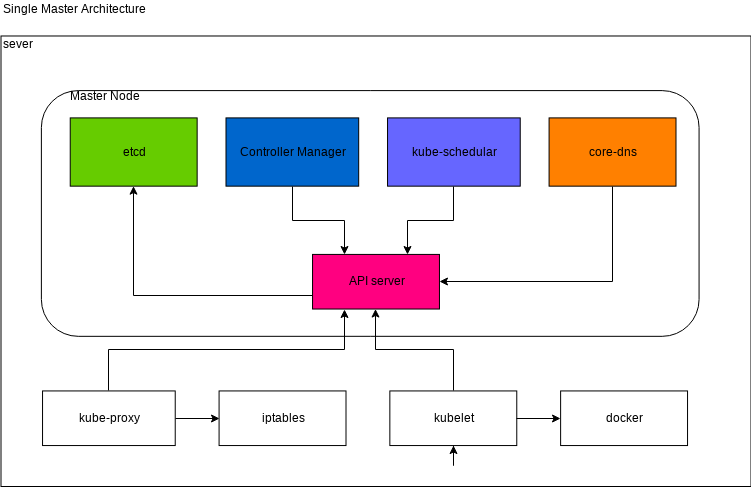
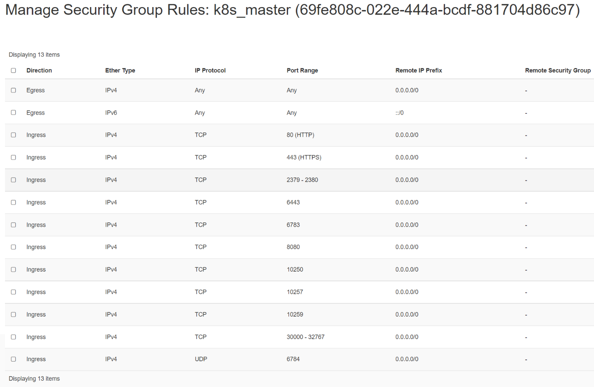
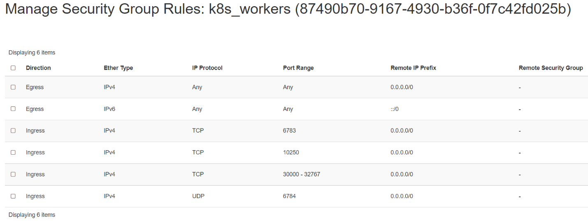
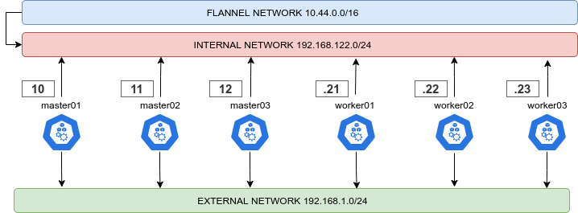
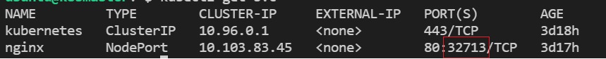
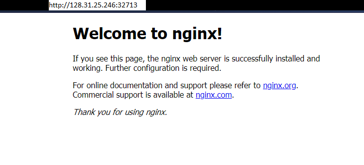
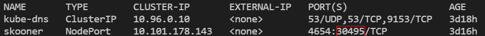
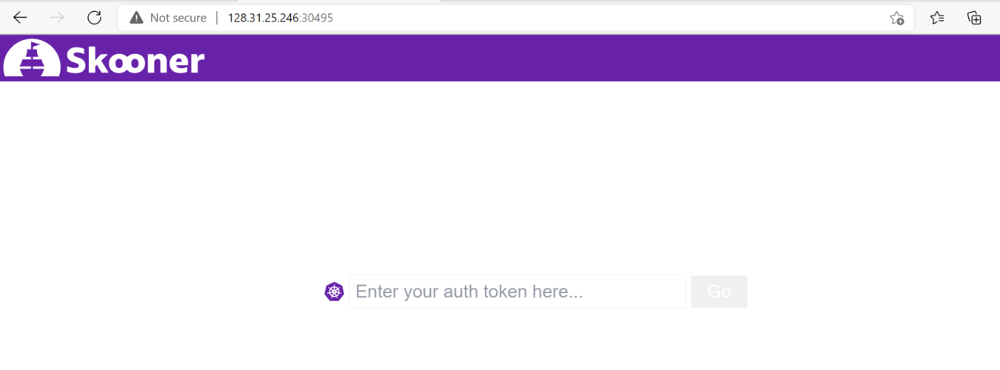

# Creating a Single Master cluster with kubeadm

## Objectives

- Install a single control-plane(master) Kubernetes cluster
- Install a Pod network on the cluster so that your Pods can talk to each other
- Deploy and test a sample app
- Deploy K8s Dashboard to view all cluster's components

## Components and architecure



You can learn about each component from [Kubernetes Componets](https://kubernetes.io/docs/concepts/overview/components/).

## Pre-requisite

We will need 1 control-plane(master) and 2 worker node to create a single
control-plane kubernetes cluster using `kubeadm`. We are using following setting
for this purpose:

- 1 Linux machine for master, ubuntu-21.04-x86_64, m1.medium flavor with 2vCPU,
4GB RAM, 10GB storage - also [assign Floating IP](../../create-and-connect-to-the-VM/assign-a-floating-IP.md)
 to the master node.
- 2 Linux machines for worker, ubuntu-21.04-x86_64, m1.small flavor with 1vCPU,
 2GB RAM, 10GB storage.
- ssh access to all machines: [Read more here](../../create-and-connect-to-the-VM/bastion-host-based-ssh/index.md)
on how to setup SSH to your remote VMs.
- Create 2 security groups with appropriate [ports and protocols](https://kubernetes.io/docs/reference/ports-and-protocols/):

    i. To be used by the master nodes:
    

    ii. To be used by the worker nodes:
    
- setup Unique hostname to each machine using the following command:

```sh
echo "<node_internal_IP> <host_name>" >> /etc/hosts
hostnamectl set-hostname <host_name>
```

For example,

```sh
echo "192.168.0.167 master" >> /etc/hosts
hostnamectl set-hostname master
```

## Steps

1. Disable swap on all nodes.
2. Install `kubeadm`, `kubelet`, and `kubectl` on all the nodes.
3. Install container runtime on all nodes- you will be using *`Docker`*.
4. Initiate `kubeadm` control plane configuration on the master node.
5. Save the worker node join command with the token.
6. Install CNI network plugin i.e. **Flannel** on master node.
7. Join the worker node to the master node (control plane) using the join command.
8. Validate all cluster components and nodes are visible on master node.
9. Deploy a sample app and validate the app from master node.

## Install kubeadm, kubelet and docker on master and worker nodes

`kubeadm` will not install or manage `kubelet` or `kubectl` for you, so you will
need to ensure they match the version of the Kubernetes control plane you want kubeadm
to install for you.  You will install these packages on all of your machines:

• **kubeadm**: the command to bootstrap the cluster.

• **kubelet**: the component that runs on all of the machines in your cluster and
does things like starting pods and containers.

• **kubectl**: the command line util to talk to your cluster.

In this step, you will install kubelet and kubeadm on the below nodes

- master
- worker1
- worker2

The below steps will be performed on all the above mentioned nodes:

- SSH into all the 3 machines

- Switch as root: `sudo su`

- Update the repositories and packages:

```sh
apt-get update && apt-get upgrade -y
```

- Turn off `swap`

```sh
swapoff -a
sed -i '/ swap / s/^/#/' /etc/fstab
```

- Install `curl` and `apt-transport-https`

```sh
apt-get update && apt-get install -y apt-transport-https curl
```

- Download the Google Cloud public signing key and add key to verify releases

```sh
curl -s https://packages.cloud.google.com/apt/doc/apt-key.gpg | apt-key add -
```

- add kubernetes apt repo

```sh
cat <<EOF | sudo tee /etc/apt/sources.list.d/kubernetes.list
deb https://apt.kubernetes.io/ kubernetes-xenial main
EOF
```

- Install kubelet, kubeadm, and kubectl

```sh
apt-get update
apt-get install -y kubelet kubeadm kubectl
```

- `apt-mark hold` is used so that these packages will not be updated/removed automatically

```sh
apt-mark hold kubelet kubeadm kubectl
```

---

## Install **Docker**

- Install container runtime - **docker**

```sh
sudo apt-get install docker.io -y
```

- Configure the Docker daemon, in particular to use systemd for the management
of the container’s cgroups

```sh
cat <<EOF | sudo tee /etc/docker/daemon.json
{
"exec-opts": ["native.cgroupdriver=systemd"]
}
EOF

systemctl enable --now docker
usermod -aG docker ubuntu
systemctl daemon-reload
systemctl restart docker
```

- Ensure net.bridge.bridge-nf-call-iptables is set to 1 in your sysctl config

For more [Read this](https://kubernetes.io/docs/setup/production-environment/tools/kubeadm/install-kubeadm/#letting-iptables-see-bridged-traffic)

```sh
sysctl net.bridge.bridge-nf-call-iptables=1
```

---

## Configure kubeadm to bootstrap the cluster on master node

Run the below command on the master node i.e. `master` that you want to setup as
control plane.

- SSH into **master** machine
- Switch to root user: `sudo su`
- Execute the below command to initialize the cluster:

```sh
export MASTER_IP=<Master-Internal-IP>
kubeadm config images pull
kubeadm init --apiserver-advertise-address=${MASTER_IP} --pod-network-cidr=10.244.0.0/16
```

!!!note "Important Note"
    Please make sure you replace the correct IP of the node with
    `<Master-Internal-IP>` which is the Internal IP of master node.
    `--pod-network-cidr` value depends upon what CNI plugin you going to use so
    need to be very careful while setting this CIDR values. In our case, you are
    going to use **Flannel** CNI network plugin so you will use:
    `--pod-network-cidr=10.244.0.0/16`. If you are opted to use **Calico** CNI
    network plugin then you need to use: `--pod-network-cidr=192.168.0.0/16` and
    if you are opted to use **Weave Net** no need to pass this parameter.

For example, our `Flannel` CNI network plugin based kubeadm init command with
*mster node* with internal IP: `192.168.0.167` look like below:

For example,

```sh
export MASTER_IP=192.168.0.167
kubeadm config images pull
kubeadm init --apiserver-advertise-address=${MASTER_IP} --pod-network-cidr=10.244.0.0/16
```

Save the output in some secure file for future use. This will show an unique token
to join the control plane. The output from `kubeadm init` should looks like below:

```sh
Your Kubernetes control-plane has initialized successfully!

To start using your cluster, you need to run the following as a regular user:

  mkdir -p $HOME/.kube
  sudo cp -i /etc/kubernetes/admin.conf $HOME/.kube/config
  sudo chown $(id -u):$(id -g) $HOME/.kube/config

Alternatively, if you are the root user, you can run:

  export KUBECONFIG=/etc/kubernetes/admin.conf

You should now deploy a pod network to the cluster.
Run "kubectl apply -f [podnetwork].yaml" with one of the options listed at:
  https://kubernetes.io/docs/concepts/cluster-administration/addons/

Please note that the certificate-key gives access to cluster sensitive data, keep
it secret!
As a safeguard, uploaded-certs will be deleted in two hours; If necessary, you
can use "kubeadm init phase upload-certs --upload-certs" to reload certs afterward.

Then you can join any number of worker nodes by running the following on each as
root:

kubeadm join 192.168.0.167:6443 --token cnslau.kd5fjt96jeuzymzb \
    --discovery-token-ca-cert-hash sha256:871ab3f050bc9790c977daee9e44cf52e15ee37ab9834567333b939458a5bfb5
```

The output consists of 2 major tasks:

1. Setup `kubeconfig` using on current master node:
As you are running as `root` user so you need to run the following command:

    ```sh
    export KUBECONFIG=/etc/kubernetes/admin.conf
    ```

2. Join worker nodes running following command on individual workder nodes:

    ```sh
    kubeadm join 192.168.0.167:6443 --token cnslau.kd5fjt96jeuzymzb \
        --discovery-token-ca-cert-hash sha256:871ab3f050bc9790c977daee9e44cf52e15ee37ab9834567333b939458a5bfb5
    ```

    !!!note "Important Note"
        **Your output will be different than what is provided here. While
        performing the rest of the demo, ensure that you are executing the
        command provided by your output and dont copy and paste from here.**

If you do not have the token, you can get it by running the following command on
the control-plane node:

```sh
kubeadm token list
```

The output is similar to this:

```sh
TOKEN     TTL  EXPIRES      USAGES           DESCRIPTION            EXTRA GROUPS
8ewj1p... 23h  2018-06-12   authentication,  The default bootstrap  system:
                            signing          token generated by     bootstrappers:
                                            'kubeadm init'.         kubeadm:
                                                                    default-node-token
```

If you missed the join command, execute the following command
`kubeadm token create --print-join-command` in the master node to recreate the
token with the join command.

```sh
root@master:~$ kubeadm token create --print-join-command

kubeadm join 10.2.0.4:6443 --token xyzeyi.wxer3eg9vj8hcpp2 \
--discovery-token-ca-cert-hash sha256:ccfc92b2a31b002c3151cdbab77ff4dc32ef13b213fa3a9876e126831c76f7fa
```

By default, tokens expire after 24 hours. If you are joining a node to the cluster
after the current token has expired, you can create a new token by running the
following command on the control-plane node:

```sh
kubeadm token create
```

The output is similar to this:
`5didvk.d09sbcov8ph2amjw`

We can use this new token to join:

```sh
$ kubeadm join <master-ip>:<master-port> --token <token> \
    --discovery-token-ca-cert-hash sha256:<hash>
```

---

Now that you have initialized the master - you can now work on bootstrapping the
worker nodes.

- SSH into **worker1** and **worker2**
- Switch to root user on both the machines: `sudo su`
- Check the output given by the init command on **master** to join worker node:

```sh
kubeadm join 192.168.0.167:6443 --token cnslau.kd5fjt96jeuzymzb \
    --discovery-token-ca-cert-hash sha256:871ab3f050bc9790c977daee9e44cf52e15ee37ab9834567333b939458a5bfb5
```

- Execute the above command on both the nodes:

- Your output should look like:

```sh
This node has joined the cluster:
* Certificate signing request was sent to apiserver and a response was received.
* The Kubelet was informed of the new secure connection details.

```

### Watch Recoded Video

Here’s a quick [recorded demo video](https://drive.google.com/file/d/19jMuR_pnQD9X3WRezNoZ4VHpE4nwpxU9/view?usp=sharing)
upto this point.

---

## Validate all cluster components and nodes are visible on all nodes

- Verify the cluster

```sh
kubectl get nodes

NAME      STATUS        ROLES                  AGE     VERSION
master    NotReady      control-plane,master   21m     v1.16.2
worker1   Ready         <none>                 9m17s   v1.16.2
worker2   Ready         <none>                 9m25s   v1.16.2

```

---

## Install CNI network plugin

### CNI overview

Managing a network where containers can interoperate efficiently is very
important. Kubernetes has adopted the Container Network Interface(CNI)
specification for managing network resources on a cluster. This relatively
simple specification makes it easy for Kubernetes to interact with a wide range
of CNI-based software solutions. Using this CNI plugin allows Kubernetes pods to
have the same IP address inside the pod as they do on the VPC network. Make sure
the configuration corresponds to the Pod CIDR specified in the `kubeadm`
configuration file if applicable.

You must deploy a CNI based Pod network add-on so that your Pods can communicate
with each other. Cluster DNS (CoreDNS) will not start up before a network is
installed. To verify you can run this command: `kubectl get po -n kube-system`:

You should see the following output. You will see the two `coredns-*` pods in a
pending state. It is the expected behavior. Once we install the network plugin,
it will be in a Running state.

Output Example:

```sh
root@master:~$ kubectl get po -n kube-system
 NAME                               READY  STATUS   RESTARTS  AGE
coredns-558bd4d5db-5jktc             0/1   Pending   0        10m
coredns-558bd4d5db-xdc5x             0/1   Pending   0        10m
etcd-master1                         1/1   Running   0        11m
kube-apiserver-master1               1/1   Running   0        11m
kube-controller-manager-master1      1/1   Running   0        11m
kube-proxy-5jfh5                     1/1   Running   0        10m
kube-scheduler-master1               1/1   Running   0        11m
```

### Supported CNI options

To read more about the currently supported base CNI solutions for Kubernetes
[read here](https://kubernetes.io/docs/concepts/cluster-administration/networking/)
and also [read this](https://kubernetes.io/docs/setup/production-environment/tools/kubeadm/create-cluster-kubeadm/#pod-network)

The below command can be run on the master node to install the CNI plugin:

```sh
kubectl apply -f https://github.com/coreos/flannel/raw/master/Documentation/kube-flannel.yml
```

As you had passed `--pod-network-cidr=10.244.0.0/16` with `kubeadm init` so this
should work for **Flannel** CNI.

!!! tip "Using Other CNI Options"
    For **Calico** CNI plugin to work correctly, you need to pass
    `--pod-network-cidr=192.168.0.0/16` with `kubeadm init` and then you can run:
    `kubectl apply -f https://docs.projectcalico.org/v3.8/manifests/calico.yaml`
    ---
    For **Weave Net** CNI plugin to work correctly, you **don't** need to pass
    `--pod-network-cidr` with `kubeadm init` and then you can run:
    `kubectl apply -f "https://cloud.weave.works/k8s/net?k8s-version=$(kubectl
    version | base64 | tr -d '\n')"`

- Dual Network:
It is **highly recommended** to follow an internal/external network layout for your
cluster, as showed in this diagram:


To enable this just give two different names to the internal and external interface,
according to your distro of choiche naming scheme:

```sh
external_interface: eth0
internal_interface: eth1
```

Also you can decide here what CIDR should your cluster use

```sh
cluster_cidr: 10.43.0.0/16
service_cidr: 10.44.0.0/16
```

Once you successfully installed the **Flannel** CNI component to your cluster.
You can now verify your HA cluster running:

```sh
kubectl get nodes

NAME      STATUS   ROLES                    AGE   VERSION
master    Ready    control-plane,master     22m   v1.16.2
worker1   Ready    <none>                   10m   v1.16.2
worker2   Ready    <none>                   10m   v1.16.2

```

---

### Deploy A Sample Nginx Application

Now that we have all the components to make the cluster and applications work,
let’s deploy a sample Nginx application and see if we can access it over a
[NodePort](https://kubernetes.io/docs/concepts/services-networking/service/#nodeport)
that has port range of *30000-32767*.

The below command can be run on:

```sh
kubectl run nginx --image=nginx --port=80
kubectl expose pod nginx --port=80 --type=NodePort
```

To check which NodePort is opened and running the Nginx run:

```sh
kubectl get svc
```

The output will show:


Once the deployment is up, you should be able to access the Nginx home page on
the allocated NodePort from the master node's Floating IP.

Go to browser, visit `http://<Master-Floating-IP>:<NodePort>`
i.e. <http://128.31.25.246:32713> to check the nginx default page.

For your example,



---

### Deploy A K8s Dashboard

You will going to setup [K8dash/Skooner](https://github.com/skooner-k8s/skooner)
to view a dashboard that shows all your K8s cluster components.

- SSH into `master` node
- Switch to root user: `sudo su`
- Apply available deployment by running the following command:

```sh
kubectl apply -f https://raw.githubusercontent.com/skooner-k8s/skooner/master/kubernetes-skooner-nodeport.yaml
```

This will map Skooner port **4654** to a randomly selected port from the master node.
The assigned NodePort on the master node can be found running:

```sh
kubectl get svc --namespace=kube-system
```

**OR,**

```sh
kubectl get po,svc -n kube-system
```



Go to browser, visit `http://<Master-Floating-IP>:<NodePort>` i.e.
<http://128.31.25.246:30495> to check the skooner dashboard page.



Setup the **Service Account Token** to access the Skooner Dashboard:

The first (and easiest) option is to create a dedicated service account. Run the
following commands:

- Create the service account in the current namespace (we assume default)

`kubectl create serviceaccount skooner-sa`

- Give that service account root on the cluster

`kubectl create clusterrolebinding skooner-sa --clusterrole=cluster-admin --serviceaccount=default:skooner-sa`

- Find the secret that was created to hold the token for the SA

`kubectl get secrets`

- Show the contents of the secret to extract the token

`kubectl describe secret skooner-sa-token-xxxxx`

Copy the token value from the secret and enter it into the login screen to access
the dashboard.

### Watch Demo Video

Here’s a [recorded demo video](https://drive.google.com/file/d/14OyuP7i_eKiuhqEHWcOJ4EFWAXXsen2j/view?usp=sharing)
on how to configure CNI and deploy applications listed
above.

---

### Clean Up

- To view the Cluster info:

```sh
kubectl cluster-info
```

- To delete your local references to the cluster:

```sh
kubectl config delete-cluster
```

## How to Remove the node?

Talking to the control-plane node with the appropriate credentials, run:

```sh
kubectl drain <node name> --delete-emptydir-data --force --ignore-daemonsets
```

- Before removing the node, reset the state installed by kubeadm:

```sh
kubeadm reset
```

The reset process does not reset or clean up iptables rules or IPVS tables. If
you wish to reset iptables, you must do so manually:

```sh
iptables -F && iptables -t nat -F && iptables -t mangle -F && iptables -X
```

If you want to reset the IPVS tables, you must run the following command:

```sh
ipvsadm -C
```

- Now remove the node:

```sh
kubectl delete node <node name>
```

If you wish to start over, run `kubeadm init` or `kubeadm join` with the
appropriate arguments.

---
