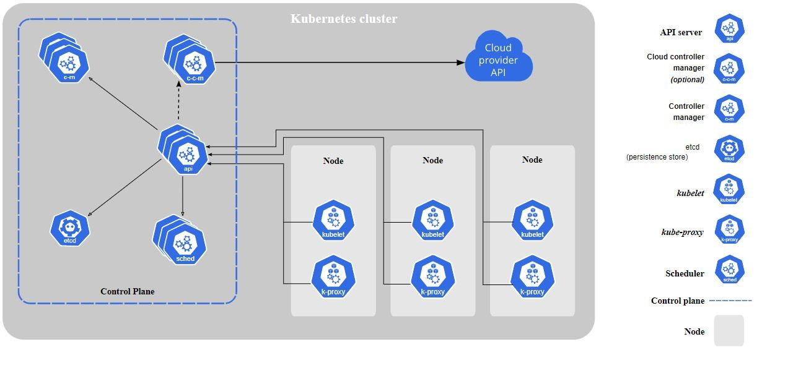
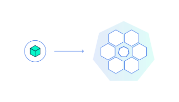
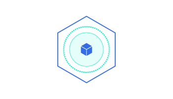
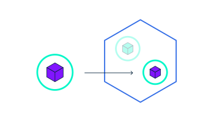

# Kubernetes Overview

**Kubernetes**, commonly known as K8s is an open sourced container orchestration
tool for managing containerized cloud-native workloads and services in computing,
networking, and storage infrastructure. K8s can help to deploy and manage
containerized applications like platforms as a service(PaaS), batch processing
workers, and microservices in the cloud at scale.  It reduces cloud computing
costs while simplifying the operation of resilient and scalable applications.
While it is possible to install and manage Kubernetes on infrastructure that you
manage, it is a time-consuming and complicated process. To make provisioning and
deploying clusters much easier, we have listed a number of popular platforms and
tools to setup your K8s on your NERC's OpenStack Project space.

## Kubernetes Components & Architecture

A Kubernetes cluster consists of a set of worker machines, called nodes, that
run containerized applications. Every cluster has at least one worker node. The
worker node(s) host the Pods that are the components of the application workload.

The control plane or master manages the worker nodes and the Pods in the cluster.
In production environments, the control plane usually runs across multiple
computers and a cluster usually runs multiple nodes, providing fault-tolerance,
redundancy, and high availability.

Here's the diagram of a Kubernetes cluster with all the components tied together.

### Kubernetes Basics workflow

1. Create a Kubernetes cluster

2. Deploy an app

3. Explore your app

4. Expose your app publicly

5. Scale up your app

6. Update your app

### Development environment

1. [Minikube](https://minikube.sigs.k8s.io/docs/start/) is a local Kubernetes
cluster that focuses on making Kubernetes development and learning simple.
Kubernetes may be started with just a single command if you have a Docker
(or similarly comparable) container or a Virtual Machine environment.
For more [read this](minikube.md).

2. [Minishift](https://www.okd.io/minishift/) is a tool for running OKD locally
by launching a single-node OKD cluster within a virtual machine. Minishift is an
open-source project forked from [Minikube](minikube.md). Minishift is a tool that
helps you run **OpenShift** locally by running a single-node OpenShift cluster inside
a VM. For more [read this](minishift.md).

3. [Kind](https://kind.sigs.k8s.io/docs/user/quick-start/) is a tool for running
local Kubernetes clusters utilizing Docker container “nodes”. It was built for
Kubernetes testing, but it may also be used for local development and continuous
integration. For more [read this](kind.md).

4. [MicroK8s](https://microk8s.io/) is the smallest, fastest, and most conformant
Kubernetes that tracks upstream releases and simplifies clustering. MicroK8s is
ideal for prototyping, testing, and offline development.
For more [read this](microk8s.md).

5. [k0s](https://k0sproject.io/) is an all-inclusive Kubernetes distribution,
configured with all of the features needed to build a Kubernetes cluster simply
by copying and running an executable file on each target host.
For more [read this](k0s.md).

6. [CRC - Red Hat Code Ready Containers](https://developers.redhat.com/products/codeready-containers/overview)
is a great way to experience the most recent version of OpenShift locally (CRC).
CRC instals a minimum OpenShift 4.x cluster on your local machine, allowing you
to create and test in a controlled environment. CRC is primarily designed for
use on the workstations of programmers. For more [read this](crc.md).

### Production environment

If your Kubernetes cluster has to run critical workloads, it must be configured
to be resilient and higly available(HA) production-ready Kubernetes cluster. To
setup production-quality cluster, you can use the following deployment tools.

1. [Kubeadm](https://kubernetes.io/docs/setup/production-environment/tools/kubeadm/install-kubeadm/)
performs the actions necessary to get a minimum viable, secure cluster up and
running in a user friendly way.
Bootstrapping cluster with kubeadm [read this](kubeadm/single-master-clusters-with-kubeadm.md)
and if you would like to setup Multi-master cluster setup using Kubeadm [read this](kubeadm/HA-clusters-with-kubeadm.md).

2. [Kubespray](https://kubernetes.io/docs/setup/production-environment/tools/kubespray/)
helps to install a Kubernetes cluster on NERC OpenStack. Kubespray is a
composition of Ansible playbooks, inventory, provisioning tools, and domain
knowledge for generic OS/Kubernetes clusters configuration management tasks.
Installing Kubernetes with Kubespray [read this](kubespray.md).

3. [K3s](https://k3s.io/) is a single <40MB binary, certified Kubernetes distribution
developed by Rancher Labs and now a CNCF sandbox project that fully implements the
Kubernetes API and is less than  40MB in size. To do so, they got rid of a lot of
additional drivers that didn't need to be in the core and could easily be replaced
with add-ons. For more [read this](k3s/k3s.md).

To setup a Multi-master HA K3s cluster using k3sup(pronounced **ketchup**)
[read this](k3s/k3s-using-k3sup.md).

To setup a Single-Node K3s Cluster using k3d [read this](k3s/k3s-using-k3d.md)
and if you would like to setup Multi-master K3s cluster setup using k3d [read this](k3s/k3s-ha-cluster-using-k3d.md).

To choose a tool which best fits your use case, read [this comparison](comparisons.md).

---
