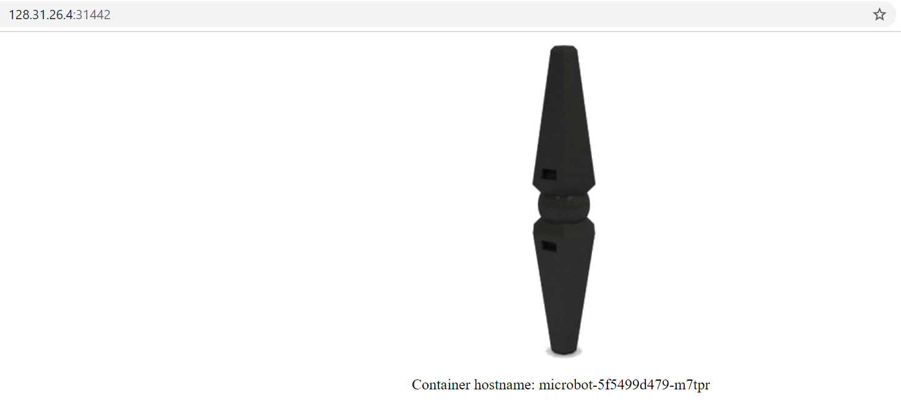

# Microk8s

## Pre-requisite

We will need 1 VM to create a single node kubernetes cluster using `microk8s`.
We are using following setting for this purpose:

- 1 Linux machine, ubuntu-21.04-x86_64, m1.medium flavor with 2vCPU,
4GB RAM, 10GB storage - also [assign Floating IP](../../create-and-connect-to-the-VM/assign-a-floating-IP.md)
 to this VM.
- setup Unique hostname to the machine using the following command:

```sh
echo "<node_internal_IP> <host_name>" >> /etc/hosts
hostnamectl set-hostname <host_name>
```

For example,

```sh
echo "192.168.0.62 microk8s" >> /etc/hosts
hostnamectl set-hostname microk8s
```

## Install MicroK8s on Ubuntu

Run the below command on the Ubuntu VM:

- SSH into **microk8s** machine
- Switch to root user: `sudo su`

- Update the repositories and packages:

```sh
apt-get update && apt-get upgrade -y
```

- Install MicroK8s:

```sh
sudo snap install microk8s --classic
```

- Check the status while Kubernetes starts

```sh
microk8s status --wait-ready
```

- Turn on the services you want:

```sh
microk8s enable dashboard dns registry istio
```

Try `microk8s enable --help` for a list of available services and optional features.
`microk8s disable <name>` turns off a service.

- Start using Kubernetes

```sh
microk8s kubectl get all --all-namespaces
```

If you mainly use MicroK8s you can make our kubectl the default one on your command-line
with `alias mkctl="microk8s kubectl"`. Since it is a standard upstream kubectl, you
can also drive other Kubernetes clusters with it by pointing to the respective kubeconfig
file via the `--kubeconfig` argument.

- Access the Kubernetes dashboard UI:


As we see above the kubernetes-dashboard service in the kube-system namespace has
a ClusterIP of 10.152.183.73 and listens on TCP port 443. The ClusterIP is randomly
assigned, so if you follow these steps on your host, make sure you check the IP
adress you got.

```sh
microk8s dashboard-proxy

Checking if Dashboard is running.
Dashboard will be available at https://127.0.0.1:10443
Use the following token to login:
eyJhbGc....
```

**OR,**

To access the dashboard use the default token retrieved with:

```sh
token=$(microk8s kubectl -n kube-system get secret | grep default-token | \
    cut -d " " -f1)
microk8s kubectl -n kube-system describe secret $token
```

This will show the token to login to the Dashbord shown on the url with NodePort.

- Start and stop Kubernetes:
Kubernetes is a collection of system services that talk to each other all the time.
If you don’t need them running in the background then you will save battery by
stopping them. `microk8s start` and `microk8s stop` will those tasks for you.

- To Reset the infrastructure to a clean state:

```sh
microk8s reset
```

### Deploy A Sample Nginx Application

- Create an alias:

```sh
alias mkctl="microk8s kubectl"
```

- Create a deployment, in this case **Nginx**:

```sh
mkctl create deployment --image nginx my-nginx
```

- To access the deployment we will need to expose it:

```sh
mkctl expose deployment my-nginx --port=80 --type=NodePort
```

```sh
mkctl get svc my-nginx

NAME       TYPE       CLUSTER-IP      EXTERNAL-IP   PORT(S)        AGE
my-nginx   NodePort   10.152.183.41   <none>        80:31225/TCP   35h
```

Go to browser, visit `http://<Floating-IP>:<NodePort>`
i.e. <http://128.31.26.4:31225/> to check the nginx default page.

### Deploy Another Application

You can start by creating a microbot deployment with two pods via the kubectl cli:

```sh
mkctl create deployment microbot --image=dontrebootme/microbot:v1
mkctl scale deployment microbot --replicas=2
```

To expose the deployment to NodePort, you need to create a service:

```sh
mkctl expose deployment microbot --type=NodePort --port=80 --name=microbot-service
```

- View the port information:

```sh
mkctl get svc microbot-service

NAME               TYPE       CLUSTER-IP     EXTERNAL-IP   PORT(S)        AGE
microbot-service   NodePort   10.152.183.8   <none>        80:31442/TCP   35h
```

Go to browser, visit `http://<Floating-IP>:<NodePort>`
i.e. <http://128.31.26.4:31442/> to check the microbot default page.



---
