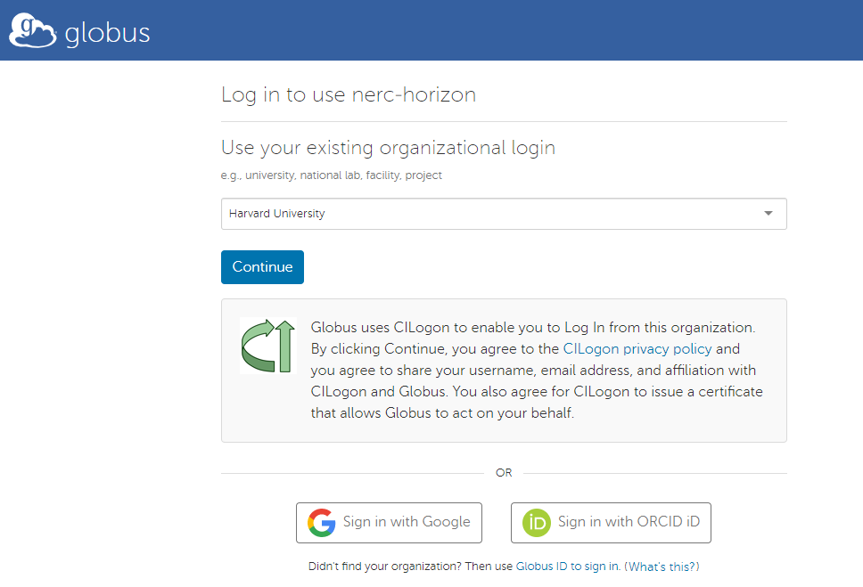
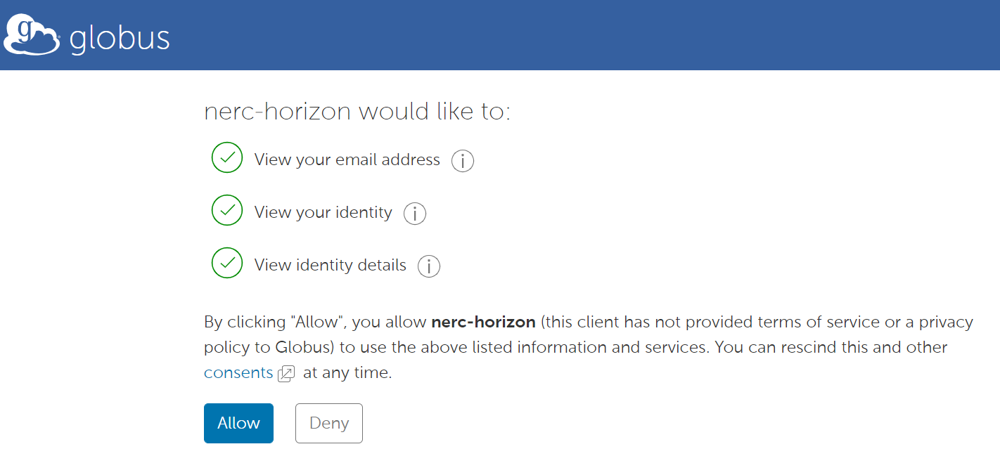

# Access the OpenStack Dashboard

The OpenStack Dashboard which is a web-based graphical interface, code named Horizon, is located at [https://nerc.rc.fas.harvard.edu](https://nerc.rc.fas.harvard.edu).

The NERC Authentication supports OpenID Connect using Globus Auth that provides federated login via your institution accounts and it is the recommended authentication method. Select "OpenID Connect" as shown here:

and then this will redirect you to Globus Auth page where you can search and select your organizational and click "Continue".

Follow the prompt and click "Allow" for some basic consent that is required in order to allow access your account to NERC's OpenStack dashboard. The NERC does not see or have access to your institutional account credentials and neither store them rather it just point to your selected insitution's identity provider (IdP) and redirects back once authenticated.

Once you successfully authenticated you should see an overview of the resources like Compute (instances, VCPUs, RAM, etc.), Volume and Network. You can also see usage summary for provided date range.

---
