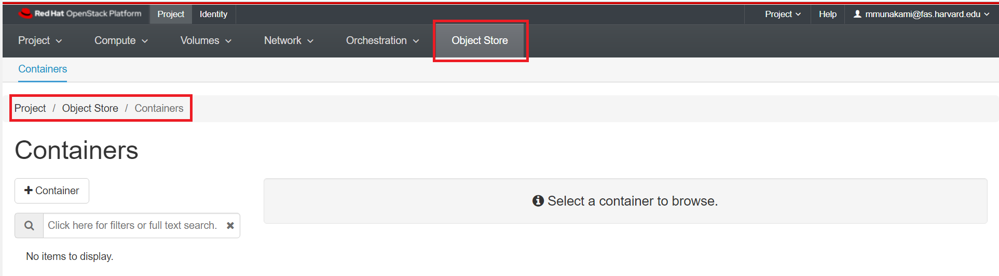

# Dashboard Overview

When you logged-in, you will be redirected to the Compute panel which is under the
Project tab. In the top bar, you can see the two small tabs: "Project" and "Identity".

Beneath that you can see six panels in larger print: "Project", "Compute",
"Volumes", "Network", "Orchestration", and "Object Store".

## Project Panel

Navigate: Project -> Project

- API Access: View API endpoints.

## Compute Panel

Navigate: Project -> Compute

- Overview: View reports for the project.

- Instances: View, launch, create a snapshot from, stop, pause, or reboot
instances, or connect to them through VNC.

- Images: View images and instance snapshots created by project users, plus any
images that are publicly available. Create, edit, and delete images, and launch
instances from images and snapshots.

- Key Pairs: View, create, edit, import, and delete key pairs.

- Server Groups: View, create, edit, and delete server groups.

## Volume Panel

Navigate: Project -> Volume

- Volumes: View, create, edit, delete volumes, and accept volume trnasfer.

- Backups: View, create, edit, and delete backups.

- Snapshots: View, create, edit, and delete volume snapshots.

- Groups: View, create, edit, and delete groups.

- Group Snapshots: View, create, edit, and delete group snapshots.

## Network Panel

Navigate: Project -> Network

- Network Topology: View the network topology.

- Networks: Create and manage public and private networks.

- Routers: Create and manage routers.

- Security Groups: View, create, edit, and delete security groups and security
group rules..

- Load Balancers: View, create, edit, and delete load balancers.

- Floating IPs: Allocate an IP address to or release it from a project.

- Trunks: View, create, edit, and delete trunk.

## Orchestration Panel

Navigate: Project->Orchestration

- Stacks: Use the REST API to orchestrate multiple composite cloud applications.

- Resource Types: view various resources types and their details.

- Template Versions: view different heat templates.

- Template Generator: GUI to generate and save template using drag and drop resources.

## Object Store Panel

Navigate: Project->Object Store

- Containers: Create and manage containers and objects. In future you would use
this tab to [create Swift object storage](../advanced-openstack-topics/persistent-storage/object-storage.md)
for your projects on a need basis.

---
