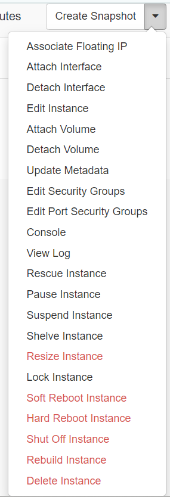
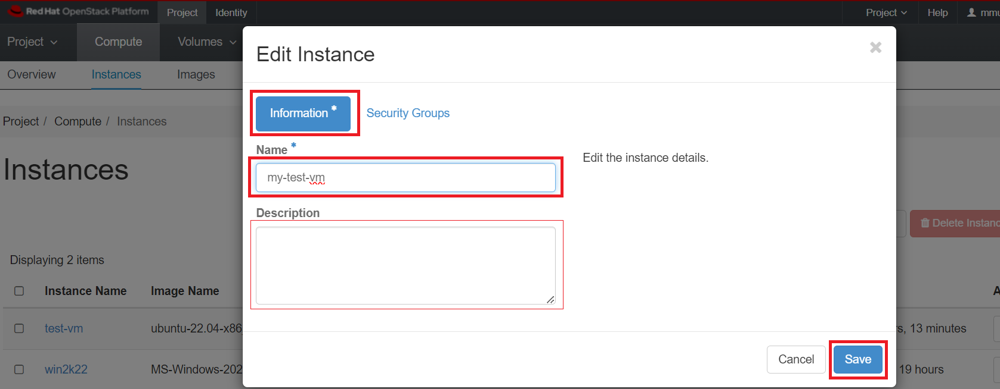

# VM Management

RedHat OpenStack offers numerous functionalities for handling virtual machines,
and comprehensive information can be found in the
[official OpenStack site user guide](http://docs.openstack.org/user-guide/content/),
please keep in mind that certain features may not be fully implemented at NERC OpenStack.

## Instance Management Actions

After launching an instance (On the left side bar, click on
*Project -> Compute -> Instances*), several options are available under the
Actions menu located on the right hand side of your screen as shown here:

## Renaming VM

Once a VM is created, its name is set based on [user specified Instance Name](../create-and-connect-to-the-VM/launch-a-VM.md#details-tab)
while launching an instance using Horizon dashboard or <Instance_Name> specified
in `openstack server create ...` command [using openstack client](../openstack-cli/launch-a-VM-using-openstack-CLI.md#launch-an-instance-from-an-image).

To rename a VM, navigate to *Project -> Compute -> Instances*.

Select an instance.

In the menu list in the actions column, select "Edit Instance" by clicking on
the arrow next to "Create Snapshot" as shown below:

Then edit the Name and also Description(Optional) in "Information" tab and
save it:

## Stopping and Starting

Virtual machines can be stopped and initiated using various methods, and these
actions are executed through the openstack command with the relevant parameters.

1. Reboot is equivalent to powering down the machine and then restarting it. A
complete boot sequence takes place and thus the machine returns to use in a few
minutes.

    **Soft Reboot**:

    - A soft reboot attempts a graceful shut down and restart of the instance. It
    sends an ACPI Restart request to the VM. Similar to sending a reboot command
    to a physical computer.

    - Click *Action -> Soft Reboot Instance*.

    - Status will change to `Reboot`.

    **Hard Reboot**:

    - A hard reboot power cycles the instance. This forcibly restart your VM. Similar
    to cycling the power on a physical computer.

    - Click *Action -> Hard Reboot Instance*.

    - Status will change to `Hard Reboot`.

2. The `Pause` & `Resume` feature enables the temporary suspension of the VM. While
in this state, the VM is retained in memory but doesn't receive any allocated
CPU time. This proves handy when conducting interventions on a group of servers,
preventing the VM from processing during the intervention.

    - Click *Action -> Pause Instance*.

    - Status will change to `Paused`.

    - The Resume operation typically completes in less than a second by clicking
    *Action -> Resume Instance*.

3. The `Suspend` & `Resume` function saves the VM onto disk and swiftly restores
it (in less than a minute). This process is quicker than the stop/start method,
and the VM resumes from where it was suspended, avoiding a new boot cycle.

    - Click *Action -> Suspend Instance*.

    - Status will change to `Suspended`.

    - The Resume operation typically completes in less than a second by clicking
    *Action -> Resume Instance*.

4. `Shelve` & `Unshelve`

    - Click *Action -> Shelve Instance*.

    - When shelved it stops all computing, stores a snapshot of the instance. The
    shelved instances are already imaged as part of the shelving process and appear
    in *Project -> Compute -> Images* as "<Instance_Name>_shelved".

    - We strongly recommend detaching volumes before shelving.

    - Status will change to `Shelved Offloaded`.

    - To unshelve the instance, click *Action -> Unshelve Instance*.

5. `Shut Off` & `Start Instance`

    - Click *Action -> Shut Off Instance*.

    - When shut off it stops active computing, consuming fewer resources than a Suspend.

    - Status will change to `Shutoff`.

    - To start the shut down VM, click *Action -> Start Instance*.

### Using openstack client commands

The above mentioned actions can all be performed running the openstack client
commands with the following syntax:

    openstack server <operation> <INSTANCE_NAME_OR_ID>

such as,

    openstack server shutoff my-vm

    openstack server restart my-vm

!!! tip "Pro Tip"
    If your instance name `<INSTANCE_NAME_OR_ID>` includes spaces, you need to
    enclose the name of your instance in quotes, i.e. `"<INSTANCE_NAME_OR_ID>"`

    For example: `openstack server restart "My Test Instance"`

## Create Snapshot

- Click *Action -> Create Snapshot*.

- Instances must have status `Active`, `Suspended`, or `Shutoff` to create snapshot.

- This creates an image template from a VM instance also known as "Instance Snapshot"
as [described here](../backup/backup-with-snapshots.md#create-and-use-instance-snapshots).

- The menu will automatically shift to *Project -> Compute -> Images* once the
image is created.

- The sole distinction between an *image* directly uploaded to the image data
service, [glance](https://docs.openstack.org/glance) and an *image* generated
through a snapshot is that the snapshot-created image possesses additional
properties in the glance database and defaults to being **private**.

!!! info "Glance Image Service"
    **Glance** is a central image repository which provides discovering, registering,
    retrieving for disk and server images. More about this service can be
    [found here](../create-and-connect-to-the-VM/images.md#glance).

## Rescue a VM

There are instances where a virtual machine may encounter boot failure due to
reasons like misconfiguration or issues with the system disk. To diagnose and
address the problem, the virtual machine console offers valuable diagnostic
information on the underlying cause.

Alternatively, utilizing OpenStack's rescue functions involves booting the
virtual machine using the original image, with the system disk provided as a
secondary disk. This allows manipulation of the disk, such as using `fsck` to
address filesystem issues or mounting and editing the configuration.

!!! warning "Important Note"
    We cannot rescue a volume-backed instance that means **ONLY** instance running
    using [Ephemeral disk](../persistent-storage/volumes.md#ephemeral-disk) can
    be rescued. Also, this procedure has not been tested for Windows virtual machines.

VMs can be rescued using either the OpenStack dashboard by clicking
*Action -> Rescue Instance* or via the openstack client using
`openstack server rescue ...` command.

If however, the virtual machine is no longer required and no data on the
associated system or ephemeral disk needs to be preserved, the following command
can be run:

    openstack server rescue <INSTANCE_NAME_OR_ID>

or, using Horizon dashboard:

Navigate to *Project -> Compute -> Instances*.

Select an instance.

Click *Action -> Rescue Instance*.

!!! warning "When to use Rescue Instance"
    The rescue mode is only for emergency purpose, for example in case of a
    system or access failure. This will shut down your instance and mount the
    root disk to a temporary server. Then, you will be able to connect to this
    server, repair the system configuration or recover your data. You may
    optionally select an image and set a password on the rescue instance server.

### Troubleshoot the disk

This will reboot the virtual machine and you can then log in using the key pair
previously defined. You will see two disks, `/dev/vda` which is the new system disk
and `/dev/vdb` which is the old one to be repaired.

    ubuntu@my-vm:~$ lsblk
    NAME    MAJ:MIN RM  SIZE RO TYPE MOUNTPOINTS
    loop0     7:0    0   62M  1 loop /snap/core20/1587
    loop1     7:1    0 79.9M  1 loop /snap/lxd/22923
    loop2     7:2    0   47M  1 loop /snap/snapd/16292
    vda     252:0    0  2.2G  0 disk
    ├─vda1  252:1    0  2.1G  0 part /
    ├─vda14 252:14   0    4M  0 part
    └─vda15 252:15   0  106M  0 part /boot/efi
    vdb     252:16   0   20G  0 disk
    ├─vdb1  252:17   0 19.9G  0 part
    ├─vdb14 252:30   0    4M  0 part
    └─vdb15 252:31   0  106M  0 part

The old one can be mounted and configuration files edited or `fsck`'d.

    # lsblk
    # cat /proc/diskstats
    # mkdir /tmp/rescue
    # mount /dev/vdb1 /tmp/rescue

### Unrescue the VM

On completion, the VM can be returned to active state with
`openstack server unrescue ...` openstack client command, and rebooted.

    openstack server unrescue <INSTANCE_NAME_OR_ID>

Then the secondary disk is removed as shown below:

    ubuntu@my-vm:~$ lsblk
    NAME    MAJ:MIN RM  SIZE RO TYPE MOUNTPOINTS
    loop0     7:0    0   47M  1 loop /snap/snapd/16292
    vda     252:0    0   20G  0 disk
    ├─vda1  252:1    0 19.9G  0 part /
    ├─vda14 252:14   0    4M  0 part
    └─vda15 252:15   0  106M  0 part /boot/efi

Alternatively, using Horizon dashboard:

Navigate to *Project -> Compute -> Instances*.

Select an instance.

Click *Action -> Unrescue Instance*.

And then *Action -> Soft Reboot Instance*.

## Delete Instance

VMs can be deleted using either the OpenStack dashboard by clicking
*Action -> Delete Instance* or via the openstack client `openstack server delete`
command.

!!! note "How can I delete multiple instances at once?"
    Using the Horizon dashboard, navigate to *Project -> Compute -> Instances*.
    In the Instances panel, you should see a list of all instances running in
    your project. Select the instances you want to delete by ticking the checkboxes
    next to their names. Then, click on "Delete Instances" button located on the
    top right side, as shown below:
    

!!! danger "Important Note"
    This will immediately terminate the instance, delete all contents of the
    virtual machine and erase the disk. This operation is not recoverable.

There are other options available if you wish to keep the virtual machine for
future usage. These do, however, continue to use quota for the project even though
the VM is not running.

- **Snapshot the VM** to keep an offline copy of the virtual machine that can be
performed as [described here](../backup/backup-with-snapshots.md#how-to-create-an-instance-snapshot).

If however, the virtual machine is no longer required and no data on the
associated system or ephemeral disk needs to be preserved, the following command
can be run:

    openstack server delete <INSTANCE_NAME_OR_ID>

or, using Horizon dashboard:

Navigate to *Project -> Compute -> Instances*.

Select an instance.

Click *Action -> Delete Instance*.

!!! danger "Important Note: Unmount volumes first"
    Ensure to unmount any volumes attached to your instance before initiating
    the deletion process, as failure to do so may lead to data corruption in
    both your data and the associated volume.

- If the instance is using [Ephemeral disk](../persistent-storage/volumes.md#ephemeral-disk):
It stops and removes the instance along with the ephemeral disk.
**All data will be permanently lost!**

- If the instance is using [Volume-backed disk](../persistent-storage/volumes.md#volumes):
It stops and removes the instance. If **"Delete Volume on Instance Delete"** was
explicitely set to **Yes**, **All data will be permanently lost!**. If set to
**No** (which is default selected while launching an instance), the volume may be
used to boot a new instance, though any data stored in memory will be permanently
lost. For more in-depth information on making your VM setup and data persistent,
you can explore the details [here](../persistent-storage/volumes.md#how-do-you-make-your-vm-setup-and-data-persistent).

- Status will briefly change to **Deleting** while the instance is being removed.

The quota associated with this virtual machine will be returned to the project
and you can review and verify that looking at your
[OpenStack dashboard overview](../logging-in/dashboard-overview.md#compute-panel).

- Navigate to *Project -> Compute -> Overview*.

---
