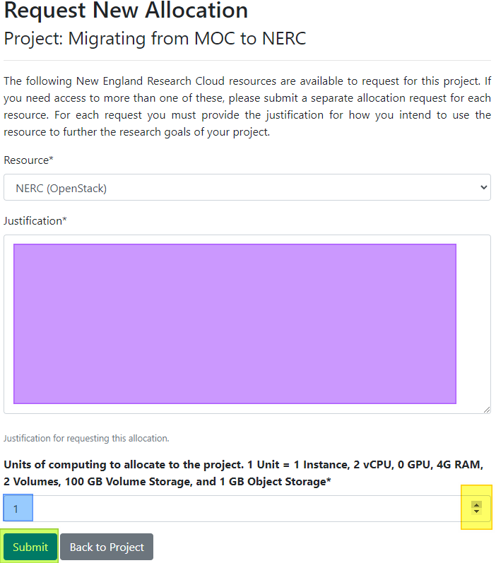
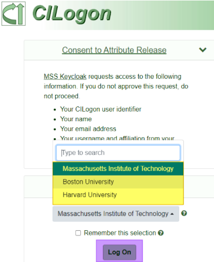
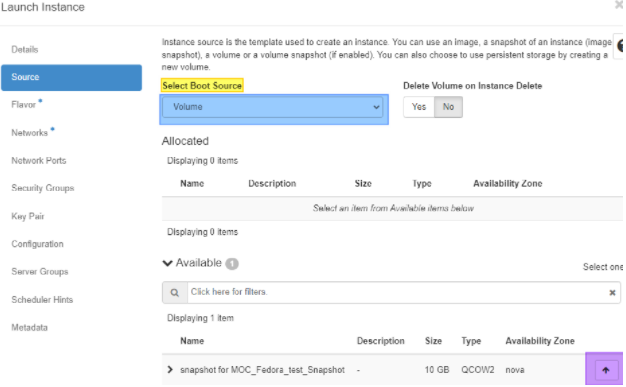
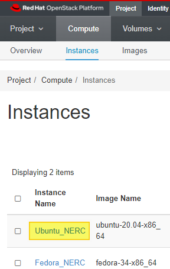
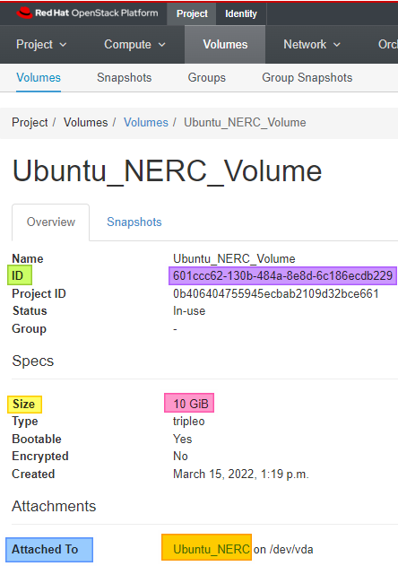

# Steps to Create empty project/s in NERC and Gather UUID's for Migrating MOC to

## Account Creation & Quota Request

1. Register for your new NERC account [here](https://regapp.mss.mghpcc.org/reglanding/).

    1. Wait for approval email.

2. Register to be a PI for a NERC account
[here](https://docs.google.com/forms/d/e/1FAIpQLSdscMlm3TQR09sl7P-0n4oN1uzpd7YikqDubEYF2QDLVz6djA/viewform?pli=1&fbzx=-8227359805748438031).

    1. Wait for approval email.

3. Request the quota necessary for all of your MOC Projects to be added
to NERC [here](https://coldfront.mss.mghpcc.org/user/login)
(link also in PI approval email).

        

    1. Log in with your institution login by clicking on
    **Log in via OpenID Connect** (highlighted in yellow above).

        

    2. Under Projects>> Click on the name of your project
    (highlighted in yellow above).

        

    3. Scroll down until you see **Request Resource Allocation**
    (highlighted in yellow above) and click on it.

        

    4. Fill out the Justification (highlighted in purple above) for
    the quota allocation.

    5. Using your “MOC Instance information” table you gathered from your MOC
    project calculate the total number of Instances, VCPUs, RAM and use your
    “MOC Volume Information” table to calculate Disk space you will need.

    6. Using the up and down arrows (highlighted in yellow above) or by
    entering the number manually select the multiple of 1 Instance, 2 vCPUs,
    4GB RAM, 2 Volumes and 100GB Disk that you will need.

        1. For example if I need 2 instances 2 vCPUs, 3GB RAM, 3 Volumes and
        30GB of storage I would click the up arrow once to select 2 units.

    7. Click **Submit** (highlighted in green above).

4. Wait for your allocation approval email.

## Setup

1. Log into the
[NERC OpenStack Dashboard](https://stack.nerc.mghpcc.org/dashboard)
using your OpenID Connect password.

    

    1. Click **Connect**.

        

    2. Select your institution from the drop down (highlighted in yellow
    above).

    3. Click **Log On** (highlighted in purple).

    4. Follow your institutions log on instructions.

2. You are then brought to the Project>Compute>Overview location of
the Dashboard.

    

    1. This will look very familiar as the MOC and NERC Dashboard are quite
    similar.

    2. Follow the instructions
    [here](https://nerc-project.github.io/nerc-docs/openstack/advanced-openstack-topics/setting-up-a-network/set-up-a-private-network/)
    to set up your network/s. (you may also use the default_network
    if you wish)

        1. The networks and security groups don't have to exactly match the
        MOC. You only need the networks and security groups for creating
        your new instances (and accessing them once we complete the migration).

    3. Follow the instructions
    [here](https://nerc-project.github.io/nerc-docs/openstack/advanced-openstack-topics/setting-up-a-network/create-a-router/)
    to set up your router/s. (you may also use the default_router if you wish)

    4. Follow the instructions
    [here](https://nerc-project.github.io/nerc-docs/openstack/access-and-security/security-groups/)
    to set up your Security Group/s.

        1. This is where you can use your “MOC Security Group Information”
        table to create similar Security Groups to the ones you had in the MOC.

    5. Follow the instructions
    [here](https://nerc-project.github.io/nerc-docs/openstack/access-and-security/create-a-key-pair/)
    to set up your SSH Key-pair/s.

    6. Follow the instructions
    [here](https://nerc-project.github.io/nerc-docs/openstack/create-and-connect-to-the-VM/launch-a-VM/)
    to set up your instance/s.

        1. These will serve as blank targets for us to copy the data from the
        old environment.

        2. You can choose any source image when creating the instance
        (provided the flavor can launch it).

        3. If the size of the root disk is larger than the flavor in NERC,
        then please launch your instance from a volume.

            

            1. When selecting Source Click the Select Boot Source dropdown
            (highlighted in yellow above) and select Volume
            (highlighted in blue above).

            2. Choose the Volume you wish to mount from and click the up
            arrow (highlighted in purple above) to the right of the volume.

        4. The Flavor will be important as this decides how much vCPUs, RAM,
        and Disk this instance will consume of your total.

            1. If for some reason the earlier approved resource quota is not
            sufficient you can request further quota by following
            [these steps](https://nerc-project.github.io/nerc-docs/get-started/get-an-allocation/#request-change-to-resource-allocation-to-an-existing-project).

        5. You do not need to install anything on these instances as you will
        be bringing over your information from MOC

        6. Make sure Volume Bootable column (highlighted in purple below)
        matches MOC Bootable column.

            

            1. If it does not you can modify the checkbox by clicking on
            **Edit Volume** (highlighted in yellow above).

                

            2. Adding or removing the check next to the Bootable flag
            (highlighted in purple above).

            3. Click **Submit** (highlighted in yellow above).

    7. Follow the instructions
    [here](https://nerc-project.github.io/nerc-docs/openstack/create-and-connect-to-the-VM/assign-a-floating-IP/)
    to Assign Floating IPs to your Instances.

        1. Your floating IPs will not be the same as the ones you had in the
        MOC. Please claim new floating IPs to use.

    8. If you have volumes in the MOC that are not attached to Instances
    follow the instructions
    [here](https://nerc-project.github.io/nerc-docs/openstack/advanced-openstack-topics/persistent-storage/volumes/)
    to set up your volume/s, up until the “Format and mount the volume”
    section.

        1. When launching volumes please stick to the default volume type
        unless your workload strictly requires performance volumes.

        2. A common mistake here is to forget to attach all volumes to new
        Instances/VMs causing them to fail to boot. PLEASE DOUBLE CHECK
        new Instance/VM attachments are correct before creating unnecessary
        tickets.

## Data Gathering

1. Gather the Instance UUIDs (of only the instances that you need to migrate
to the NERC).

    1. Click [Instances](https://stack.nerc.mghpcc.org/dashboard/project/instances/)
    (highlighted in pink above).

        

    2. Click the Instance Name (highlighted in Yellow above) of the first
    instance you would like to gather data on.

        

    3. Locate the ID row (highlighted in green above) and copy and save the ID
    (highlighted in purple above).

        1. This is the UUID of your first Instance.

    4. Locate the RAM, VCPUs & Disk rows (highlighted in yellow) and copy and
    save the associated values (highlighted in pink).

2. Repeat step 1 for each Instance you have.

3. Gather the Volume UUIDs (of only the volumes that you need to migrate to
the NERC).

    

    1. Click Volumes dropdown.

    2. Select [Volumes](https://stack.nerc.mghpcc.org/dashboard/project/volumes/)
    (highlighted in purple above).

        

    3. Click the Volume Name (highlighted in yellow above) of the first
    volume you would like to gather data on.

        1. The name might be the same as the ID (highlighted in blue above).

            

    4. Locate the ID row (highlighted in green above) and copy and save the ID
    (highlighted in purple above).

        1. This is the UUID of your first Volume.

    5. Locate the Size row (highlighted in yellow above) and copy and save the
    Volume size (highlighted in pink above).

    6. Locate the Attached To row (highlighted in blue above) and copy and
    save the Instance this Volume is attached to (highlighted in orange above).

        1. If the volume is not attached to an image it will state
        “Not attached”.

4. Repeat step 3 for each Volume you have.

5. Create 2 tables of all of your Instances and Volumes for example, if you
have 2 instances and 2 volumes like the sample above your lists might look
like this:

NERC Instance information:

| Instance Name | NERC VCPUs | NERC Disk | NERC RAM | NERC UUID |
| ------------- | ---------- | --------- | -------- | --------- |
| Ubuntu_NERC | 1 | 10GB | 2GB | 9f1e100b-184b-4bc6-9658-0d82e7c2e4f2 |
| Ubuntu_Test | 1 | 10GB | 1GB | 84f3d7c7-f4a0-45ef-9663-733421ce5da0 |
| total | 2 | 20GB | 3GB | |

NERC Volume Information:

| Volume Name | NERC Disk | NERC Attached To | NERC UUID |
| ----------- | --------- | ---------------- | --------- |
| Ubuntu_NERC_Volume | 10GiB | Ubuntu_NERC | 601ccc62-130b-484a-8e8d-6c186ecdb229 |
| 4d46dc3a-93c7-42b8-bea0-e2a83a7e7849 | 10GiB | Fedora_NERC | 4d46dc3a-93c7-42b8-bea0-e2a83a7e7849 |
| Empty_Volume_NERC | 10GiB | Not attached | 5cd61834-c52e-49df-b696-7b300f8af9cc |
| total | 30GiB | Not attached | |

---
