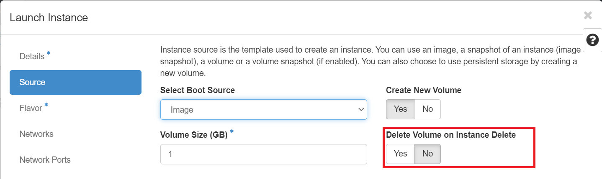

# Delete Volumes

## Using Horizon dashboard

Once you're logged in to NERC's Horizon dashboard.

Navigate to _Project -> Volumes -> Volumes_.

Select the volume or volumes that you want to delete.

Click "Delete Volumes" button.

In the Confirm Delete Volumes window, click the Delete Volumes button to
confirm the action.

!!! danger "Unable to Delete Volume"

    You cannot delete a **bootable** volume that is actively in use by a running
    VM. If you really want to delete such volume then first delete the insance and
    then you are allowed to delete the detached volume. Before deleting
    **Please make sure** during the launch of this insance is using the default
    selected **No** for "Delete Volume on Instance Delete" configuration option.
    If you had set this configuration "Yes" for "Delete Volume on Instance Delete",
    then deleting the instance will automatically remove the associated volume.
    

## Using the CLI

**Prerequisites**:

To run the OpenStack CLI commands, you need to have:

-   OpenStack CLI setup, see [OpenStack Command Line setup](../openstack-cli/openstack-CLI.md#command-line-setup)
    for more information.

To delete a volume using the CLI, do this:

### Using the openstack client

The following openstack client command syntax can be used to delete a volume:

```sh
openstack volume delete <VOLUME_NAME_OR_ID>
```

For example:

```sh
openstack volume delete my-volume
```

!!! tip "Pro Tip"

    If your volume name `<VOLUME_NAME_OR_ID>` include spaces, you need to enclose
    them in quotes, i.e. `"<VOLUME_NAME_OR_ID>"`.

    For example: `openstack volume delete "My Volume"`.

Your volume will now go into state 'deleting' and completely disappear from the
`openstack volume list` output.

---
