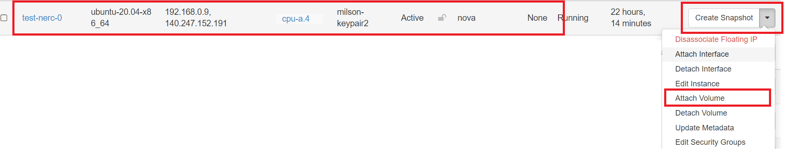

# Detach A Volume and Attach it to an instance

## Detach A Volume

### Using Horizon dashboard

Once you're logged in to NERC's Horizon dashboard.

Navigate to *Project -> Volumes -> Volumes*.

To detach a mounted volume by going back to "Manage Attachments" and choosing
Detach Volume.

This will popup the following interface to proceed:

!!! danger "Unable to Detach Volume"
    If your bootable volume that is attached to a VM then that volume cannot be
    detached as this is a root device volume. This bootable volume is created when
    you launch an instance from an **Image** or an **Instance Snapshot**, and the
    choice for utilizing persistent storage is configured by selecting the **Yes**
    option for "Create New Volume". If you explicitly chosen as "No" for this option
    then there will be no attach volume created for the instance instead an **Ephemeral**
    disk storage is used.
    

### Using the CLI

**Prerequisites**:

To run the OpenStack CLI commands, you need to have:

- OpenStack CLI setup, see [OpenStack Command Line setup](../openstack-cli/openstack-CLI.md#command-line-setup)
  for more information.

#### Using the openstack client

The following openstack client command syntax can be used to detach a volume
from a VM:

    openstack server remove volume <INSTANCE_NAME_OR_ID> <VOLUME_NAME_OR_ID>

For example:

    openstack server remove volume test-vm my-volume

where "test-vm" is the virtual machine and the second parameter, "my-volume" is
the volume created before and attached to the VM and can be shown in
`openstack volume list`.

!!! tip "Pro Tip"
    If your instance name `<INSTANCE_NAME_OR_ID>` and volume name `<VOLUME_NAME_OR_ID>`
    include spaces, you need to enclose them in quotes, i.e. `"<INSTANCE_NAME_OR_ID>"`
    and `"<VOLUME_NAME_OR_ID>"`.

    For example: `openstack server remove volume "My Test Instance" "My Volume"`

Check that the volume is in state 'available' again.

If that's the case, the volume is now ready to either be attached to another
virtual machine or, if it is not needed any longer, to be [completely deleted](#delete-volumes)
(please note that this step cannot be reverted!).

## Attach the detached volume to an instance

Once it is successfully detached, you can use "Manage Attachments" to attach it
to another instance if desired as [explained here](../persistent-storage/attach-the-volume-to-an-instance.md).

**OR,**

You can attach the existing volume (Detached!) to the new instance as shown below:

After this run the following commands as `root` user to mount it:

    mkdir /mnt/test_volume
    mount /dev/vdb /mnt/test_volume

All the previous data from previous instance will be available under the mounted
folder at `/mnt/test_volume`.

!!! note "Very Important Note"
    Also, a given volume might not get the same device name the second time you
    attach it to an instance.

---
