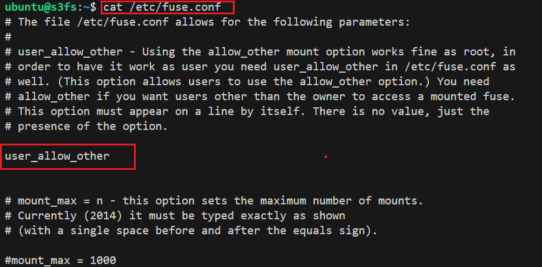

# Mount The Object Storage To An Instance

## Pre-requisite

We are using following setting for this purpose to mount the object storage to an
NERC OpenStack VM:

- 1 Linux machine, `ubuntu-22.04-x86_64` or your choice of Ubuntu OS image,
`cpu-su.2` flavor with 2vCPU, 8GB RAM, 20GB storage - also [assign Floating IP](../../openstack/create-and-connect-to-the-VM/assign-a-floating-IP.md)
to this VM.

- Setup and enable your S3 API credentials:

    To access the API credentials, you must login through the OpenStack Dashboard
    and navigate to "Projects > API Access" where you can download the "Download
    OpenStack RC File" as well as the "EC2 Credentials".

    

    While clicking on "EC2 Credentials", this will download a file **zip file**
    including `ec2rc.sh` file that has content similar to shown below. The important
    parts are `EC2_ACCESS_KEY` and `EC2_SECRET_KEY`, keep them noted.

        #!/bin/bash

        NOVARC=$(readlink -f "${BASH_SOURCE:-${0}}" 2>/dev/null) || NOVARC=$(python -c 'import os,sys; print os.path.abspath(os.path.realpath(sys.argv[1]))' "${BASH_SOURCE:-${0}}")
        NOVA_KEY_DIR=${NOVARC%/*}
        export EC2_ACCESS_KEY=...
        export EC2_SECRET_KEY=...
        export EC2_URL=https://localhost/notimplemented
        export EC2_USER_ID=42 # nova does not use user id, but bundling requires it
        export EC2_PRIVATE_KEY=${NOVA_KEY_DIR}/pk.pem
        export EC2_CERT=${NOVA_KEY_DIR}/cert.pem
        export NOVA_CERT=${NOVA_KEY_DIR}/cacert.pem
        export EUCALYPTUS_CERT=${NOVA_CERT} # euca-bundle-image seems to require this set

        alias ec2-bundle-image="ec2-bundle-image --cert ${EC2_CERT} --privatekey ${EC2_PRIVATE_KEY} --user 42 --ec2cert ${NOVA_CERT}"
        alias ec2-upload-bundle="ec2-upload-bundle -a ${EC2_ACCESS_KEY} -s ${EC2_SECRET_KEY} --url ${S3_URL} --ec2cert ${NOVA_CERT}"

    **Alternatively,** you can obtain your EC2 access keys using the openstack client:

        sudo apt install python3-openstackclient

        openstack ec2 credentials list
        +------------------+------------------+--------------+-----------+
        | Access           | Secret           | Project ID   | User ID   |
        +------------------+------------------+--------------+-----------+
        | <EC2_ACCESS_KEY> | <EC2_SECRET_KEY> | <Project_ID> | <User_ID> |
        +------------------+------------------+--------------+-----------+

    **OR,** you can even create a new one by running:

        openstack ec2 credentials create

- Source the downloaded OpenStack RC File from *Projects > API Access* by using:
`source *-openrc.sh` command. Sourcing the RC File will set the required environment
variables.

- Allow Other User option by editing fuse config by editing `/etc/fuse.conf` file
and uncomment "user_allow_other" option.

        sudo nano /etc/fuse.conf

    The output going to look like this:

    

## 1. Using Mountpoint for Amazon S3

[Mountpoint for Amazon S3](https://github.com/awslabs/mountpoint-s3) is a high-throughput
open-source file client designed to mount an Amazon S3 bucket as a local file system.
Mountpoint is optimized for workloads that need high-throughput read and write
access to data stored in S3 Object Storage through a file system interface.

!!! warning "Very Important Note"
    Mountpoint for Amazon S3 intentionally does not implement the full [POSIX](https://en.wikipedia.org/wiki/POSIX)
    standard specification for file systems. Mountpoint supports file-based workloads
    that perform sequential and random reads, sequential (append only) writes,
    and that don’t need full POSIX semantics.

### Install Mountpoint

Access your virtual machine using SSH. Update the packages on your system and
install `wget` to be able to download the `mount-s3` binary directly to your VM:

    sudo apt update && sudo apt upgrade
    sudo apt install wget

Now, navigate to your home directory:

    cd

1. Download the Mountpoint for Amazon S3 package using `wget` command:

        wget https://s3.amazonaws.com/mountpoint-s3-release/latest/x86_64/mount-s3.deb

2. Install the package by entering the following command:

        sudo apt-get install ./mount-s3.deb

3. Verify that Mountpoint for Amazon S3 is successfully installed by entering the
following command:

        mount-s3 --version

    You should see output similar to the following:

        mount-s3 1.6.0

### Configuring and using Mountpoint

Make a folder to store your credentials:

    mkdir ~/.aws/

Create file `~/.aws/credentials` using your favorite text editor (for example
`nano` or `vim`). Add the following contents to it which requires the `EC2_ACCESS_KEY`
and `EC2_SECRET_KEY` keys that you noted from `ec2rc.sh` file (during the **"Setup
and enable your S3 API credentials"** step):

    [nerc]
    aws_access_key_id=<EC2_ACCESS_KEY>
    aws_secret_access_key=<EC2_SECRET_KEY>

Save the file and exit the text editor.

### Create a local directory as a mount point

    mkdir -p ~/bucket1

### Mount the Container locally using Mountpoint

The object storage container i.e. "bucket1" will be mounted in the directory `~/bucket1`

    mount-s3 --profile "nerc" --endpoint-url "https://stack.nerc.mghpcc.org:13808" --allow-other --force-path-style --debug bucket1 ~/bucket1/

In this command,

- `mount-s3` is the Mountpoint for Amazon S3 package as installed in `/usr/bin/`
path we don't need to specify the full path.

- `--profile` corresponds to the name given on the `~/.aws/credentials` file i.e.
`[nerc]`.

- `--endpoint-url` corresponds to the Object Storage endpoint url for NERC Object
Storage. You don't need to modify this url.

- `--allow-other`: Allows other users to access the mounted filesystem. This is
particularly useful when multiple users need to access the mounted S3 bucket. Only
allowed if `user_allow_other` is set in `/etc/fuse.conf`.

- `--force-path-style`: Forces the use of path-style URLs when accessing the S3
bucket. This is necessary when working with certain S3-compatible storage services
that do not support virtual-hosted-style URLs.

- `--debug`: Enables debug mode, providing additional information about the mounting
process.

- `bucket1` is the name of the container which contains the NERC Object Storage
resources.

- `~/bucket1` is the location of the folder in which you want to mount the Object
Storage filesystem.

!!! tip "Important Note"
    Mountpoint automatically configures reasonable defaults for file system settings
    such as permissions and performance. However, if you require finer control over
    how the Mountpoint file system behaves, you can adjust these settings accordingly.
    For further details, please refer to [this resource](https://github.com/awslabs/mountpoint-s3/blob/main/doc/CONFIGURATION.md#file-system-configuration).

In order to test whether the mount was successful, navigate to the directory in
which you mounted the NERC container repository, for example:

    cd ~/bucket1

Use the `ls` command to list its content. You should see the output similar to this:

    ls

    README.md   image.png   test-file

The NERC Object Storage container repository has now been mounted using Mountpoint.

!!! danger "Very Important Information"
    Please note that any of these Mountpoints is not persistent if your VM is
    stopped or rebooted in the future. After each reboot, you will need to execute
    the mounting command as mentioned [above](#mount-the-container-locally-using-mountpoint)
    again.

### Automatically mounting an S3 bucket at boot

Mountpoint does not currently support automatically mounting a bucket at system
boot time by configuring them in the `/etc/fstab`. If you would like your bucket/s
to automatically mount when the machine is started you will need to either set up
a [Cron Job](https://ostechnix.com/a-beginners-guide-to-cron-jobs/) in `crontab`
or using a [service manager](https://www.shubhamdipt.com/blog/how-to-create-a-systemd-service-in-linux/)
like `systemd`.

#### Using a Cron Job

You need to create a **Cron job** so that the script runs each time your VM reboots,
remounting S3 Object Storage to your VM.

    crontab -e

Add this command to the end of the file

    @reboot sh /<Path_To_Directory>/script.sh

For example,

    @reboot sh /home/ubuntu/script.sh

Create `script.sh` file paste the below code to it.

    #!/bin/bash
    mount-s3 [OPTIONS] <BUCKET_NAME> <DIRECTORY>

For example,

    #!/bin/bash
    mount-s3 --profile "nerc" --endpoint-url "https://stack.nerc.mghpcc.org:13808" --allow-other --force-path-style --debug bucket1 ~/bucket1/

Make the file executable by running the below command

    chmod +x script.sh

Reboot your VM:

    sudo reboot

#### Using a service manager like `systemd` by creating systemd unit file

Create directory in `/root` folder in which you will store the credentials:

    sudo mkdir /root/.aws

Copy the credentials you created in your local directory to the `.aws` directory
in the `/root` folder:

    sudo cp ~/.aws/credentials /root/.aws/

##### Create systemd unit file i.e. `mountpoint-s3.service`

Create a **systemd service** unit file that is going to execute the above script
and dynamically mount or unmount the container:

    sudo nano /etc/systemd/system/mountpoint-s3.service

Edit the file to look like the below:

    [Unit]
    Description=Mountpoint for Amazon S3 mount
    Documentation=https://docs.aws.amazon.com/AmazonS3/latest/userguide/mountpoint.html
    #Wants=network.target
    Wants=network-online.target
    #Requires=network-online.target
    AssertPathIsDirectory=/home/ubuntu/bucket1
    After=network-online.target

    [Service]
    Type=forking
    User=root
    Group=root
    ExecStart=/usr/bin/mount-s3 bucket1 /home/ubuntu/bucket1 \
            --profile "nerc" \
            --endpoint-url "https://stack.nerc.mghpcc.org:13808" \
            --allow-other \
            --force-path-style \
            --debug

    ExecStop=/bin/fusermount -u /home/ubuntu/bucket1
    Restart=always
    RestartSec=10

    [Install]
    #WantedBy=remote-fs.target
    WantedBy=default.target

!!! note "Important Note"
    The `network-online.target` lines ensure that mounting is not attempted until
    there's a network connection available. The service is launched as soon as the
    network is up and running, it mounts the bucket and remains active.

##### Launch the service

Now reload systemd deamon:

    sudo systemctl daemon-reload

Start your service

    sudo systemctl start mountpoint-s3.service

To check the status of your service

    sudo systemctl status mountpoint-s3.service

To enable your service on every reboot

    sudo systemctl enable --now mountpoint-s3.service

!!! note "Information"
    The service name is based on the file name i.e. `/etc/systemd/system/mountpoint-s3.service`
    so you can just use `mountpoint-s3` instead of `mountpoint-s3.service` on all
    above `systemctl` commands.

    To debug you can use:

    `sudo systemctl status mountpoint-s3.service -l --no-pager` or,
    `journalctl -u mountpoint-s3 --no-pager | tail -50`

Verify, the service is running successfully in background as `root` user:

    ps aux | grep mount-s3

    root       13585  0.0  0.0 1060504 11672 ?       Sl   02:00   0:00 /usr/bin/mount-s3 bucket1 /home/ubuntu/bucket1 --profile nerc --endpoint-url https://stack.nerc.mghpcc.org:13808 --read-only --allow-other --force-path-style --debug

##### Stopping the service

Stopping the service causes the container to unmount from the mount point.

To disable your service on every reboot:

    sudo systemctl disable --now mountpoint-s3.service

Confirm the Service is not in "Active" Status:

    sudo systemctl status mountpoint-s3.service

    ○ mountpoint-s3.service - Mountpoint for Amazon S3 mount
        Loaded: loaded (/etc/systemd/system/mountpoint-s3.service; disabled; vendor p>
        Active: inactive (dead)

Unmount the local mount point:

If you have the local mounted directory "bucket1" already mounted, unmount it
(replace `~/bucket1` with the location in which you have it mounted):

    fusermount -u ~/bucket1

**Or,**

    sudo umount -l ~/bucket1

Now reboot your VM:

    sudo reboot

!!! note "Further Reading"
    For further details, including instructions for downloading and installing
    Mountpoint on various Linux operating systems, please refer to [this resource](https://docs.aws.amazon.com/AmazonS3/latest/userguide/mountpoint-installation.html).

## 2. Using Goofys

### Install goofys

Access your virtual machine using SSH. Update the packages on your system and
install `wget` to be able to download the `goofys` binary directly to your VM:

    sudo apt update && sudo apt upgrade
    sudo apt install wget

Now, navigate to your home directory:

    cd

Use `wget` to download the `goofys` binary:

    wget https://github.com/kahing/goofys/releases/latest/download/goofys

Make the `goofys` binary executable:

    chmod +x goofys

Copy the `goofys` binary to somewhere in your path

    sudo cp goofys /usr/bin/

!!! note "To update goofys in the future"
    In order to update the newer version of `goofys` binary, you need to follow:

    - make sure that the data in the NERC Object Storage container is not actively
    used by any applications on your VM.

    - remove the `goofys` binary from ubuntu's home directory as well as from `/usr/bin/`.

    - execute the above commands (those starting with wget and chmod) from your
    home directory again and copy it to your path i.e. `/usr/bin/`.

    - reboot your VM.

### Provide credentials to configure goofys

Make a folder to store your credentials:

    mkdir ~/.aws/

Create file `~/.aws/credentials` using your favorite text editor (for example
`nano` or `vim`). Add the following contents to it which requires the `EC2_ACCESS_KEY`
and `EC2_SECRET_KEY` keys that you noted from `ec2rc.sh` file (during the **"Setup
and enable your S3 API credentials"** step):

    [nerc]
    aws_access_key_id=<EC2_ACCESS_KEY>
    aws_secret_access_key=<EC2_SECRET_KEY>

Save the file and exit the text editor.

### Create a local directory as a mount folder

    mkdir -p ~/bucket1

### Mount the Container locally using `goofys`

The object storage container i.e. "bucket1" will be mounted in the directory `~/bucket1`

    goofys -o allow_other --region RegionOne --profile "nerc" --endpoint "https://stack.nerc.mghpcc.org:13808" bucket1 ~/bucket1

In this command,

- `goofys` is the goofys binary as we already copied this in `/usr/bin/` path we
don't need to specify the full path.

- `-o` stands for goofys options, and is handled differently.

- `allow_other` Allows goofys with option `allow_other` only allowed if `user_allow_other`
is set in `/etc/fuse.conf`.

- `--profile` corresponds to the name given on the `~/.aws/credentials` file i.e.
`[nerc]`.

- `--endpoint` corresponds to the Object Storage endpoint url for NERC Object Storage.
You don't need to modify this url.

- `bucket1` is the name of the container which contains the NERC Object Storage
resources.

- `~/bucket1` is the location of the folder in which you want to mount the Object
Storage filesystem.

In order to test whether the mount was successful, navigate to the directory in
which you mounted the NERC container repository, for example:

    cd ~/bucket1

Use the `ls` command to list its content. You should see the output similar to this:

    ls

    README.md   image.png   test-file

The NERC Object Storage container repository has now been mounted using `goofys`.

!!! danger "Very Important Information"
    Please note that any of these Mountpoints is not persistent if your VM is
    stopped or rebooted in the future. After each reboot, you will need to execute
    the mounting command as mentioned [above](#mount-the-container-locally-using-goofys)
    again.

### Mounting on system startup

Mounts can be set to occur automatically during system initialization so that mounted
file systems will persist even after the VM reboot.

Create directory in `/root` folder in which you will store the credentials:

    sudo mkdir /root/.aws

Copy the credentials you created in your local directory to the `.aws` directory
in the `/root` folder:

    sudo cp ~/.aws/credentials /root/.aws/

#### Configure mounting of the `bucket1` container

Open the file `/etc/fstab` using your favorite command line text editor for editing.
You will need sudo privileges for that. For example, if you want to use nano, execute
this command:

    sudo nano /etc/fstab

Proceed with one of the methods below depending on whether you wish to have the
"bucket1" repository automatically mounted at system startup:

##### Method 1: Mount the repository automatically on system startup

Add the following line to the `/etc/fstab` file:

    /usr/bin/goofys#bucket1 /home/ubuntu/bucket1 fuse _netdev,allow_other,--dir-mode=0777,--file-mode=0666,--region=RegionOne,--profile=nerc,--endpoint=https://stack.nerc.mghpcc.org:13808 0 0

##### Method 2: Do NOT mount the repository automatically on system startup

Add the following line to the `/etc/fstab` file:

    /usr/bin/goofys#bucket1 /home/ubuntu/bucket1 fuse noauto,_netdev,allow_other,--dir-mode=0777,--file-mode=0666,--region=RegionOne,--profile=nerc,--endpoint=https://stack.nerc.mghpcc.org:13808 0 0

The difference between this code and the code mentioned in Method 1 is the addition
of the option `noauto`.

!!! note "Content of /etc/fstab"
    In the `/etc/fstab` content as added above:

        grep goofys /etc/fstab

        /usr/bin/goofys#bucket1 /home/ubuntu/bucket1 fuse _netdev,allow_other,--dir-mode=0777,--file-mode=0666,--region=RegionOne,--profile=nerc,--endpoint=https://stack.nerc.mghpcc.org:13808 0 0

    - `/usr/bin/goofys` with the location of your `goofys` binary.

    - `/home/ubuntu/bucket1` is the location in which you wish to mount `bucket1`
    container from your NERC Object Storage.

    - `--profile=nerc` is the name you mentioned on the `~/.aws/credentials` file
    i.e. `[nerc]`.

Once you have added that line to your `/etc/fstab` file, reboot the VM. After the
system has restarted, check whether the NERC Object Storage repository i.e. `bucket1`
is mounted in the directory specified by you i.e. in `/home/ubuntu/bucket1`.

!!! tip "Important Information"
    If you just want to test your mounting command written in `/etc/fstab` without
    "Rebooting" the VM you can also do that by running `sudo mount -a`.
    And if you want to stop automatic mounting of the container from the NERC
    Object Storage repository i.e. `bucket1`, remove the line you added in the
    `/etc/fstab` file. You can also comment it out by adding `#` character in front
    of that line. After that, reboot the VM. Optionally, you can also remove the
    `goofys` binary and the credentials file located at `~/.aws/credentials` if
    you no longer want to use `goofys`.

## 3. Using S3FS

### Install S3FS

Access your virtual machine using SSH. Update the packages on your system and install
`s3fs`:

    sudo apt update && sudo apt upgrade
    sudo apt install s3fs

!!! tip "For CentOS"
    The **CentOS** repositiories do not have `s3fs`. Therefore, you will need to
    compile it yourself.

    First, using your local computer, visit the following website (it contains
    the releases of `s3fs`): [https://github.com/s3fs-fuse/s3fs-fuse/releases/latest](https://github.com/s3fs-fuse/s3fs-fuse/releases/latest).

    Then, in the section with the most recent release find the part **Assets**.
    From there, find the link to the zip version of the **Source code**.

    

    Right click on one of the Source Code i.e. "v1.94.zip" and select the "Copy
    link address". You will need this link to use later as a parameter for the
    `wget` command to download it to your virtual machine.

    Access your VM on the NERC OpenStack using the web console or SSH.

    Update your packages:

        sudo yum update

    Install the prerequisites including fuse, the *C++ compiler* and make:

        sudo yum install automake fuse fuse-devel gcc-c++ git libcurl-devel libxml2-devel make openssl-devel wget unzip

    Now, use `wget` to download the source code. Replace https://github.com/s3fs-fuse/s3fs-fuse/archive/refs/tags/v1.94.zip with the link to the source code you found previously:

        wget https://github.com/s3fs-fuse/s3fs-fuse/archive/refs/tags/v1.94.zip

    Use the `ls` command to verify that the zip archive has been downloaded:

        ls

    Unzip the archive (replace v1.94.zip with the name of the archive you downloaded):

        unzip v1.94.zip

    Use the ls command to find the name of the folder you just extracted:

        ls

    Now, navigate to that folder (replace **s3fs-fuse-1.94** with the name of the folder you just extracted):

        cd s3fs-fuse-1.94

    Perform the compilation by executing the following commands in order:

        ./autogen.sh
        ./configure
        make
        sudo make install

    `s3fs` should now be installed in `/usr/local/bin/s3fs`.

### Create a file which will store the S3 Credentials

Store your S3 credentials in a file `${HOME}/.passwd-s3fs` and set "owner-only"
permissions. Run the following command to create a pair of `EC2_ACCESS_KEY` and
`EC2_SECRET_KEY` keys that you noted from `ec2rc.sh` file (above) to store them
in the file.

    echo EC2_ACCESS_KEY:EC2_SECRET_KEY > ${HOME}/.passwd-s3fs

Change the permissions of this file to 600 to set "owner-only" permissions:

    chmod 600 ${HOME}/.passwd-s3fs

### [Create a Container](../persistent-storage/object-storage.md#create-your-first-container) in the NERC Project's Object storage

We create it using the OpenStack Swift client:

    sudo apt install python3-swiftclient

Let's call the Container "bucket1"

    swift post bucket1

!!! note "More about Swift Interface"
    You can read more about using Swift Interface for NERC Object Storage [here](object-storage.md#ii-swift-interface).

### Create a local directory as a mount point in your VM

    mkdir -p ~/bucket1

### Mount the Container locally using `s3fs`

The object storage container i.e. "bucket1" will be mounted in the directory `~/bucket1`

    s3fs bucket1 ~/bucket1 -o passwd_file=~/.passwd-s3fs -o url=https://stack.nerc.mghpcc.org:13808 -o use_path_request_style -o umask=0002

### Unmount the local mount point

If you have the local mounted directory "bucket1" already mounted, unmount it
(replace `~/bucket1` with the location in which you have it mounted):

    sudo umount -l ~/bucket1

### Configure mounting of the `bucket1` repository

Open the file `/etc/fstab` using your favorite command line text editor for editing.
You will need sudo privileges for that. For example, if you want to use nano, execute
this command:

    sudo nano /etc/fstab

Proceed with one of the methods below depending on whether you wish to have the
"bucket1" repository automatically mounted at system startup:

#### Method 1: Mount the repository automatically on startup

Add the following line to the `/etc/fstab` file:

    /usr/bin/s3fs#bucket1 /home/ubuntu/bucket1 fuse passwd_file=/home/ubuntu/.passwd-s3fs,_netdev,allow_other,use_path_request_style,uid=0,umask=0222,mp_umask=0222,gid=0,url=https://stack.nerc.mghpcc.org:13808 0 0

#### Method 2: Do NOT mount the repository automatically on startup

Add the following line to the `/etc/fstab` file:

    /usr/bin/s3fs#bucket1 /home/ubuntu/bucket1 fuse noauto,passwd_file=/home/ubuntu/.passwd-s3fs,_netdev,allow_other,use_path_request_style,uid=0,umask=0222,mp_umask=0222,gid=0,url=https://stack.nerc.mghpcc.org:13808 0 0

The difference between this code and the code mentioned in Method 1 is the addition
of the option `noauto`.

!!! note "Content of /etc/fstab"
    In the `/etc/fstab` content as added above:

    - `/usr/bin/s3fs` is the location of your `s3fs` binary. If you installed
    it using `apt` on Debian or Ubuntu, you do not have to change anything here.
    If you are using a self-compiled version of `s3fs` created on CentOS as explained
    above, that location is `/usr/local/bin/s3fs`.

    - `/home/ubuntu/.passwd-s3fs` is the location of the file which contains
    the key pair used for mounting the "bucket1" repository as we named it in previous
    step.

!!! note "A comparative analysis of Mountpoint for S3, S3FS and Goofys."
    When choosing between S3 clients that enable the utilization of an object store
    with applications expecting files, it's essential to consider the specific use
    case and whether the convenience and compatibility provided by FUSE clients
    match the project's requirements.

    To delve into a comparative analysis of Mountpoint for S3, S3FS, and Goofys,
    please read [this blog post](https://medium.com/@maksym.lutskyi/a-comparative-analysis-of-mountpoint-for-s3-s3fs-and-goofys-9a097a25).

## 4. Using [Rclone](https://rclone.org/swift/)

### Installing Rclone

Install rclone as [described here](object-storage.md#using-rclone) or for our Ubuntu
based VM we can just SSH into the VM and then run the following command using default
`ubuntu` user:

    curl -sSL https://rclone.org/install.sh | sudo bash

### Configuring Rclone

If you run `rclone config file` you will see where the default location is
for you.

    rclone config file
    Configuration file doesn't exist, but rclone will use this path:
    /home/ubuntu/.config/rclone/rclone.conf

So create the config file as mentioned above path: `/home/ubuntu/.config/rclone/rclone.conf`
and add the following entry with the name **[nerc]**:

    [nerc]
    type = s3
    env_auth = false
    provider = Other
    endpoint = https://stack.nerc.mghpcc.org:13808
    acl = public-read
    access_key_id = <YOUR_EC2_ACCESS_KEY_FROM_ec2rc_FILE>
    secret_access_key = <YOUR_EC2_SECRET_KEY_FROM_ec2rc_FILE>
    location_constraint =
    server_side_encryption =

More about the config for **AWS S3 compatible API** can be [seen here](https://rclone.org/s3/).

!!! note "Important Information"
    Mind that if set `env_auth = true` then it  will take variables from environment,
    so you shouldn't insert it in this case.

### Listing the Containers and Contents of a Container

Once your Object Storage has been configured in Rclone, you can then use the
Rclone interface to List all the Containers with the "lsd" command

    rclone lsd "nerc:"

**Or,**

    rclone lsd "nerc:" --config=rclone.conf

For e.g.,

    rclone lsd "nerc:" --config=rclone.conf
            -1 2024-04-23 20:21:43        -1 bucket1

To list the files and folders available within a container i.e. "bucket1" in this
case, within a container we can use the "ls" command:

    rclone ls "nerc:bucket1/"
      653 README.md
        0 image.png
       12 test-file

### Create a mount point directory

    mkdir -p bucket1

### Mount the container with Rclone

Start the mount like this, where `home/ubuntu/bucket1` is an empty existing directory:

    rclone -vv --vfs-cache-mode full mount nerc:bucket1 /home/ubuntu/bucket1 --allow-other --allow-non-empty

On Linux, you can run mount in either **foreground** or **background** (aka `daemon`)
mode. Mount runs in `foreground` mode by default. Use the `--daemon` flag to force
background mode i.e.

    rclone mount remote:path/to/files /path/to/local/mount --daemon

When running in background mode the user will have to stop the mount manually:

    fusermount -u /path/to/local/mount

**Or,**

    sudo umount -l /path/to/local/mount

Now we have the mount running and we have background mode also enabled. Lets say
there is a scenario where we want the mount to be persistent after a server/machine
reboot. There are few ways to do it:

#### Create systemd unit file i.e. `rclone-mount.service`

Create a **systemd service** unit file that is going to execute the above script
and dynamically mount or unmount the container:

    sudo nano /etc/systemd/system/rclone-mount.service

Edit the file to look like the below:

    [Unit]
    Description=rclone mount
    Documentation=http://rclone.org/docs/
    AssertPathIsDirectory=/home/ubuntu/bucket1
    After=network-online.target

    [Service]
    Type=simple
    User=root
    Group=root
    ExecStart=/usr/bin/rclone mount \
            --config=home/ubuntu/.config/rclone/rclone.conf \
            --vfs-cache-mode full \
            nerc:bucket1 /home/ubuntu/bucket1 \
                    --allow-other \
                    --allow-non-empty

    ExecStop=/bin/fusermount -u /home/ubuntu/bucket1
    Restart=always
    RestartSec=10

    [Install]
    WantedBy=default.target

The service is launched as soon as the network is up and running, it mounts the
bucket and remains active. Stopping the service causes the container to unmount
from the mount point.

#### Launch the service using a service manager

Now reload systemd deamon:

    sudo systemctl daemon-reload

Start your service

    sudo systemctl start rclone-mount.service

To check the status of your service

    sudo systemctl status rclone-mount.service

To enable your service on every reboot

    sudo systemctl enable --now rclone-mount.service

!!! note "Information"
    The service name is based on the file name i.e. `/etc/systemd/system/rclone-mount.service`
    so you can just use `rclone-mount` instead of `rclone-mount.service` on all
    above `systemctl` commands.

    To debug you can use:

    `sudo systemctl status rclone-mount.service -l --no-pager` or,
    `journalctl -u rclone-mount --no-pager | tail -50`

Verify, if the container is mounted successfully:

    df -hT | grep rclone
    nerc:bucket1   fuse.rclone  1.0P     0  1.0P   0% /home/ubuntu/bucket1

## 5. Using [JuiceFS](https://juicefs.com/docs/)

### Preparation

A JuiceFS file system consists of two parts:

- **Object Storage:** Used for data storage.

- **Metadata Engine:** A database used for storing metadata. In this case, we will
use a durable [**Redis**](https://redis.io/) in-memory database service that
provides extremely fast performance.

#### Installation of the JuiceFS client

Access your virtual machine using SSH. Update the packages on your system and install
the JuiceFS client:

    sudo apt update && sudo apt upgrade
    # default installation path is /usr/local/bin
    curl -sSL https://d.juicefs.com/install | sh -

Verify the JuiceFS client is running in background:

    ps aux | grep juicefs
    ubuntu     16275  0.0  0.0   7008  2212 pts/0    S+   18:44   0:00 grep --color=auto juicefs

#### Installing and Configuring Redis database

Install Redis by running:

    sudo apt install redis-server

This will download and install Redis and its dependencies. Following this, there
is one important configuration change to make in the Redis configuration file,
which was generated automatically during the installation.

You can check the line number where to find `supervised` by running:

    sudo cat /etc/redis/redis.conf -n | grep supervised

    228  #   supervised no      - no supervision interaction
    229  #   supervised upstart - signal upstart by putting Redis into SIGSTOP mode
    231  #   supervised systemd - signal systemd by writing READY=1 to $NOTIFY_SOCKET
    232  #   supervised auto    - detect upstart or systemd method based on
    236  supervised no

Open this file with your preferred text editor:

    sudo nano /etc/redis/redis.conf -l

Inside the config file, find the `supervised` directive. This directive allows you
to declare an init system to manage Redis as a service, providing you with more
control over its operation. The `supervised` directive is set to `no` by default.
Since you are running `Ubuntu`, which uses the [systemd](https://en.wikipedia.org/wiki/Systemd)
init system, change this to `systemd` as shown here:

- Binding to localhost:

By default, Redis is only accessible from `localhost`. We need to verify that by
locating this line by running:

    sudo cat /etc/redis/redis.conf -n | grep bind

    ...
    68  bind 127.0.0.1 ::1
    ...

and make sure it is uncommented (remove the `#` if it exists) by editing this file
with your preferred text editor.

So save and close it when you are finished. If you used `nano` to edit the
file, do so by pressing `CTRL + X`, `Y`, then `ENTER`.

Then, restart the Redis service to reflect the changes you made to the configuration
file:

    sudo systemctl restart redis.service

With that, you've installed and configured Redis and it's running on your machine.
Before you begin using it, you should first check whether Redis is functioning
correctly.

Start by checking that the Redis service is running:

    sudo systemctl status redis

If it is running without any errors, this command will show "active (running)" Status.

To test that Redis is functioning correctly, connect to the server using `redis-cli`,
Redis's command-line client:

    redis-cli

In the prompt that follows, test connectivity with the `ping` command:

    ping

Output:

    PONG

Also, check that binding to `localhost` is working fine by running the following
`netstat` command:

    sudo netstat -lnp | grep redis

    tcp        0      0 127.0.0.1:6379          0.0.0.0:*               LISTEN      16967/redis-server
    tcp6       0      0 ::1:6379                :::*                    LISTEN      16967/redis-server

!!! warning "Important Note"
    The `netstat` command may not be available on your system by default. If this
    is the case, you can install it (along with a number of other handy networking
    tools) with the following command: `sudo apt install net-tools`.

##### Configuring a Redis Password

Configuring a Redis password enables one of its two built-in security features —
the `auth` command, which requires clients to authenticate to access the database.
The password is configured directly in Redis's configuration file,
`/etc/redis/redis.conf`.

First, we need to locate the line where the `requirepass` directive is mentioned:

    sudo cat /etc/redis/redis.conf -n | grep requirepass

    ...
    790  # requirepass foobared
    ...

Then open the Redis's config file i.e. `/etc/redis/redis.conf` again with your
preferred editor:

    sudo nano /etc/redis/redis.conf -l

Uncomment it by removing the `#`, and change `foobared` to a secure password.

!!! tip "How to generate random password?"
    You can use `openssl` to generate random password by running the following
    command locally:

    `openssl rand 12 | openssl base64 -A`

    `<your_redis_password>`

After saving and closing it when you are finished. You need to restart the Redis
service to reflect the changes you made to the configuration file by running:

    sudo systemctl restart redis.service

To test that the password works, open up the Redis client:

    redis-cli

The following shows a sequence of commands used to test whether the Redis password
works. The first command tries to set a key to a value before authentication:

    127.0.0.1:6379> set key1 10

That won’t work because you didn't authenticate, so Redis returns an error:

Output:

(error) NOAUTH Authentication required.

The next command authenticates with the password specified in the Redis configuration
file:

    127.0.0.1:6379> auth <your_redis_password>

Redis acknowledges:

Output:

    OK

After that, running the previous command again will succeed:

    127.0.0.1:6379> set key1 10

Output:

    OK

`get key1` queries Redis for the value of the new key.

    127.0.0.1:6379> get key1

Output:

    "10"

After confirming that you're able to run commands in the Redis client after
authenticating, you can exit redis-cli:

    127.0.0.1:6379> quit

#### Setting authorizing S3 access using `juicefs config`

You can store the S3 credentials using `juicefs config` that allows us to add the
`Access Key` and `Secret Key` for the file system by running:

    juicefs config \
    --access-key=<EC2_ACCESS_KEY> \
    --secret-key=<EC2_SECRET_KEY> \
    redis://default:<your_redis_password>@127.0.0.1:6379/1

#### Formatting file system

    sudo juicefs format --storage s3 --bucket https://stack.nerc.mghpcc.org:13808/<your_container> redis://default:<your_redis_password>@127.0.0.1:6379/1 myjfs

#### Mounting file system manually

##### Create a local directory as a mount point folder

    mkdir -p ~/bucket1

##### Mount the Container locally using `juicefs`

The formatted file system "myjfs" will be mounted in the directory `~/bucket1` by
running the following command:

    juicefs mount redis://default:<your_redis_password>@127.0.0.1:6379/1 ~/bucket1

#### Mount JuiceFS at Boot Time

After JuiceFS has been successfully formatted, follow this guide to set up auto-mount
on boot.

We can speficy the `--update-fstab` option on the `mount` command that will automatically
help you set up mount at boot:

    sudo juicefs mount --update-fstab --max-uploads=50 --writeback --cache-size 204800 <META-URL> <MOUNTPOINT>

    grep <MOUNTPOINT> /etc/fstab
    <META-URL> <MOUNTPOINT> juicefs _netdev,max-uploads=50,writeback,cache-size=204800 0 0

    ls -l /sbin/mount.juicefs
    lrwxrwxrwx 1 root root 22 Apr 24 20:25 /sbin/mount.juicefs -> /usr/local/bin/juicefs

For example,

    sudo juicefs mount --update-fstab --max-uploads=50 --writeback --cache-size 204800 redis://default:<your_redis_password>@127.0.0.1:6379/1 ~/bucket1

    grep juicefs /etc/fstab
    redis://default:<your_redis_password>@127.0.0.1:6379/1  /home/ubuntu/bucket1  juicefs  _netdev,cache-size=204800,max-uploads=50,writeback  0 0

    ls -l /sbin/mount.juicefs
    lrwxrwxrwx 1 root root 22 Apr 24 20:25 /sbin/mount.juicefs -> /usr/local/bin/juicefs

#### Automating Mounting with systemd service unit file

If you're using JuiceFS and need to apply settings like database access password,
S3 access key, and secret key, which are hidden from the command line using environment
variables for security reason, it may not be easy to configure them in the `/etc/fstab`
file. In such cases, you can utilize `systemd` to mount your JuiceFS instance.

Here's how you can set up your systemd configuration file:

Create a **systemd service** unit file that is going to execute the above script
and dynamically mount or unmount the container:

    sudo nano /etc/systemd/system/juicefs-mount.service

Edit the file to look like the below:

    [Unit]
    Description=JuiceFS mount
    Documentation=https://juicefs.com/docs/
    AssertPathIsDirectory=/home/ubuntu/bucket1
    After=network-online.target

    [Service]
    Type=simple
    User=root
    Group=root
    ExecStart=/usr/local/bin/juicefs mount \
    "redis://default:<your_redis_password>@127.0.0.1:6379/1" \
    /home/ubuntu/bucket1 \
    --no-usage-report \
    --writeback \
    --cache-size 102400 \
    --cache-dir /home/juicefs_cache \
    --buffer-size 2048 \
    --open-cache 0 \
    --attr-cache 1 \
    --entry-cache 1 \
    --dir-entry-cache 1 \
    --cache-partial-only false \
    --free-space-ratio 0.1 \
    --max-uploads 20 \
    --max-deletes 10 \
    --backup-meta 0 \
    --log /var/log/juicefs.log \
    --get-timeout 300 \
    --put-timeout 900 \
    --io-retries 90 \
    --prefetch 1

    ExecStop=/usr/local/bin/juicefs umount /home/ubuntu/bucket1
    Restart=always
    RestartSec=10

    [Install]
    WantedBy=default.target

!!! note "Important Information"
    Feel free to modify the options and environments according to your needs. Please
    make sure you change `<your_redis_password>` to your own Redis password that
    was setup by following [this step](#configuring-a-redis-password).

The service is launched as soon as the network is up and running, it mounts the
bucket and remains active. Stopping the service causes the container to unmount
from the mount point.

##### Launch the service as daemon

Now reload systemd deamon:

    sudo systemctl daemon-reload

Start your service

    sudo systemctl start juicefs-mount.service

To check the status of your service

    sudo systemctl status juicefs-mount.service

To enable your service on every reboot

    sudo systemctl enable --now juicefs-mount.service

!!! note "Information"
    The service name is based on the file name i.e. `/etc/systemd/system/juicefs-mount.service`
    so you can just use `juicefs-mount` instead of `juicefs-mount.service` on all
    above `systemctl` commands.

    To debug you can use:

    `sudo systemctl status juicefs-mount.service -l --no-pager` or,
    `journalctl -u juicefs-mount --no-pager | tail -50`

Verify, if the container is mounted successfully:

    df -hT | grep juicefs
    JuiceFS:myjfs  fuse.juicefs  1.0P  4.0K  1.0P   1% /home/ubuntu/bucket1

### Data Synchronization

`juicefs sync` is a powerful data migration tool, which can copy data across all
supported storages including object storage, JuiceFS itself, and local file systems,
you can freely copy data between any of these systems.

#### Command Syntax

To synchronize data from `SRC` i.e. the source data address or path to `DST` i.e.
the destination address or path;, capable for both directories and files.

    juicefs sync [command options] SRC DST

!!! note "More Information"
    `[command options]` are synchronization options. See [command reference](https://juicefs.com/docs/community/command_reference#sync)
    for more details.

Address format:

    [NAME://][ACCESS_KEY:SECRET_KEY[:TOKEN]@]BUCKET[.ENDPOINT][/PREFIX]

    # MinIO only supports path style
    minio://[ACCESS_KEY:SECRET_KEY[:TOKEN]@]ENDPOINT/BUCKET[/PREFIX]

#### Synchronize between Object Storage and JuiceFS

The following command synchronizes `movies` container on **Object Storage Container**
to your local **JuiceFS File System** i.e `~/jfs`:

    # create local folder
    mkdir -p ~/jfs
    # mount JuiceFS
    juicefs mount -d redis://default:<your_redis_password>@127.0.0.1:6379/1 ~/jfs
    # synchronize
    juicefs sync --force-update s3://<EC2_ACCESS_KEY>:<EC2_SECRET_KEY>@movies.stack.nerc.mghpcc.org:13808/ ~/jfs/

The following command synchronizes `images` directory from your local
**JuiceFS File System** i.e `~/jfs` to **Object Storage Container** i.e. `movies`
container:

    # mount JuiceFS
    juicefs mount -d redis://default:<your_redis_password>@127.0.0.1:6379/1 ~/jfs
    # create local folder and add some file to this folder
    mkdir -p ~/jfs/images/
    cp "test.image" ~/jfs/images/
    # synchronization
    juicefs sync --force-update ~/jfs/images/ s3://<EC2_ACCESS_KEY>:<EC2_SECRET_KEY>@movies.stack.nerc.mghpcc.org:13808/images/

### How to destroy a file system

After JuiceFS has been successfully formatted, follow this guide to clean up.

JuiceFS client provides the destroy command to completely destroy a file system,
which will result in:

- Deletion of all metadata entries of this file system

- Deletion of all data blocks of this file system

Use this command in the following format:

    juicefs destroy <METADATA URL> <UUID>

Here,

`<METADATA URL>`: The URL address of the metadata engine

`<UUID>`: The UUID of the file system

#### Find the UUID of existing mount file system

You can run either `juicefs config redis://default:<your_redis_password>@127.0.0.1:6379/1`
or `juicefs status redis://default:<your_redis_password>@127.0.0.1:6379/1` to get
detailed information about mounted file system i.e. **"myjfs"** that is setup by
following [this step](##formatting-file-system). The output looks like shown here:

    {
    ...
    "Name": "myjfs",
    "UUID": "<UUID>",
    ...
    }

#### Destroy a file system

Please note the **"UUID"** that you will need to run `juicefs destroy` command as
shown below:

    juicefs destroy redis://default:<your_redis_password>@127.0.0.1:6379/1 <UUID> --force

When destroying a file system, the client will issue a confirmation prompt. Please
make sure to check the file system information carefully and enter `y` after confirming
it is correct.

!!! danger "Danger"
    The destroy operation will cause all the data in the database and the object
    storage associated with the file system to be deleted. Please make sure to
    back up the important data before operating!

---
